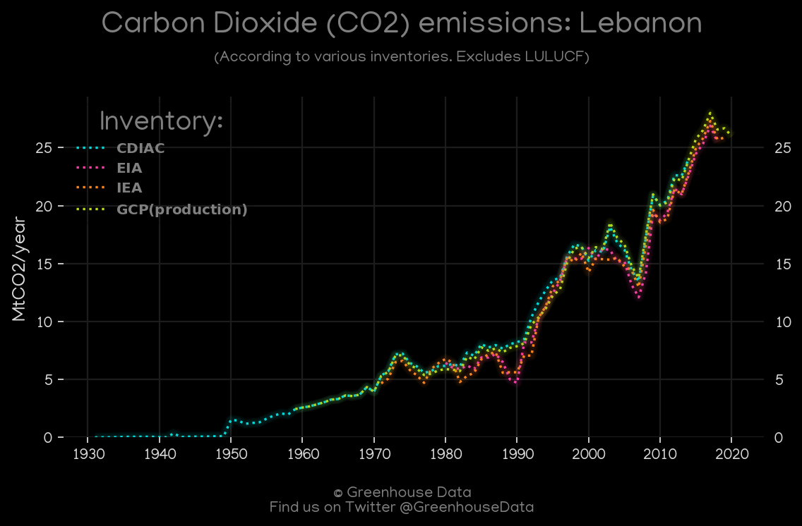
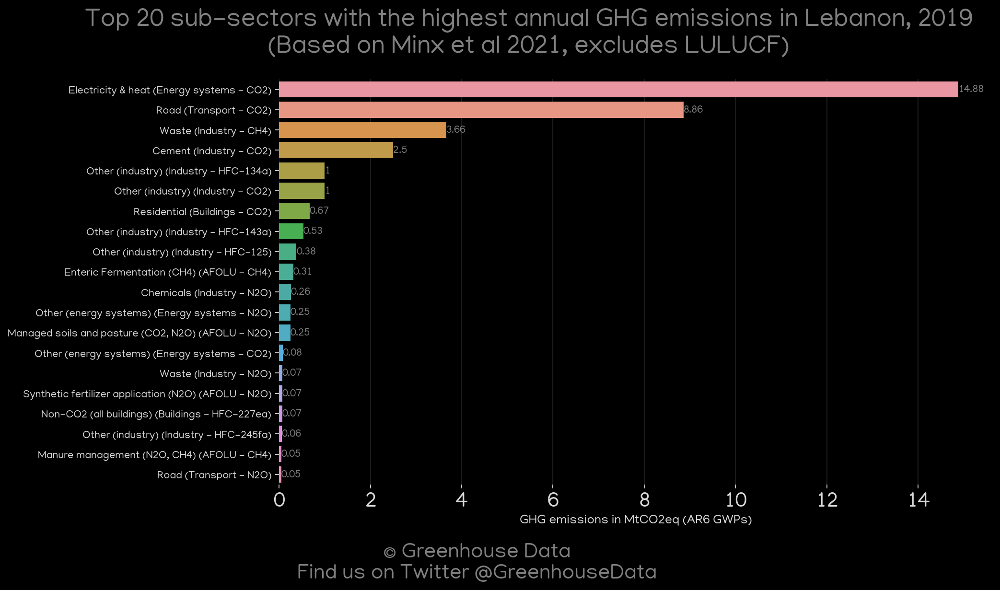
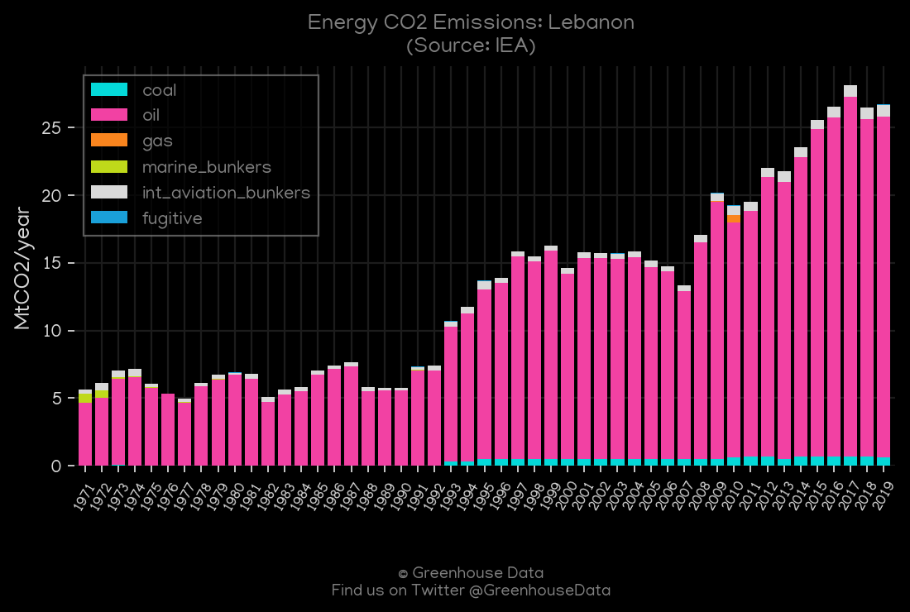
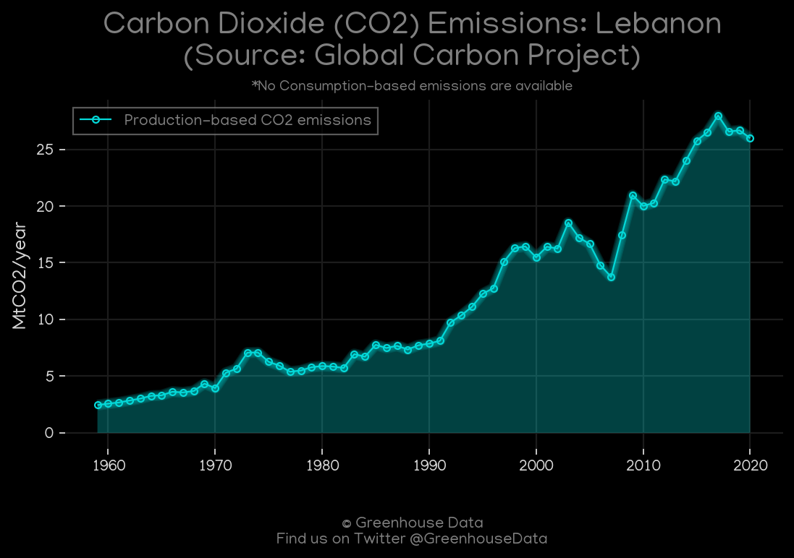
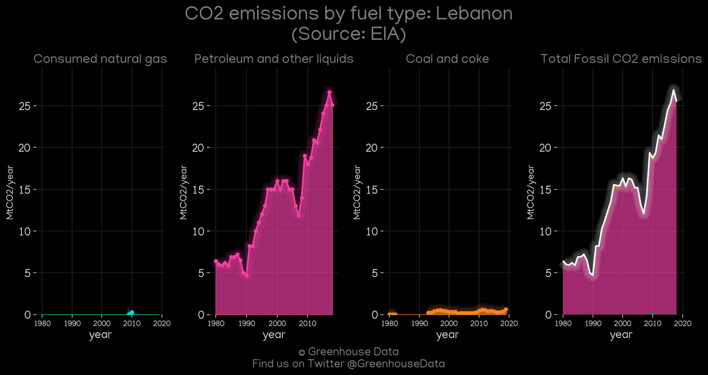
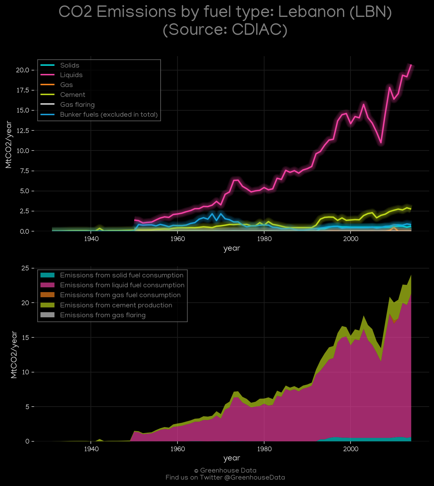
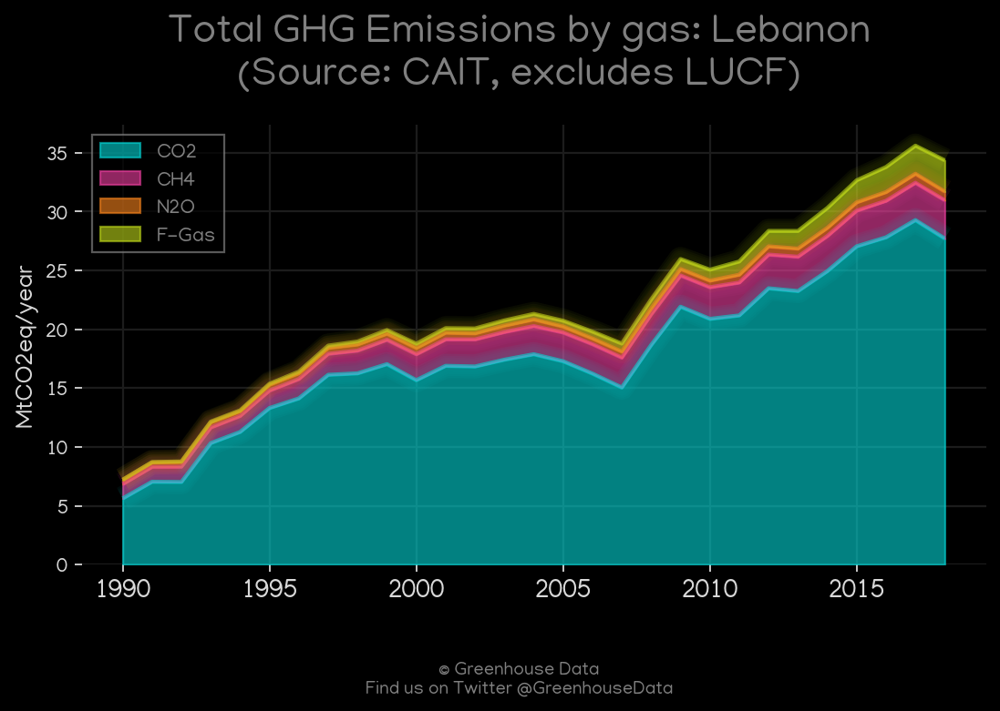

<h1 align="center">
🇱🇧🇱🇧🇱🇧🇱🇧🇱🇧
 
Lebanon
 
🇱🇧🇱🇧🇱🇧🇱🇧🇱🇧
</h1>
<h2>Datasets:</h2>

<a href="https://github.com/dquintani/GreenhouseData/tree/master/country_data/LBN_Lebanon/data">View on Github</a>
 

<a href="data/LBN_CAIT.csv">CAIT</a> || <a href="data/LBN_GCP.csv">GCP</a> || <a href="data/LBN_GCP_consupmption.csv">GCP_consupmption</a> || <a href="data/LBN_EPA.csv">EPA</a> || <a href="data/LBN_Minx_2021.csv">Minx_2021</a> || <a href="data/LBN_GCP_cons.csv">GCP_cons</a> || <a href="data/LBN_FAO.csv">FAO</a> || <a href="data/LBN_PRIMAP-hist.csv">PRIMAP-hist</a> || <a href="data/LBN_IEA.csv">IEA</a> || <a href="data/LBN_EDGAR.csv">EDGAR</a> || <a href="data/LBN_EIA.csv">EIA</a> || <a href="data/LBN_CDIAC.csv">CDIAC</a>

 

<h1>Figures:</h1><h2>#1 (LBN_CO2_totals)</h2>

<h2>#2 (LBN_Minx_top20_subsectors)</h2>

<h2>#3 (LBN_IEA_1)</h2>

<h2>#4 (LBN_GCP_1)</h2>

<h2>#5 (LBN_EIA_1)</h2>

<h2>#6 (LBN_CDIAC_1)</h2>

<h2>#7 (LBN_UNFCCC_NAI_1)</h2>

<h2>#8 (LBN_CAIT_gases_1)</h2>

