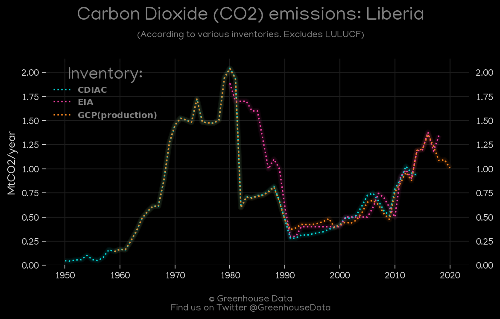
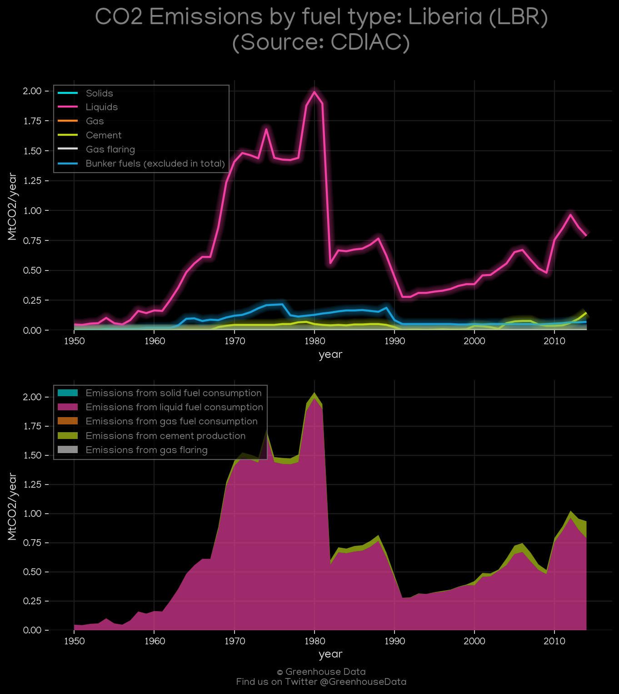
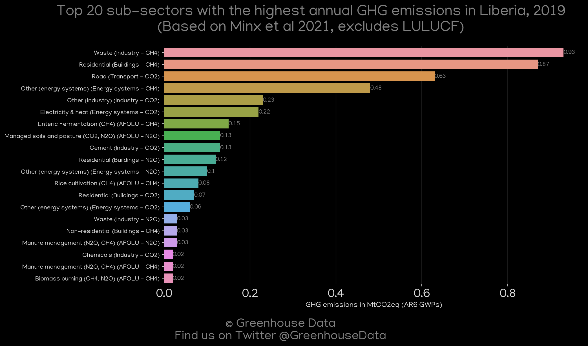
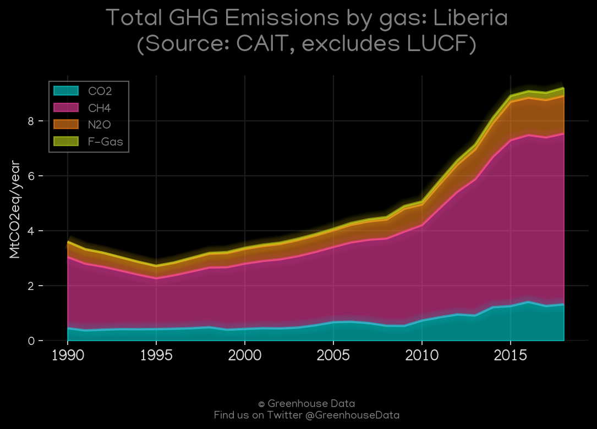
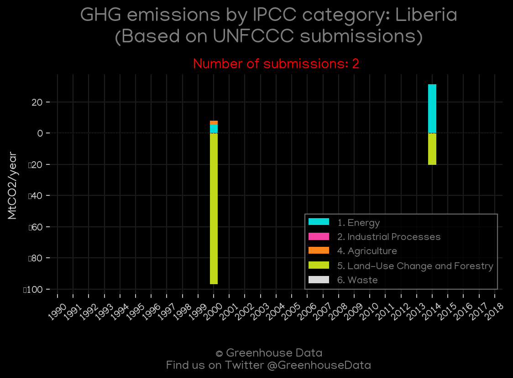
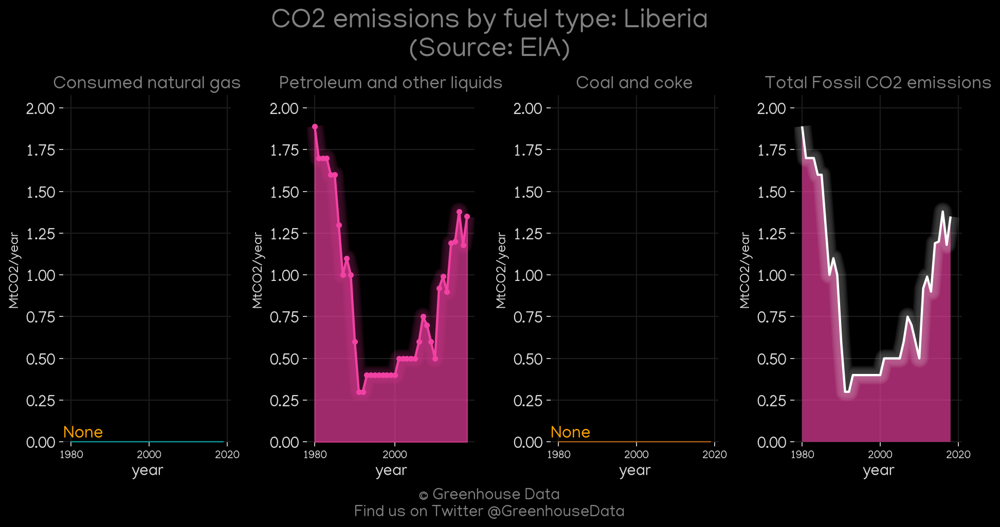
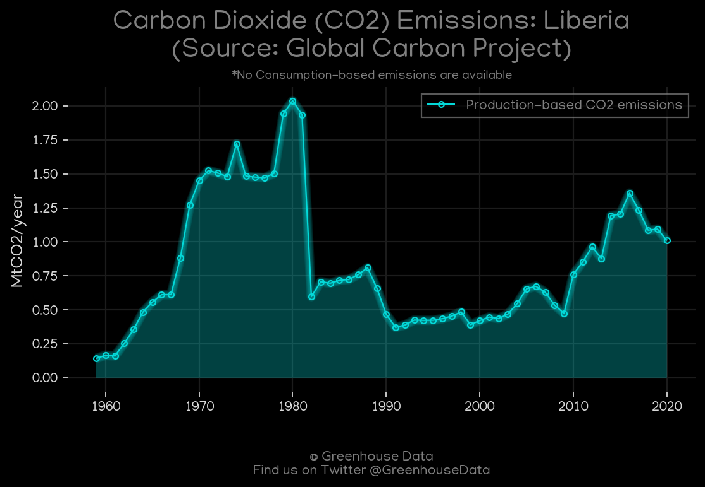

<h1 align="center">
🇱🇷🇱🇷🇱🇷🇱🇷🇱🇷
 
Liberia
 
🇱🇷🇱🇷🇱🇷🇱🇷🇱🇷
</h1>
<h2>Datasets:</h2>

<a href="https://github.com/dquintani/Greenhouse-Data/tree/master/country_data/LBR_Liberia/data">View on Github</a>
 

<a href="data/LBR_CDIAC.csv">CDIAC</a> || <a href="data/LBR_GCP.csv">GCP</a> || <a href="data/LBR_PRIMAP-hist.csv">PRIMAP-hist</a> || <a href="data/LBR_CAIT.csv">CAIT</a> || <a href="data/LBR_EIA.csv">EIA</a> || <a href="data/LBR_FAO.csv">FAO</a> || <a href="data/LBR_Minx_2021.csv">Minx_2021</a> || <a href="data/LBR_GCP_consupmption.csv">GCP_consupmption</a> || <a href="data/LBR_GCP_cons.csv">GCP_cons</a> || <a href="data/LBR_EDGAR.csv">EDGAR</a> || <a href="data/LBR_EPA.csv">EPA</a>

 

<h1>Figures:</h1><h2>#1 (LBR_CO2_totals)</h2>

<h2>#2 (LBR_CDIAC_1)</h2>

<h2>#3 (LBR_Minx_top20_subsectors)</h2>

<h2>#4 (LBR_CAIT_gases_1)</h2>

<h2>#5 (LBR_BP_1)</h2>

<h2>#6 (LBR_UNFCCC_NAI_1)</h2>

<h2>#7 (LBR_EIA_1)</h2>

<h2>#8 (LBR_GCP_1)</h2>

