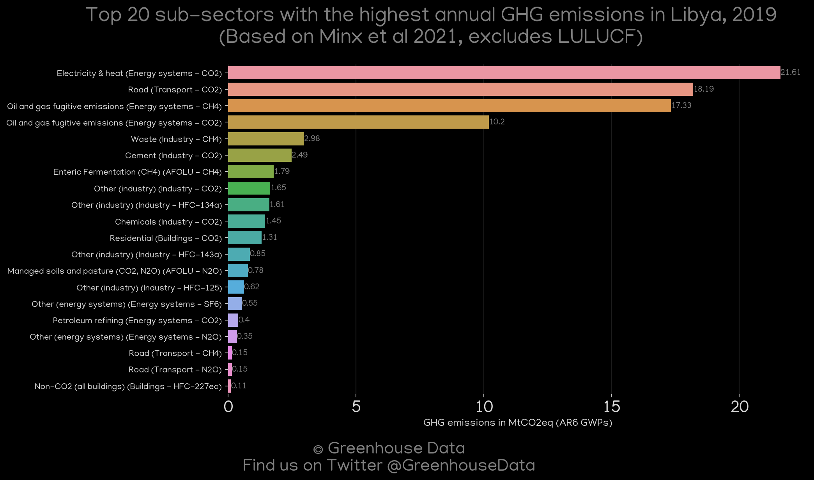
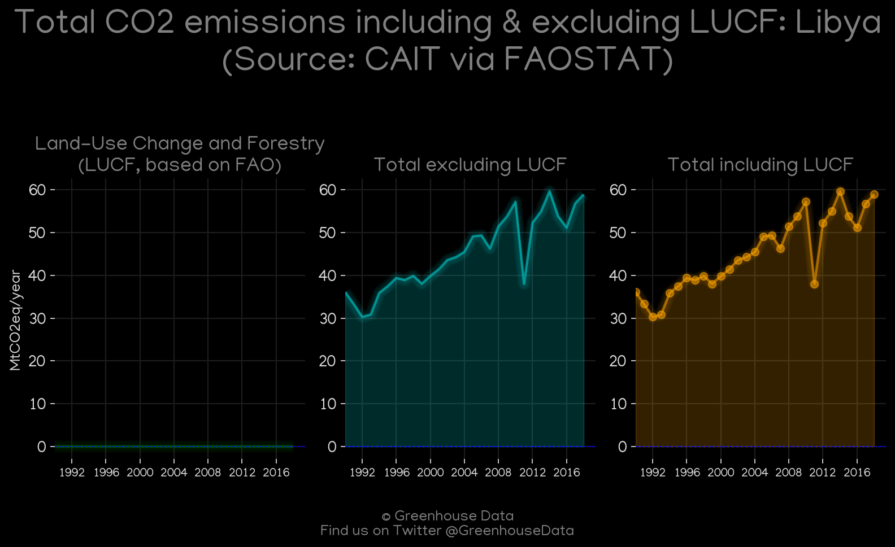
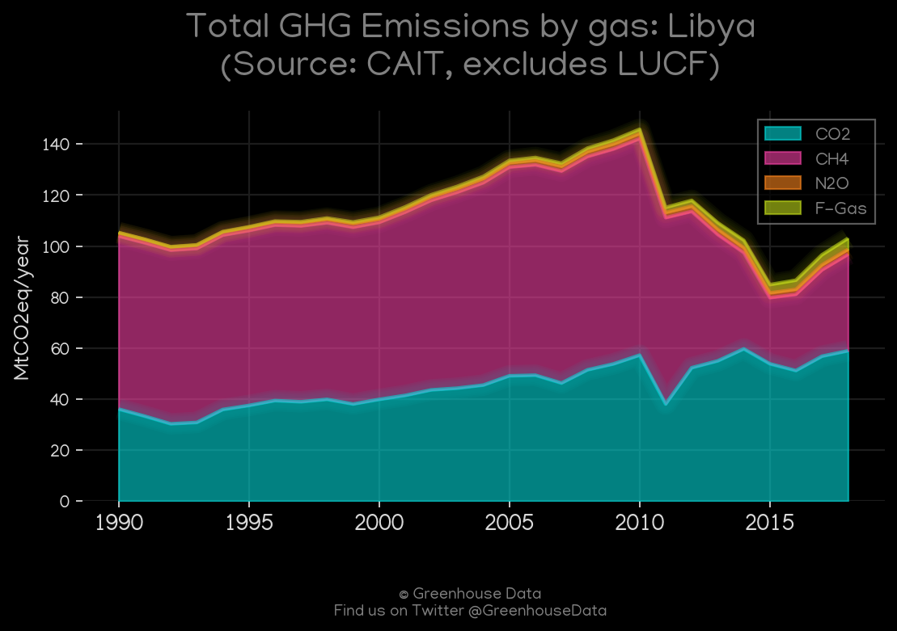
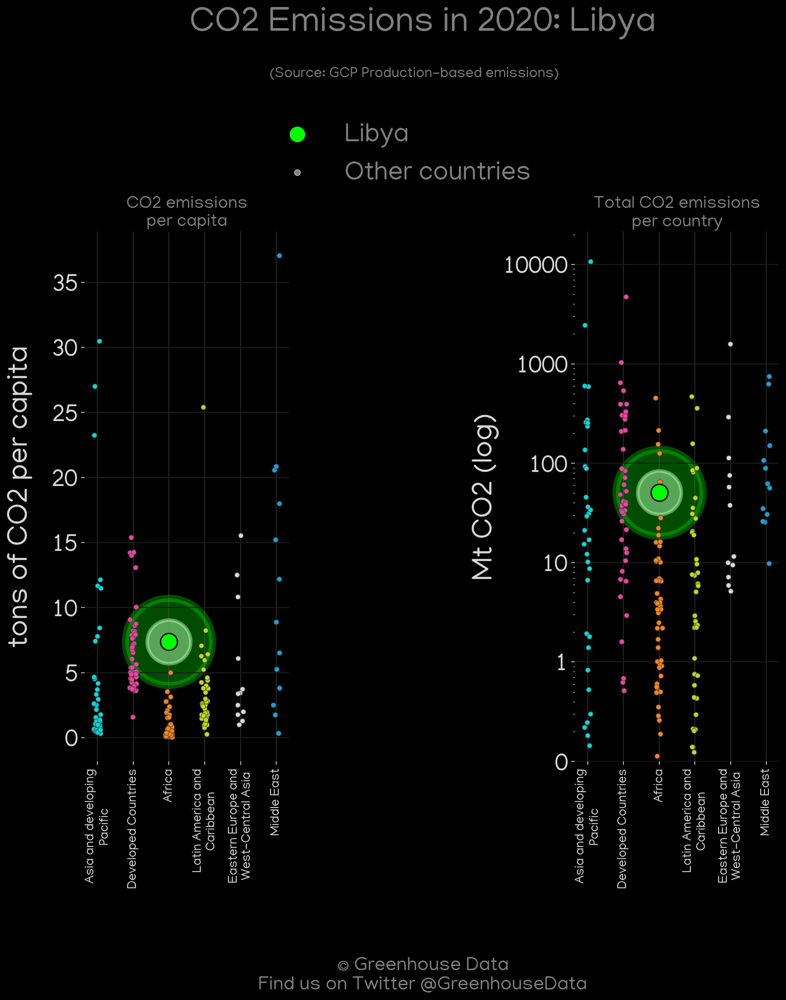
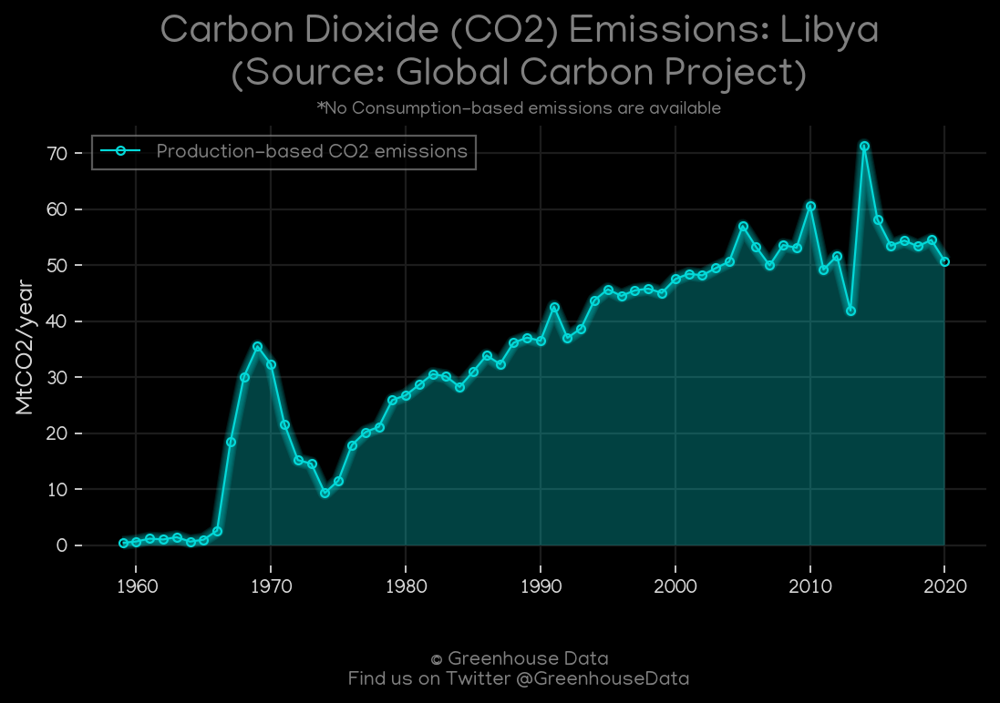
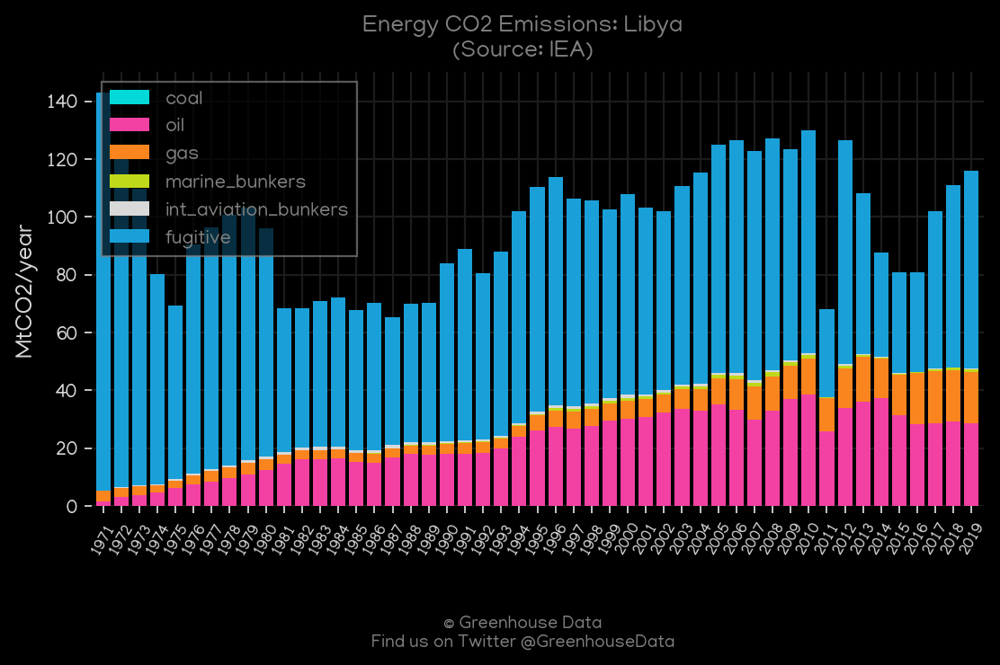
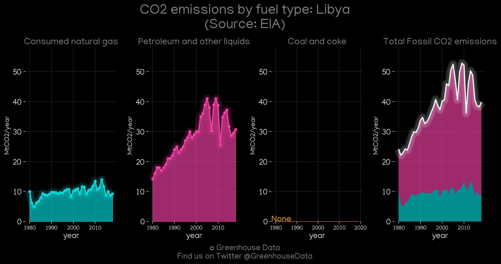
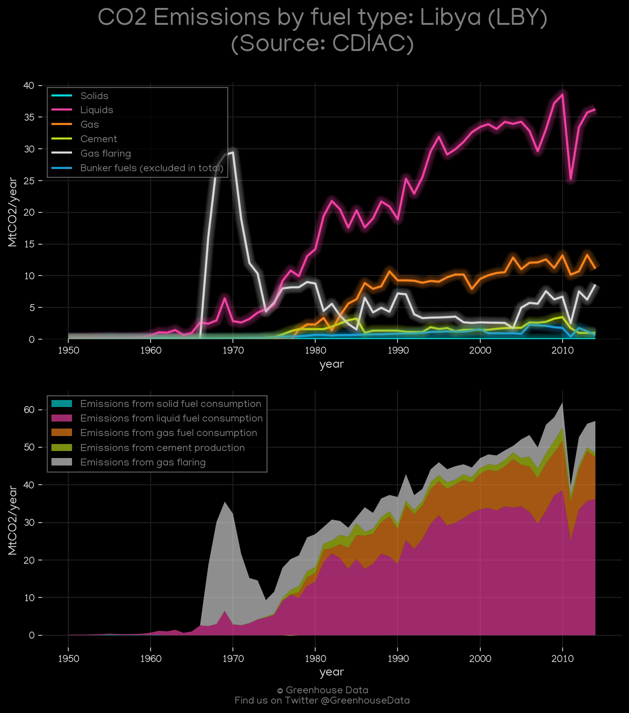
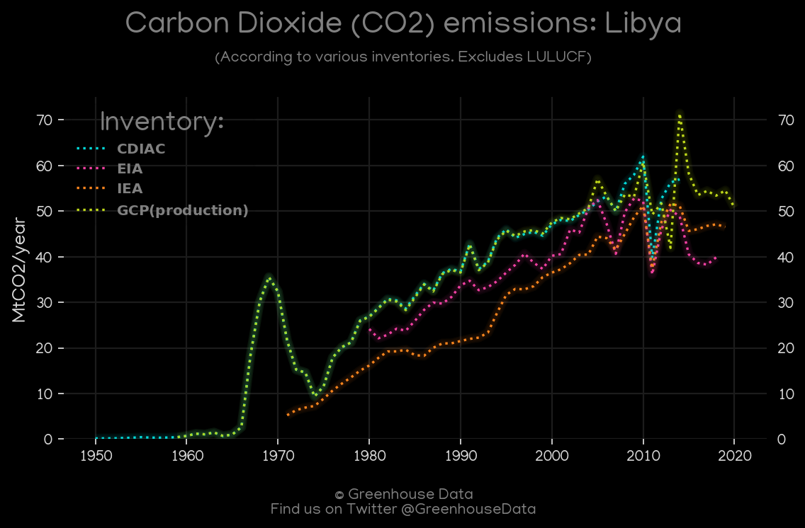

<h1 align="center">
🇱🇾🇱🇾🇱🇾🇱🇾🇱🇾
 
Libya
 
🇱🇾🇱🇾🇱🇾🇱🇾🇱🇾
</h1>
<h2>Datasets:</h2>

<a href="https://github.com/dquintani/GreenhouseData/tree/master/country_data/LBY_Libya/data">View on Github</a>
 

<a href="data/LBY_CAIT.csv">CAIT</a> || <a href="data/LBY_EIA.csv">EIA</a> || <a href="data/LBY_EPA.csv">EPA</a> || <a href="data/LBY_IEA.csv">IEA</a> || <a href="data/LBY_PRIMAP-hist.csv">PRIMAP-hist</a> || <a href="data/LBY_FAO.csv">FAO</a> || <a href="data/LBY_EDGAR.csv">EDGAR</a> || <a href="data/LBY_Minx_2021.csv">Minx_2021</a> || <a href="data/LBY_CDIAC.csv">CDIAC</a> || <a href="data/LBY_GCP_consupmption.csv">GCP_consupmption</a> || <a href="data/LBY_GCP.csv">GCP</a>

 

<h1>Figures:</h1><h2>#1 (LBY_Minx_top20_subsectors)</h2>

<h2>#2 (LBY_CAIT_lucf_vs_nolucf)</h2>

<h2>#3 (LBY_CAIT_gases_1)</h2>

<h2>#4 (LBY_GCP_Country_Highlight)</h2>

<h2>#5 (LBY_GCP_1)</h2>

<h2>#6 (LBY_IEA_1)</h2>

<h2>#7 (LBY_EIA_1)</h2>

<h2>#8 (LBY_CDIAC_1)</h2>

<h2>#9 (LBY_CO2_totals)</h2>

