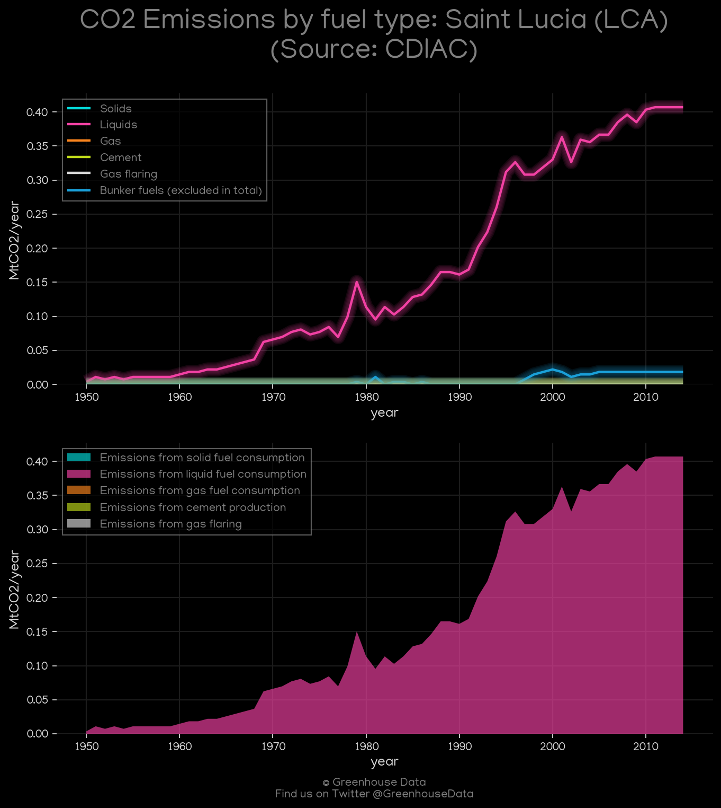
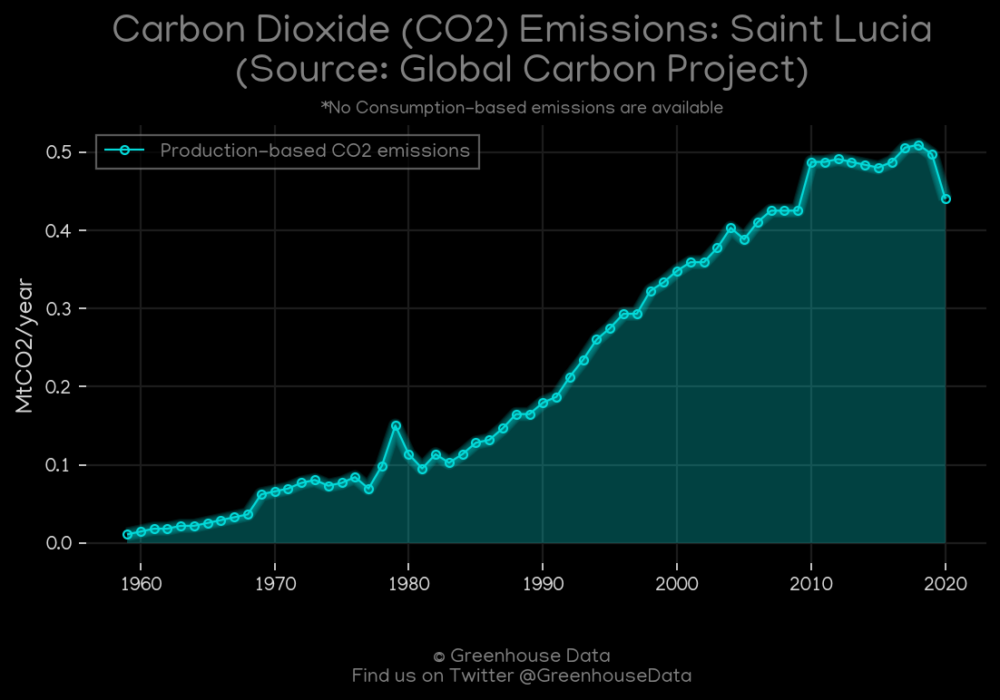
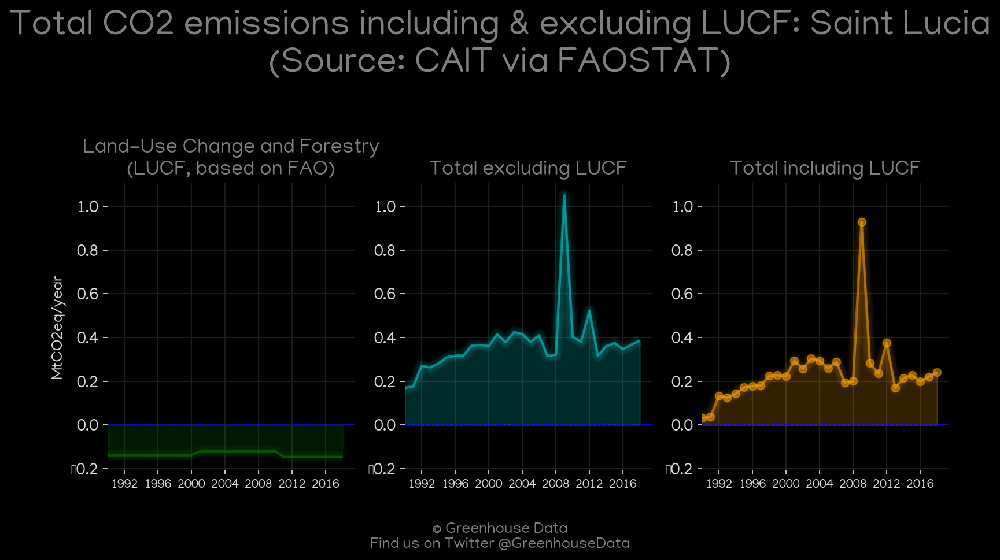
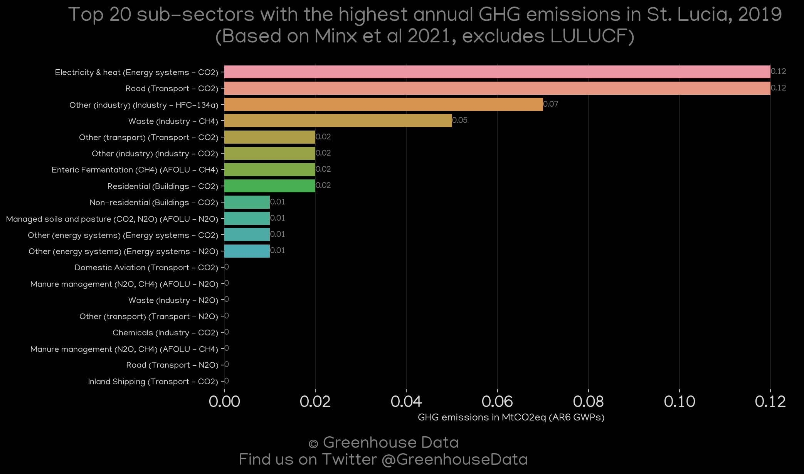
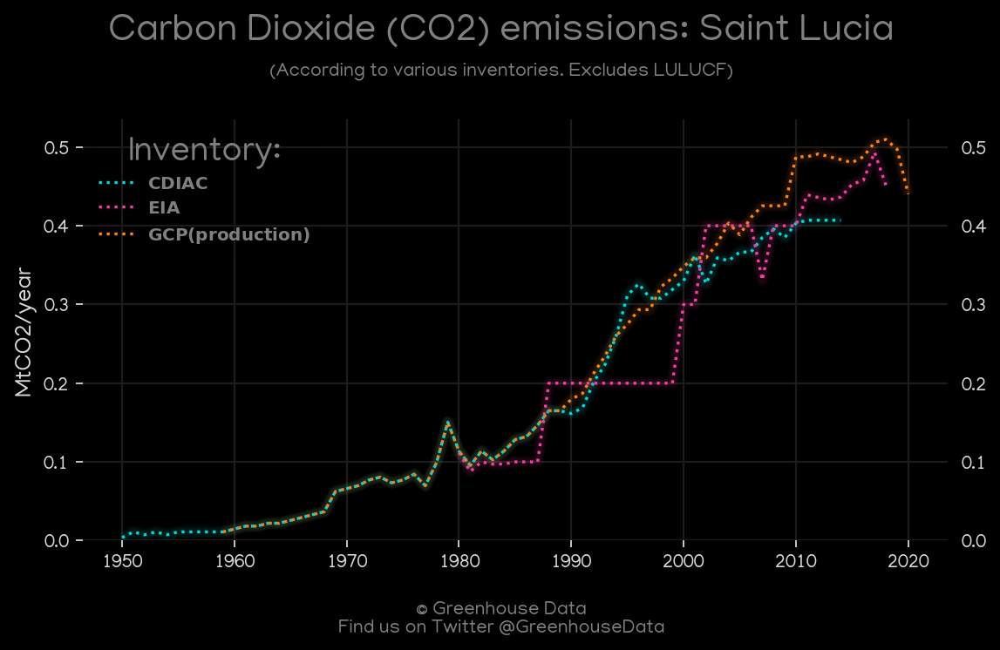
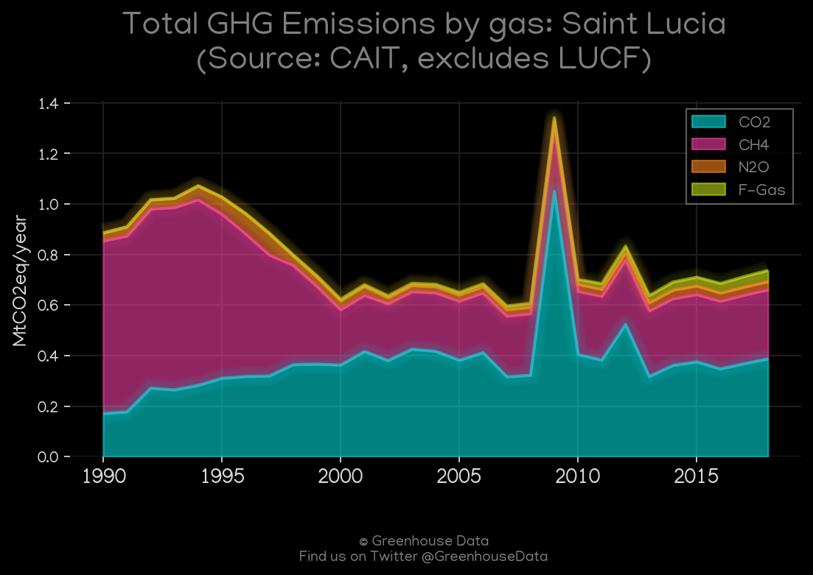
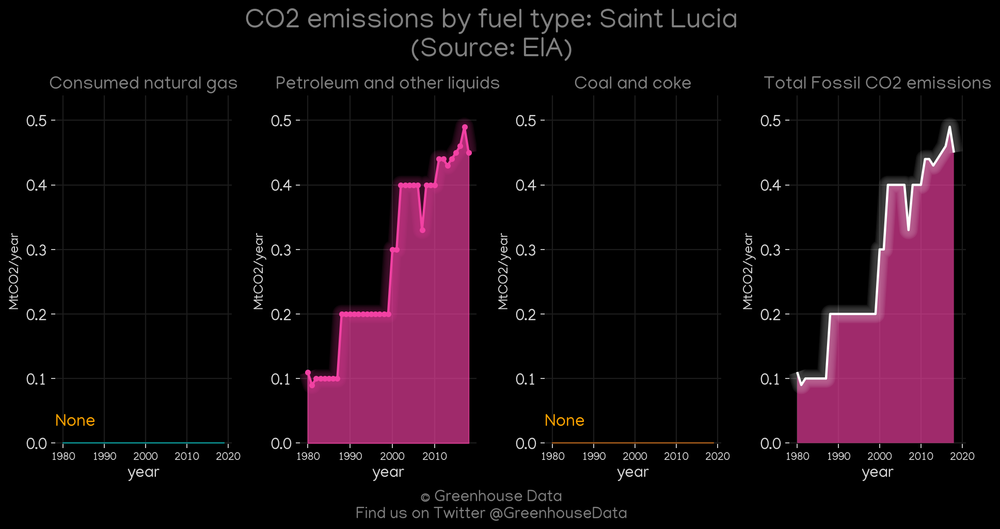
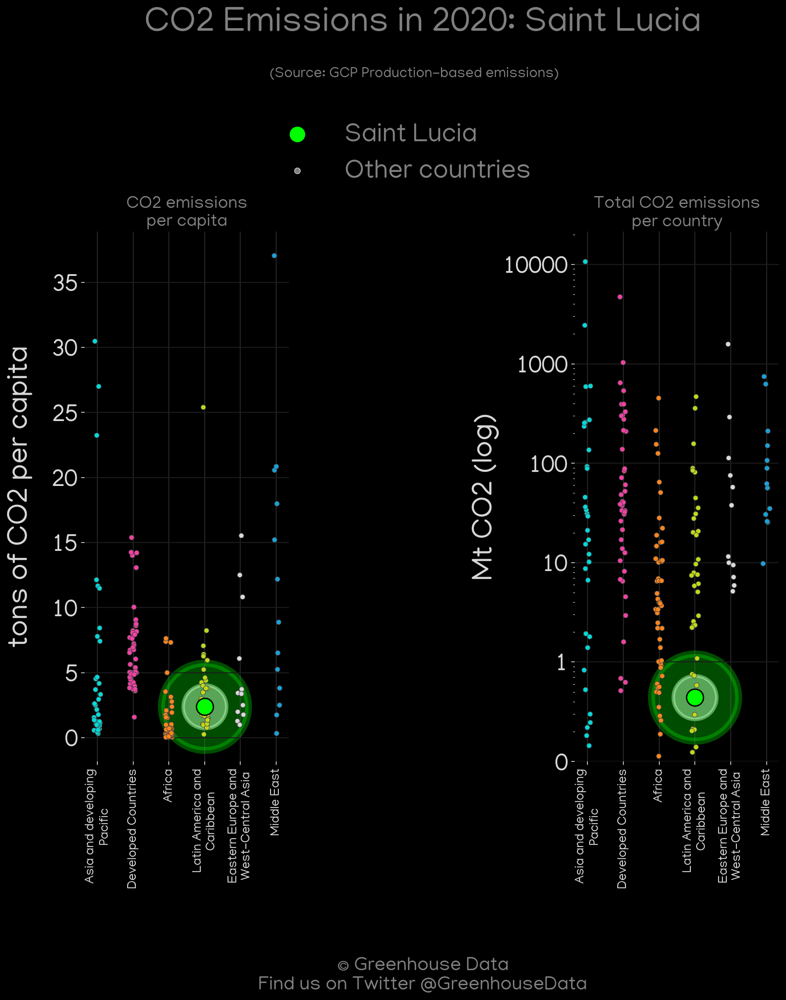

<h1 align="center">
🇱🇨🇱🇨🇱🇨🇱🇨🇱🇨
 
Saint Lucia
 
🇱🇨🇱🇨🇱🇨🇱🇨🇱🇨
</h1>
<h2>Datasets:</h2>

<a href="https://github.com/dquintani/GreenhouseData/tree/master/country_data/LCA_Saint Lucia/data">View on Github</a>
 

<a href="data/LCA_CAIT.csv">CAIT</a> || <a href="data/LCA_EPA.csv">EPA</a> || <a href="data/LCA_EIA.csv">EIA</a> || <a href="data/LCA_GCP.csv">GCP</a> || <a href="data/LCA_GCP_consupmption.csv">GCP_consupmption</a> || <a href="data/LCA_PRIMAP-hist.csv">PRIMAP-hist</a> || <a href="data/LCA_FAO.csv">FAO</a> || <a href="data/LCA_Minx_2021.csv">Minx_2021</a> || <a href="data/LCA_EDGAR.csv">EDGAR</a> || <a href="data/LCA_CDIAC.csv">CDIAC</a>

 

<h1>Figures:</h1><h2>#1 (LCA_CDIAC_1)</h2>

<h2>#2 (LCA_GCP_1)</h2>

<h2>#3 (LCA_CAIT_lucf_vs_nolucf)</h2>

<h2>#4 (LCA_Minx_top20_subsectors)</h2>

<h2>#5 (LCA_CO2_totals)</h2>

<h2>#6 (LCA_UNFCCC_NAI_1)</h2>

<h2>#7 (LCA_relative_totals)</h2>

<h2>#8 (LCA_CAIT_gases_1)</h2>

<h2>#9 (LCA_EIA_1)</h2>

<h2>#10 (LCA_GCP_Country_Highlight)</h2>

