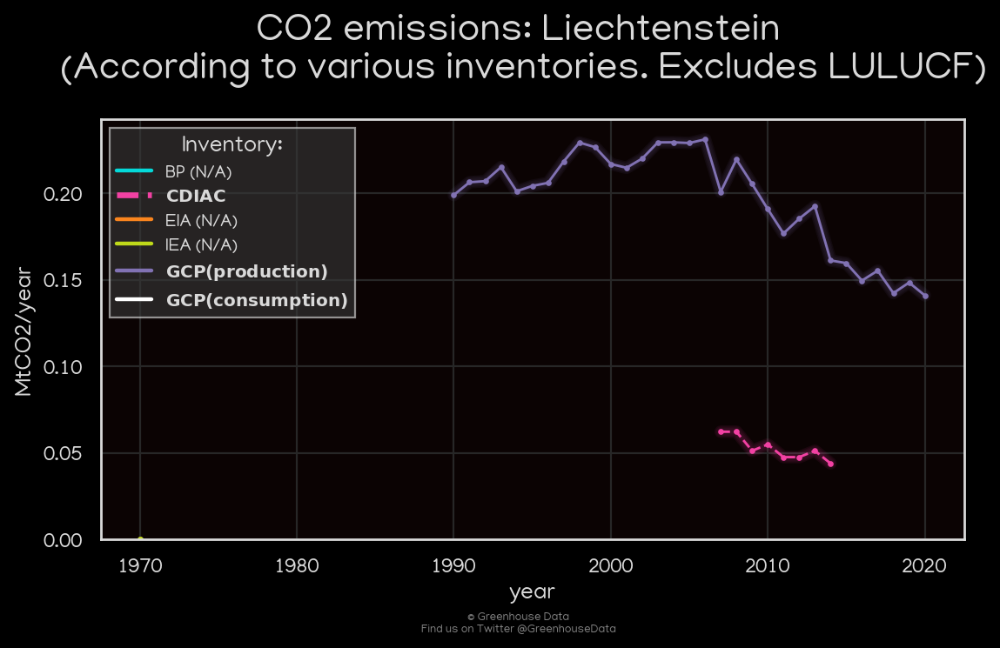
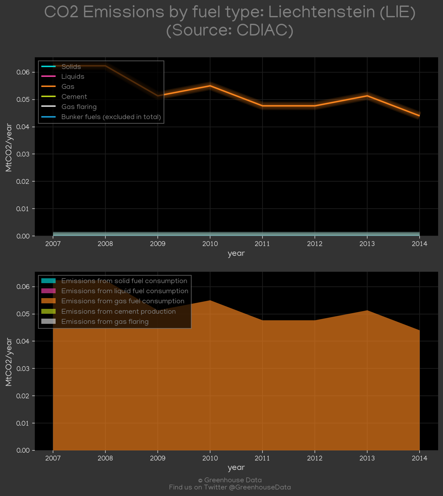
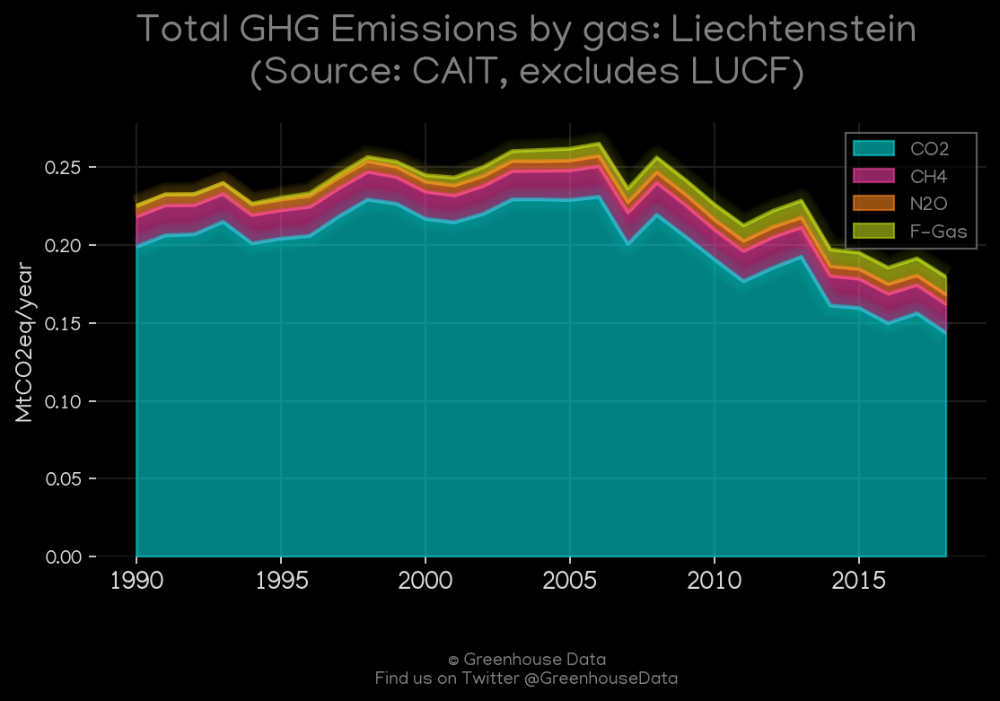
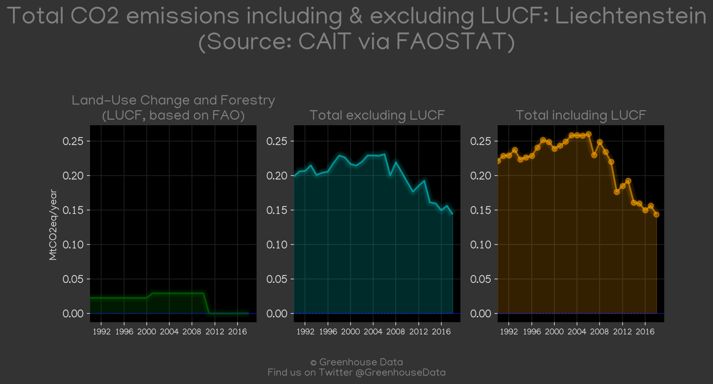
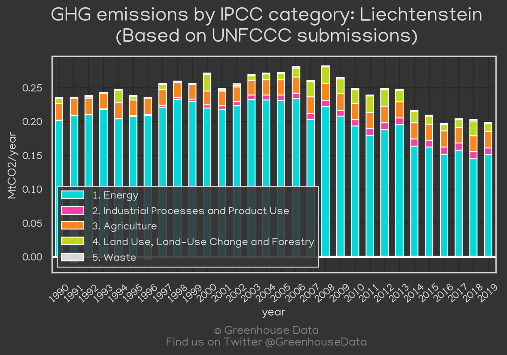
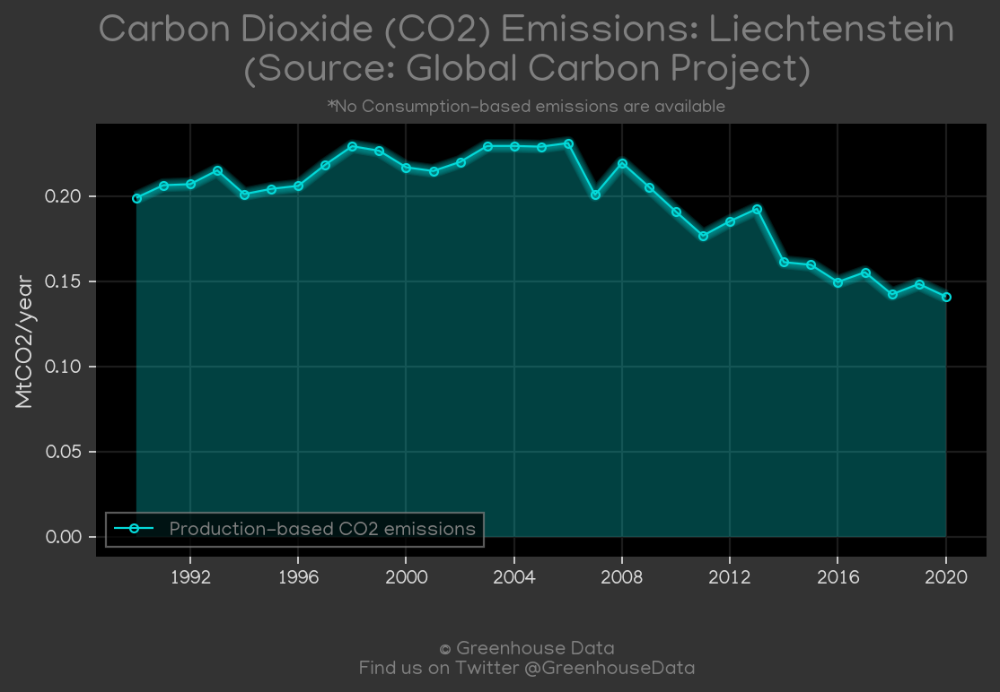
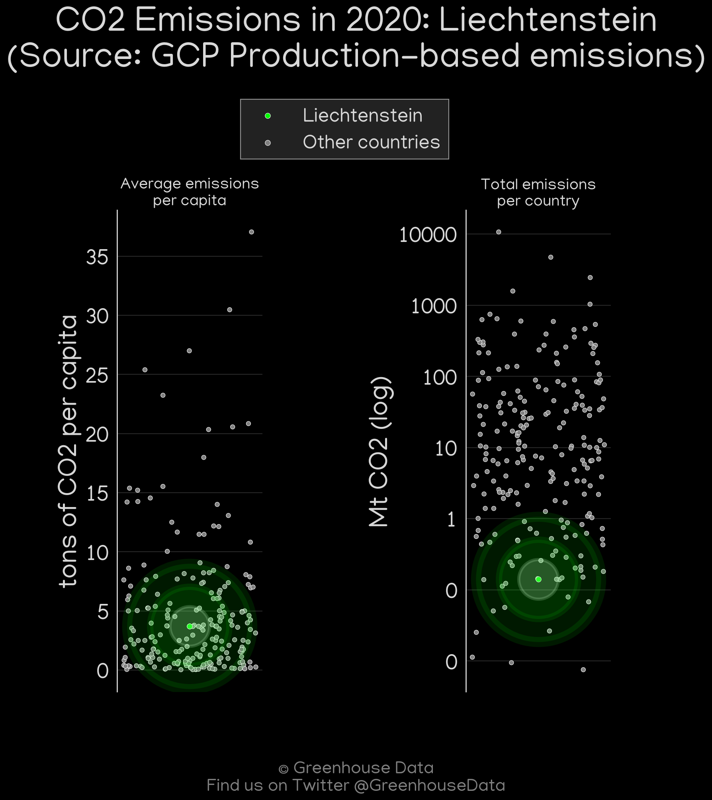

<h1 align="center">
🇱🇮🇱🇮🇱🇮🇱🇮🇱🇮
 
Liechtenstein
 
🇱🇮🇱🇮🇱🇮🇱🇮🇱🇮
</h1>
<h2>Datasets:</h2>

<a href="https://github.com/dquintani/GreenhouseData/tree/master/country_data/LIE_Liechtenstein/data">View on Github</a>
 

<a href="data/LIE_PRIMAP-hist.csv">PRIMAP-hist</a> || <a href="data/LIE_EPA.csv">EPA</a> || <a href="data/LIE_CDIAC.csv">CDIAC</a> || <a href="data/LIE_GCP_consupmption.csv">GCP_consupmption</a> || <a href="data/LIE_GCP.csv">GCP</a> || <a href="data/LIE_CAIT.csv">CAIT</a> || <a href="data/LIE_FAO.csv">FAO</a>

 

<h1>Figures:</h1><h2>#1 (LIE_CO2_totals)</h2>

<h2>#2 (LIE_CDIAC_1)</h2>

<h2>#3 (LIE_CAIT_gases_1)</h2>

<h2>#4 (LIE_CAIT_lucf_vs_nolucf)</h2>

<h2>#5 (LIE_UNFCCC_AI_1)</h2>

<h2>#6 (LIE_GCP_1)</h2>

<h2>#7 (LIE_GCP_Country_Highlight)</h2>

