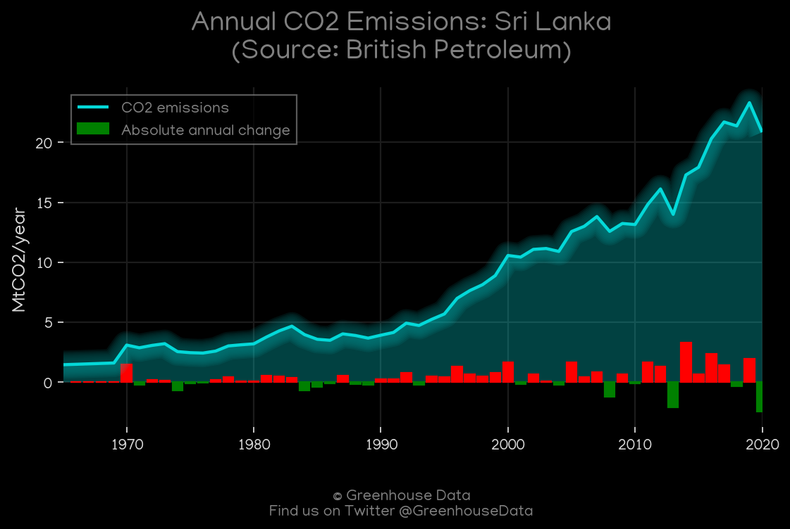
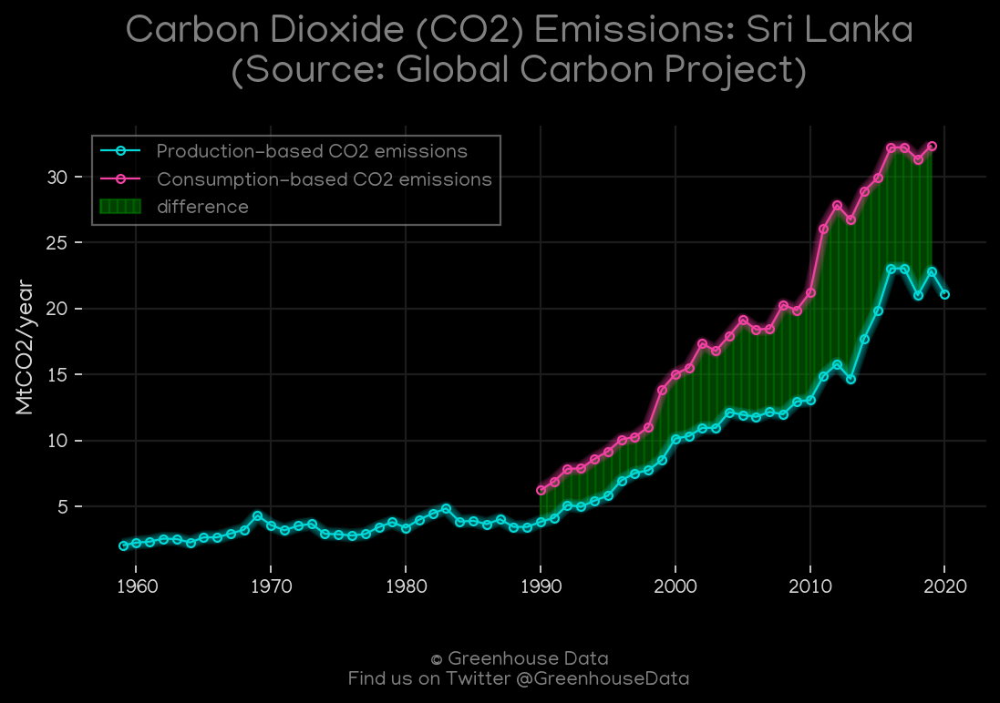
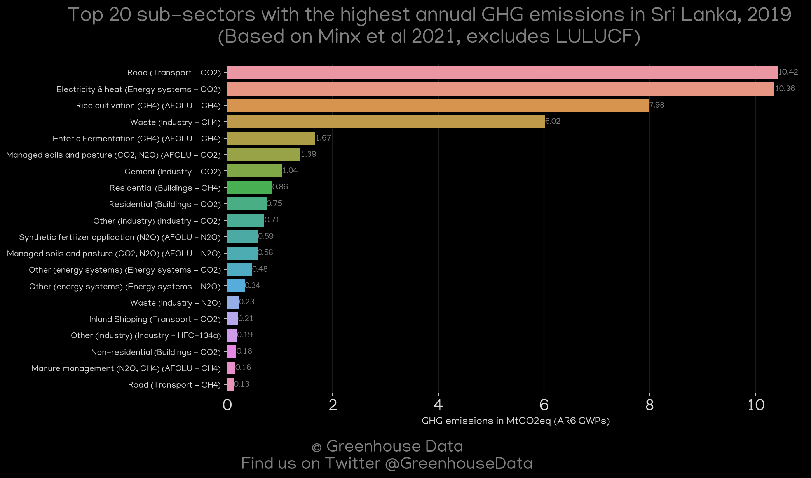
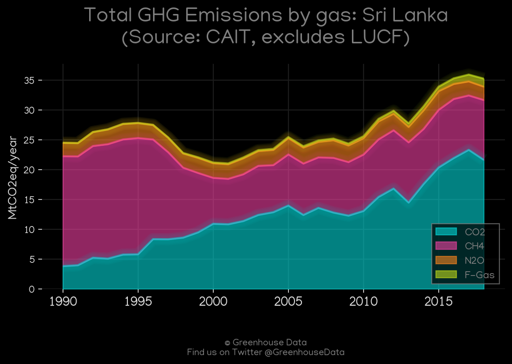
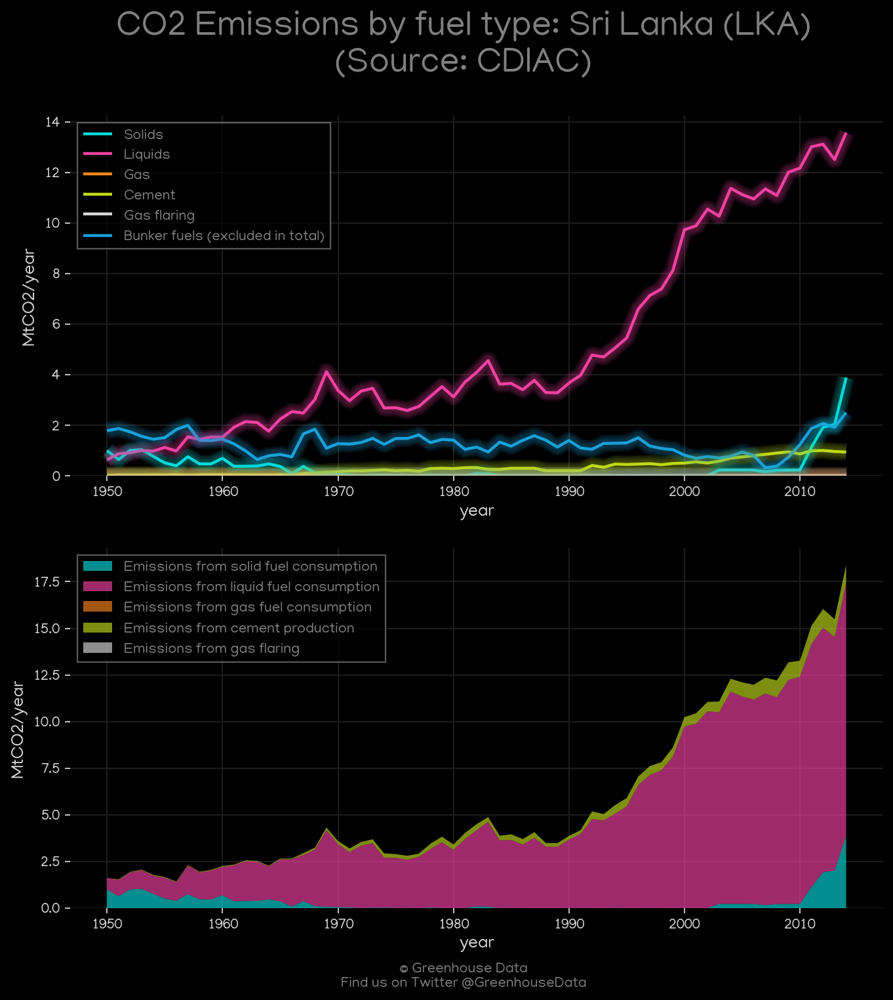
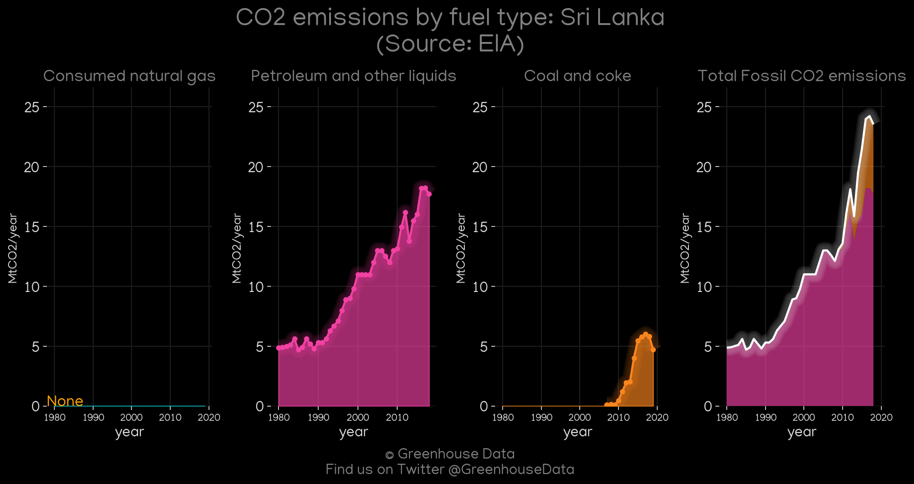
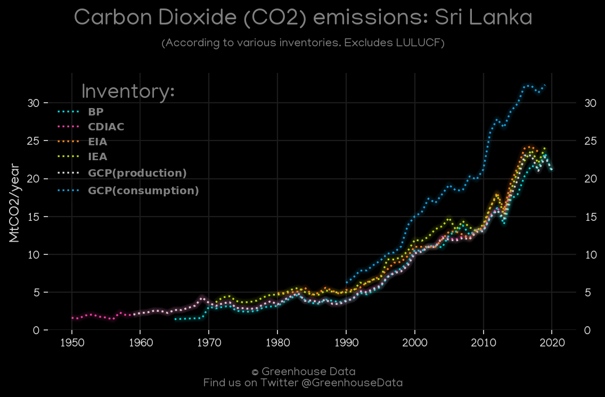

<h1 align="center">
🇱🇰🇱🇰🇱🇰🇱🇰🇱🇰
 
Sri Lanka
 
🇱🇰🇱🇰🇱🇰🇱🇰🇱🇰
</h1>
<h2>Datasets:</h2>

<a href="https://github.com/dquintani/GreenhouseData/tree/master/country_data/LKA_Sri Lanka/data">View on Github</a>
 

<a href="data/LKA_GCP_consupmption.csv">GCP_consupmption</a> || <a href="data/LKA_FAO.csv">FAO</a> || <a href="data/LKA_EDGAR.csv">EDGAR</a> || <a href="data/LKA_CAIT.csv">CAIT</a> || <a href="data/LKA_GCP.csv">GCP</a> || <a href="data/LKA_EIA.csv">EIA</a> || <a href="data/LKA_PRIMAP-hist.csv">PRIMAP-hist</a> || <a href="data/LKA_IEA.csv">IEA</a> || <a href="data/LKA_EPA.csv">EPA</a> || <a href="data/LKA_Minx_2021.csv">Minx_2021</a> || <a href="data/LKA_BP.csv">BP</a> || <a href="data/LKA_CDIAC.csv">CDIAC</a>

 

<h1>Figures:</h1><h2>#1 (LKA_IEA_1)</h2>

<h2>#2 (LKA_BP_1)</h2>

<h2>#3 (LKA_UNFCCC_NAI_1)</h2>

<h2>#4 (LKA_GCP_1)</h2>

<h2>#5 (LKA_Minx_top20_subsectors)</h2>

<h2>#6 (LKA_CAIT_gases_1)</h2>

<h2>#7 (LKA_CDIAC_1)</h2>

<h2>#8 (LKA_EIA_1)</h2>

<h2>#9 (LKA_CO2_totals)</h2>

