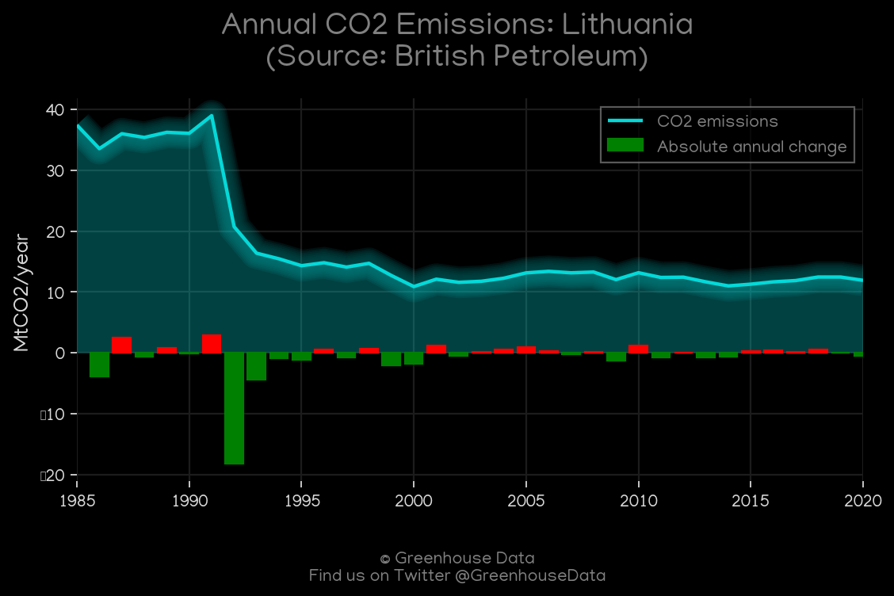
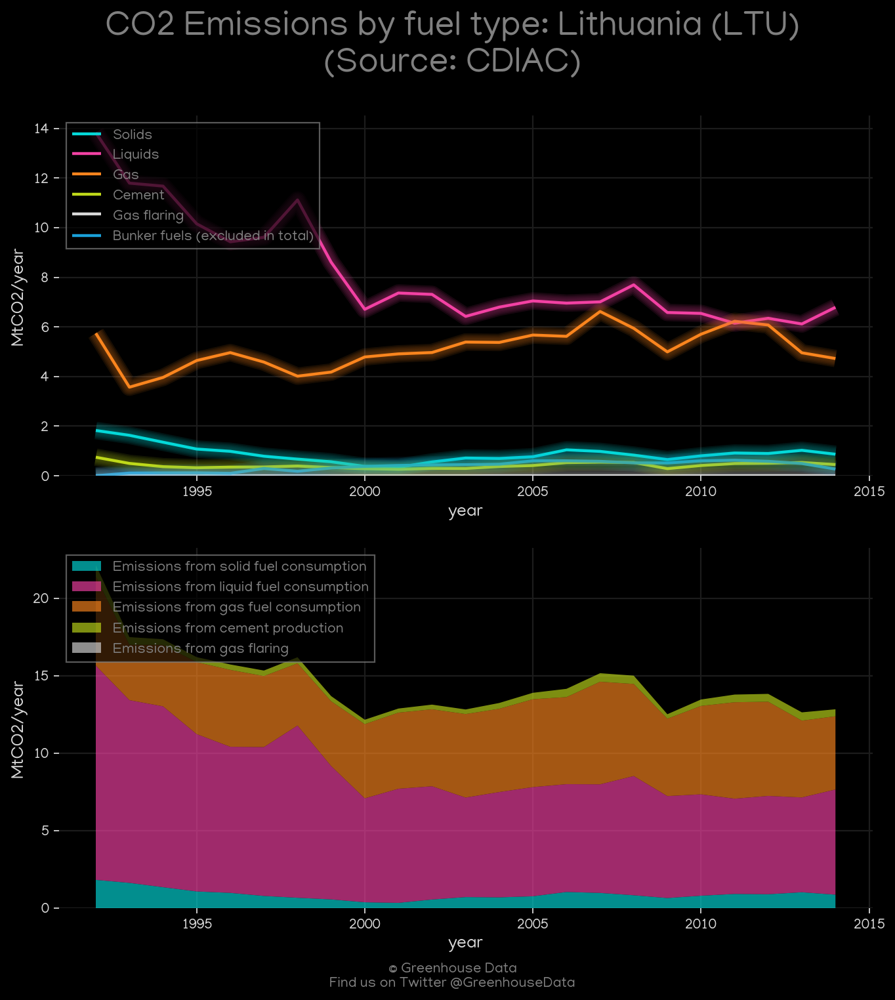
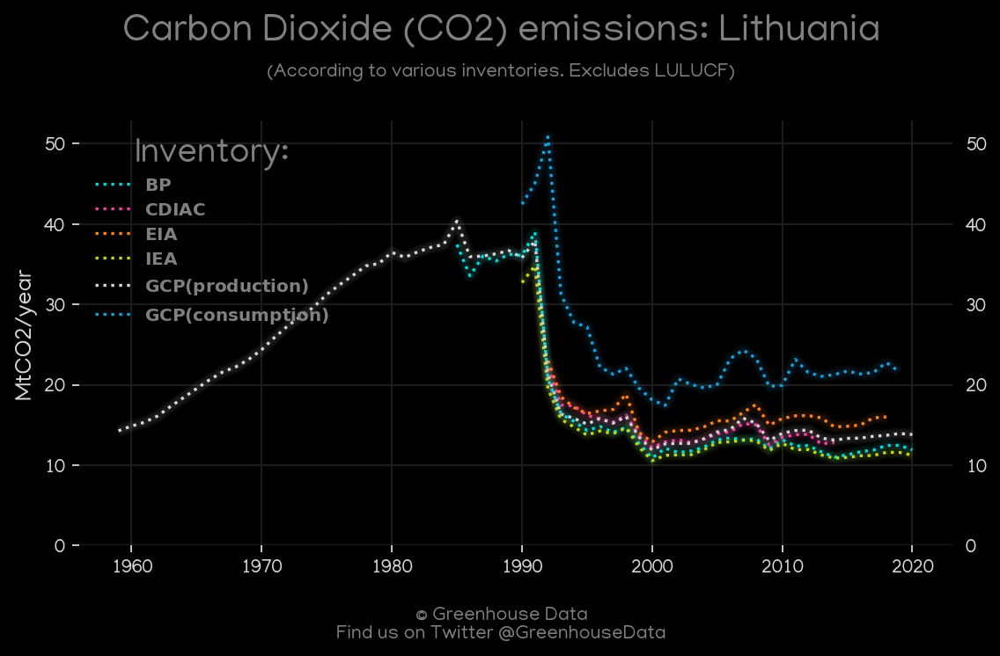
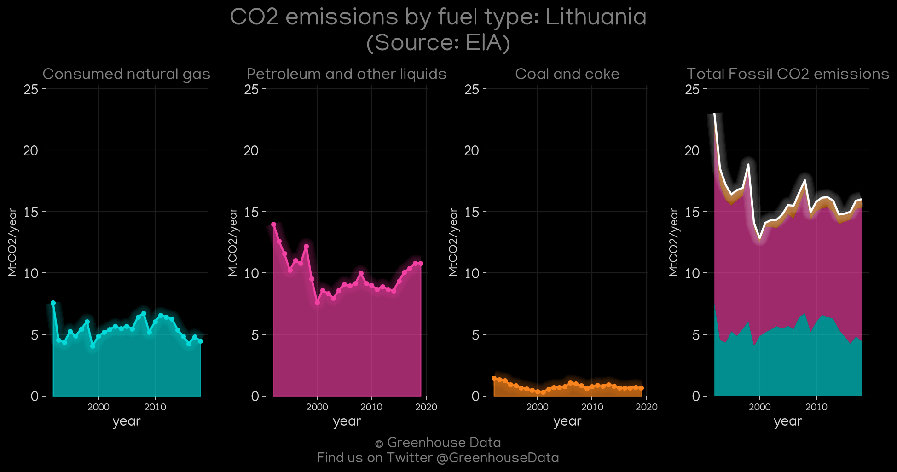
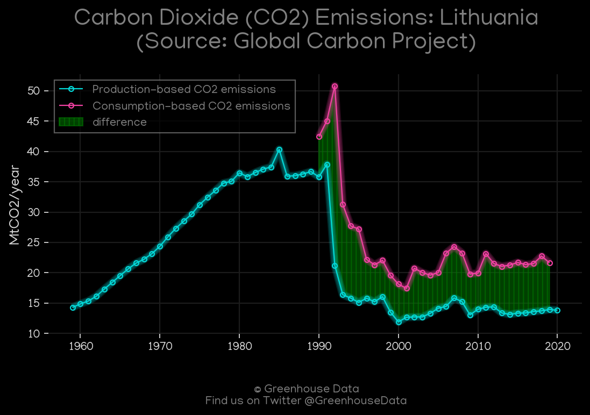
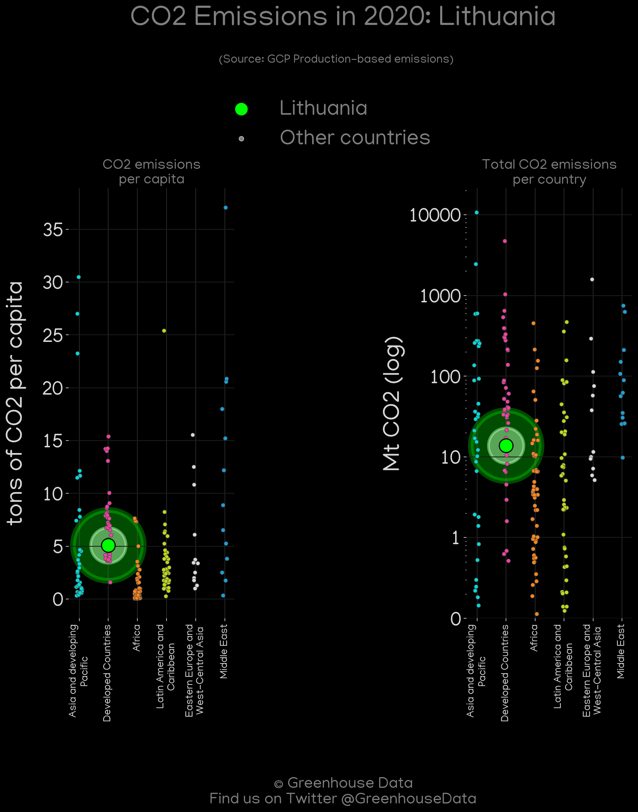
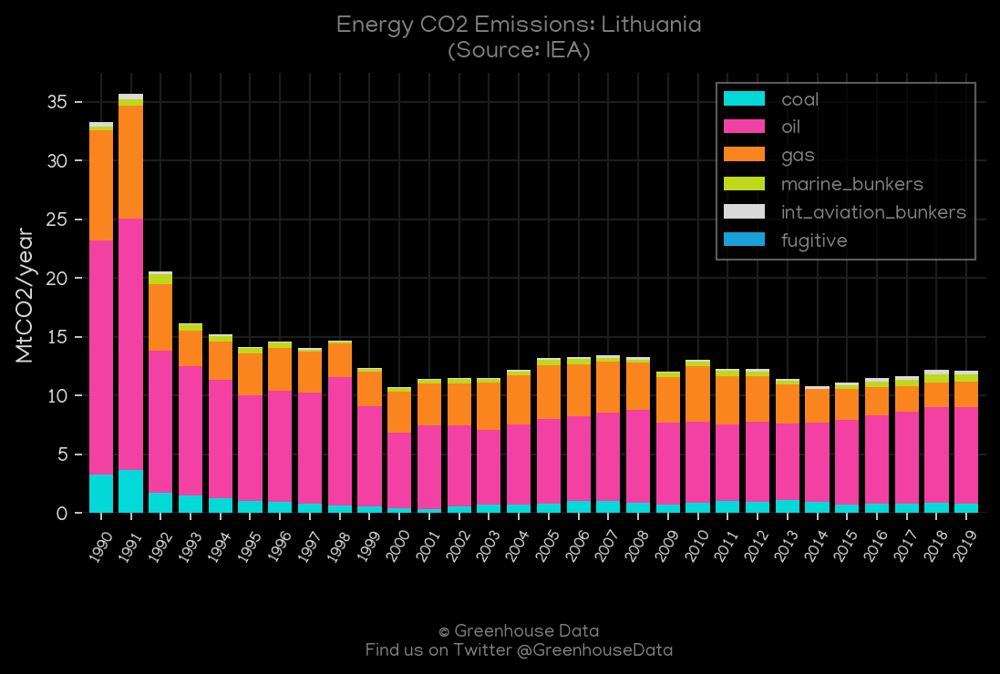
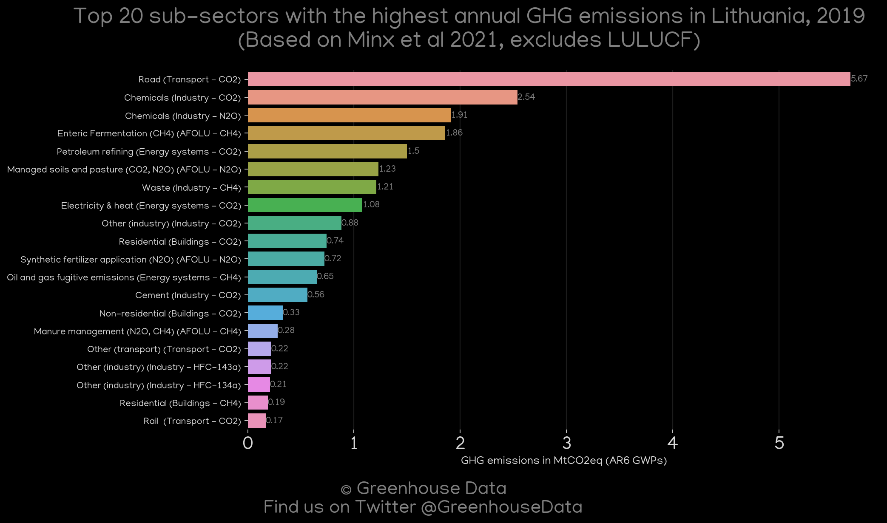
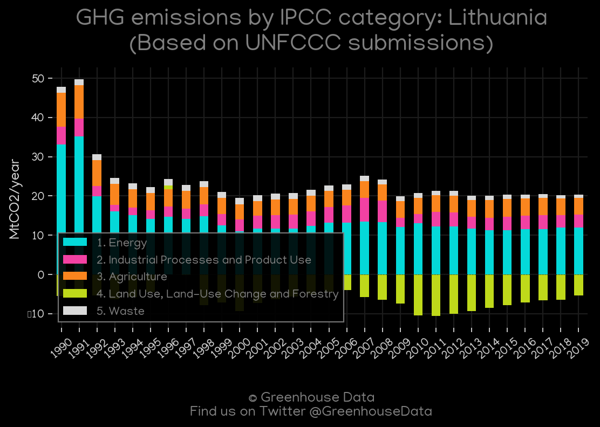

<h1 align="center">
🇱🇹🇱🇹🇱🇹🇱🇹🇱🇹
 
Lithuania
 
🇱🇹🇱🇹🇱🇹🇱🇹🇱🇹
</h1>
<h2>Datasets:</h2>

<a href="https://github.com/dquintani/GreenhouseData/tree/master/country_data/LTU_Lithuania/data">View on Github</a>
 

<a href="data/LTU_BP.csv">BP</a> || <a href="data/LTU_CAIT.csv">CAIT</a> || <a href="data/LTU_CDIAC.csv">CDIAC</a> || <a href="data/LTU_EDGAR.csv">EDGAR</a> || <a href="data/LTU_EIA.csv">EIA</a> || <a href="data/LTU_EPA.csv">EPA</a> || <a href="data/LTU_FAO.csv">FAO</a> || <a href="data/LTU_GCP.csv">GCP</a> || <a href="data/LTU_GCP_consupmption.csv">GCP_consupmption</a> || <a href="data/LTU_IEA.csv">IEA</a> || <a href="data/LTU_Minx_2021.csv">Minx_2021</a> || <a href="data/LTU_PRIMAP-hist.csv">PRIMAP-hist</a>

 

<h1>Figures:</h1><h2>#1 (LTU_BP_1)</h2>

<h2>#2 (LTU_CAIT_gases_1)</h2>

<h2>#3 (LTU_CAIT_lucf_vs_nolucf)</h2>

<h2>#4 (LTU_CDIAC_1)</h2>

<h2>#5 (LTU_CO2_totals)</h2>

<h2>#6 (LTU_EIA_1)</h2>

<h2>#7 (LTU_GCP_1)</h2>

<h2>#8 (LTU_GCP_Country_Highlight)</h2>

<h2>#9 (LTU_IEA_1)</h2>

<h2>#10 (LTU_Minx_top20_subsectors)</h2>

<h2>#11 (LTU_relative_totals)</h2>

<h2>#12 (LTU_UNFCCC_AI_1)</h2>

