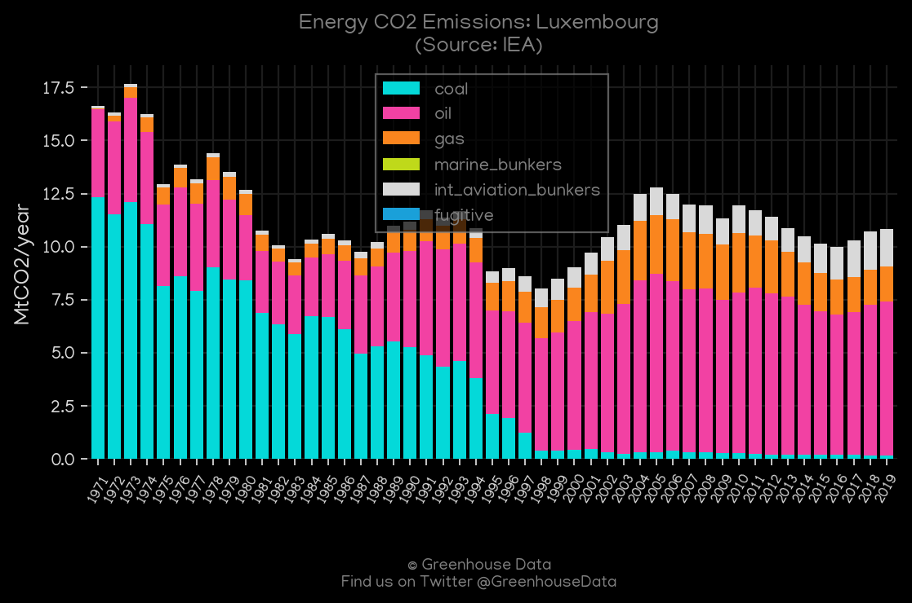
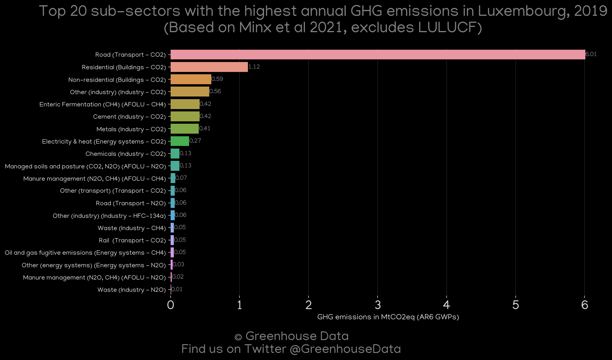
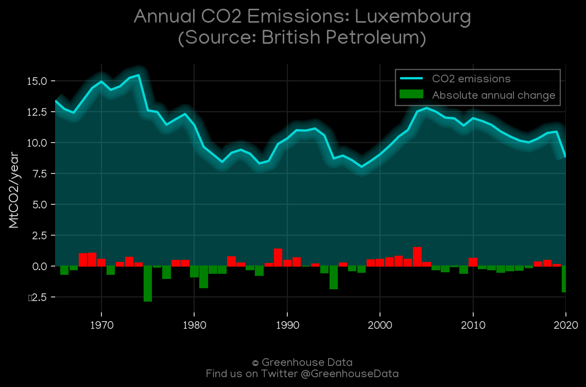
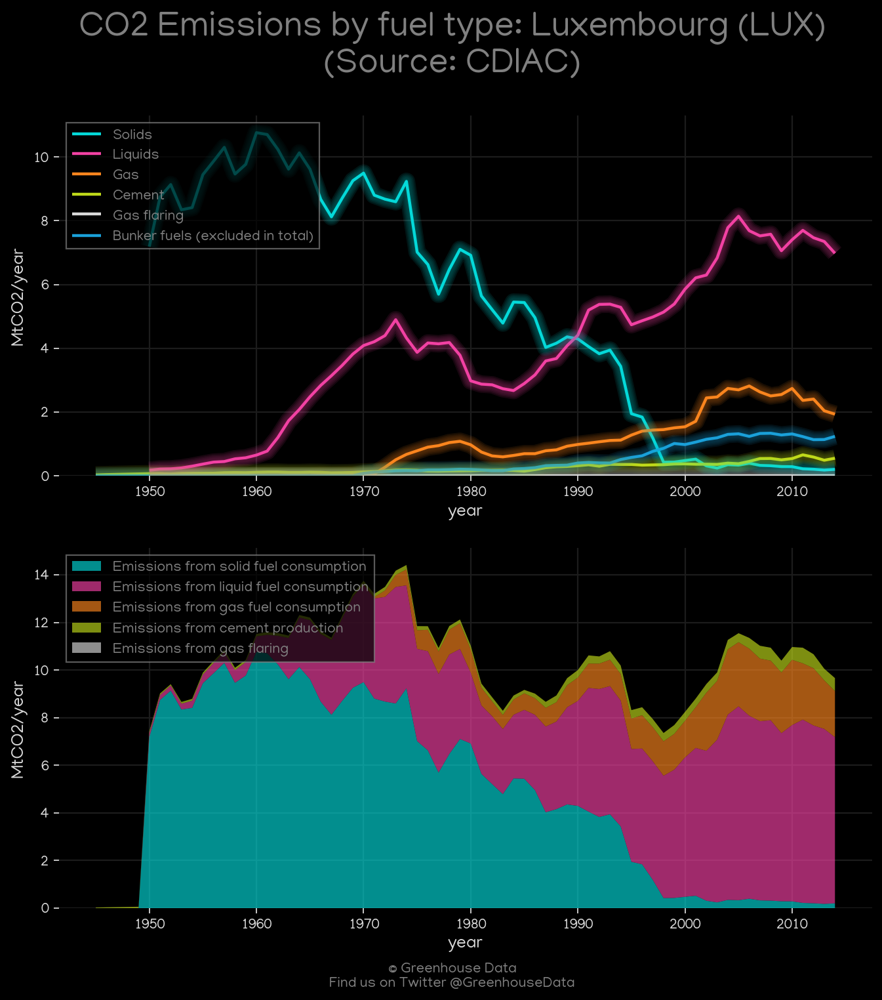
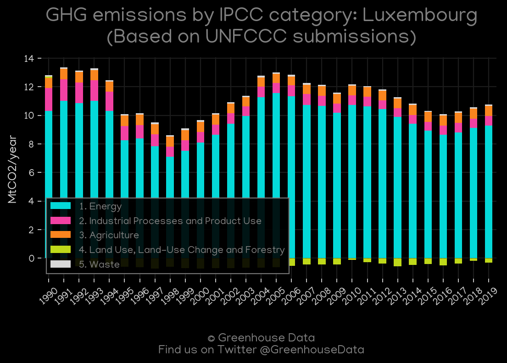
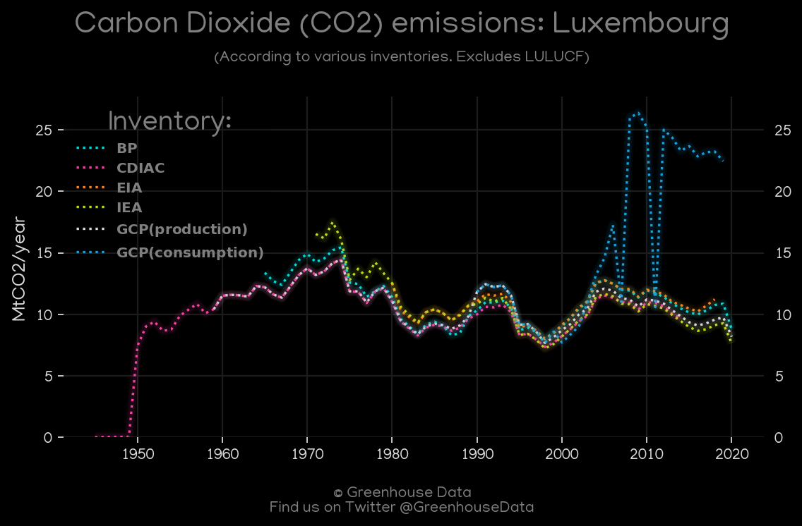
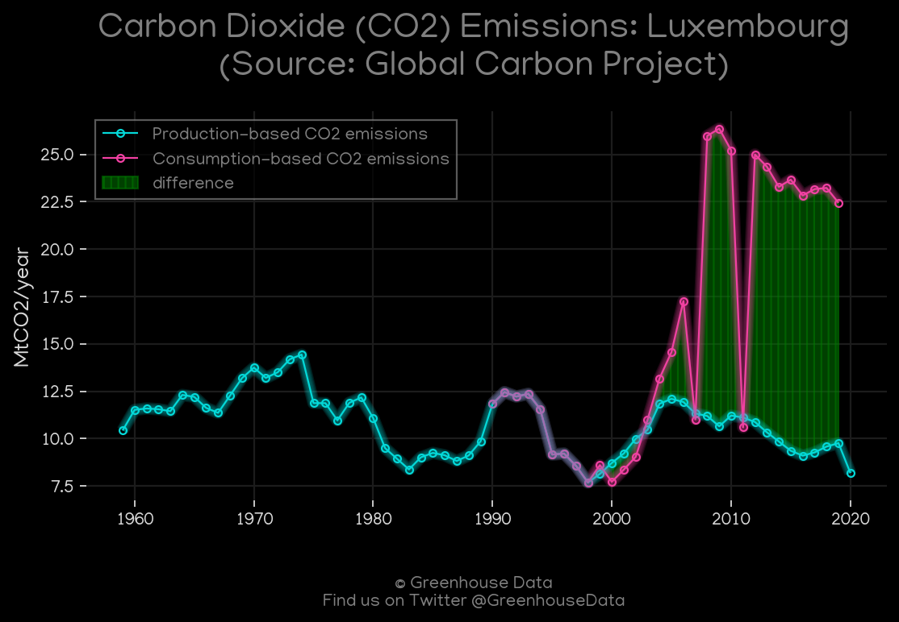
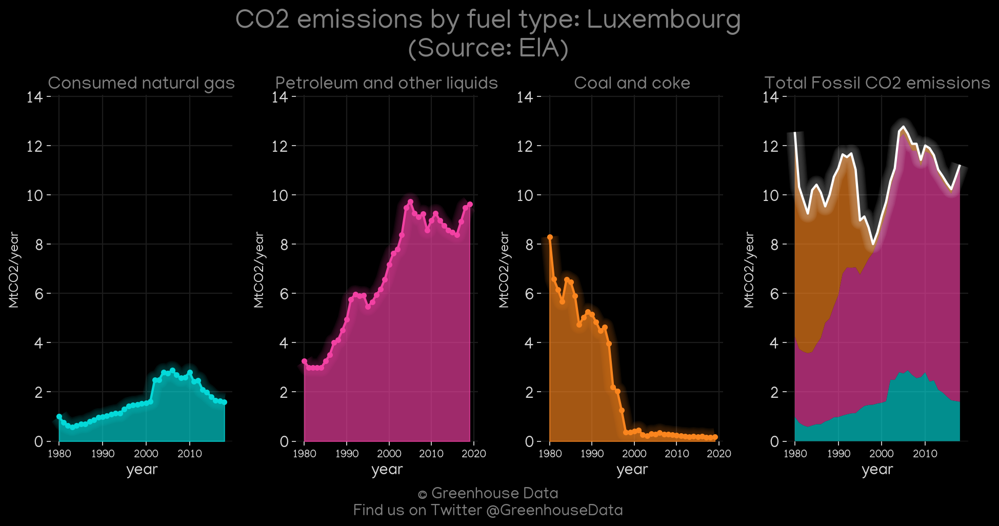
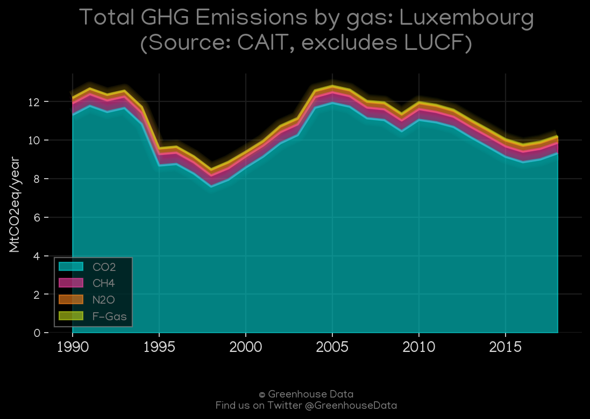

<h1 align="center">
🇱🇺🇱🇺🇱🇺🇱🇺🇱🇺
 
Luxembourg
 
🇱🇺🇱🇺🇱🇺🇱🇺🇱🇺
</h1>
<h2>Datasets:</h2>

<a href="https://github.com/dquintani/GreenhouseData/tree/master/country_data/LUX_Luxembourg/data">View on Github</a>
 

<a href="data/LUX_IEA.csv">IEA</a> || <a href="data/LUX_EIA.csv">EIA</a> || <a href="data/LUX_EDGAR.csv">EDGAR</a> || <a href="data/LUX_CDIAC.csv">CDIAC</a> || <a href="data/LUX_GCP_consupmption.csv">GCP_consupmption</a> || <a href="data/LUX_FAO.csv">FAO</a> || <a href="data/LUX_Minx_2021.csv">Minx_2021</a> || <a href="data/LUX_EPA.csv">EPA</a> || <a href="data/LUX_PRIMAP-hist.csv">PRIMAP-hist</a> || <a href="data/LUX_BP.csv">BP</a> || <a href="data/LUX_GCP.csv">GCP</a> || <a href="data/LUX_CAIT.csv">CAIT</a>

 

<h1>Figures:</h1><h2>#1 (LUX_IEA_1)</h2>

<h2>#2 (LUX_Minx_top20_subsectors)</h2>

<h2>#3 (LUX_BP_1)</h2>

<h2>#4 (LUX_CDIAC_1)</h2>

<h2>#5 (LUX_UNFCCC_AI_1)</h2>

<h2>#6 (LUX_CO2_totals)</h2>

<h2>#7 (LUX_GCP_1)</h2>

<h2>#8 (LUX_EIA_1)</h2>

<h2>#9 (LUX_CAIT_gases_1)</h2>

