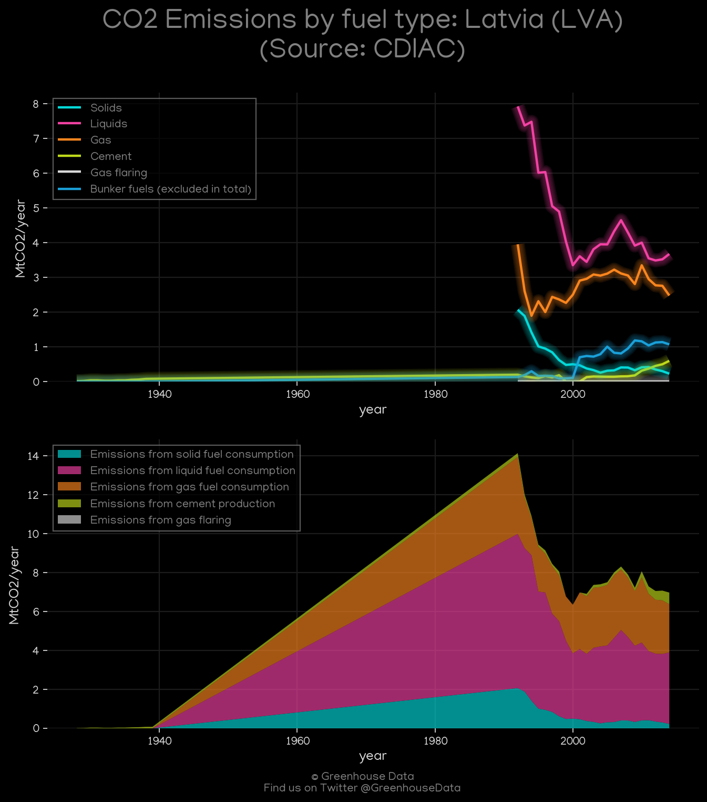
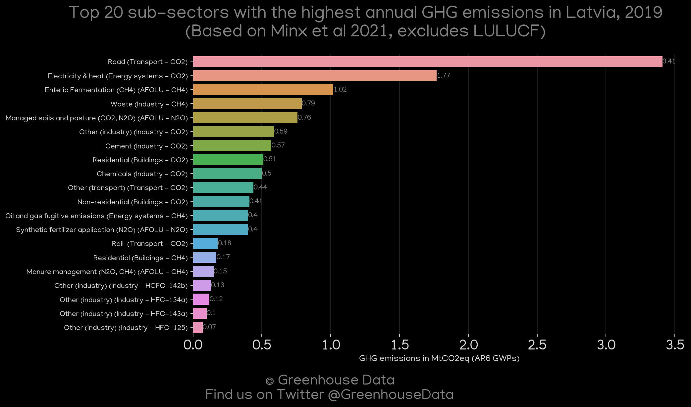
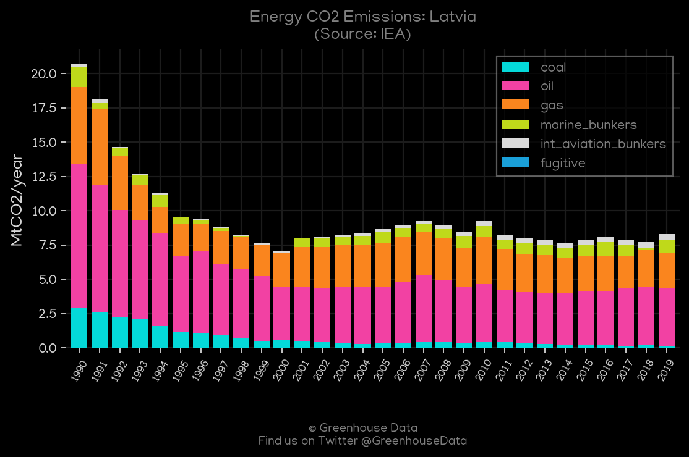
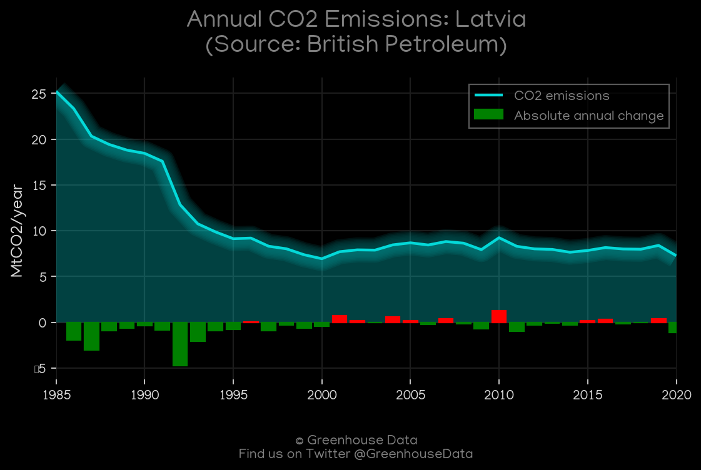
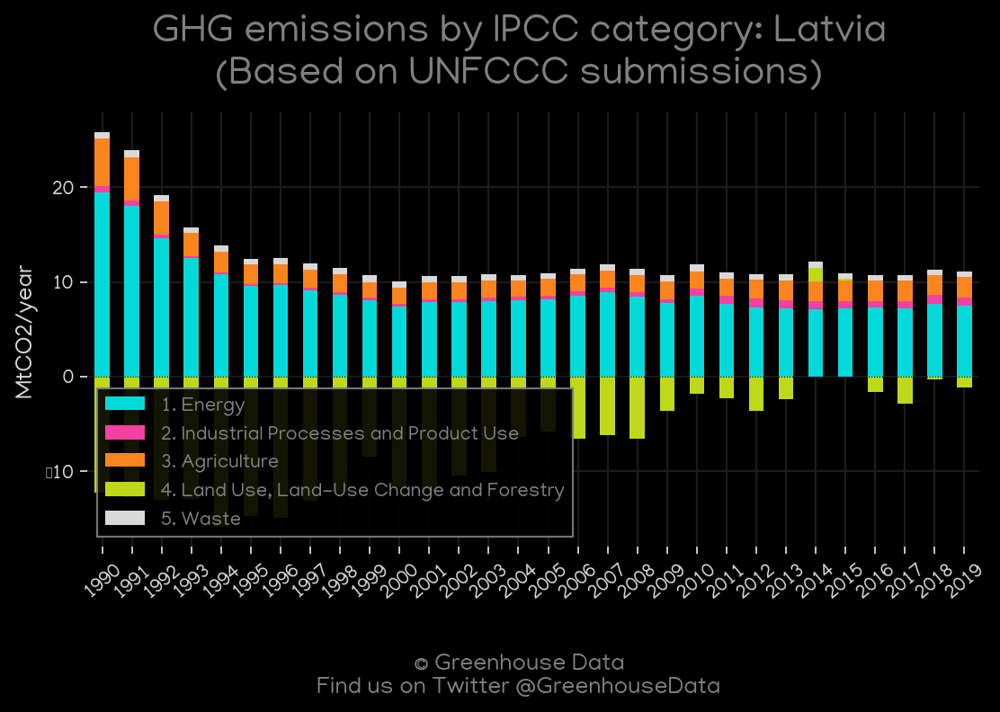
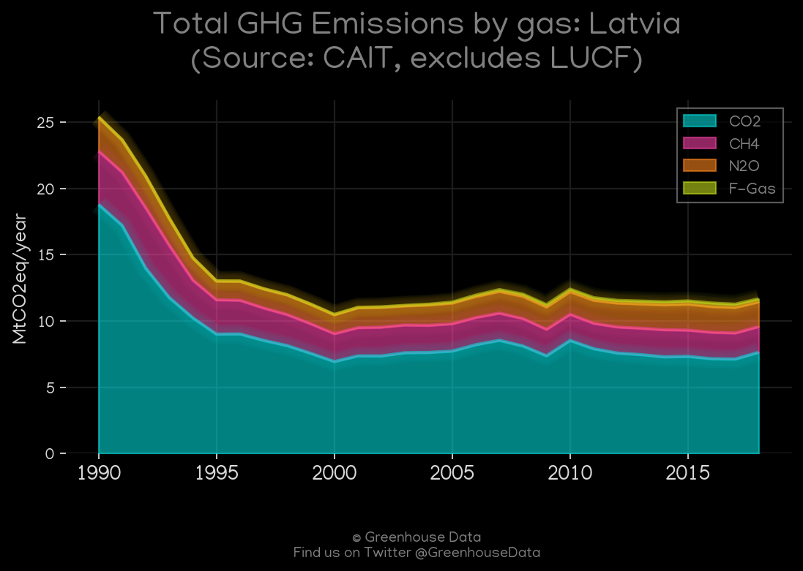
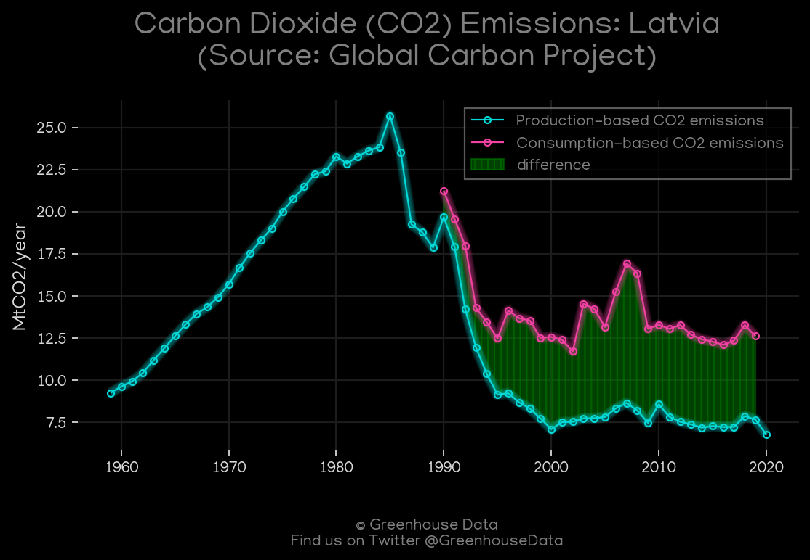

<h1 align="center">
🇱🇻🇱🇻🇱🇻🇱🇻🇱🇻
 
Latvia
 
🇱🇻🇱🇻🇱🇻🇱🇻🇱🇻
</h1>
<h2>Datasets:</h2>

<a href="https://github.com/dquintani/GreenhouseData/tree/master/country_data/LVA_Latvia/data">View on Github</a>
 

<a href="data/LVA_CDIAC.csv">CDIAC</a> || <a href="data/LVA_CAIT.csv">CAIT</a> || <a href="data/LVA_EIA.csv">EIA</a> || <a href="data/LVA_PRIMAP-hist.csv">PRIMAP-hist</a> || <a href="data/LVA_GCP.csv">GCP</a> || <a href="data/LVA_IEA.csv">IEA</a> || <a href="data/LVA_GCP_consupmption.csv">GCP_consupmption</a> || <a href="data/LVA_Minx_2021.csv">Minx_2021</a> || <a href="data/LVA_EDGAR.csv">EDGAR</a> || <a href="data/LVA_BP.csv">BP</a> || <a href="data/LVA_FAO.csv">FAO</a> || <a href="data/LVA_EPA.csv">EPA</a>

 

<h1>Figures:</h1><h2>#1 (LVA_CDIAC_1)</h2>

<h2>#2 (LVA_Minx_top20_subsectors)</h2>

<h2>#3 (LVA_EIA_1)</h2>

<h2>#4 (LVA_IEA_1)</h2>

<h2>#5 (LVA_BP_1)</h2>

<h2>#6 (LVA_UNFCCC_AI_1)</h2>

<h2>#7 (LVA_CAIT_gases_1)</h2>

<h2>#8 (LVA_CO2_totals)</h2>

<h2>#9 (LVA_GCP_1)</h2>

