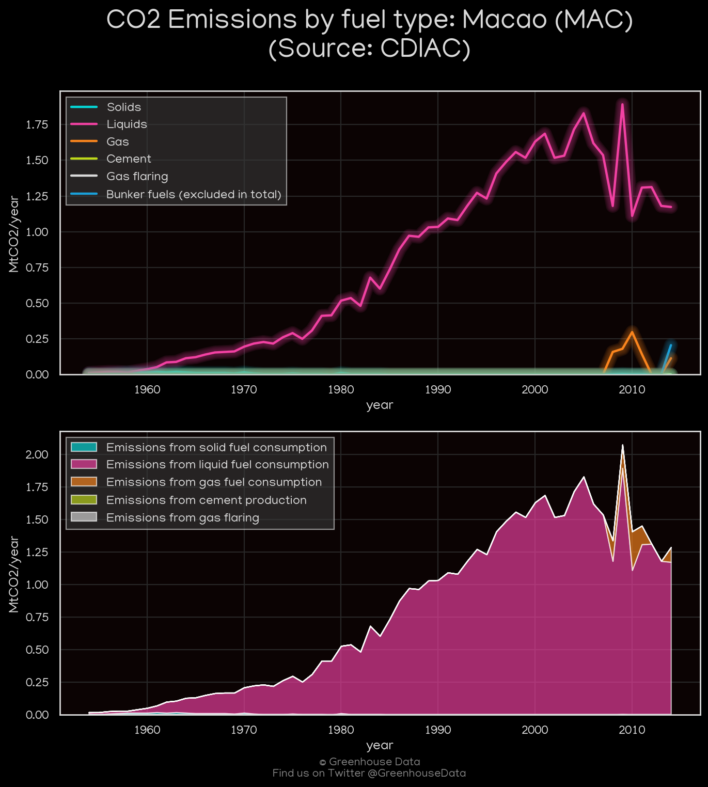
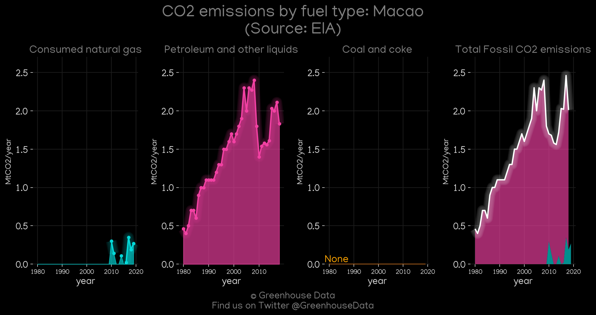
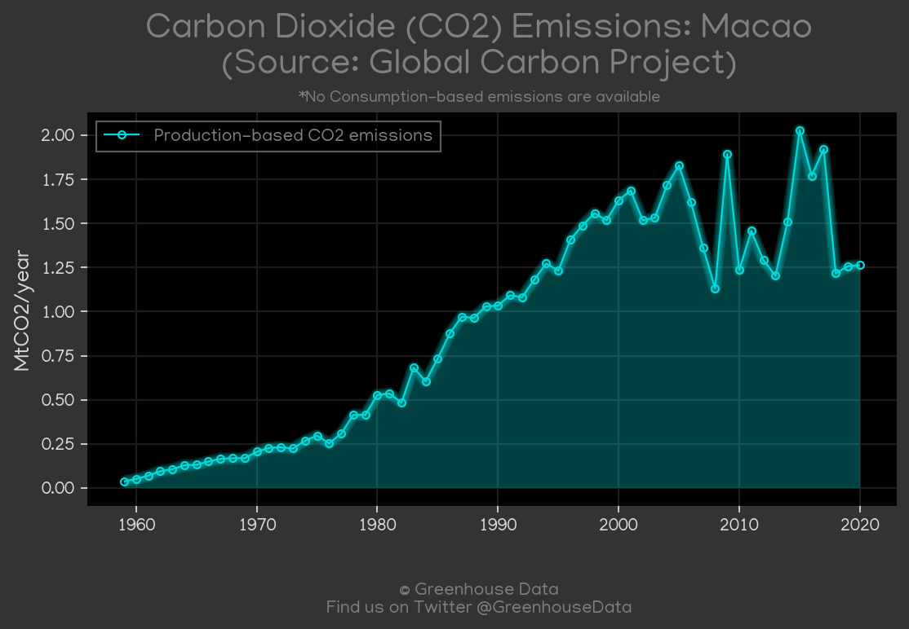
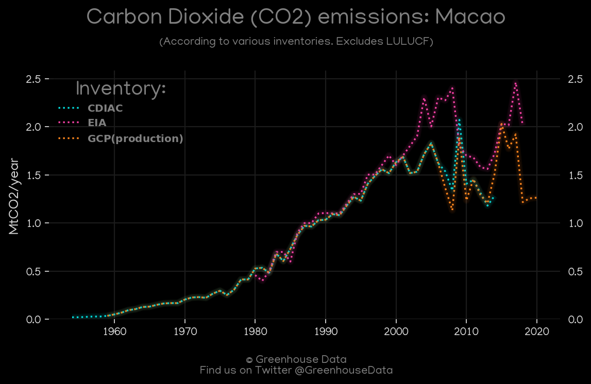
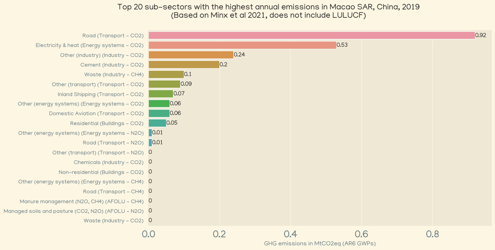

<h1 align="center">
🇲🇴🇲🇴🇲🇴🇲🇴🇲🇴
 
Macao
 
🇲🇴🇲🇴🇲🇴🇲🇴🇲🇴
</h1>
<h2>Datasets:</h2>

<a href="https://github.com/dquintani/Greenhouse-Data/tree/master/country_data/MAC_Macao/data">View on Github</a>
 

<a href="data/MAC_GCP_cons.csv">GCP_cons</a> || <a href="data/MAC_EDGAR.csv">EDGAR</a> || <a href="data/MAC_GCP.csv">GCP</a> || <a href="data/MAC_Minx_2021.csv">Minx_2021</a> || <a href="data/MAC_FAO.csv">FAO</a> || <a href="data/MAC_PRIMAP-hist.csv">PRIMAP-hist</a> || <a href="data/MAC_GCP_consupmption.csv">GCP_consupmption</a> || <a href="data/MAC_CDIAC.csv">CDIAC</a> || <a href="data/MAC_EIA.csv">EIA</a>

 

<h1>Figures:</h1><h2>#1 (MAC_CDIAC_1)</h2>

<h2>#2 (MAC_EIA_1)</h2>

<h2>#3 (MAC_GCP_1)</h2>

<h2>#4 (MAC_CO2_totals)</h2>

<h2>#5 (MAC_Minx_top20_subsectors)</h2>

