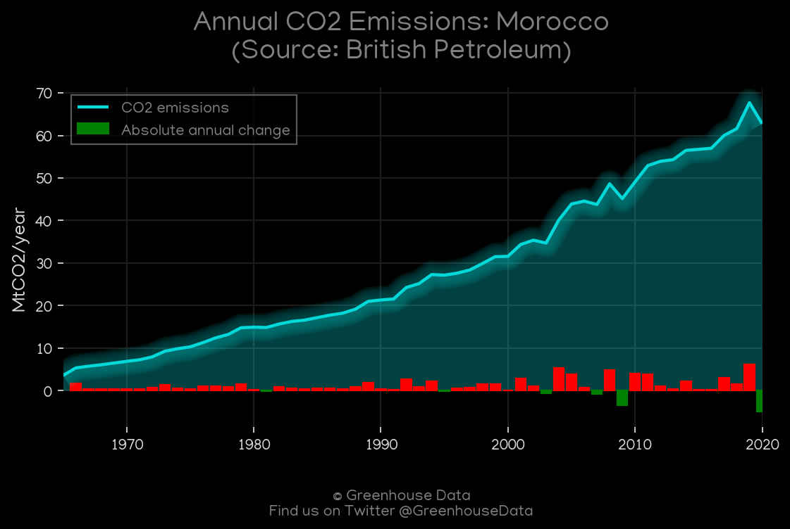
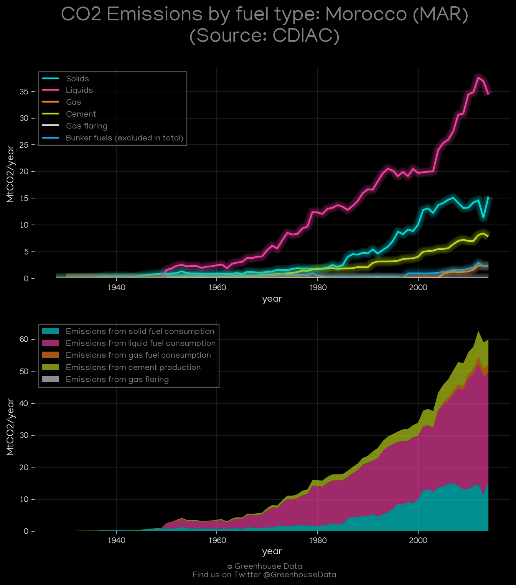
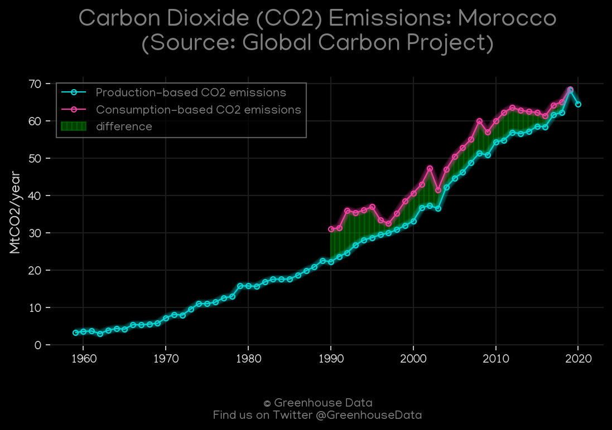
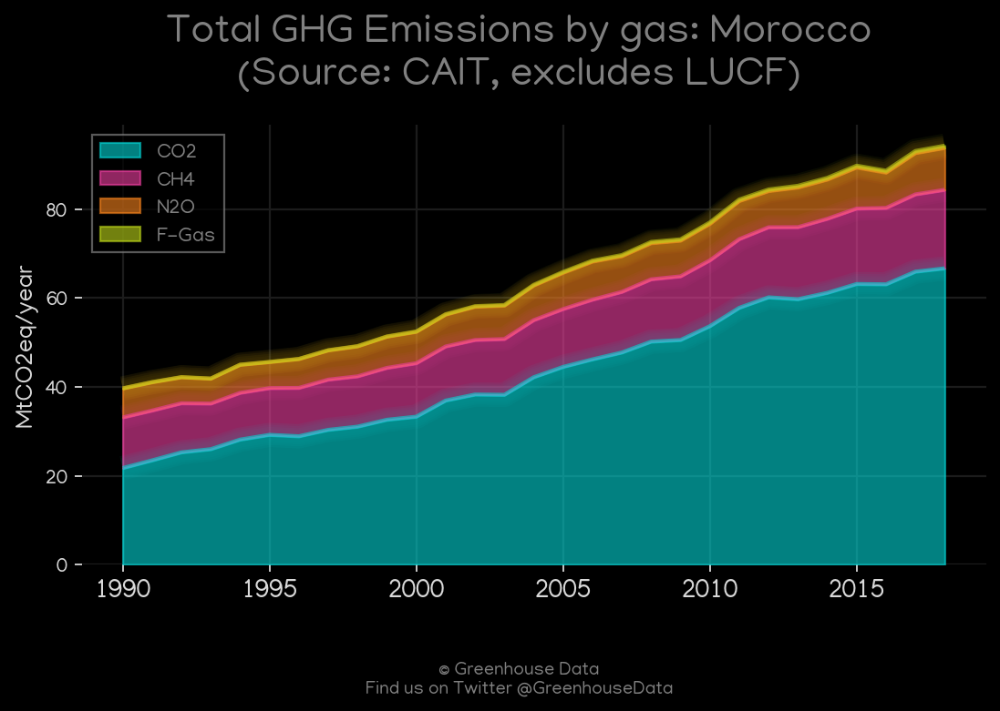
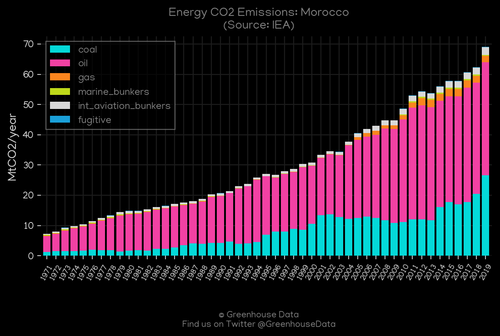
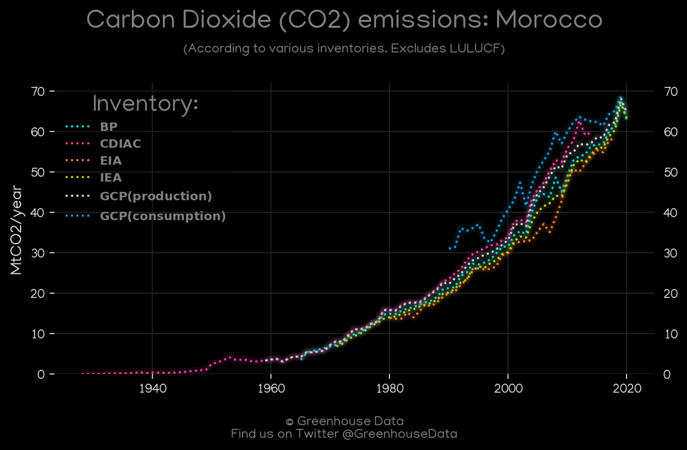
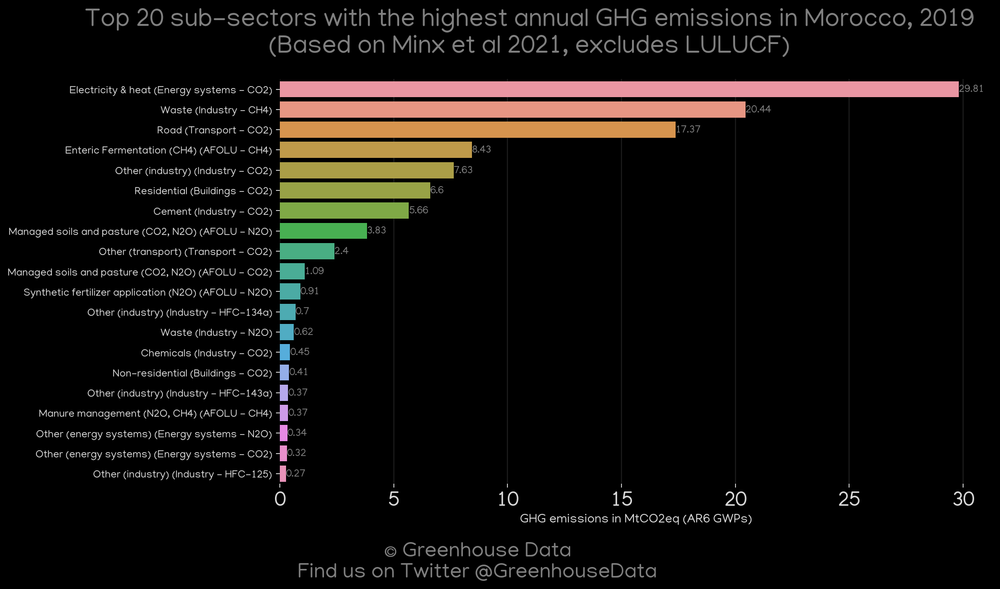
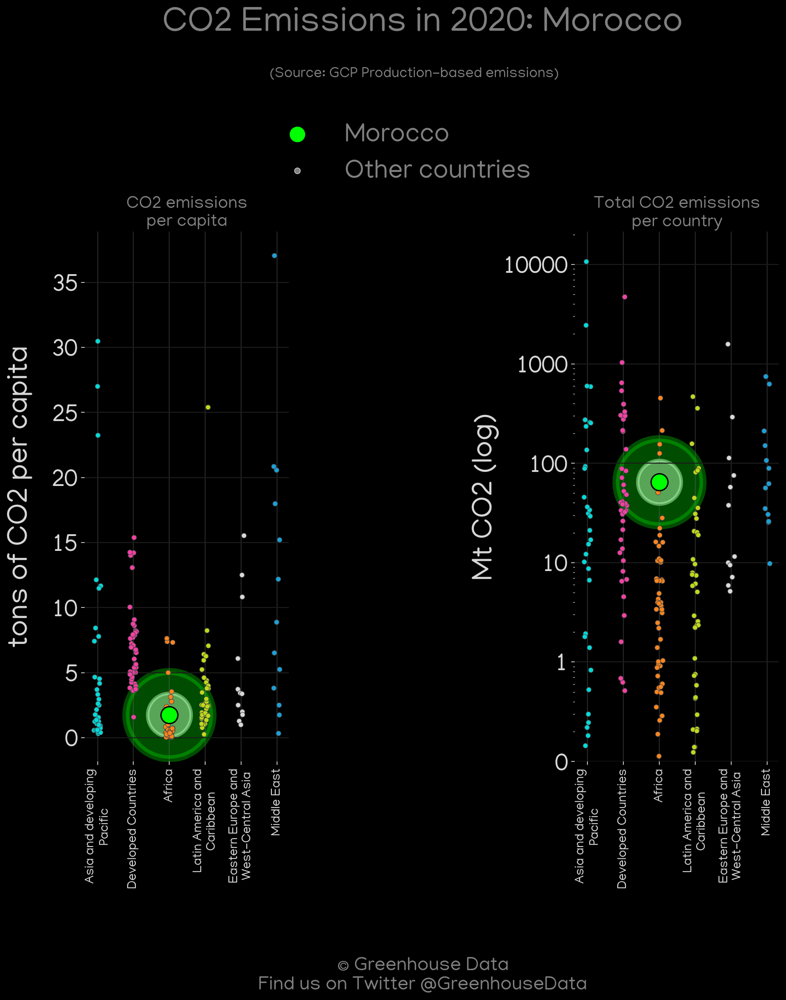
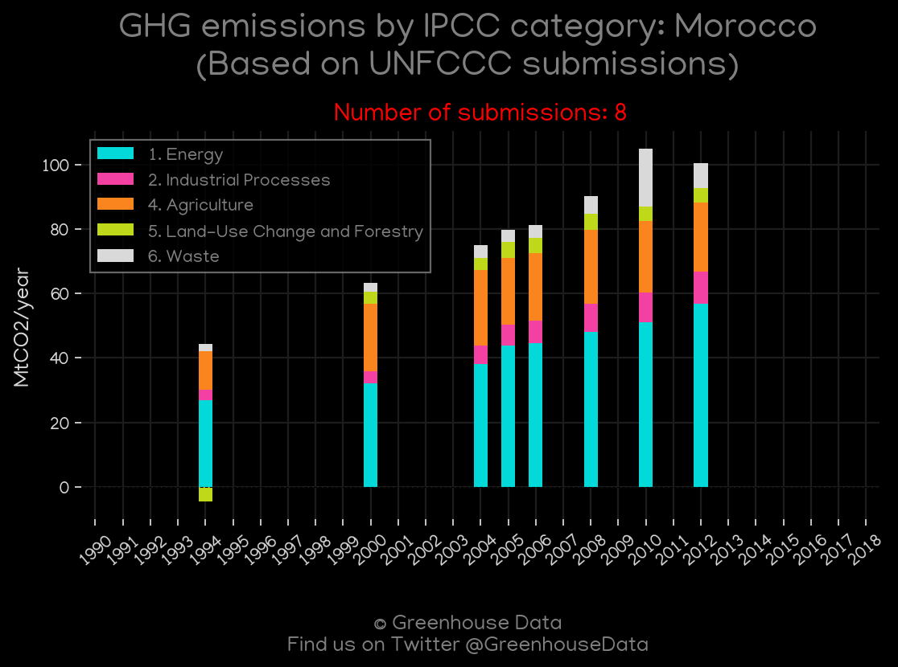
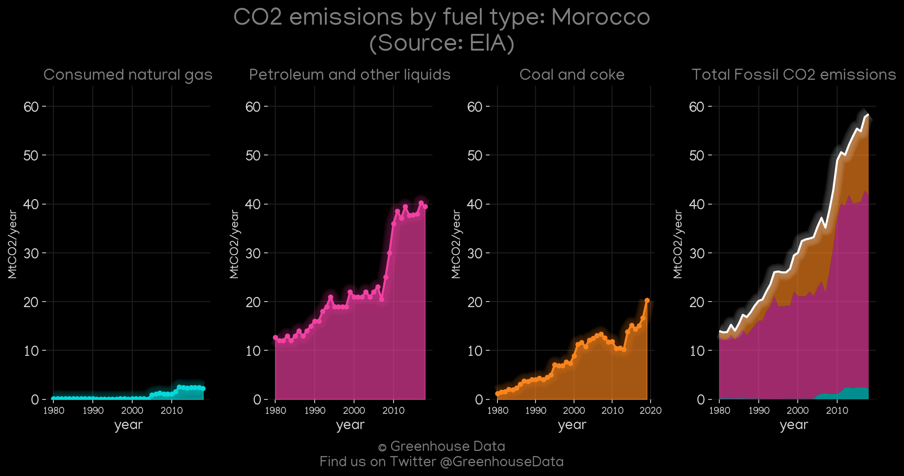

<h1 align="center">
🇲🇦🇲🇦🇲🇦🇲🇦🇲🇦
 
Morocco
 
🇲🇦🇲🇦🇲🇦🇲🇦🇲🇦
</h1>
<h2>Datasets:</h2>

<a href="https://github.com/dquintani/GreenhouseData/tree/master/country_data/MAR_Morocco/data">View on Github</a>
 

<a href="data/MAR_EDGAR.csv">EDGAR</a> || <a href="data/MAR_EIA.csv">EIA</a> || <a href="data/MAR_Minx_2021.csv">Minx_2021</a> || <a href="data/MAR_BP.csv">BP</a> || <a href="data/MAR_CAIT.csv">CAIT</a> || <a href="data/MAR_GCP.csv">GCP</a> || <a href="data/MAR_IEA.csv">IEA</a> || <a href="data/MAR_EPA.csv">EPA</a> || <a href="data/MAR_GCP_consupmption.csv">GCP_consupmption</a> || <a href="data/MAR_CDIAC.csv">CDIAC</a> || <a href="data/MAR_PRIMAP-hist.csv">PRIMAP-hist</a> || <a href="data/MAR_FAO.csv">FAO</a>

 

<h1>Figures:</h1><h2>#1 (MAR_relative_totals)</h2>

<h2>#2 (MAR_CAIT_lucf_vs_nolucf)</h2>

<h2>#3 (MAR_BP_1)</h2>

<h2>#4 (MAR_CDIAC_1)</h2>

<h2>#5 (MAR_GCP_1)</h2>

<h2>#6 (MAR_CAIT_gases_1)</h2>

<h2>#7 (MAR_IEA_1)</h2>

<h2>#8 (MAR_CO2_totals)</h2>

<h2>#9 (MAR_Minx_top20_subsectors)</h2>

<h2>#10 (MAR_GCP_Country_Highlight)</h2>

<h2>#11 (MAR_UNFCCC_NAI_1)</h2>

<h2>#12 (MAR_EIA_1)</h2>

