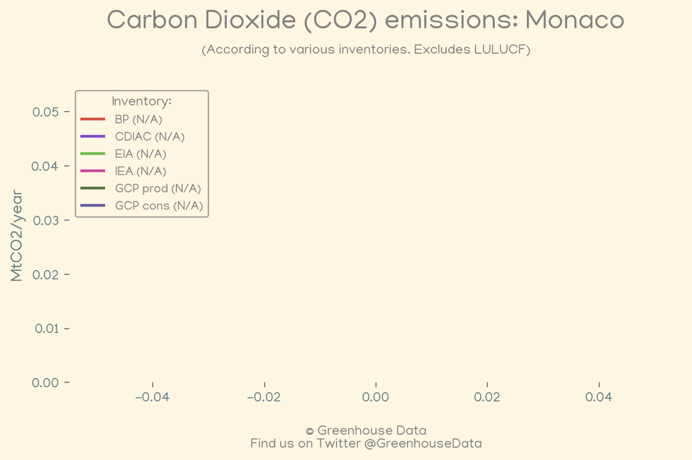
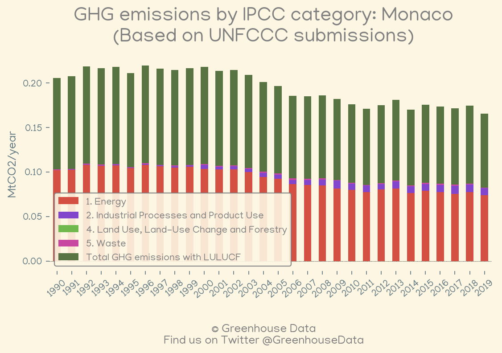

<h1 align="center">
🇲🇨🇲🇨🇲🇨🇲🇨🇲🇨
 
Monaco
 
🇲🇨🇲🇨🇲🇨🇲🇨🇲🇨
</h1>
<h2>Datasets:</h2>

<a href="https://github.com/dquintani/GreenhouseData/tree/master/country_data/MCO_Monaco/data">View on Github</a>
 

<a href="data/MCO_FAO.csv">FAO</a> || <a href="data/MCO_EPA.csv">EPA</a> || <a href="data/MCO_PRIMAP-hist.csv">PRIMAP-hist</a>

 

<h1>Figures:</h1><h2>#1 (MCO_CO2_totals)</h2>

<h2>#2 (MCO_UNFCCC_AI_1)</h2>

