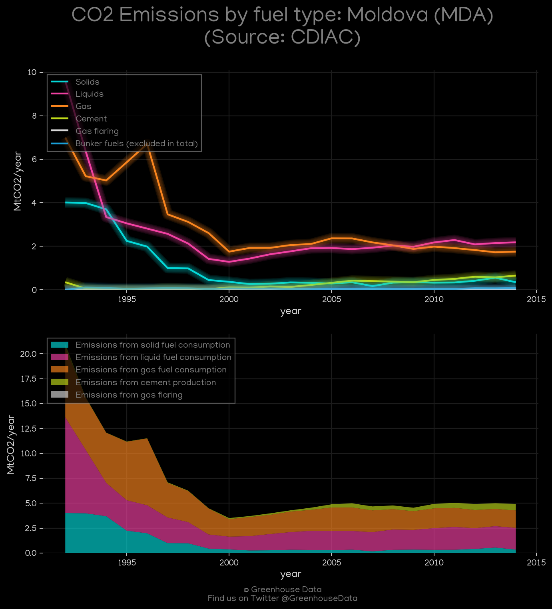
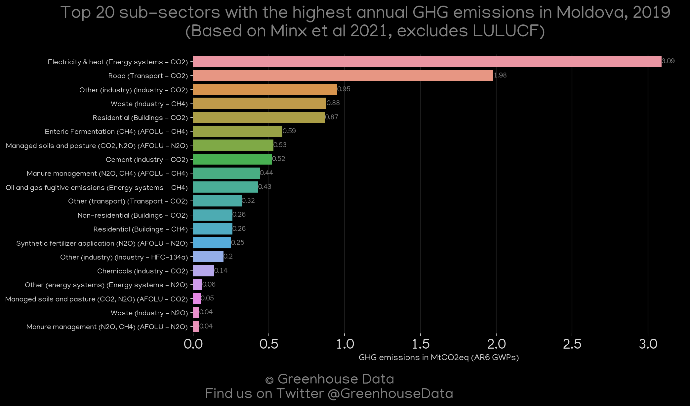
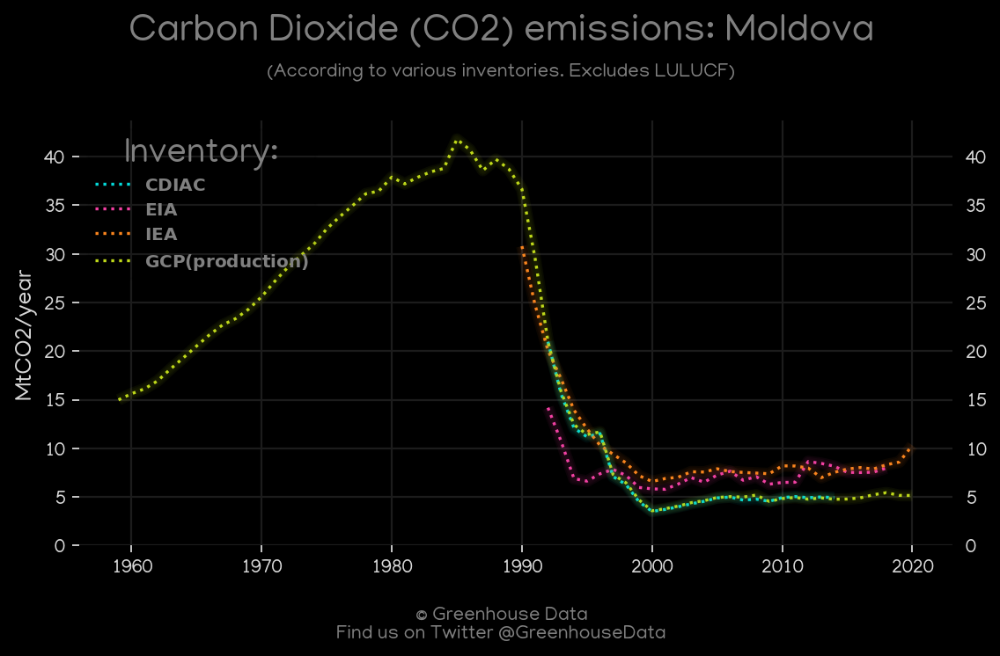
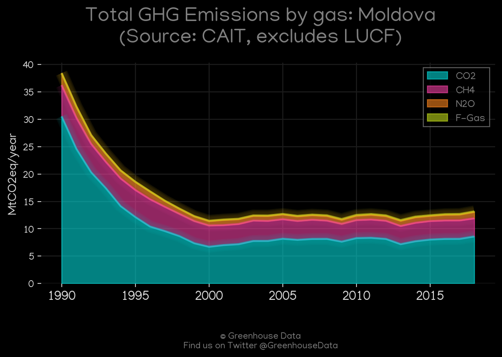
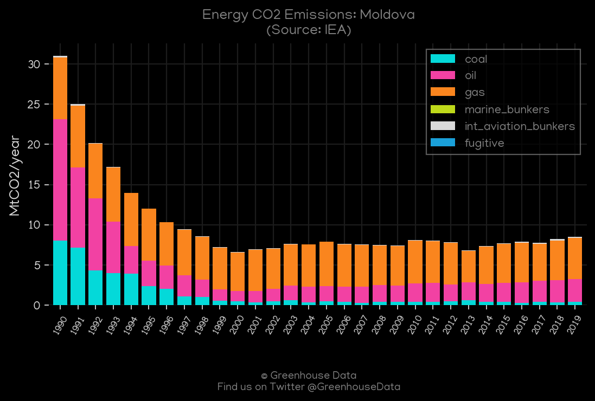
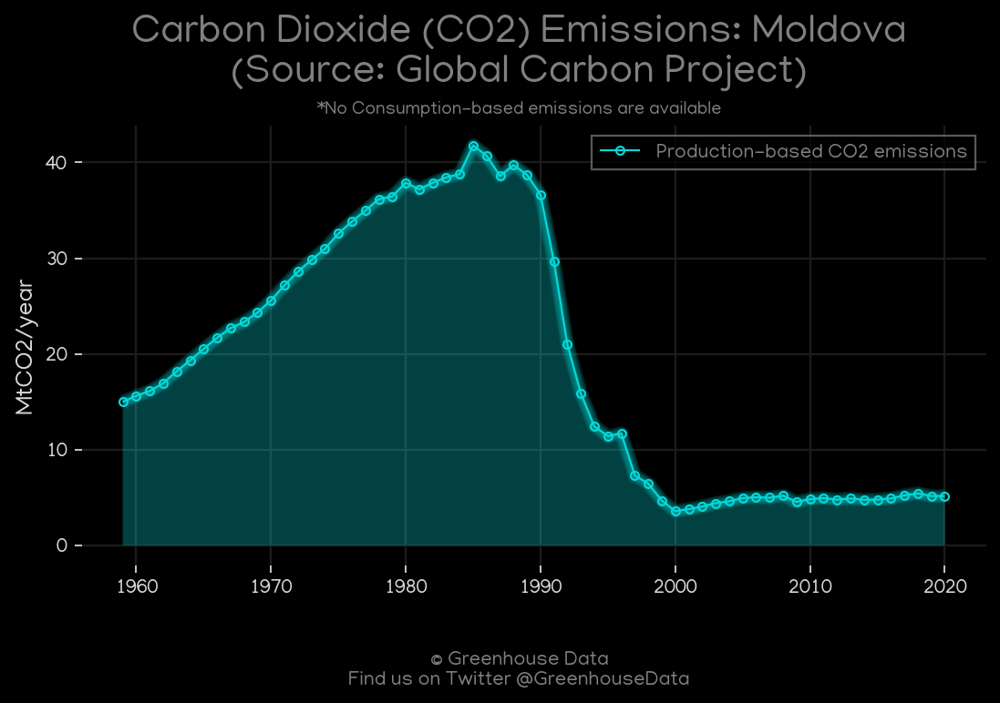
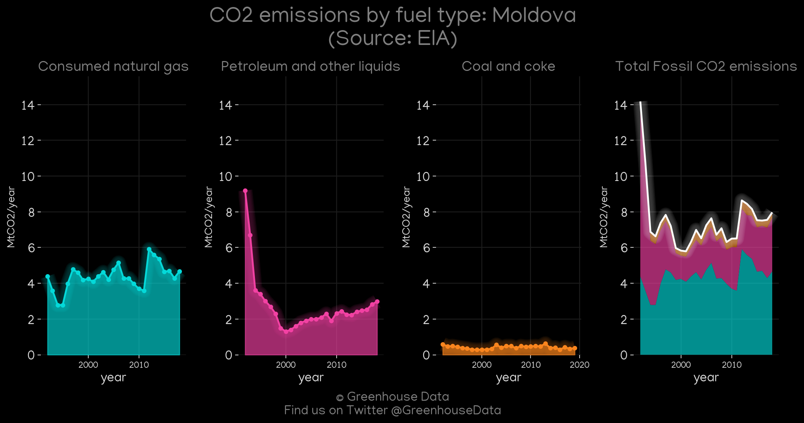
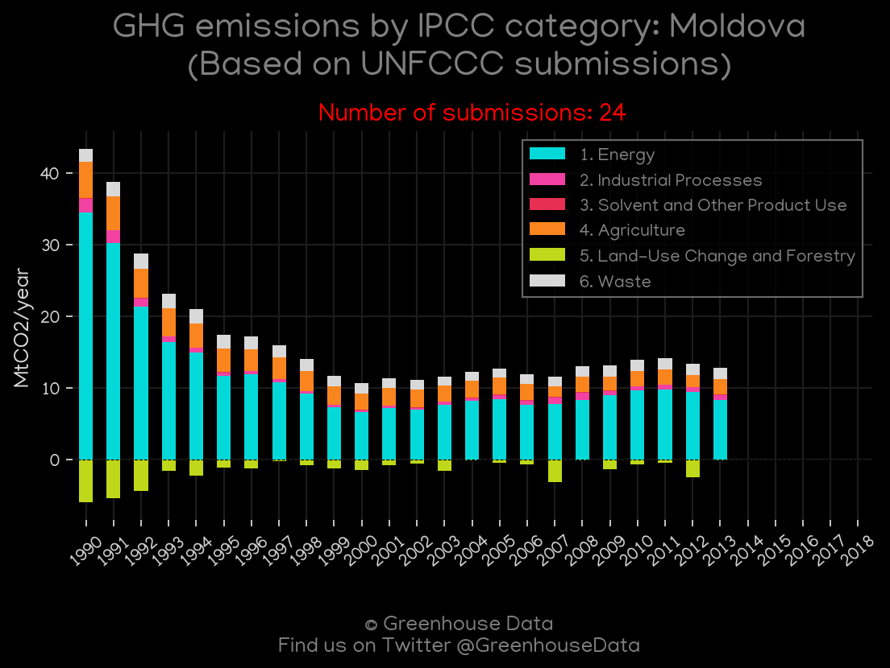

<h1 align="center">
🇲🇩🇲🇩🇲🇩🇲🇩🇲🇩
 
Moldova
 
🇲🇩🇲🇩🇲🇩🇲🇩🇲🇩
</h1>
<h2>Datasets:</h2>

<a href="https://github.com/dquintani/GreenhouseData/tree/master/country_data/MDA_Moldova/data">View on Github</a>
 

<a href="data/MDA_GCP_cons.csv">GCP_cons</a> || <a href="data/MDA_GCP.csv">GCP</a> || <a href="data/MDA_EPA.csv">EPA</a> || <a href="data/MDA_PRIMAP-hist.csv">PRIMAP-hist</a> || <a href="data/MDA_Minx_2021.csv">Minx_2021</a> || <a href="data/MDA_CAIT.csv">CAIT</a> || <a href="data/MDA_IEA.csv">IEA</a> || <a href="data/MDA_FAO.csv">FAO</a> || <a href="data/MDA_CDIAC.csv">CDIAC</a> || <a href="data/MDA_EIA.csv">EIA</a> || <a href="data/MDA_GCP_consupmption.csv">GCP_consupmption</a> || <a href="data/MDA_EDGAR.csv">EDGAR</a>

 

<h1>Figures:</h1><h2>#1 (MDA_CDIAC_1)</h2>

<h2>#2 (MDA_Minx_top20_subsectors)</h2>

<h2>#3 (MDA_CO2_totals)</h2>

<h2>#4 (MDA_CAIT_gases_1)</h2>

<h2>#5 (MDA_IEA_1)</h2>

<h2>#6 (MDA_GCP_1)</h2>

<h2>#7 (MDA_EIA_1)</h2>

<h2>#8 (MDA_UNFCCC_NAI_1)</h2>

