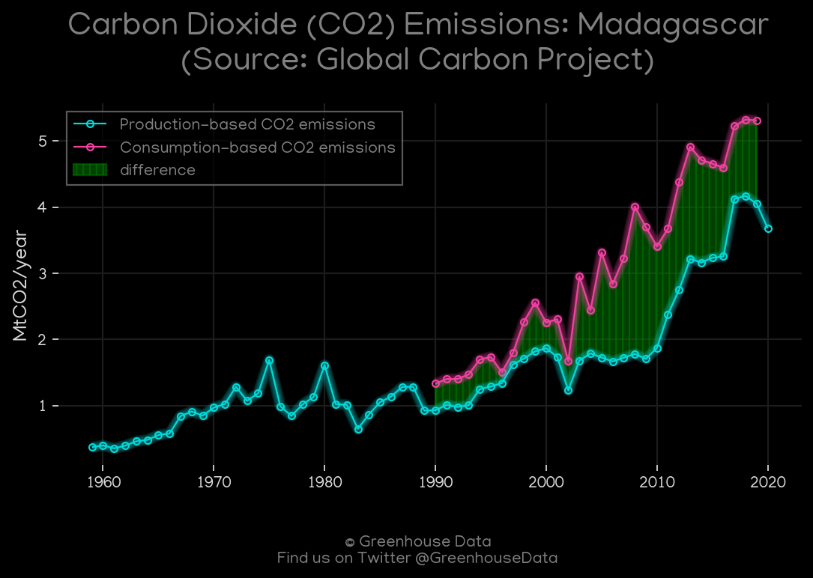
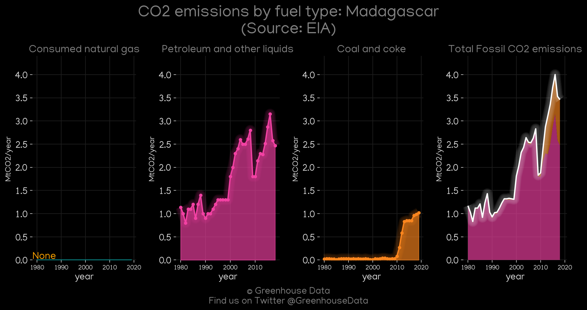
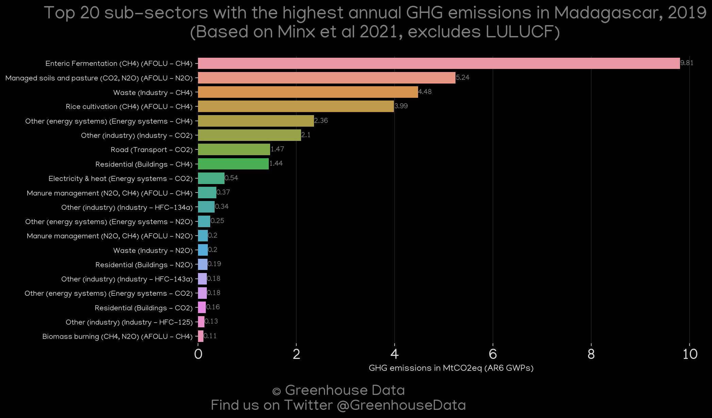
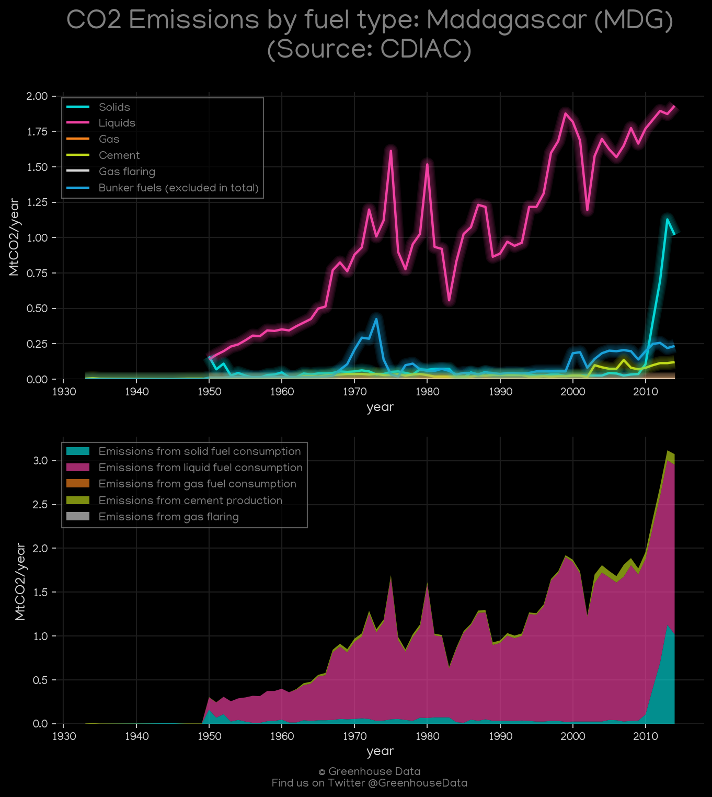
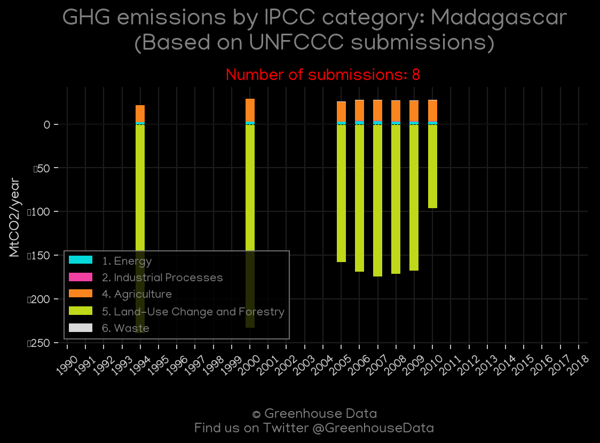
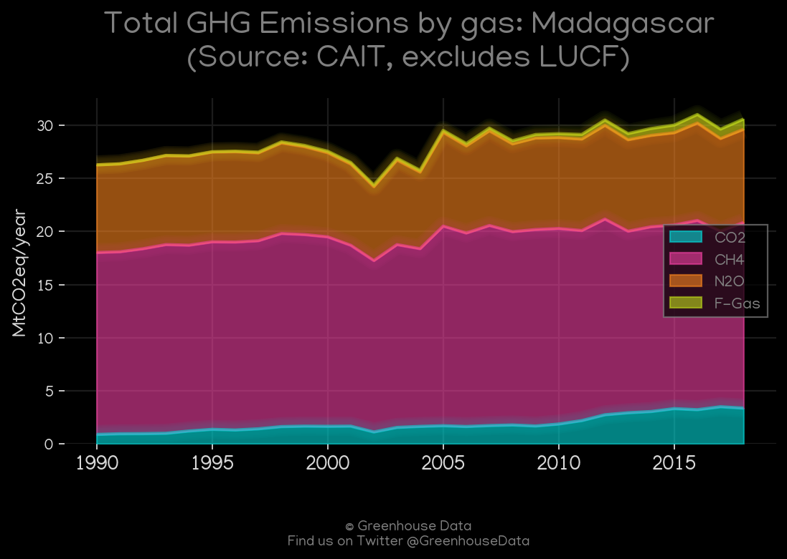

<h1 align="center">
🇲🇬🇲🇬🇲🇬🇲🇬🇲🇬
 
Madagascar
 
🇲🇬🇲🇬🇲🇬🇲🇬🇲🇬
</h1>
<h2>Datasets:</h2>

<a href="https://github.com/dquintani/Greenhouse-Data/tree/master/country_data/MDG_Madagascar/data">View on Github</a>
 

<a href="data/MDG_EIA.csv">EIA</a> || <a href="data/MDG_CAIT.csv">CAIT</a> || <a href="data/MDG_GCP_cons.csv">GCP_cons</a> || <a href="data/MDG_CDIAC.csv">CDIAC</a> || <a href="data/MDG_EPA.csv">EPA</a> || <a href="data/MDG_Minx_2021.csv">Minx_2021</a> || <a href="data/MDG_PRIMAP-hist.csv">PRIMAP-hist</a> || <a href="data/MDG_EDGAR.csv">EDGAR</a> || <a href="data/MDG_GCP.csv">GCP</a> || <a href="data/MDG_GCP_consupmption.csv">GCP_consupmption</a> || <a href="data/MDG_FAO.csv">FAO</a>

 

<h1>Figures:</h1><h2>#1 (MDG_GCP_1)</h2>

<h2>#2 (MDG_EIA_1)</h2>

<h2>#3 (MDG_Minx_top20_subsectors)</h2>

<h2>#4 (MDG_CDIAC_1)</h2>

<h2>#5 (MDG_CO2_totals)</h2>

<h2>#6 (MDG_UNFCCC_NAI_1)</h2>

<h2>#7 (MDG_CAIT_gases_1)</h2>

