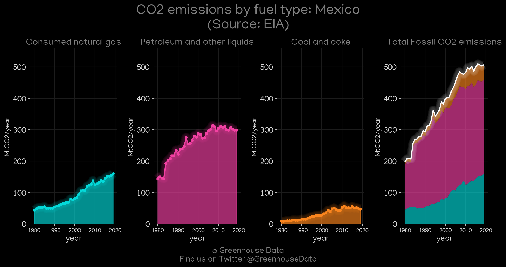
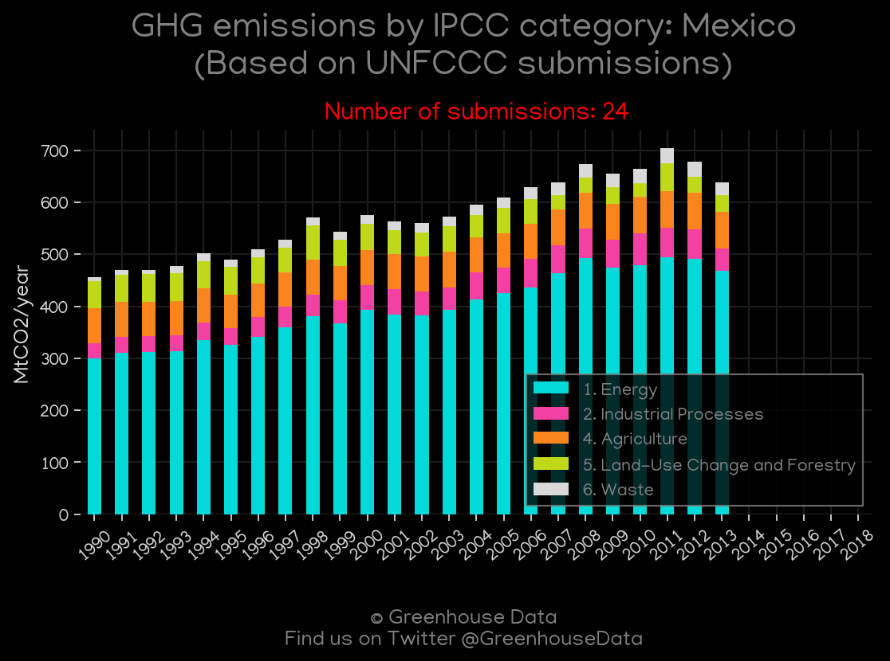
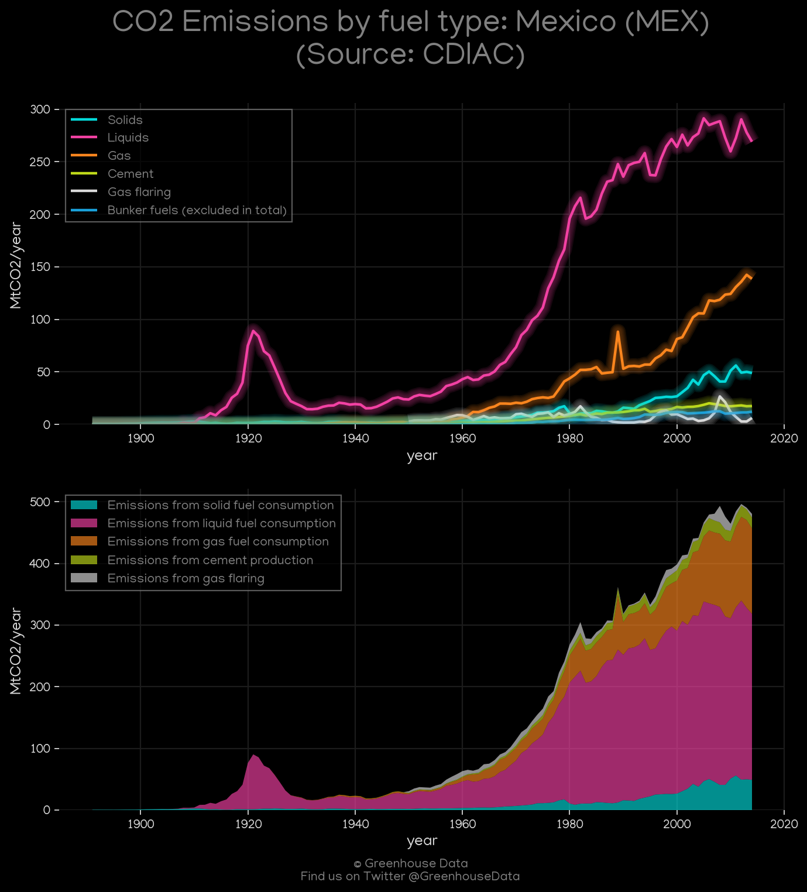
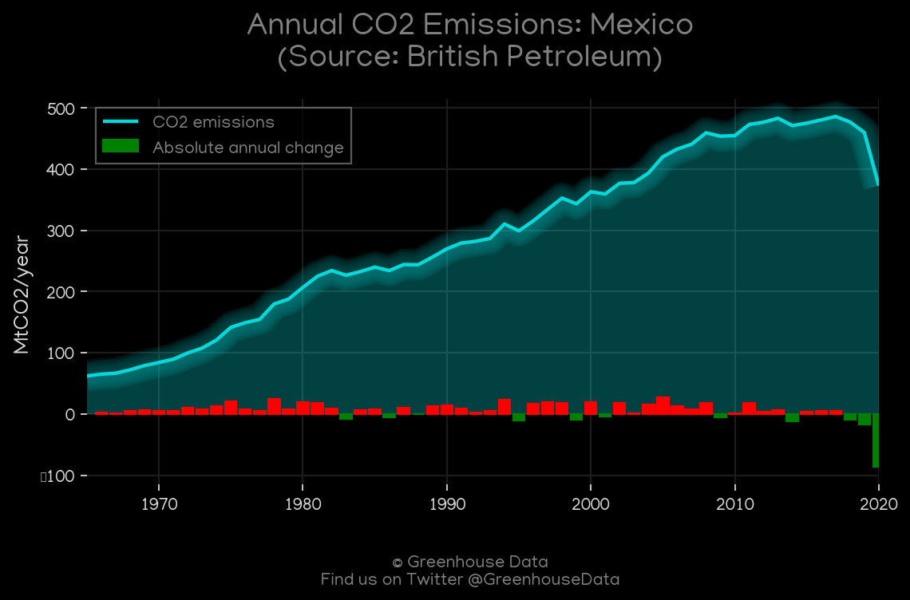
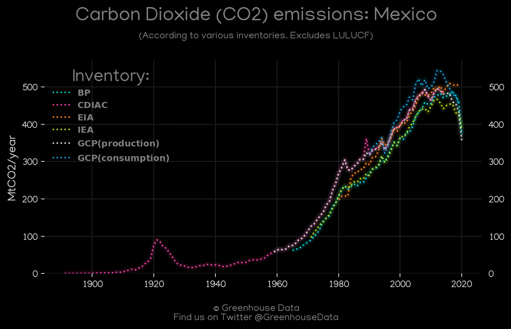
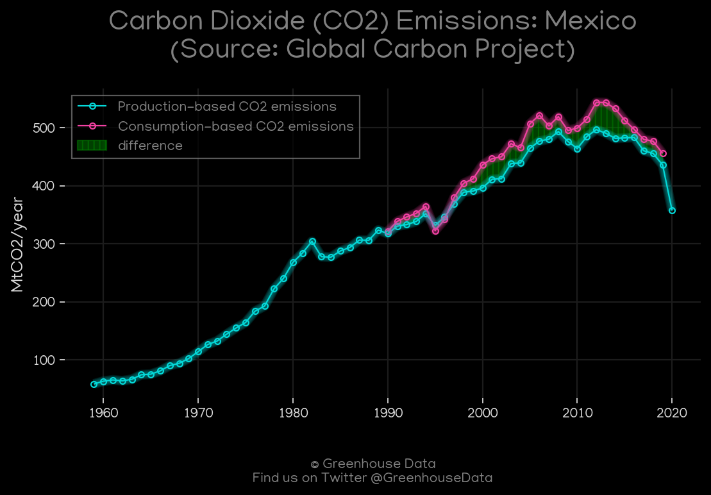
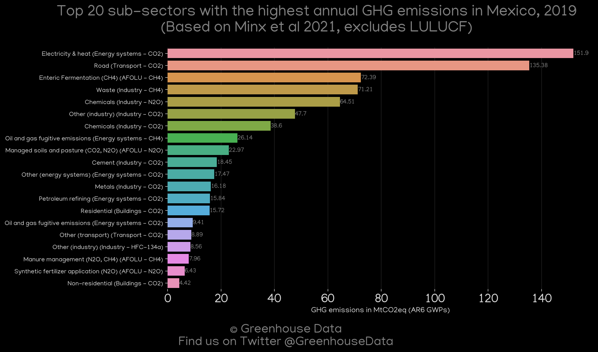
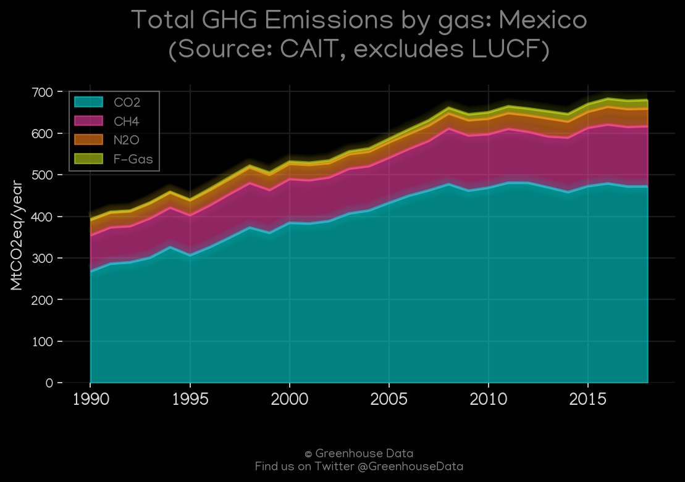
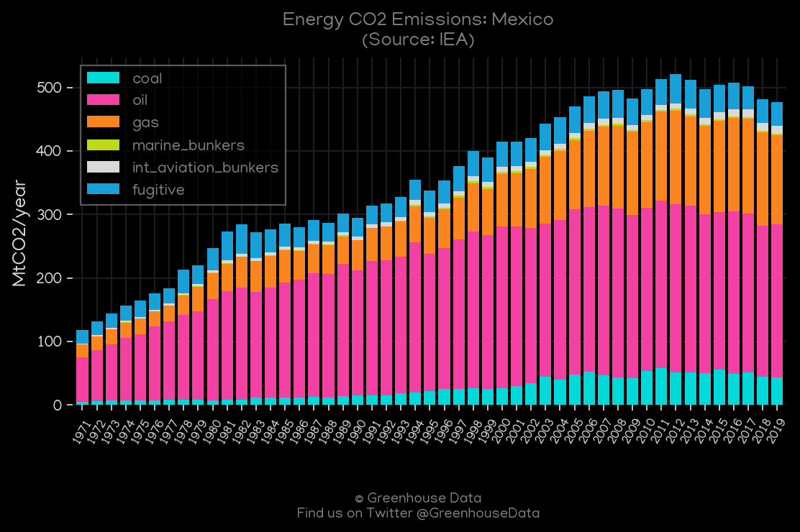

<h1 align="center">
🇲🇽🇲🇽🇲🇽🇲🇽🇲🇽
 
Mexico
 
🇲🇽🇲🇽🇲🇽🇲🇽🇲🇽
</h1>
<h2>Datasets:</h2>

<a href="https://github.com/dquintani/GreenhouseData/tree/master/country_data/MEX_Mexico/data">View on Github</a>
 

<a href="data/MEX_CDIAC.csv">CDIAC</a> || <a href="data/MEX_EPA.csv">EPA</a> || <a href="data/MEX_EDGAR.csv">EDGAR</a> || <a href="data/MEX_PRIMAP-hist.csv">PRIMAP-hist</a> || <a href="data/MEX_GCP_consupmption.csv">GCP_consupmption</a> || <a href="data/MEX_GCP.csv">GCP</a> || <a href="data/MEX_BP.csv">BP</a> || <a href="data/MEX_FAO.csv">FAO</a> || <a href="data/MEX_IEA.csv">IEA</a> || <a href="data/MEX_Minx_2021.csv">Minx_2021</a> || <a href="data/MEX_EIA.csv">EIA</a> || <a href="data/MEX_CAIT.csv">CAIT</a>

 

<h1>Figures:</h1><h2>#1 (MEX_EIA_1)</h2>

<h2>#2 (MEX_UNFCCC_NAI_1)</h2>

<h2>#3 (MEX_CDIAC_1)</h2>

<h2>#4 (MEX_BP_1)</h2>

<h2>#5 (MEX_CO2_totals)</h2>

<h2>#6 (MEX_GCP_1)</h2>

<h2>#7 (MEX_Minx_top20_subsectors)</h2>

<h2>#8 (MEX_CAIT_gases_1)</h2>

<h2>#9 (MEX_IEA_1)</h2>

