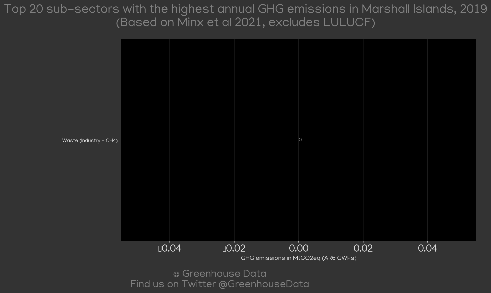
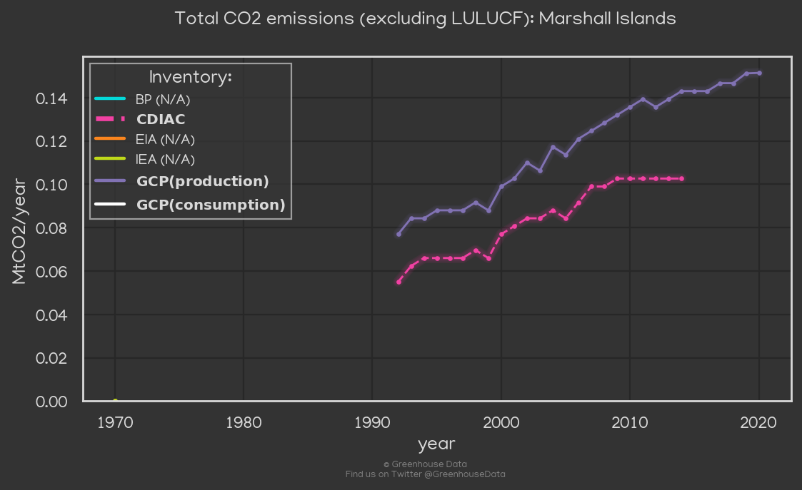
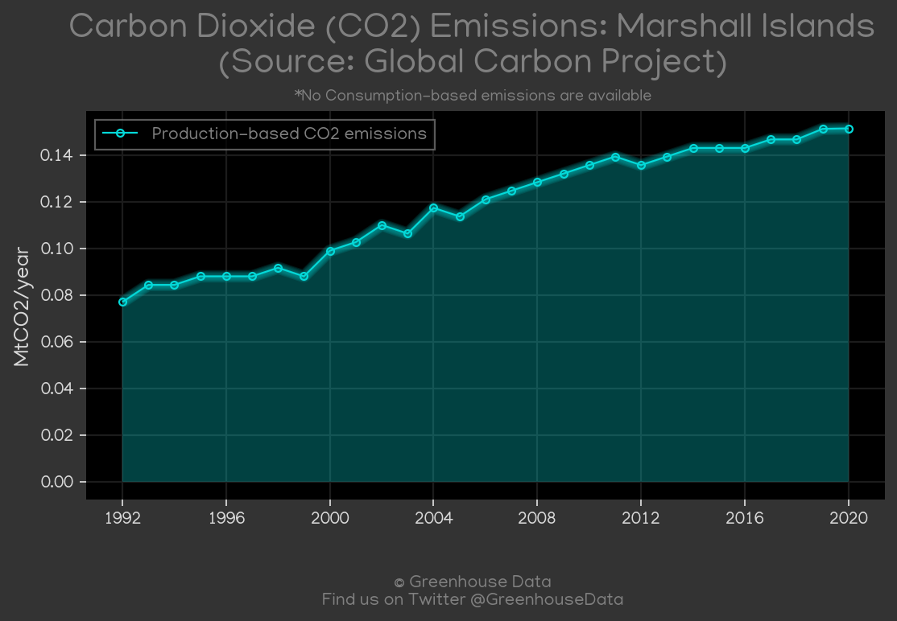
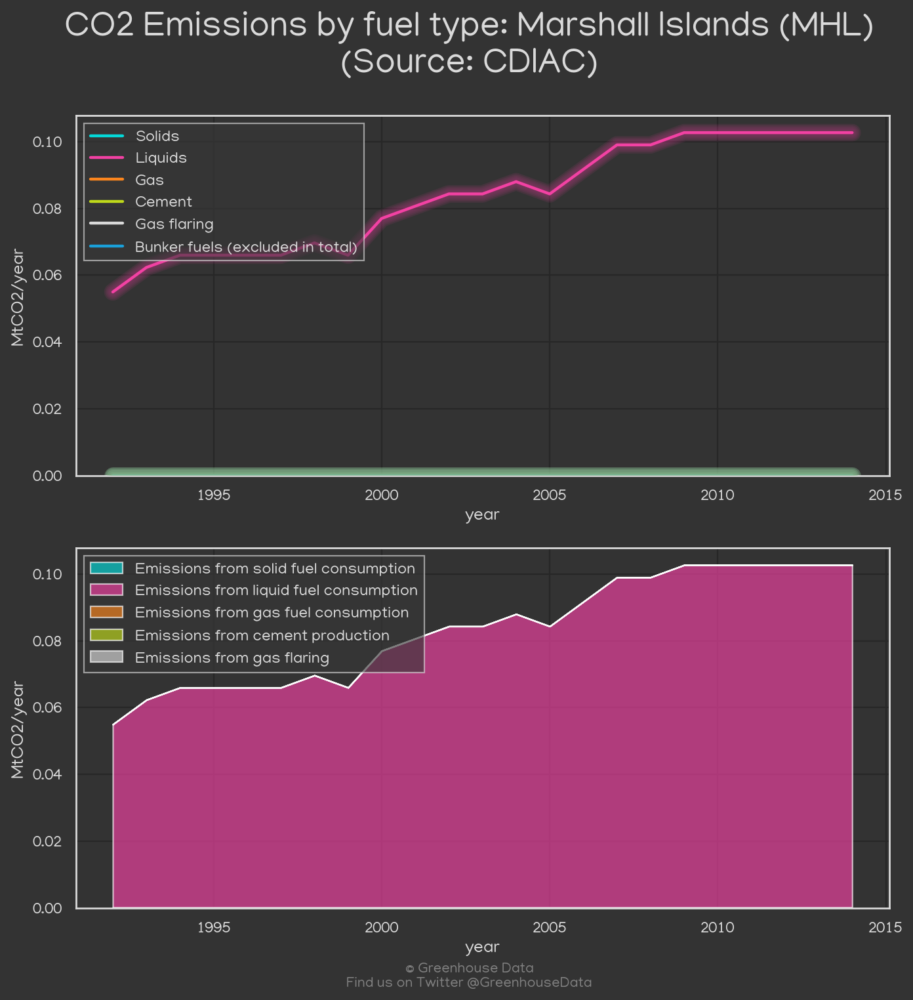
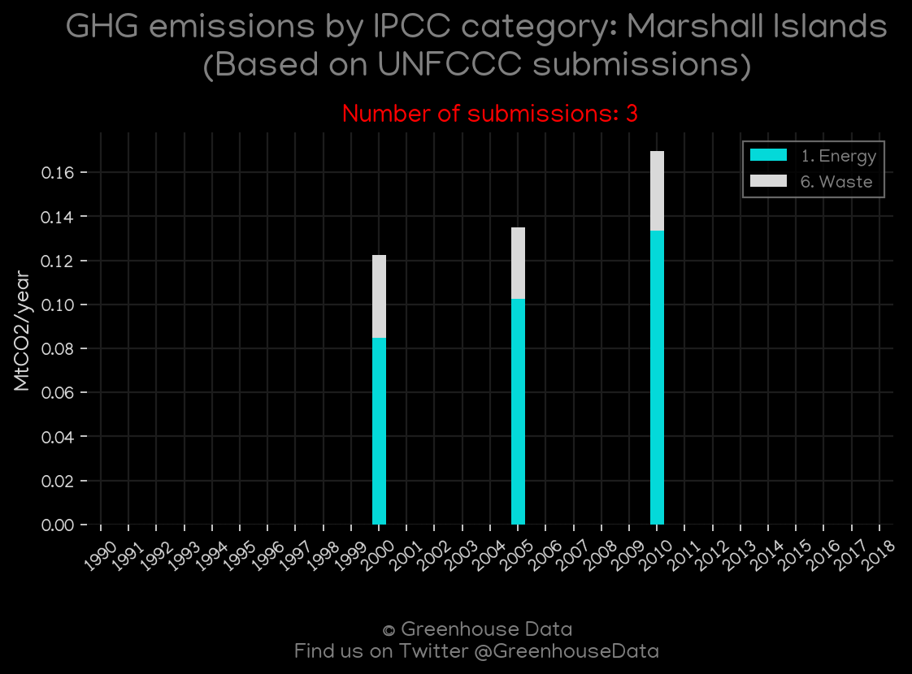
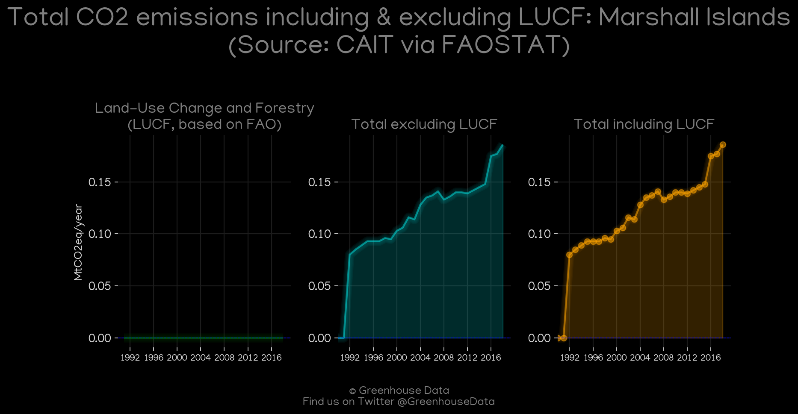
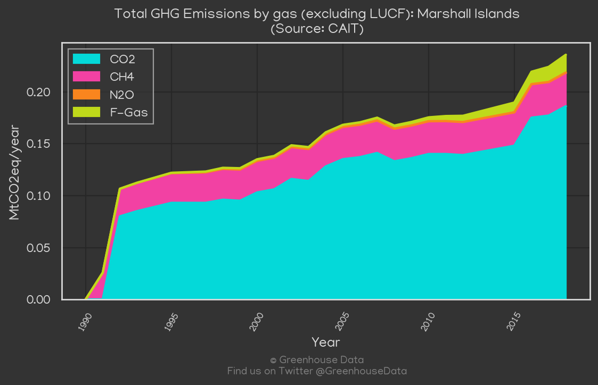

<h1 align="center">
🇲🇭🇲🇭🇲🇭🇲🇭🇲🇭
 
Marshall Islands
 
🇲🇭🇲🇭🇲🇭🇲🇭🇲🇭
</h1>
<h2>Datasets:</h2>

<a href="https://github.com/dquintani/GreenhouseData/tree/master/country_data/MHL_Marshall Islands/data">View on Github</a>
 

<a href="data/MHL_CAIT.csv">CAIT</a> || <a href="data/MHL_GCP.csv">GCP</a> || <a href="data/MHL_EDGAR.csv">EDGAR</a> || <a href="data/MHL_EPA.csv">EPA</a> || <a href="data/MHL_CDIAC.csv">CDIAC</a> || <a href="data/MHL_GCP_consupmption.csv">GCP_consupmption</a> || <a href="data/MHL_Minx_2021.csv">Minx_2021</a> || <a href="data/MHL_FAO.csv">FAO</a> || <a href="data/MHL_PRIMAP-hist.csv">PRIMAP-hist</a>

 

<h1>Figures:</h1><h2>#1 (MHL_Minx_top20_subsectors)</h2>

<h2>#2 (MHL_CO2_totals)</h2>

<h2>#3 (MHL_GCP_1)</h2>

<h2>#4 (MHL_CDIAC_1)</h2>

<h2>#5 (MHL_UNFCCC_NAI_1)</h2>

<h2>#6 (MHL_CAIT_lucf_vs_nolucf)</h2>

<h2>#7 (MHL_CAIT_gases_1)</h2>

