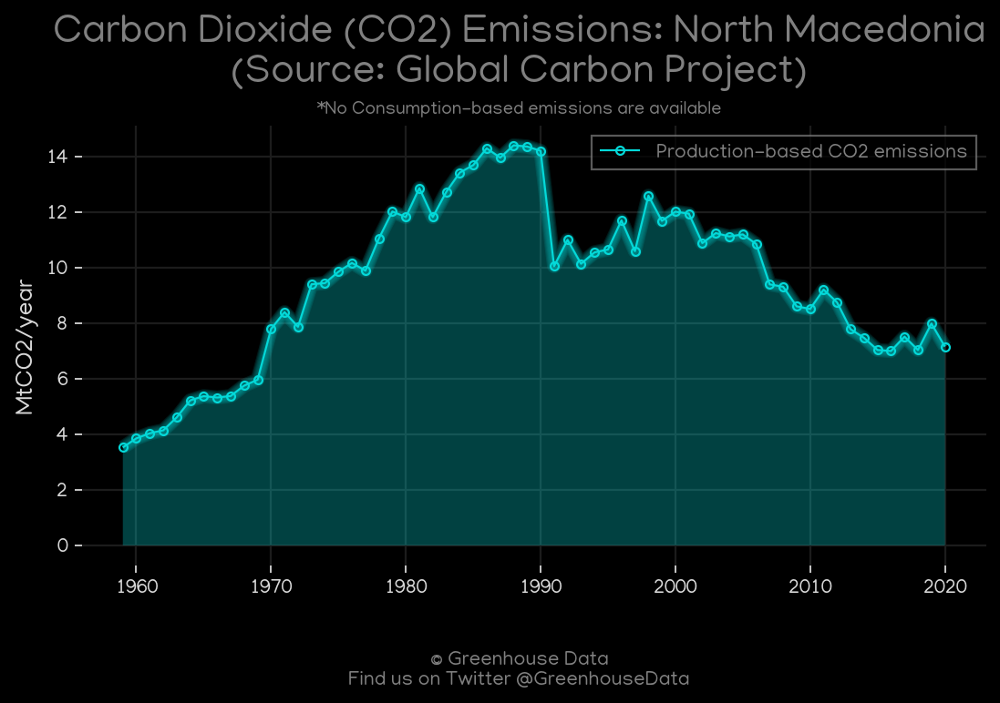
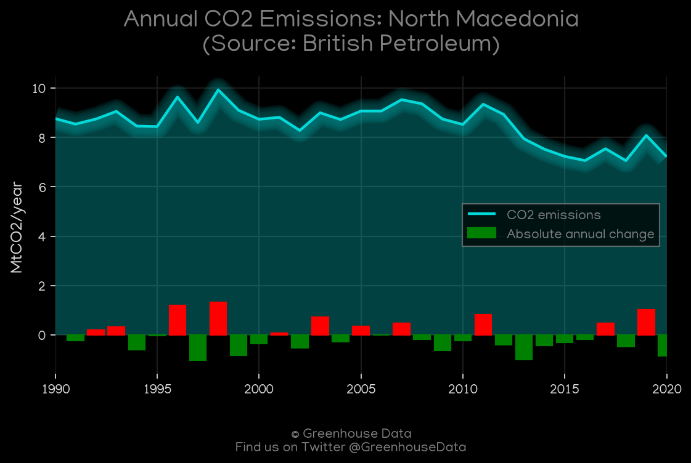
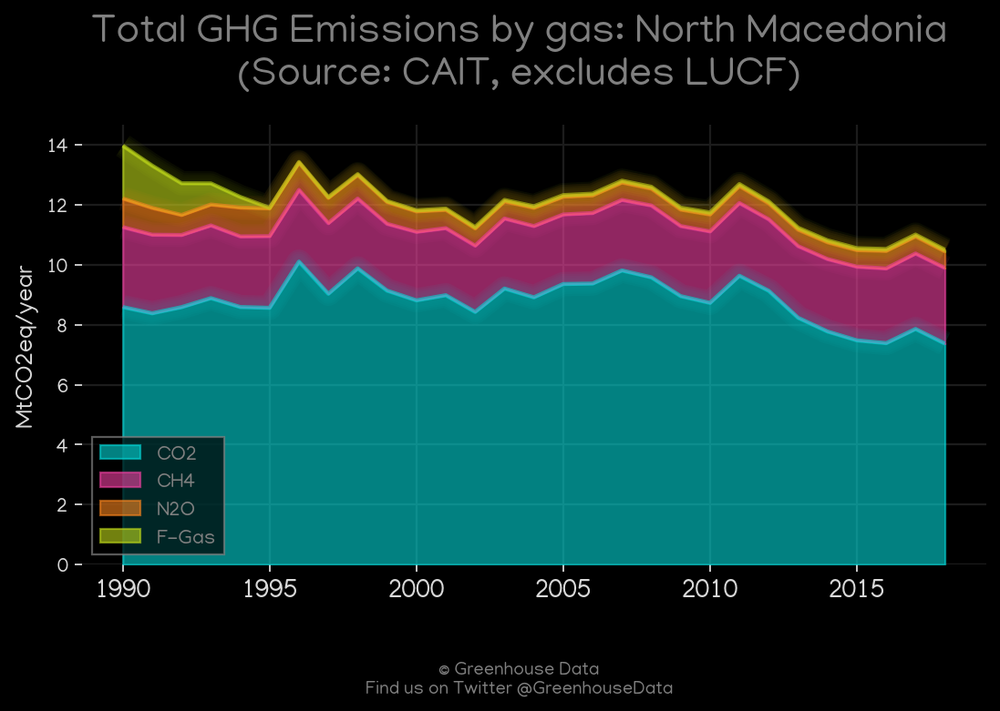
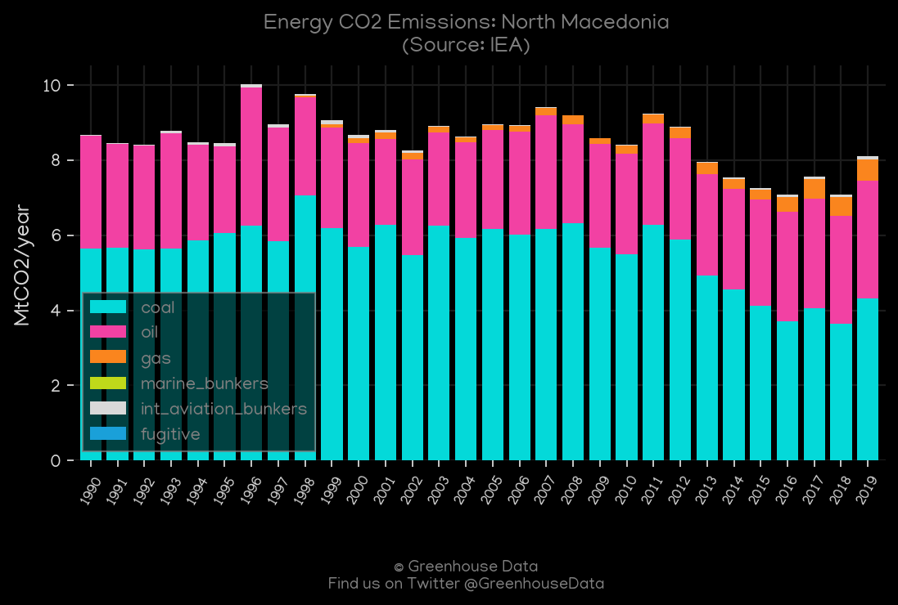
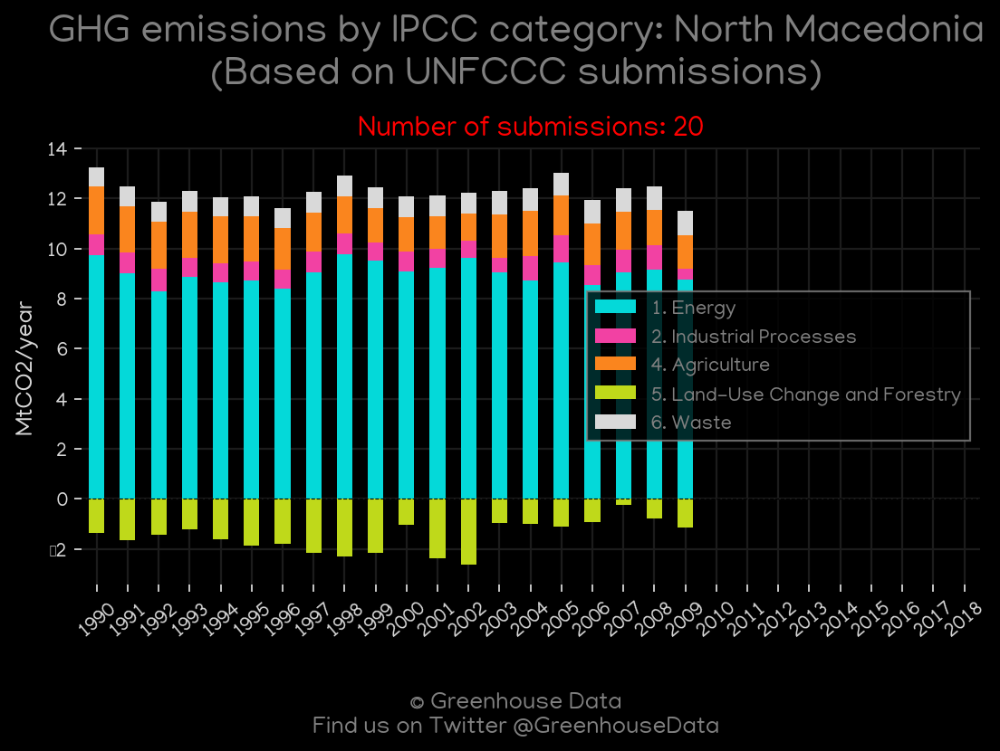
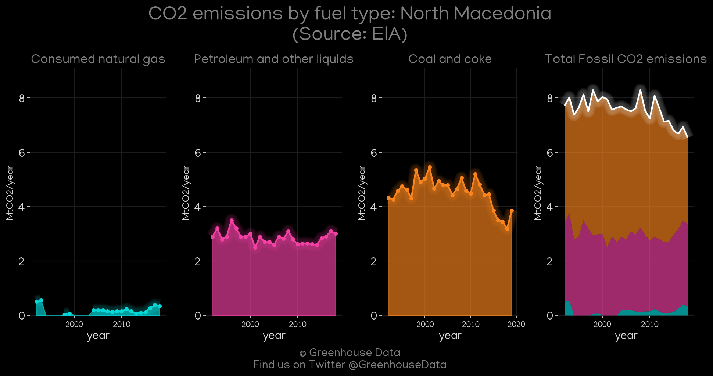
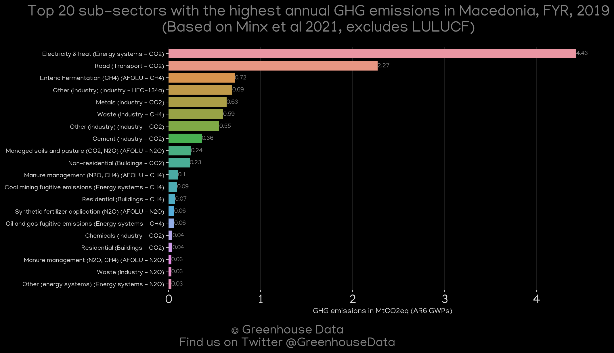
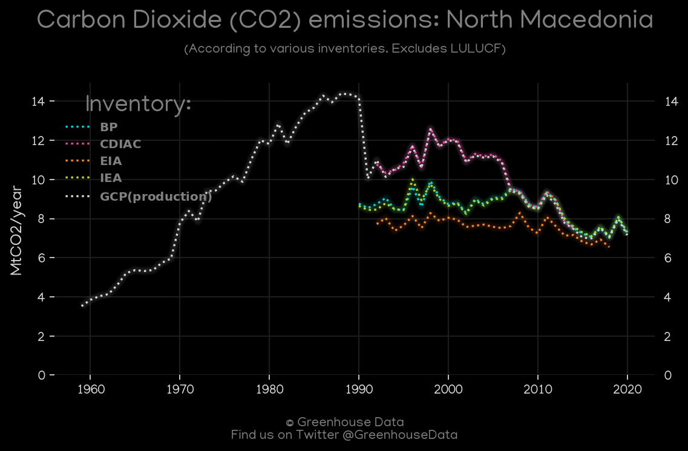

<h1 align="center">
🇲🇰🇲🇰🇲🇰🇲🇰🇲🇰
 
North Macedonia
 
🇲🇰🇲🇰🇲🇰🇲🇰🇲🇰
</h1>
<h2>Datasets:</h2>

<a href="https://github.com/dquintani/GreenhouseData/tree/master/country_data/MKD_North Macedonia/data">View on Github</a>
 

<a href="data/MKD_BP.csv">BP</a> || <a href="data/MKD_CDIAC.csv">CDIAC</a> || <a href="data/MKD_PRIMAP-hist.csv">PRIMAP-hist</a> || <a href="data/MKD_GCP.csv">GCP</a> || <a href="data/MKD_EPA.csv">EPA</a> || <a href="data/MKD_IEA.csv">IEA</a> || <a href="data/MKD_EIA.csv">EIA</a> || <a href="data/MKD_CAIT.csv">CAIT</a> || <a href="data/MKD_EDGAR.csv">EDGAR</a> || <a href="data/MKD_FAO.csv">FAO</a> || <a href="data/MKD_Minx_2021.csv">Minx_2021</a> || <a href="data/MKD_GCP_consupmption.csv">GCP_consupmption</a>

 

<h1>Figures:</h1><h2>#1 (MKD_GCP_1)</h2>

<h2>#2 (MKD_BP_1)</h2>

<h2>#3 (MKD_CAIT_gases_1)</h2>

<h2>#4 (MKD_CDIAC_1)</h2>

<h2>#5 (MKD_IEA_1)</h2>

<h2>#6 (MKD_UNFCCC_NAI_1)</h2>

<h2>#7 (MKD_EIA_1)</h2>

<h2>#8 (MKD_Minx_top20_subsectors)</h2>

<h2>#9 (MKD_CO2_totals)</h2>

