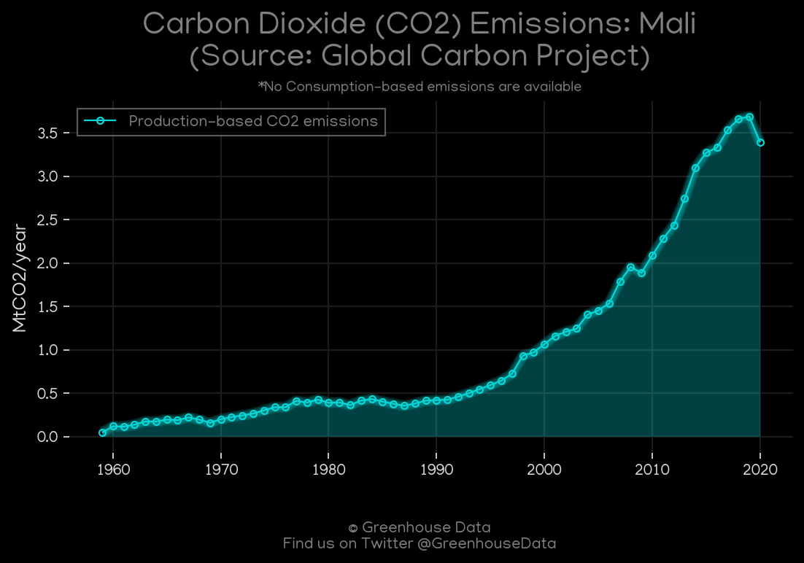
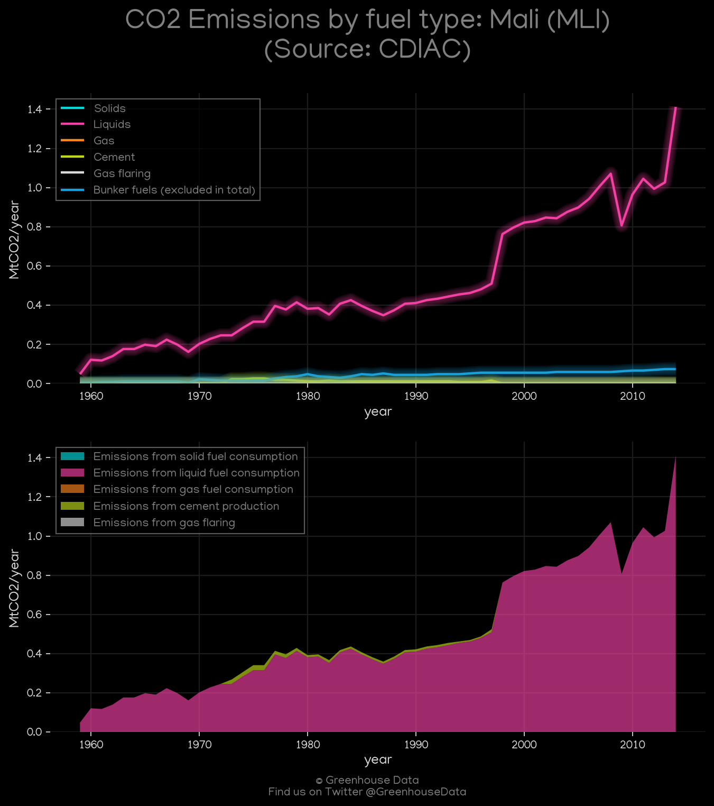
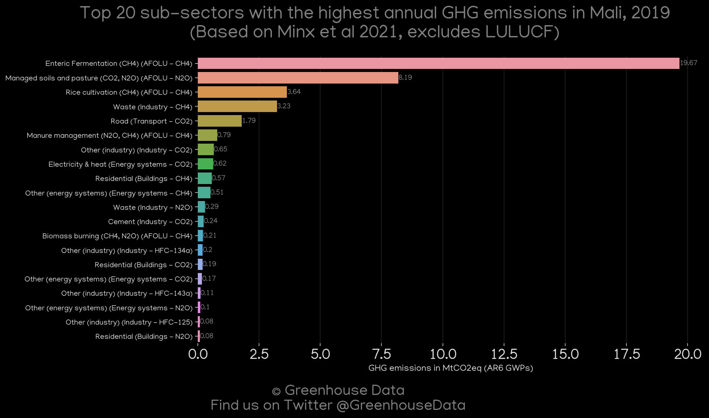
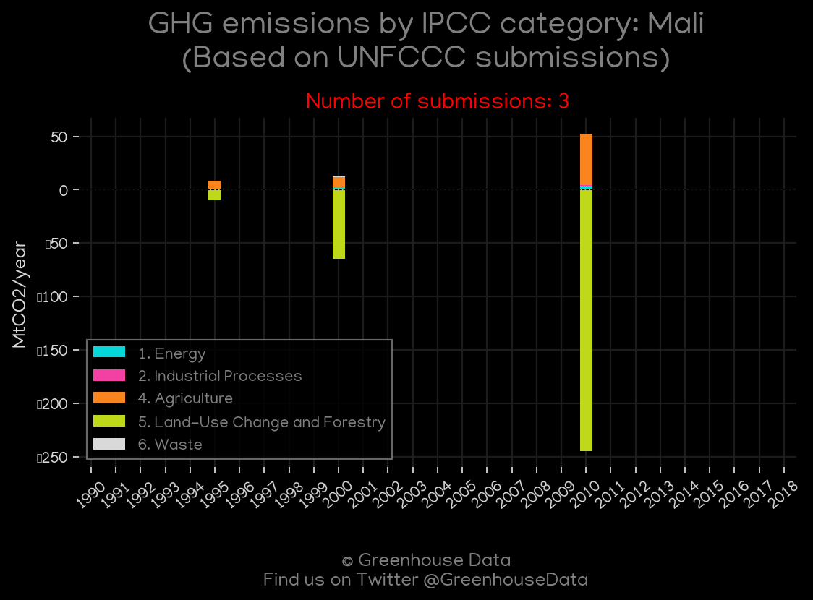
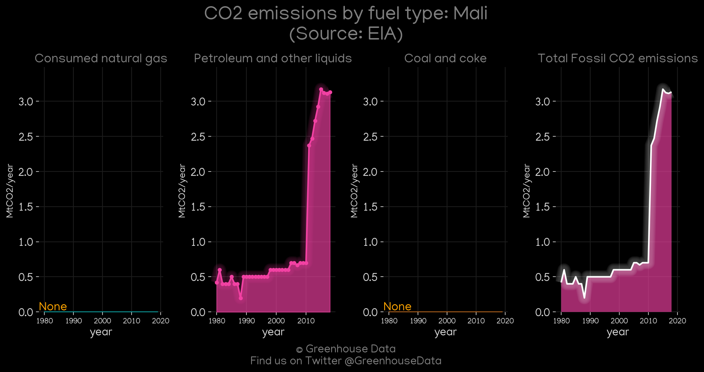
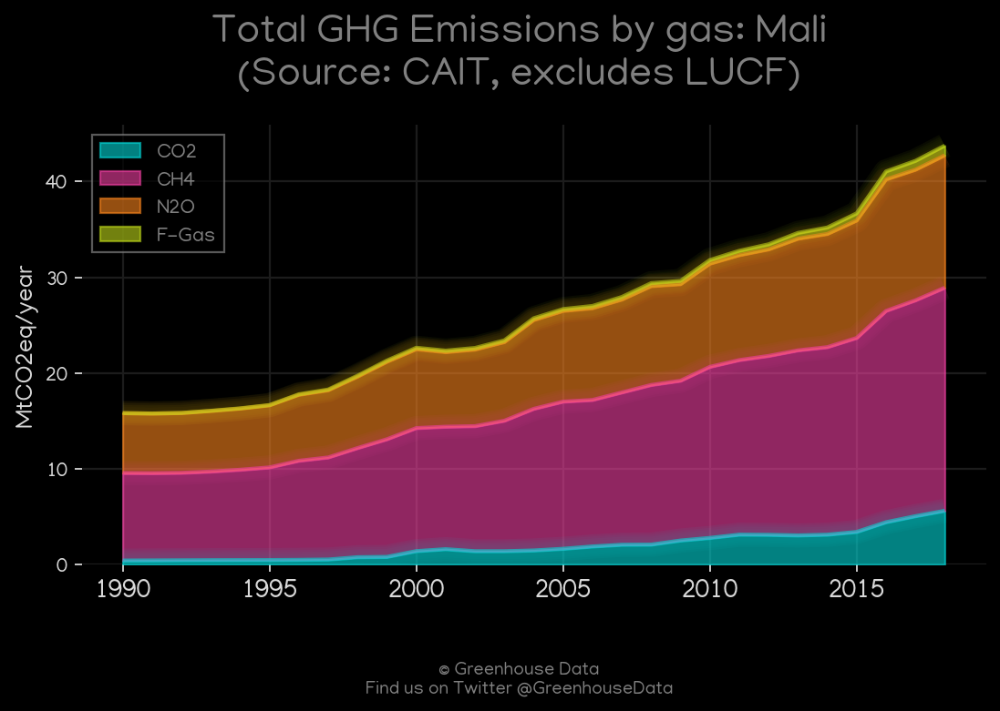
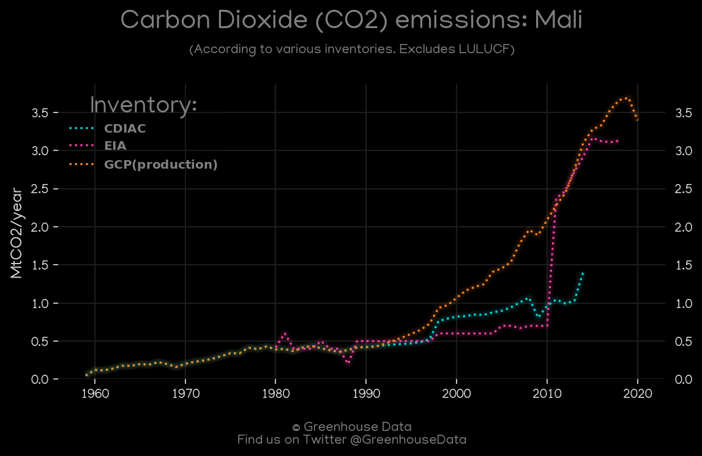

<h1 align="center">
🇲🇱🇲🇱🇲🇱🇲🇱🇲🇱
 
Mali
 
🇲🇱🇲🇱🇲🇱🇲🇱🇲🇱
</h1>
<h2>Datasets:</h2>

<a href="https://github.com/dquintani/GreenhouseData/tree/master/country_data/MLI_Mali/data">View on Github</a>
 

<a href="data/MLI_EIA.csv">EIA</a> || <a href="data/MLI_GCP_consupmption.csv">GCP_consupmption</a> || <a href="data/MLI_EDGAR.csv">EDGAR</a> || <a href="data/MLI_CAIT.csv">CAIT</a> || <a href="data/MLI_PRIMAP-hist.csv">PRIMAP-hist</a> || <a href="data/MLI_FAO.csv">FAO</a> || <a href="data/MLI_GCP.csv">GCP</a> || <a href="data/MLI_CDIAC.csv">CDIAC</a> || <a href="data/MLI_EPA.csv">EPA</a> || <a href="data/MLI_Minx_2021.csv">Minx_2021</a>

 

<h1>Figures:</h1><h2>#1 (MLI_GCP_1)</h2>

<h2>#2 (MLI_CDIAC_1)</h2>

<h2>#3 (MLI_Minx_top20_subsectors)</h2>

<h2>#4 (MLI_UNFCCC_NAI_1)</h2>

<h2>#5 (MLI_EIA_1)</h2>

<h2>#6 (MLI_CAIT_gases_1)</h2>

<h2>#7 (MLI_CO2_totals)</h2>

