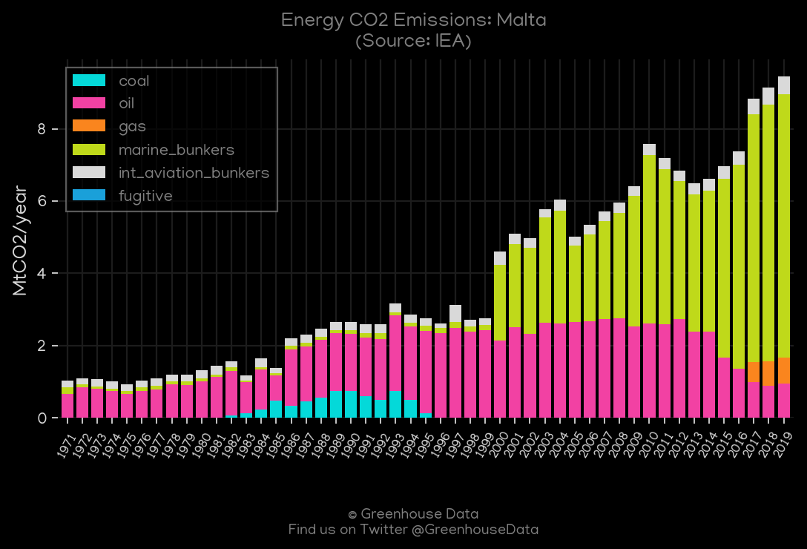
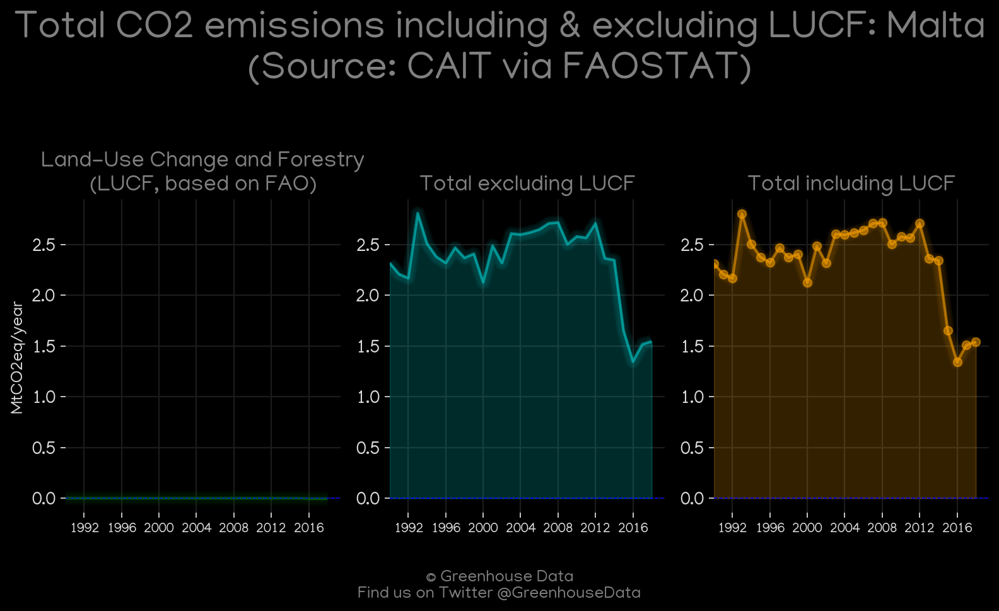
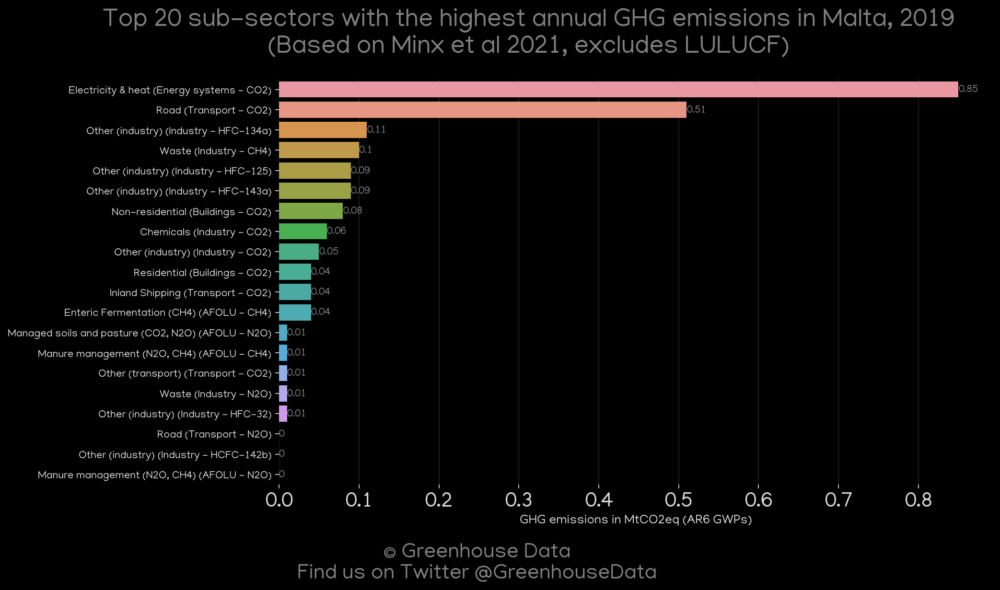
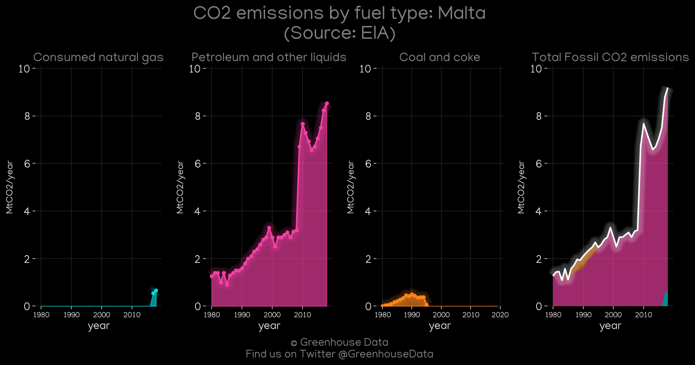
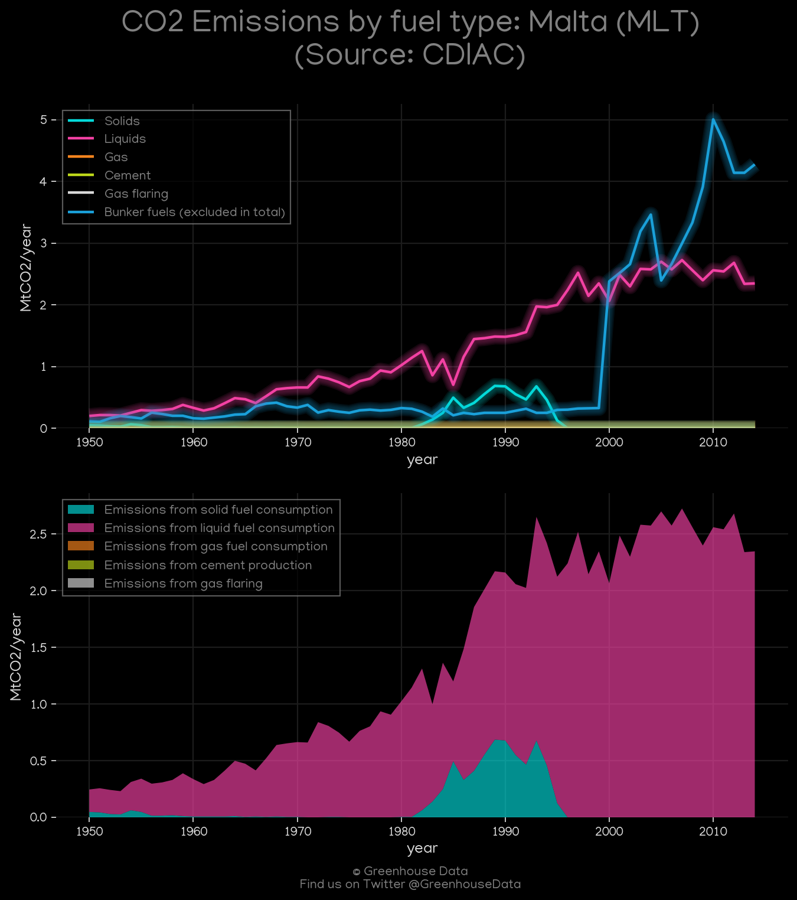
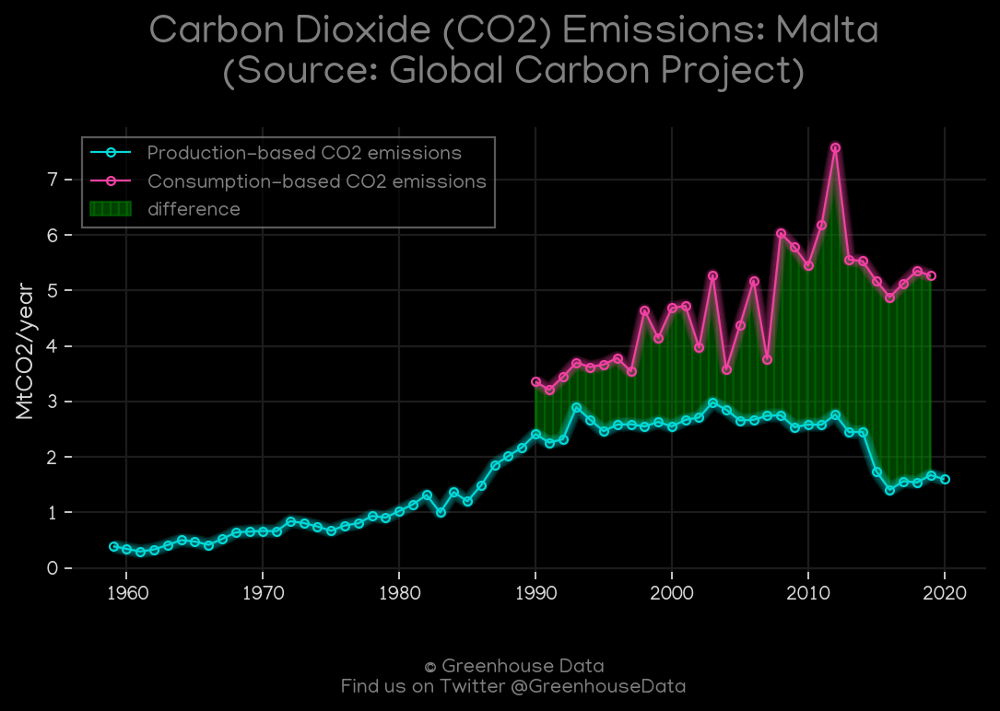
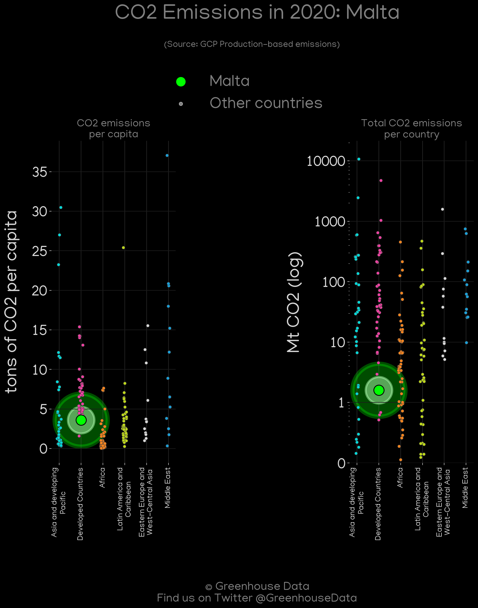

<h1 align="center">
🇲🇹🇲🇹🇲🇹🇲🇹🇲🇹
 
Malta
 
🇲🇹🇲🇹🇲🇹🇲🇹🇲🇹
</h1>
<h2>Datasets:</h2>

<a href="https://github.com/dquintani/GreenhouseData/tree/master/country_data/MLT_Malta/data">View on Github</a>
 

<a href="data/MLT_EIA.csv">EIA</a> || <a href="data/MLT_CAIT.csv">CAIT</a> || <a href="data/MLT_Minx_2021.csv">Minx_2021</a> || <a href="data/MLT_GCP.csv">GCP</a> || <a href="data/MLT_FAO.csv">FAO</a> || <a href="data/MLT_IEA.csv">IEA</a> || <a href="data/MLT_EPA.csv">EPA</a> || <a href="data/MLT_EDGAR.csv">EDGAR</a> || <a href="data/MLT_GCP_consupmption.csv">GCP_consupmption</a> || <a href="data/MLT_PRIMAP-hist.csv">PRIMAP-hist</a> || <a href="data/MLT_CDIAC.csv">CDIAC</a>

 

<h1>Figures:</h1><h2>#1 (MLT_CO2_totals)</h2>

<h2>#2 (MLT_IEA_1)</h2>

<h2>#3 (MLT_CAIT_lucf_vs_nolucf)</h2>

<h2>#4 (MLT_Minx_top20_subsectors)</h2>

<h2>#5 (MLT_EIA_1)</h2>

<h2>#6 (MLT_relative_totals)</h2>

<h2>#7 (MLT_CAIT_gases_1)</h2>

<h2>#8 (MLT_CDIAC_1)</h2>

<h2>#9 (MLT_GCP_1)</h2>

<h2>#10 (MLT_UNFCCC_AI_1)</h2>

<h2>#11 (MLT_GCP_Country_Highlight)</h2>

