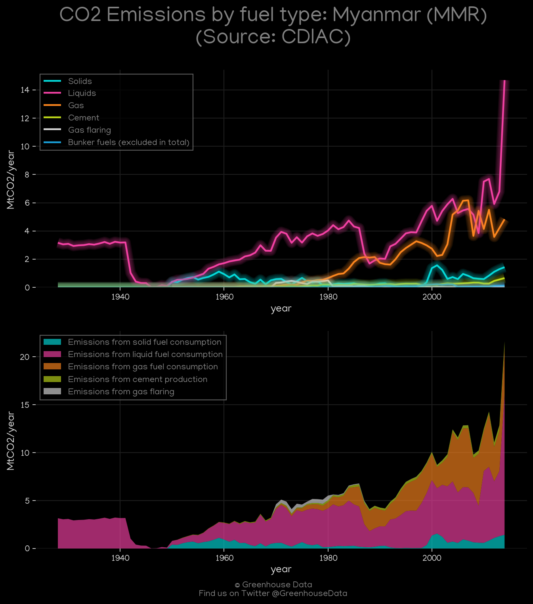
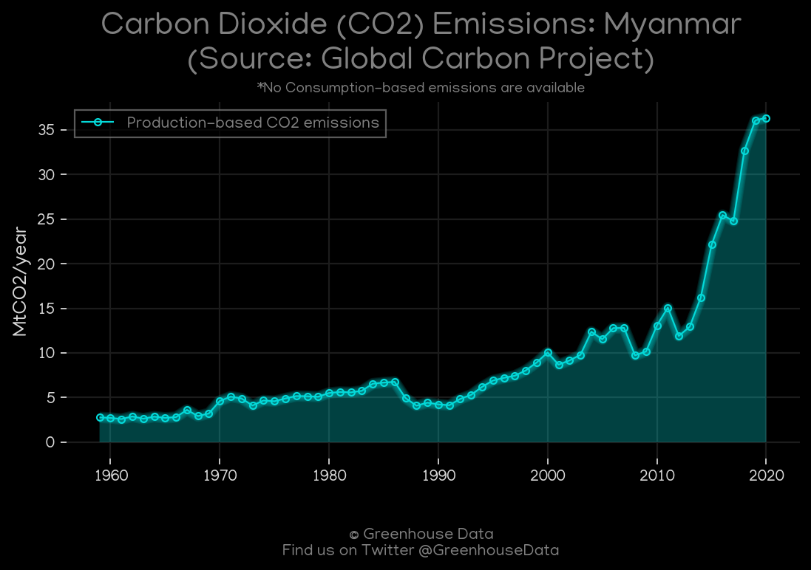
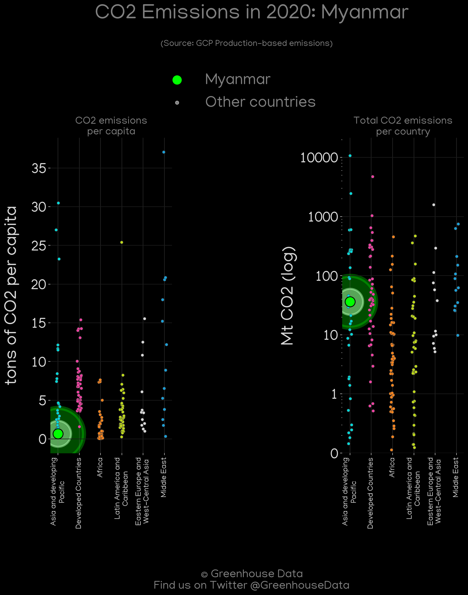
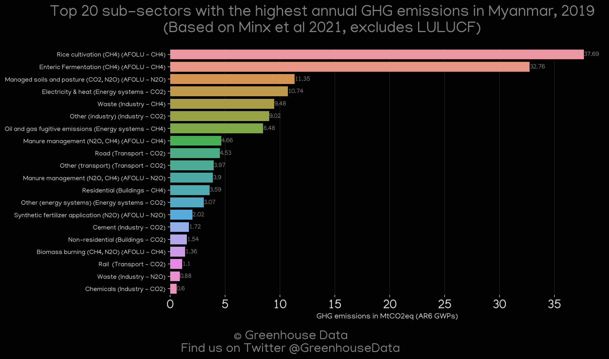
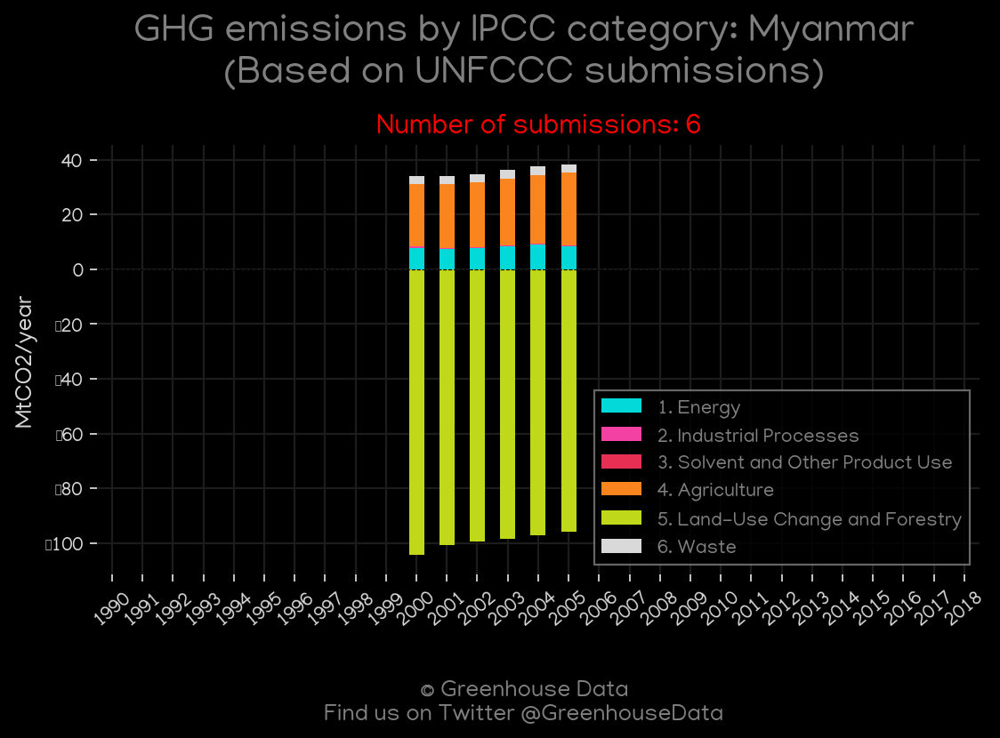

<h1 align="center">
🇲🇲🇲🇲🇲🇲🇲🇲🇲🇲
 
Myanmar
 
🇲🇲🇲🇲🇲🇲🇲🇲🇲🇲
</h1>
<h2>Datasets:</h2>

<a href="https://github.com/dquintani/GreenhouseData/tree/master/country_data/MMR_Myanmar/data">View on Github</a>
 

<a href="data/MMR_CAIT.csv">CAIT</a> || <a href="data/MMR_CDIAC.csv">CDIAC</a> || <a href="data/MMR_EDGAR.csv">EDGAR</a> || <a href="data/MMR_EIA.csv">EIA</a> || <a href="data/MMR_EPA.csv">EPA</a> || <a href="data/MMR_FAO.csv">FAO</a> || <a href="data/MMR_GCP.csv">GCP</a> || <a href="data/MMR_GCP_consupmption.csv">GCP_consupmption</a> || <a href="data/MMR_IEA.csv">IEA</a> || <a href="data/MMR_Minx_2021.csv">Minx_2021</a> || <a href="data/MMR_PRIMAP-hist.csv">PRIMAP-hist</a>

 

<h1>Figures:</h1><h2>#1 (MMR_CAIT_gases_1)</h2>

<h2>#2 (MMR_CAIT_lucf_vs_nolucf)</h2>

<h2>#3 (MMR_CDIAC_1)</h2>

<h2>#4 (MMR_CO2_totals)</h2>

<h2>#5 (MMR_EIA_1)</h2>

<h2>#6 (MMR_GCP_1)</h2>

<h2>#7 (MMR_GCP_Country_Highlight)</h2>

<h2>#8 (MMR_IEA_1)</h2>

<h2>#9 (MMR_Minx_top20_subsectors)</h2>

<h2>#10 (MMR_relative_totals)</h2>

<h2>#11 (MMR_UNFCCC_NAI_1)</h2>

