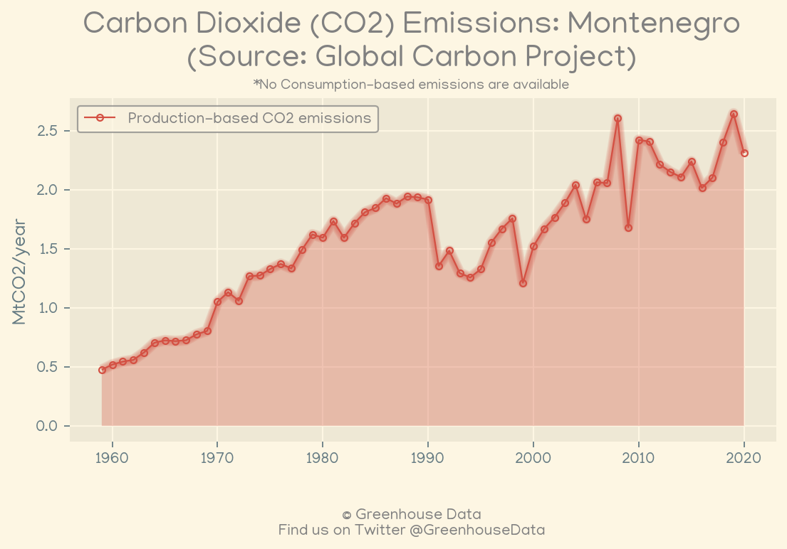
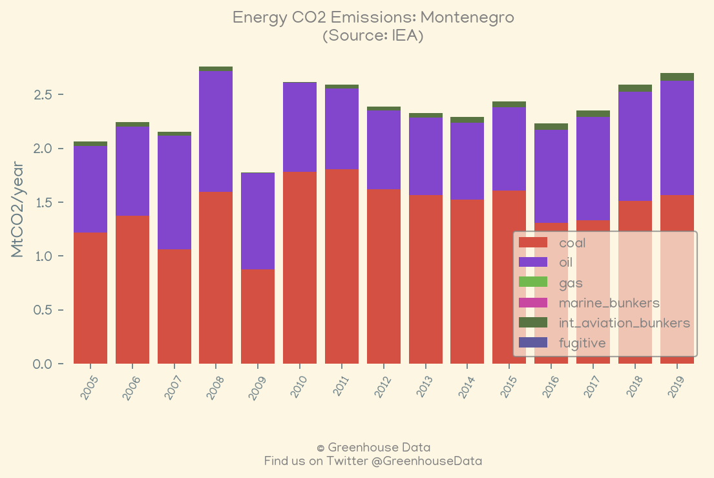
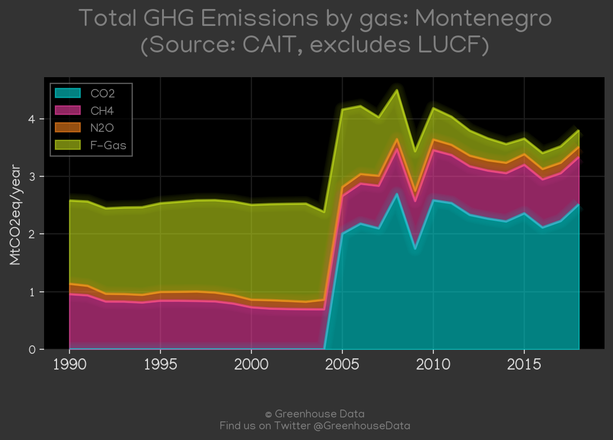
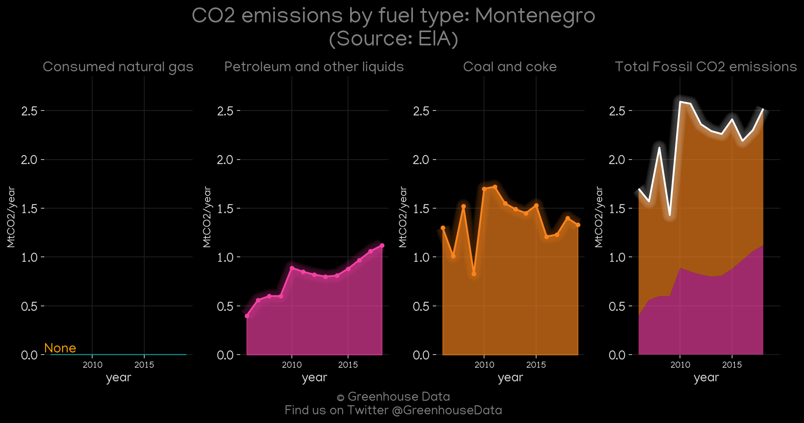
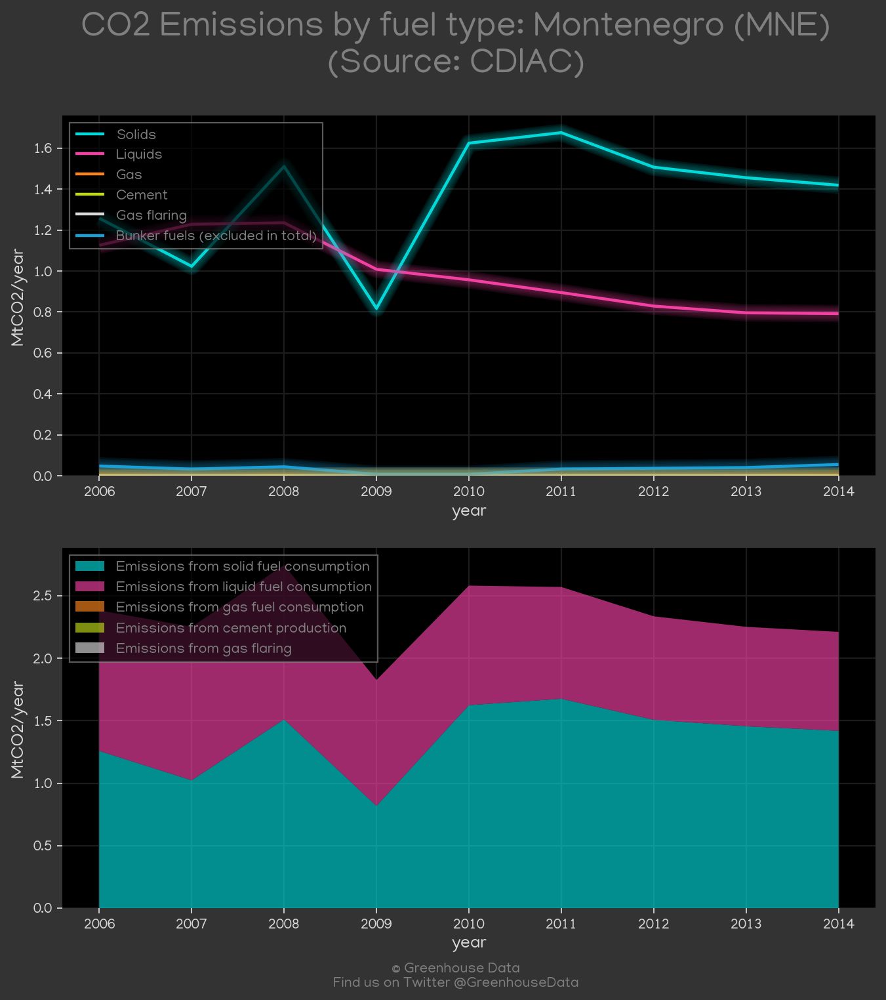
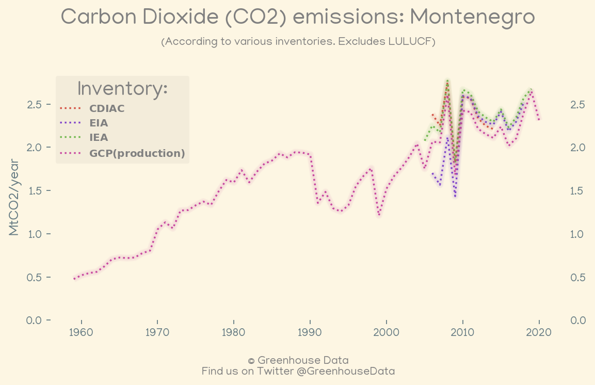
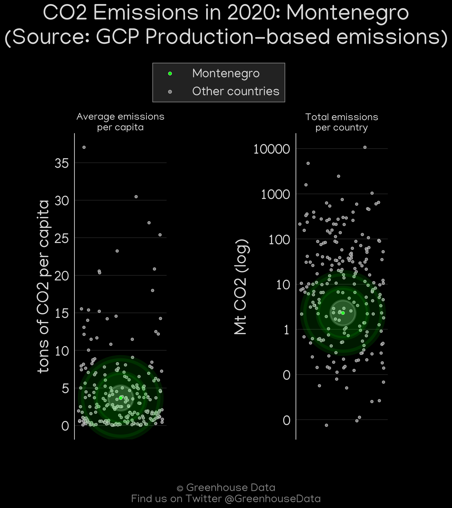
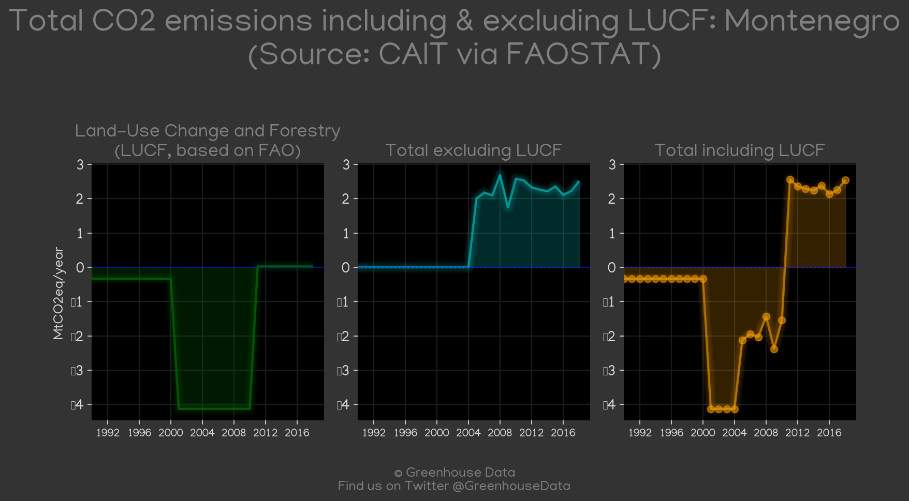
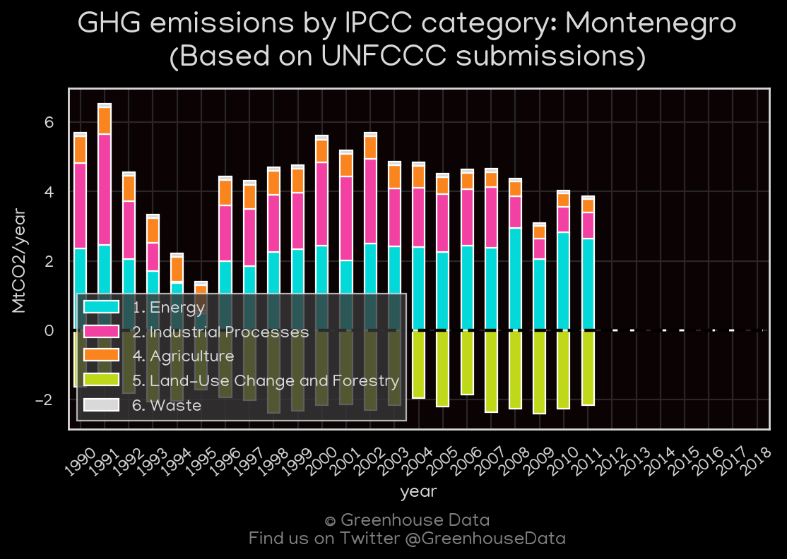

<h1 align="center">
🇲🇪🇲🇪🇲🇪🇲🇪🇲🇪
 
Montenegro
 
🇲🇪🇲🇪🇲🇪🇲🇪🇲🇪
</h1>
<h2>Datasets:</h2>

<a href="https://github.com/dquintani/GreenhouseData/tree/master/country_data/MNE_Montenegro/data">View on Github</a>
 

<a href="data/MNE_EPA.csv">EPA</a> || <a href="data/MNE_IEA.csv">IEA</a> || <a href="data/MNE_CDIAC.csv">CDIAC</a> || <a href="data/MNE_GCP.csv">GCP</a> || <a href="data/MNE_PRIMAP-hist.csv">PRIMAP-hist</a> || <a href="data/MNE_EIA.csv">EIA</a> || <a href="data/MNE_GCP_consupmption.csv">GCP_consupmption</a> || <a href="data/MNE_FAO.csv">FAO</a> || <a href="data/MNE_CAIT.csv">CAIT</a>

 

<h1>Figures:</h1><h2>#1 (MNE_GCP_1)</h2>

<h2>#2 (MNE_IEA_1)</h2>

<h2>#3 (MNE_CAIT_gases_1)</h2>

<h2>#4 (MNE_EIA_1)</h2>

<h2>#5 (MNE_CDIAC_1)</h2>

<h2>#6 (MNE_CO2_totals)</h2>

<h2>#7 (MNE_GCP_Country_Highlight)</h2>

<h2>#8 (MNE_CAIT_lucf_vs_nolucf)</h2>

<h2>#9 (MNE_UNFCCC_NAI_1)</h2>

