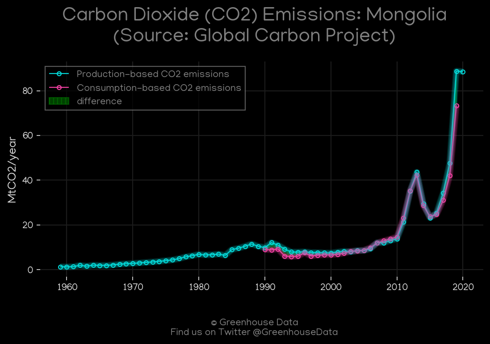
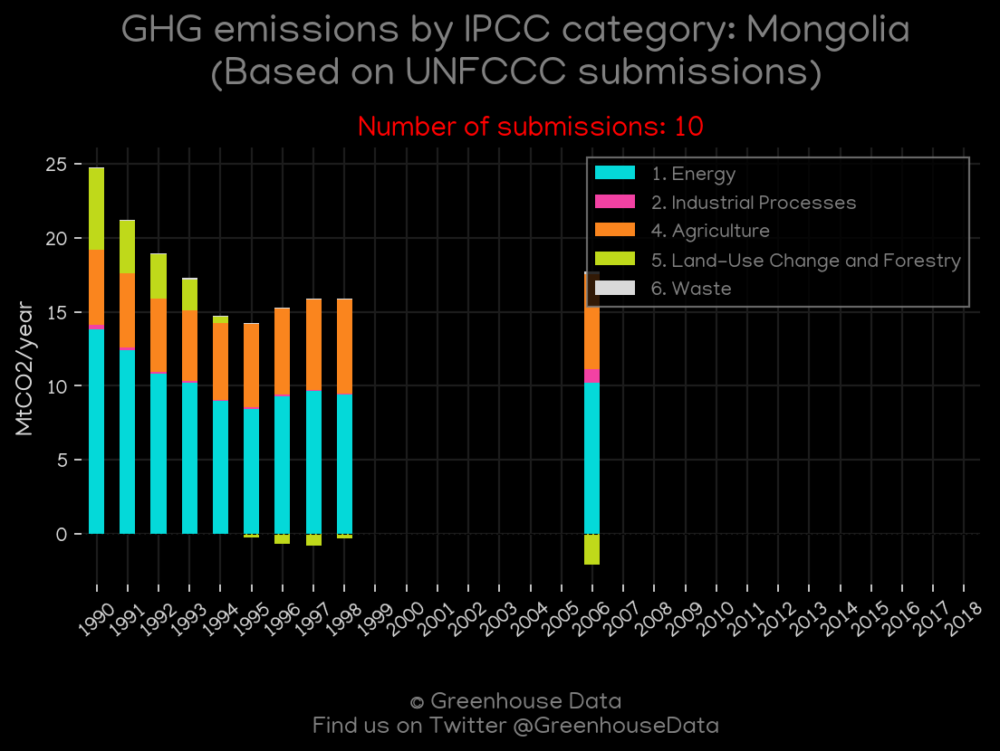
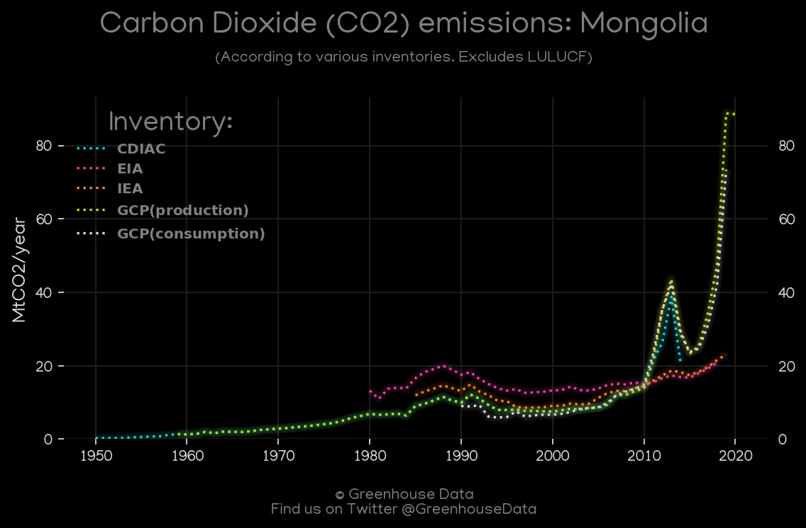
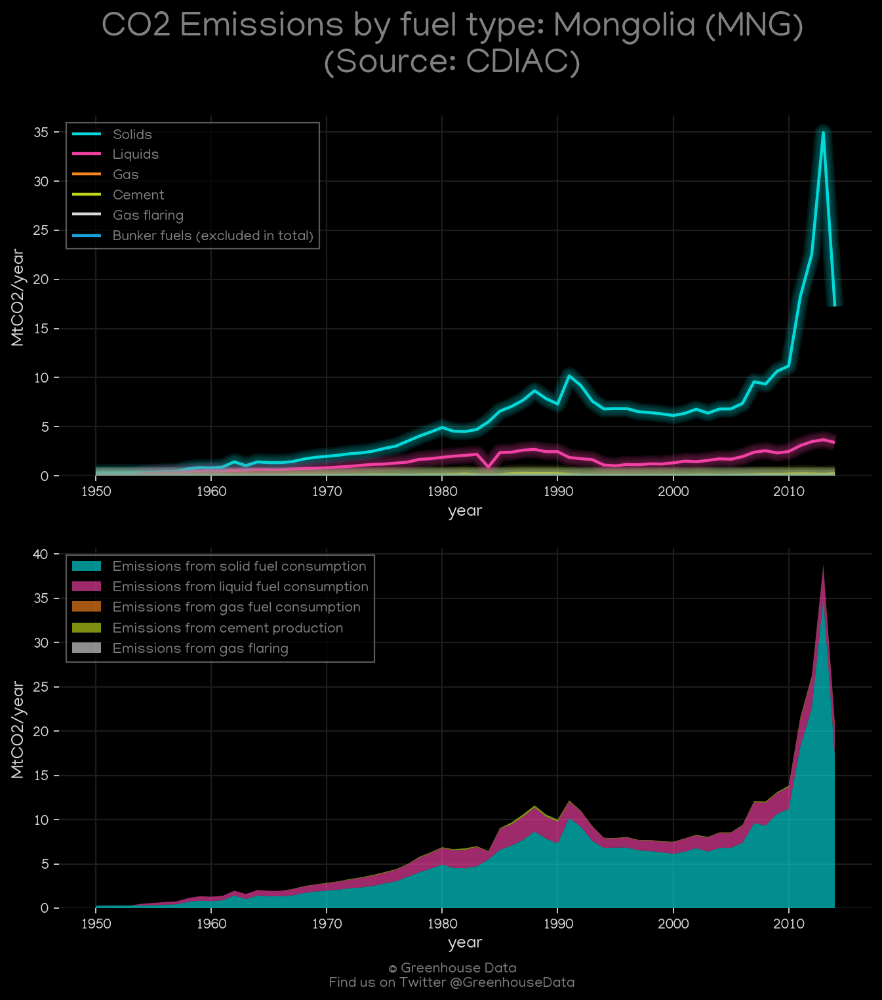
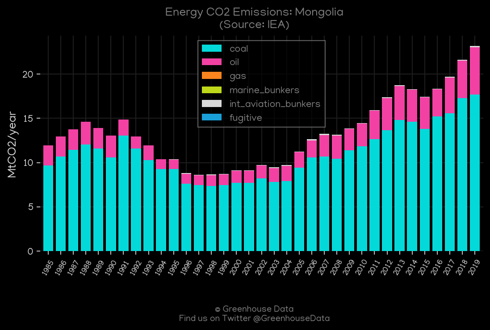
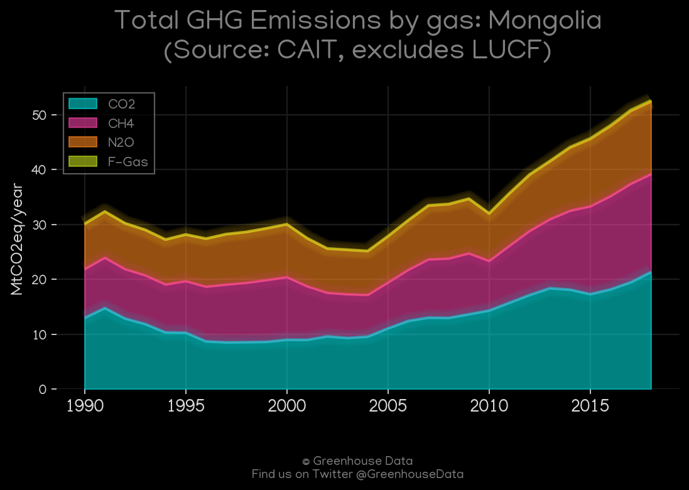

<h1 align="center">
🇲🇳🇲🇳🇲🇳🇲🇳🇲🇳
 
Mongolia
 
🇲🇳🇲🇳🇲🇳🇲🇳🇲🇳
</h1>
<h2>Datasets:</h2>

<a href="https://github.com/dquintani/GreenhouseData/tree/master/country_data/MNG_Mongolia/data">View on Github</a>
 

<a href="data/MNG_FAO.csv">FAO</a> || <a href="data/MNG_EPA.csv">EPA</a> || <a href="data/MNG_PRIMAP-hist.csv">PRIMAP-hist</a> || <a href="data/MNG_CAIT.csv">CAIT</a> || <a href="data/MNG_GCP.csv">GCP</a> || <a href="data/MNG_GCP_consupmption.csv">GCP_consupmption</a> || <a href="data/MNG_CDIAC.csv">CDIAC</a> || <a href="data/MNG_EDGAR.csv">EDGAR</a> || <a href="data/MNG_Minx_2021.csv">Minx_2021</a> || <a href="data/MNG_EIA.csv">EIA</a> || <a href="data/MNG_IEA.csv">IEA</a>

 

<h1>Figures:</h1><h2>#1 (MNG_GCP_1)</h2>

<h2>#2 (MNG_UNFCCC_NAI_1)</h2>

<h2>#3 (MNG_CO2_totals)</h2>

<h2>#4 (MNG_CDIAC_1)</h2>

<h2>#5 (MNG_EIA_1)</h2>

<h2>#6 (MNG_IEA_1)</h2>

<h2>#7 (MNG_CAIT_gases_1)</h2>

<h2>#8 (MNG_Minx_top20_subsectors)</h2>

