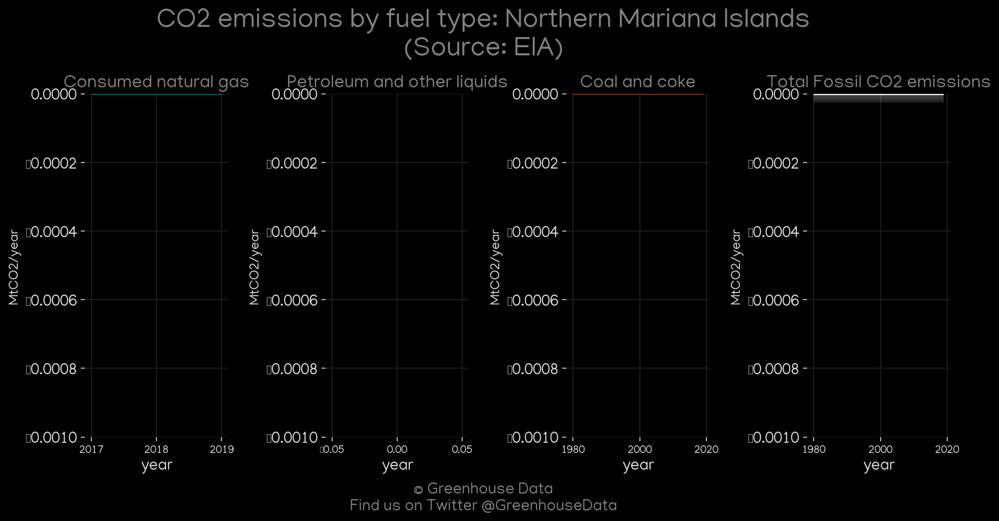
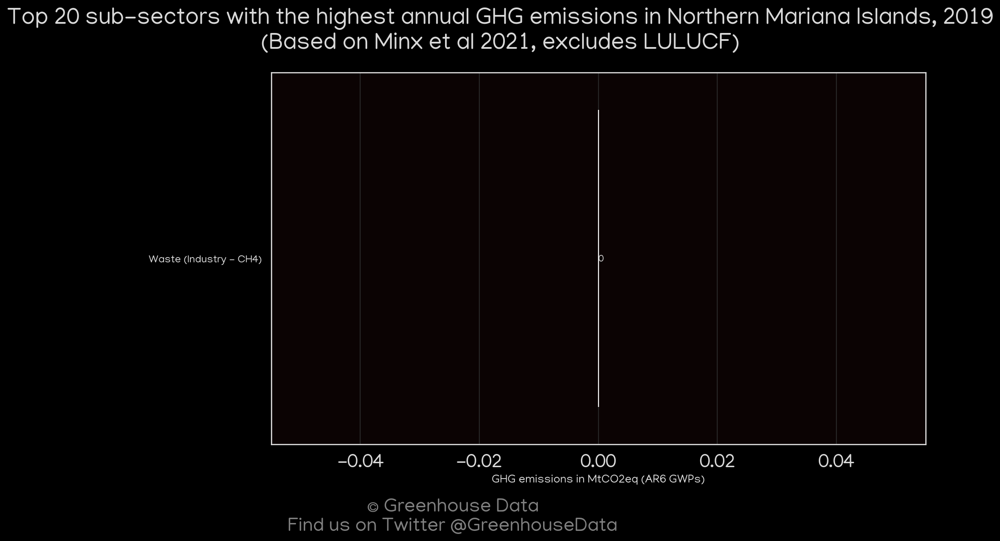
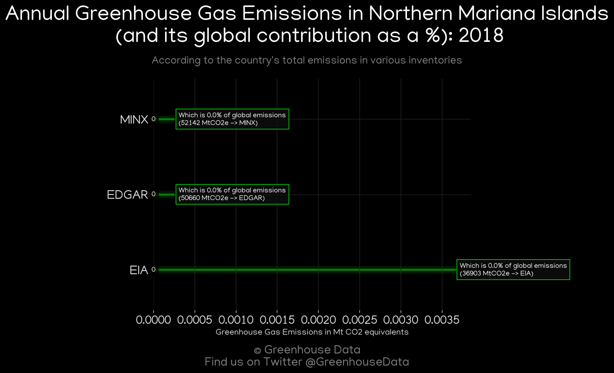
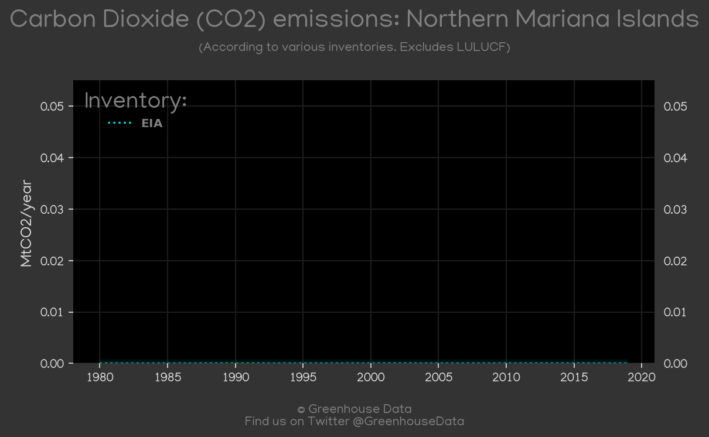

<h1 align="center">
🇲🇵🇲🇵🇲🇵🇲🇵🇲🇵
 
Northern Mariana Islands
 
🇲🇵🇲🇵🇲🇵🇲🇵🇲🇵
</h1>
<h2>Datasets:</h2>

<a href="https://github.com/dquintani/GreenhouseData/tree/master/country_data/MNP_Northern Mariana Islands/data">View on Github</a>
 

<a href="data/MNP_Minx_2021.csv">Minx_2021</a> || <a href="data/MNP_FAO.csv">FAO</a> || <a href="data/MNP_EIA.csv">EIA</a> || <a href="data/MNP_EDGAR.csv">EDGAR</a>

 

<h1>Figures:</h1><h2>#1 (MNP_EIA_1)</h2>

<h2>#2 (MNP_Minx_top20_subsectors)</h2>

<h2>#3 (MNP_relative_totals)</h2>

<h2>#4 (MNP_CO2_totals)</h2>

