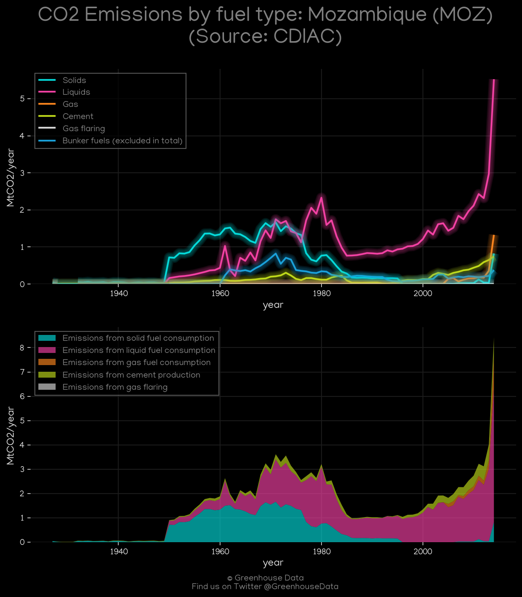
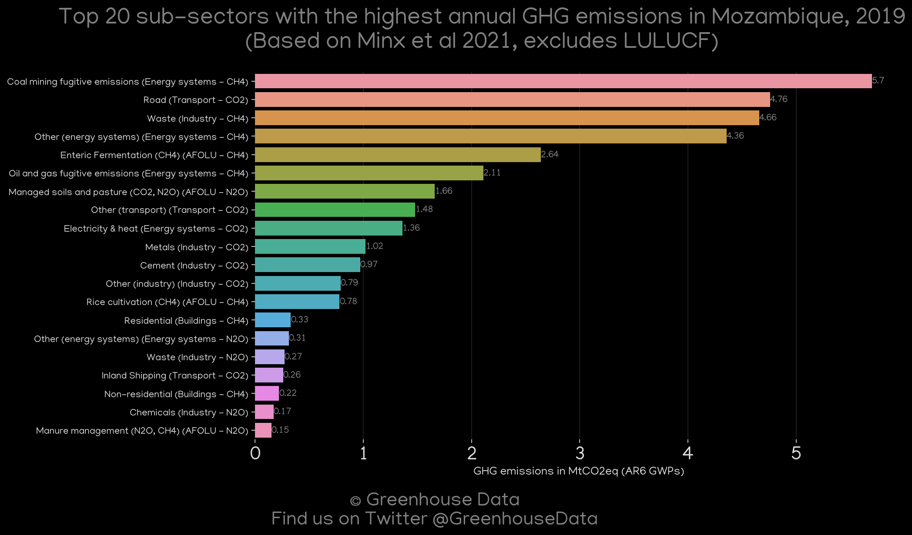
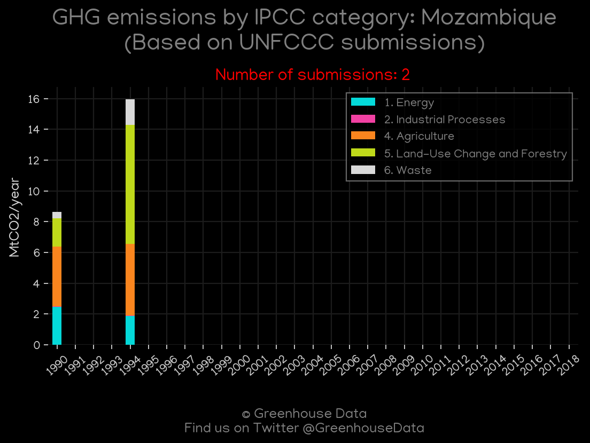
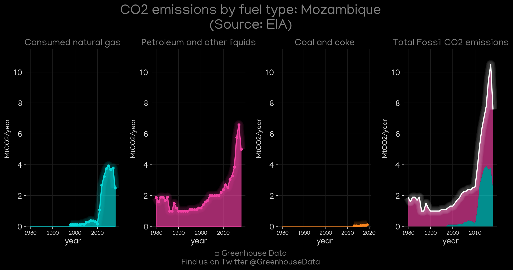
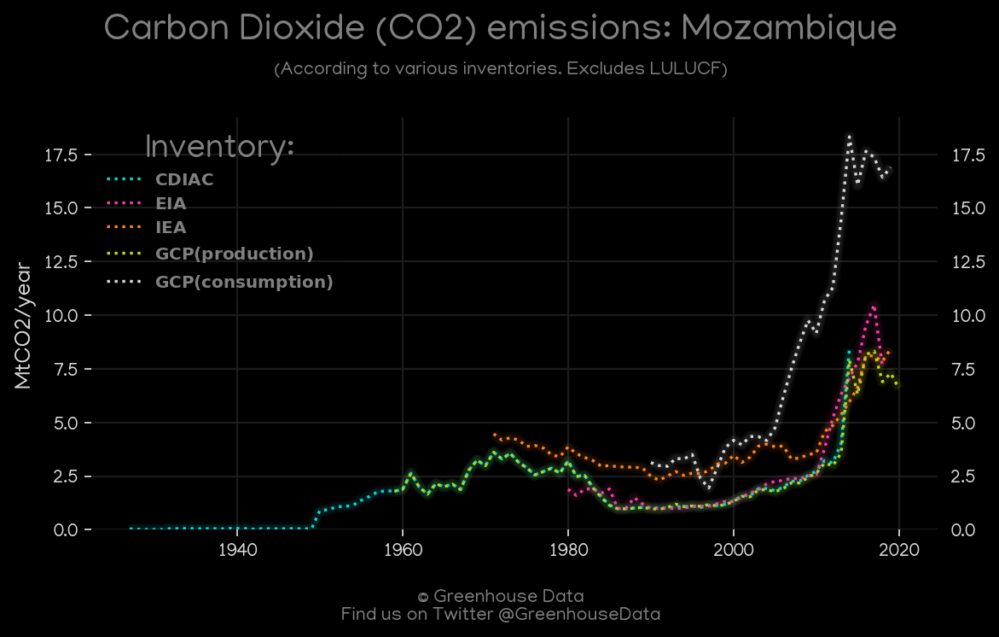
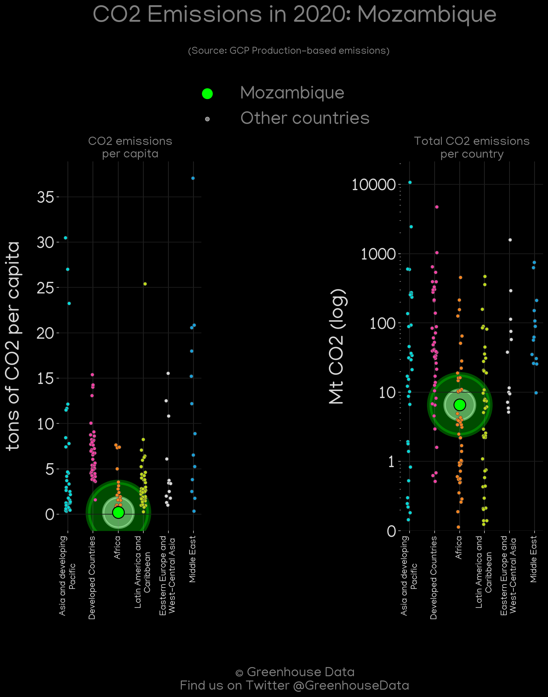
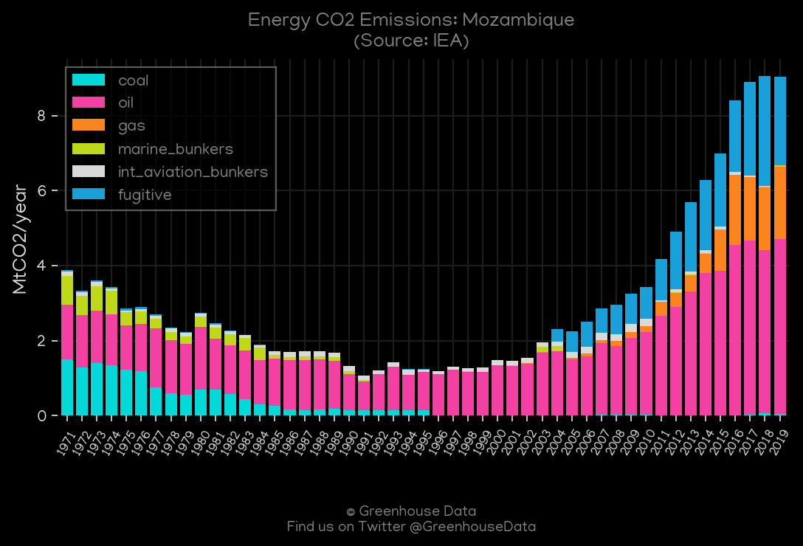

<h1 align="center">
🇲🇿🇲🇿🇲🇿🇲🇿🇲🇿
 
Mozambique
 
🇲🇿🇲🇿🇲🇿🇲🇿🇲🇿
</h1>
<h2>Datasets:</h2>

<a href="https://github.com/dquintani/GreenhouseData/tree/master/country_data/MOZ_Mozambique/data">View on Github</a>
 

<a href="data/MOZ_Minx_2021.csv">Minx_2021</a> || <a href="data/MOZ_GCP.csv">GCP</a> || <a href="data/MOZ_CDIAC.csv">CDIAC</a> || <a href="data/MOZ_IEA.csv">IEA</a> || <a href="data/MOZ_GCP_consupmption.csv">GCP_consupmption</a> || <a href="data/MOZ_FAO.csv">FAO</a> || <a href="data/MOZ_PRIMAP-hist.csv">PRIMAP-hist</a> || <a href="data/MOZ_CAIT.csv">CAIT</a> || <a href="data/MOZ_EIA.csv">EIA</a> || <a href="data/MOZ_EPA.csv">EPA</a> || <a href="data/MOZ_EDGAR.csv">EDGAR</a>

 

<h1>Figures:</h1><h2>#1 (MOZ_GCP_1)</h2>

<h2>#2 (MOZ_CDIAC_1)</h2>

<h2>#3 (MOZ_Minx_top20_subsectors)</h2>

<h2>#4 (MOZ_UNFCCC_NAI_1)</h2>

<h2>#5 (MOZ_EIA_1)</h2>

<h2>#6 (MOZ_CO2_totals)</h2>

<h2>#7 (MOZ_GCP_Country_Highlight)</h2>

<h2>#8 (MOZ_CAIT_gases_1)</h2>

<h2>#9 (MOZ_CAIT_lucf_vs_nolucf)</h2>

<h2>#10 (MOZ_IEA_1)</h2>

