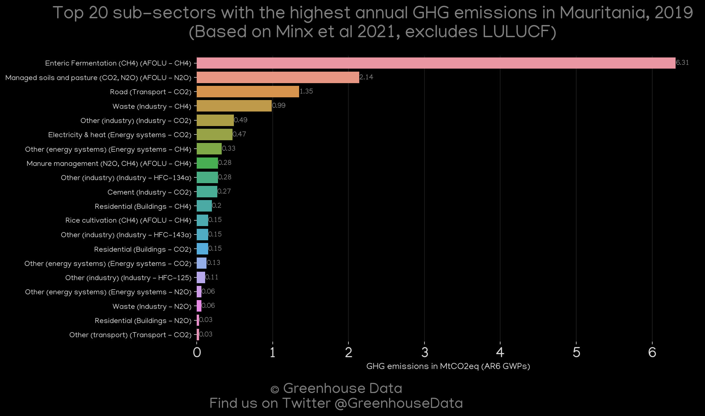
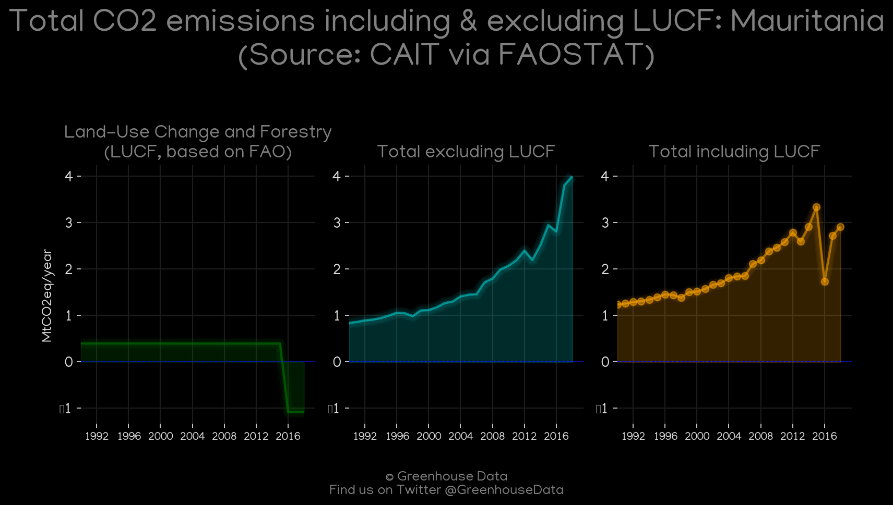
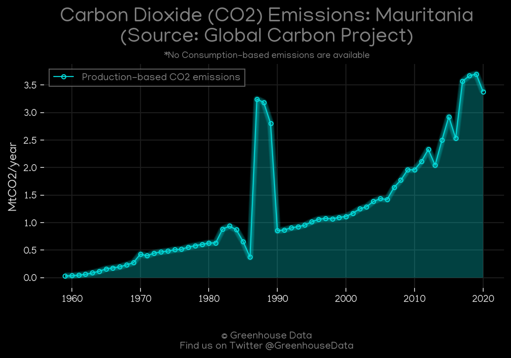
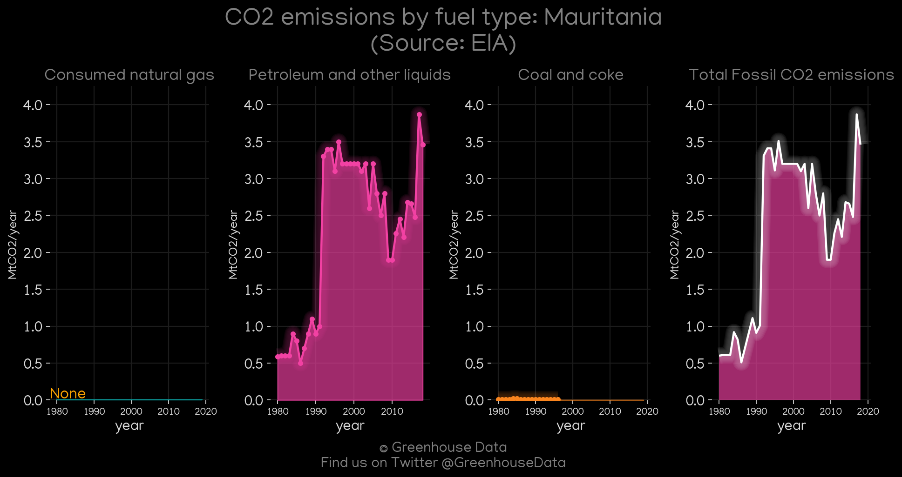
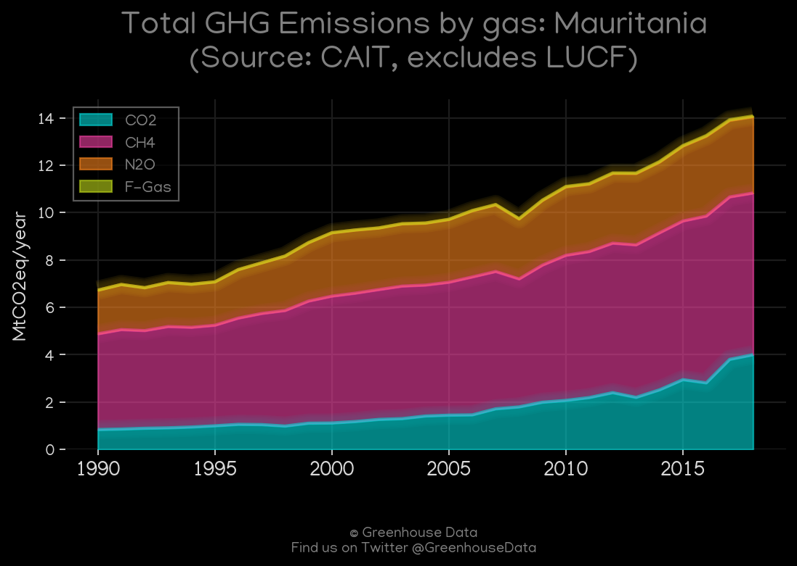
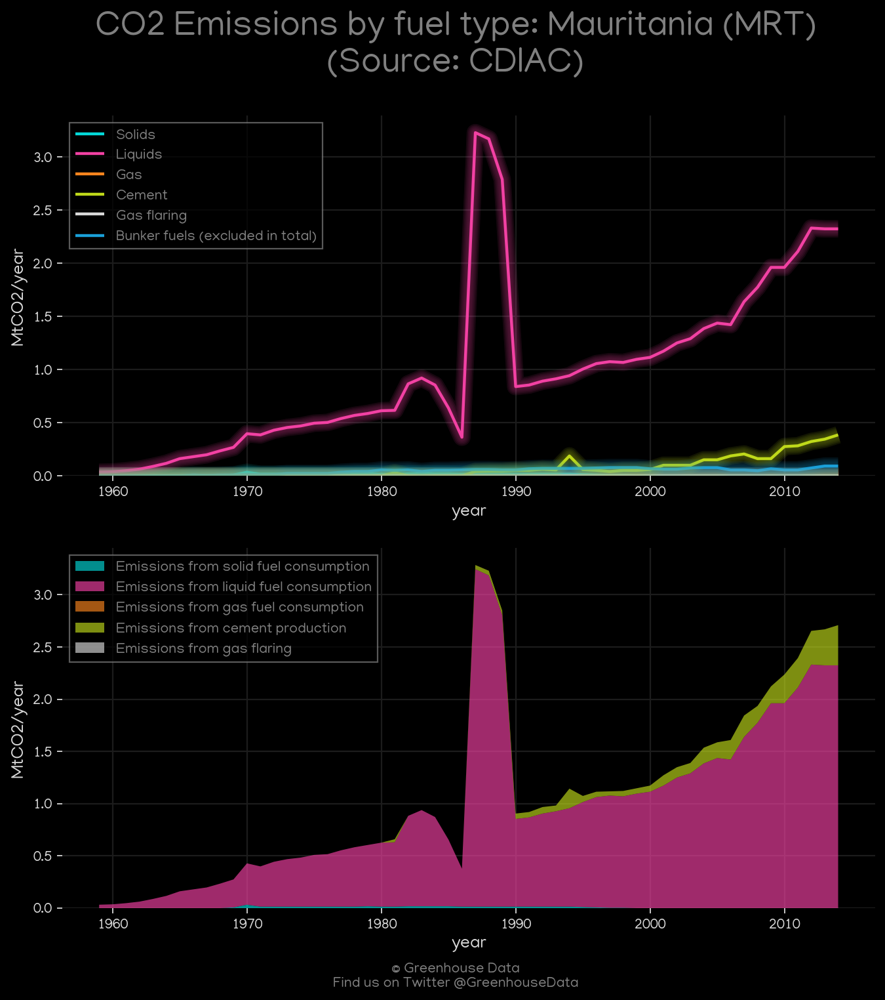
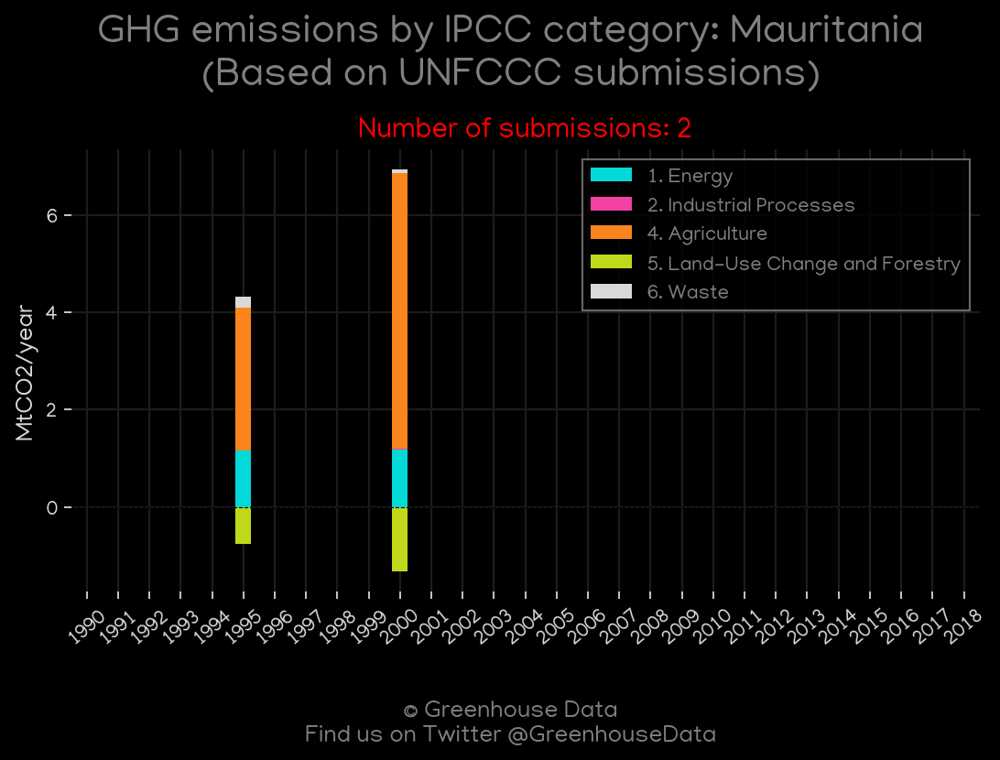

<h1 align="center">
🇲🇷🇲🇷🇲🇷🇲🇷🇲🇷
 
Mauritania
 
🇲🇷🇲🇷🇲🇷🇲🇷🇲🇷
</h1>
<h2>Datasets:</h2>

<a href="https://github.com/dquintani/GreenhouseData/tree/master/country_data/MRT_Mauritania/data">View on Github</a>
 

<a href="data/MRT_CDIAC.csv">CDIAC</a> || <a href="data/MRT_EDGAR.csv">EDGAR</a> || <a href="data/MRT_GCP.csv">GCP</a> || <a href="data/MRT_GCP_consupmption.csv">GCP_consupmption</a> || <a href="data/MRT_EPA.csv">EPA</a> || <a href="data/MRT_Minx_2021.csv">Minx_2021</a> || <a href="data/MRT_FAO.csv">FAO</a> || <a href="data/MRT_EIA.csv">EIA</a> || <a href="data/MRT_PRIMAP-hist.csv">PRIMAP-hist</a> || <a href="data/MRT_CAIT.csv">CAIT</a>

 

<h1>Figures:</h1><h2>#1 (MRT_Minx_top20_subsectors)</h2>

<h2>#2 (MRT_CO2_totals)</h2>

<h2>#3 (MRT_CAIT_lucf_vs_nolucf)</h2>

<h2>#4 (MRT_GCP_1)</h2>

<h2>#5 (MRT_EIA_1)</h2>

<h2>#6 (MRT_CAIT_gases_1)</h2>

<h2>#7 (MRT_CDIAC_1)</h2>

<h2>#8 (MRT_UNFCCC_NAI_1)</h2>

