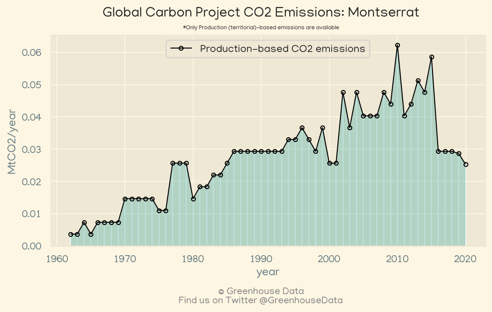
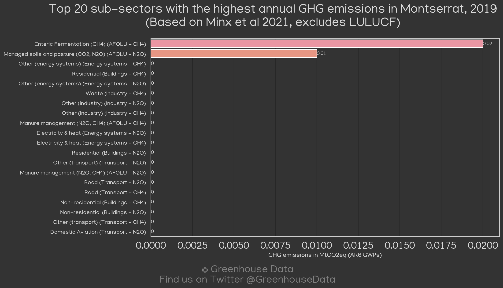
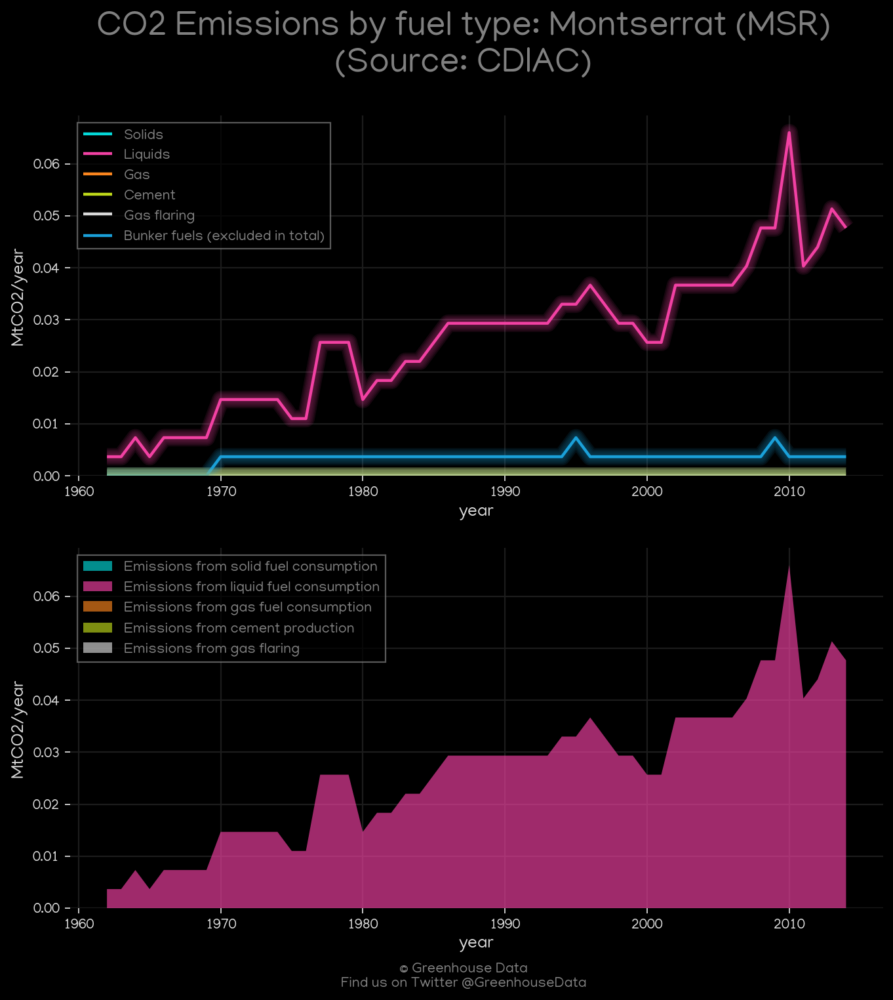
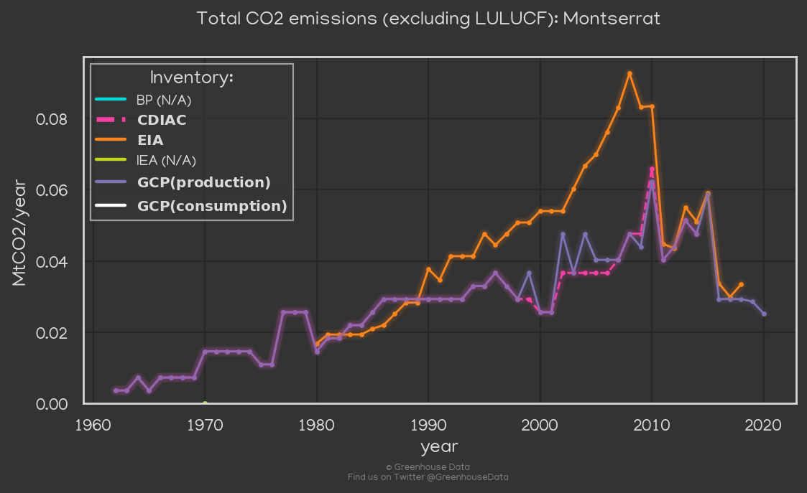
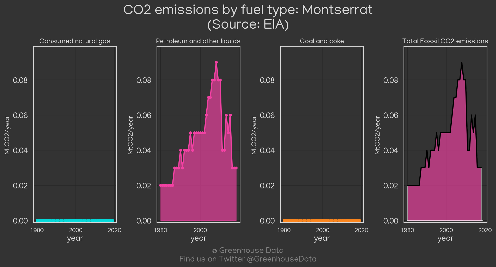

<h1 align="center">
🇲🇸🇲🇸🇲🇸🇲🇸🇲🇸
 
Montserrat
 
🇲🇸🇲🇸🇲🇸🇲🇸🇲🇸
</h1>
<h2>Datasets:</h2>

<a href="https://github.com/dquintani/GreenhouseData/tree/master/country_data/MSR_Montserrat/data">View on Github</a>
 

<a href="data/MSR_Minx_2021.csv">Minx_2021</a> || <a href="data/MSR_CDIAC.csv">CDIAC</a> || <a href="data/MSR_GCP_consupmption.csv">GCP_consupmption</a> || <a href="data/MSR_GCP.csv">GCP</a> || <a href="data/MSR_FAO.csv">FAO</a> || <a href="data/MSR_EDGAR.csv">EDGAR</a> || <a href="data/MSR_EIA.csv">EIA</a>

 

<h1>Figures:</h1><h2>#1 (MSR_GCP_1)</h2>

<h2>#2 (MSR_Minx_top20_subsectors)</h2>

<h2>#3 (MSR_CDIAC_1)</h2>

<h2>#4 (MSR_CO2_totals)</h2>

<h2>#5 (MSR_EIA_1)</h2>

