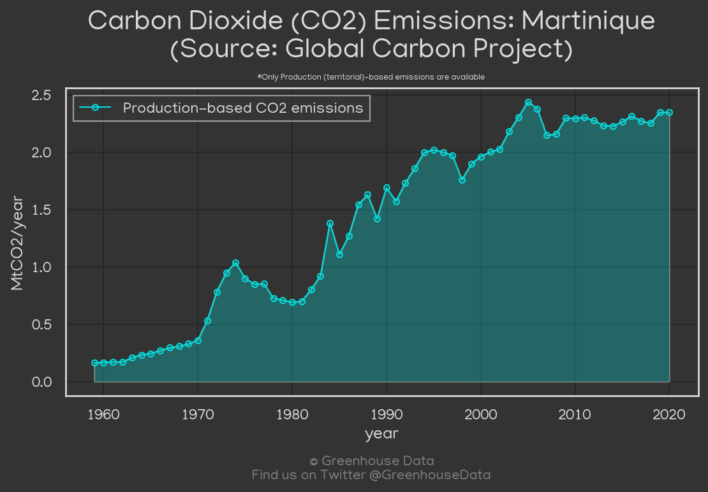
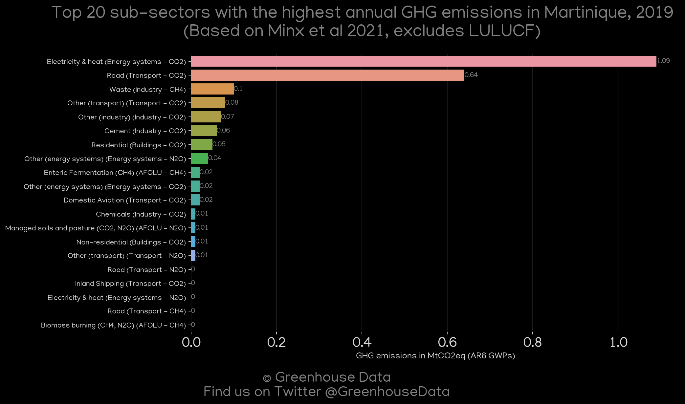
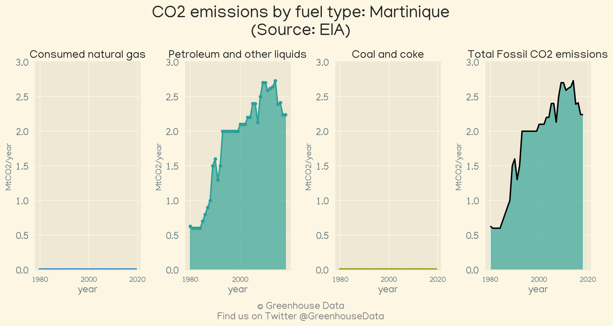
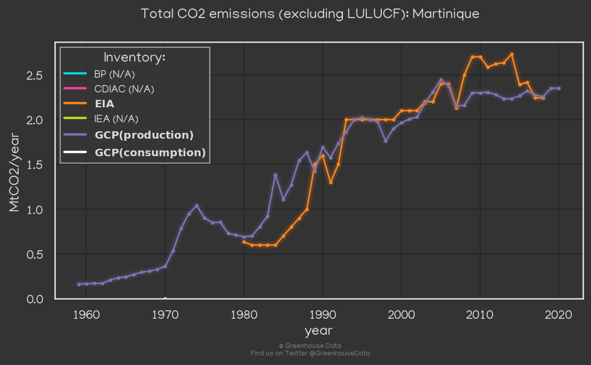

<h1 align="center">
🇲🇶🇲🇶🇲🇶🇲🇶🇲🇶
 
Martinique
 
🇲🇶🇲🇶🇲🇶🇲🇶🇲🇶
</h1>
<h2>Datasets:</h2>

<a href="https://github.com/dquintani/GreenhouseData/tree/master/country_data/MTQ_Martinique/data">View on Github</a>
 

<a href="data/MTQ_GCP.csv">GCP</a> || <a href="data/MTQ_FAO.csv">FAO</a> || <a href="data/MTQ_EIA.csv">EIA</a> || <a href="data/MTQ_EDGAR.csv">EDGAR</a> || <a href="data/MTQ_GCP_cons.csv">GCP_cons</a> || <a href="data/MTQ_Minx_2021.csv">Minx_2021</a> || <a href="data/MTQ_GCP_consupmption.csv">GCP_consupmption</a>

 

<h1>Figures:</h1><h2>#1 (MTQ_GCP_1)</h2>

<h2>#2 (MTQ_Minx_top20_subsectors)</h2>

<h2>#3 (MTQ_EIA_1)</h2>

<h2>#4 (MTQ_CO2_totals)</h2>

