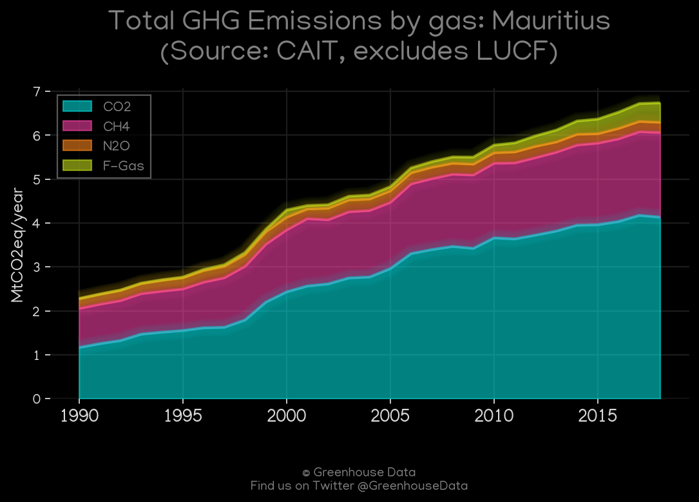
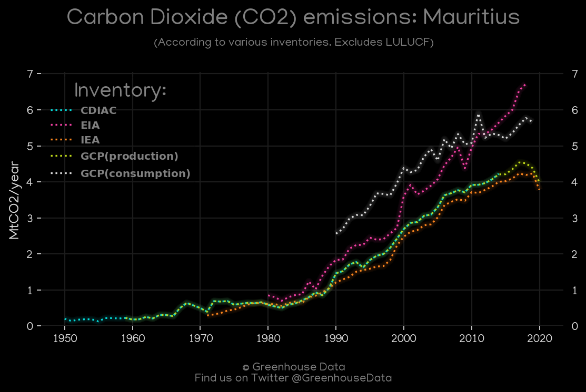
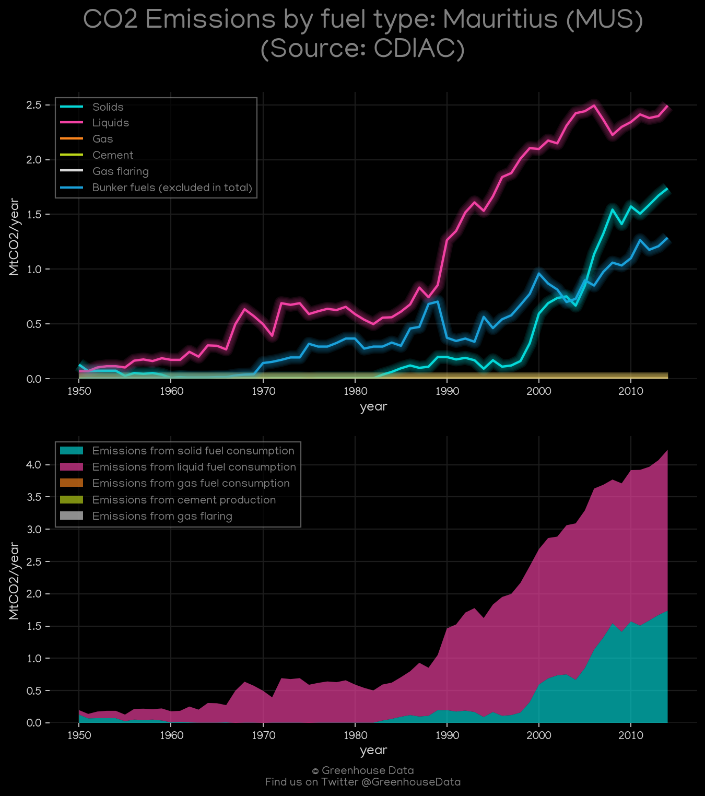
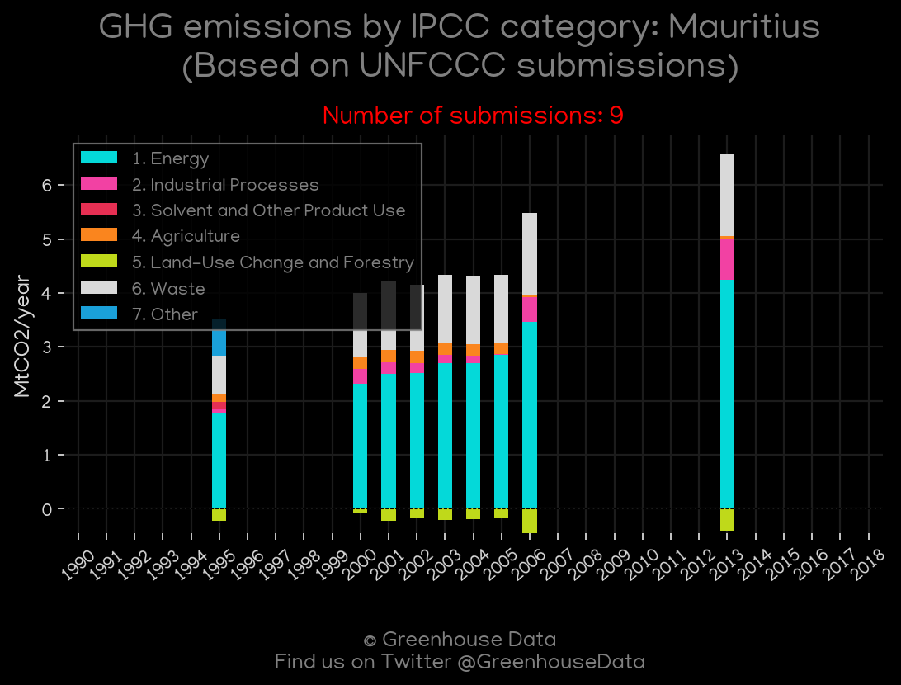
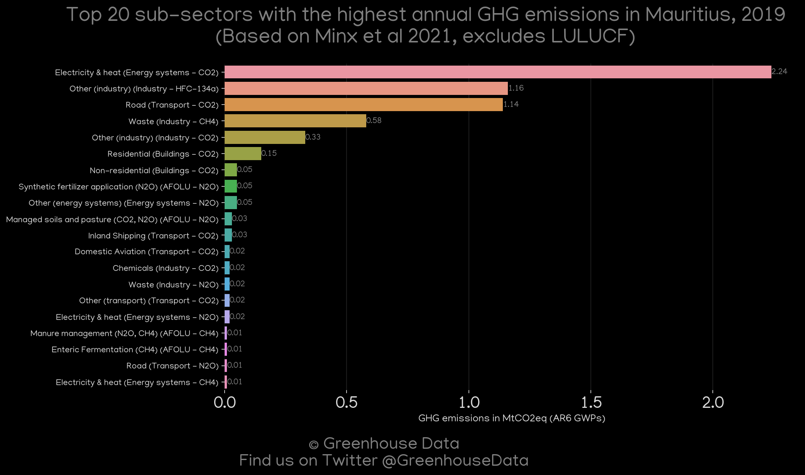
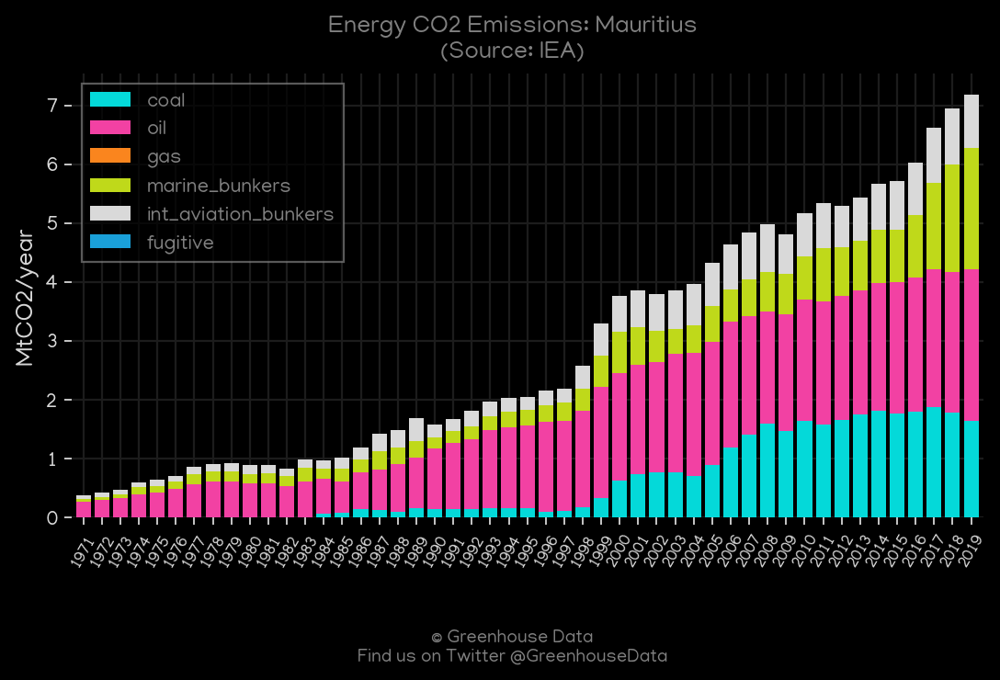
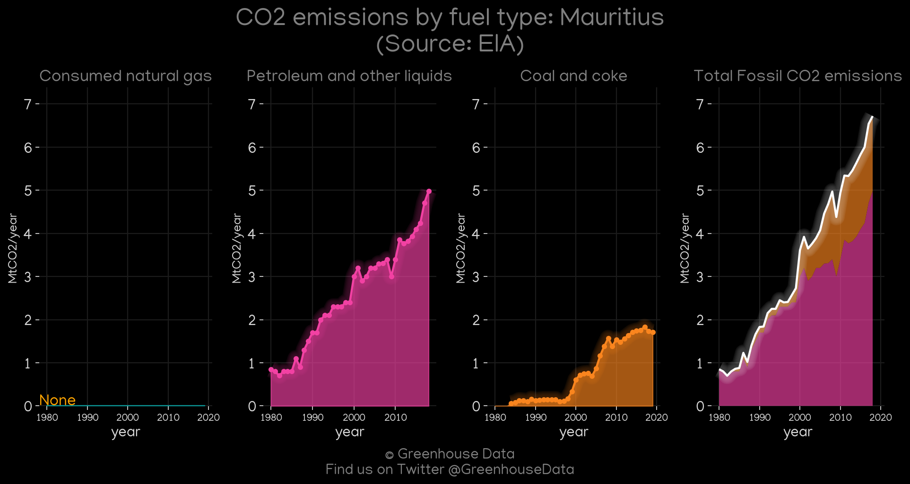
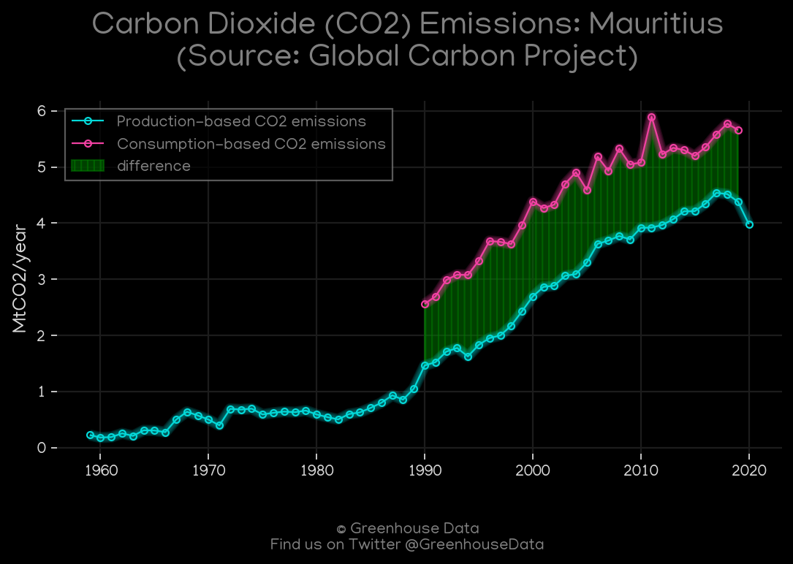

<h1 align="center">
🇲🇺🇲🇺🇲🇺🇲🇺🇲🇺
 
Mauritius
 
🇲🇺🇲🇺🇲🇺🇲🇺🇲🇺
</h1>
<h2>Datasets:</h2>

<a href="https://github.com/dquintani/Greenhouse-Data/tree/master/country_data/MUS_Mauritius/data">View on Github</a>
 

<a href="data/MUS_GCP.csv">GCP</a> || <a href="data/MUS_PRIMAP-hist.csv">PRIMAP-hist</a> || <a href="data/MUS_GCP_consupmption.csv">GCP_consupmption</a> || <a href="data/MUS_EDGAR.csv">EDGAR</a> || <a href="data/MUS_EPA.csv">EPA</a> || <a href="data/MUS_FAO.csv">FAO</a> || <a href="data/MUS_GCP_cons.csv">GCP_cons</a> || <a href="data/MUS_CAIT.csv">CAIT</a> || <a href="data/MUS_EIA.csv">EIA</a> || <a href="data/MUS_Minx_2021.csv">Minx_2021</a> || <a href="data/MUS_CDIAC.csv">CDIAC</a> || <a href="data/MUS_IEA.csv">IEA</a>

 

<h1>Figures:</h1><h2>#1 (MUS_CAIT_gases_1)</h2>

<h2>#2 (MUS_BP_1)</h2>

<h2>#3 (MUS_CO2_totals)</h2>

<h2>#4 (MUS_CDIAC_1)</h2>

<h2>#5 (MUS_UNFCCC_NAI_1)</h2>

<h2>#6 (MUS_Minx_top20_subsectors)</h2>

<h2>#7 (MUS_IEA_1)</h2>

<h2>#8 (MUS_EIA_1)</h2>

<h2>#9 (MUS_GCP_1)</h2>

