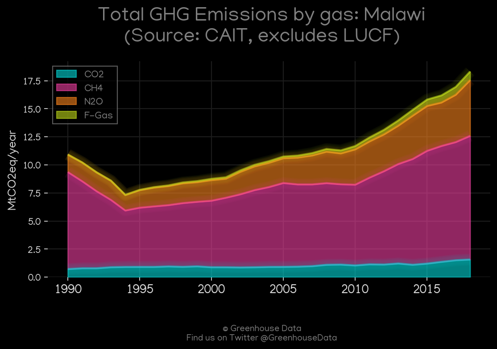
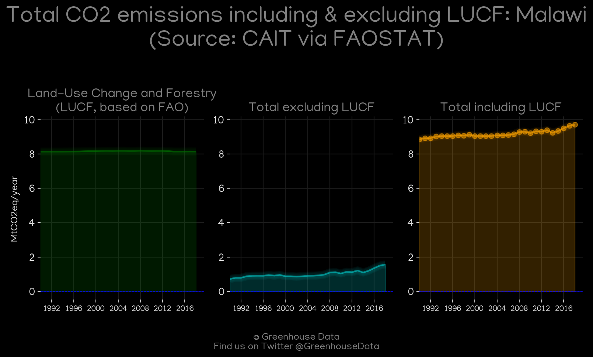
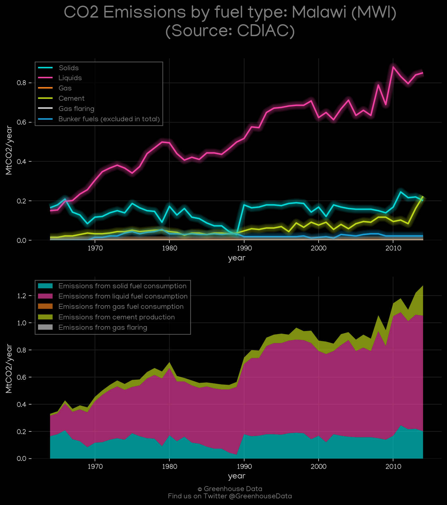
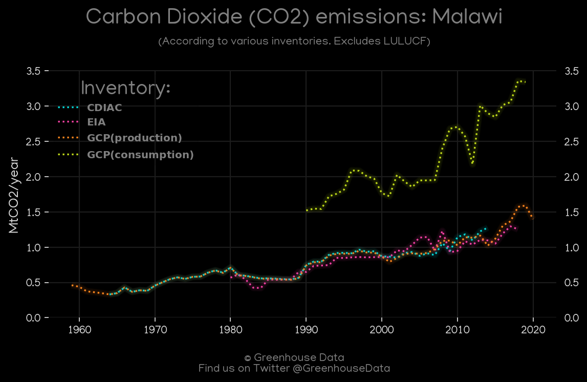
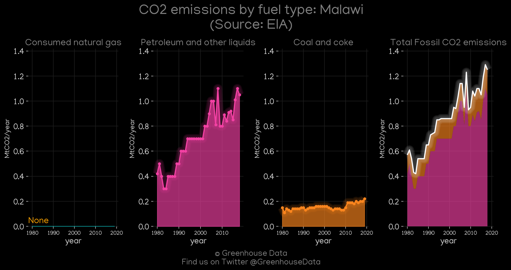
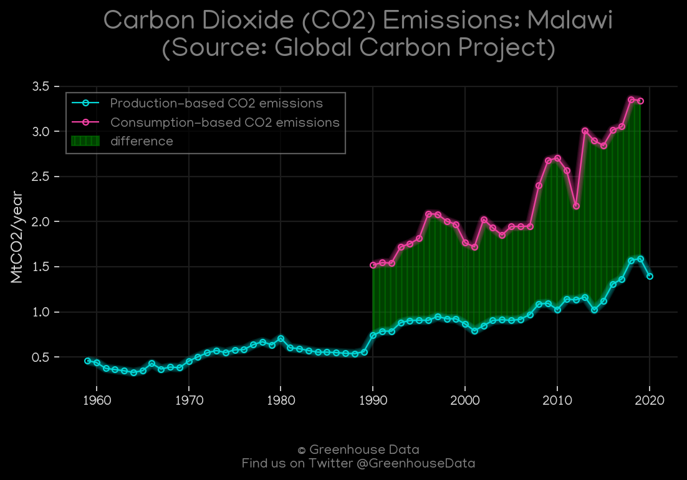
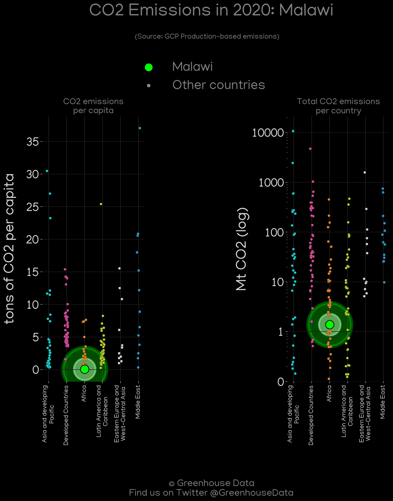
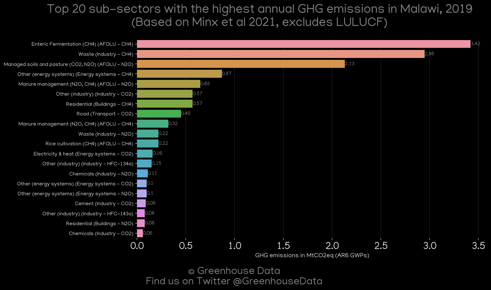
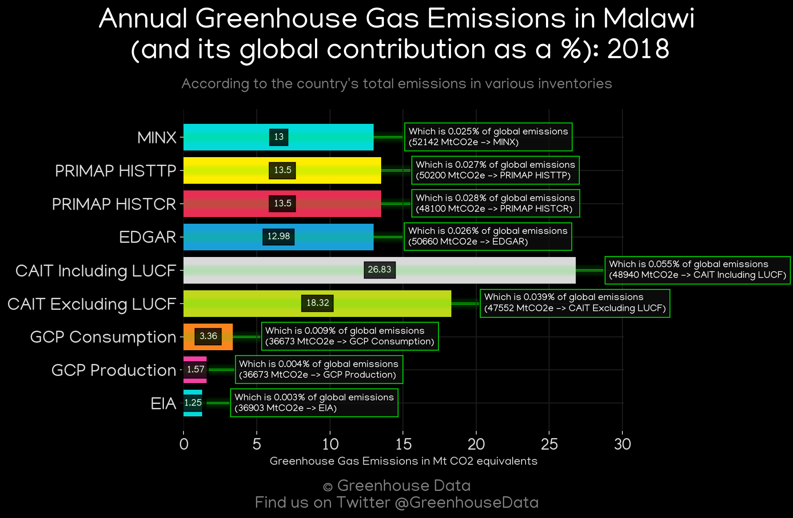
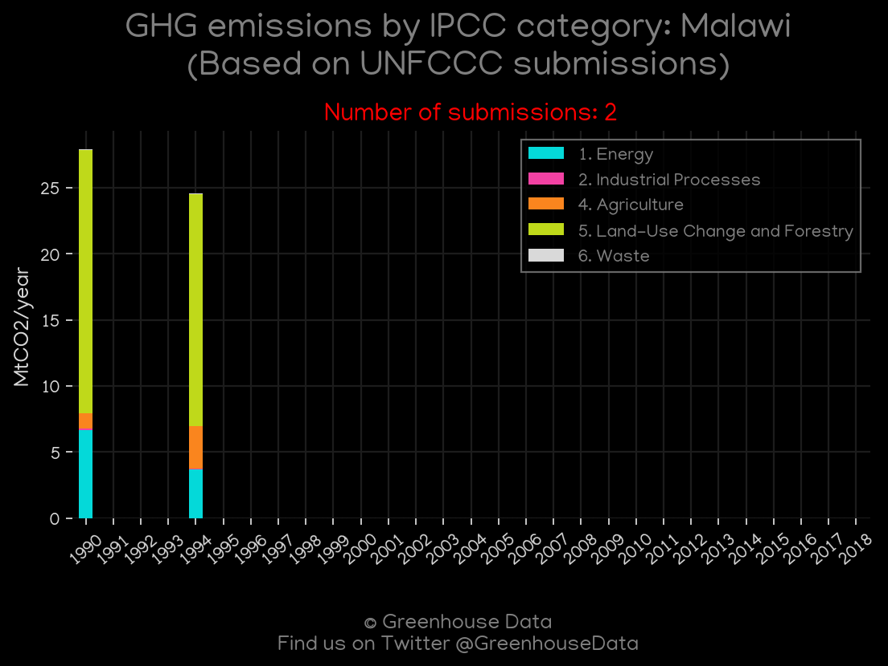

<h1 align="center">
🇲🇼🇲🇼🇲🇼🇲🇼🇲🇼
 
Malawi
 
🇲🇼🇲🇼🇲🇼🇲🇼🇲🇼
</h1>
<h2>Datasets:</h2>

<a href="https://github.com/dquintani/GreenhouseData/tree/master/country_data/MWI_Malawi/data">View on Github</a>
 

<a href="data/MWI_CAIT.csv">CAIT</a> || <a href="data/MWI_CDIAC.csv">CDIAC</a> || <a href="data/MWI_EDGAR.csv">EDGAR</a> || <a href="data/MWI_EIA.csv">EIA</a> || <a href="data/MWI_EPA.csv">EPA</a> || <a href="data/MWI_FAO.csv">FAO</a> || <a href="data/MWI_GCP.csv">GCP</a> || <a href="data/MWI_GCP_consupmption.csv">GCP_consupmption</a> || <a href="data/MWI_Minx_2021.csv">Minx_2021</a> || <a href="data/MWI_PRIMAP-hist.csv">PRIMAP-hist</a>

 

<h1>Figures:</h1><h2>#1 (MWI_CAIT_gases_1)</h2>

<h2>#2 (MWI_CAIT_lucf_vs_nolucf)</h2>

<h2>#3 (MWI_CDIAC_1)</h2>

<h2>#4 (MWI_CO2_totals)</h2>

<h2>#5 (MWI_EIA_1)</h2>

<h2>#6 (MWI_GCP_1)</h2>

<h2>#7 (MWI_GCP_Country_Highlight)</h2>

<h2>#8 (MWI_Minx_top20_subsectors)</h2>

<h2>#9 (MWI_relative_totals)</h2>

<h2>#10 (MWI_UNFCCC_NAI_1)</h2>

