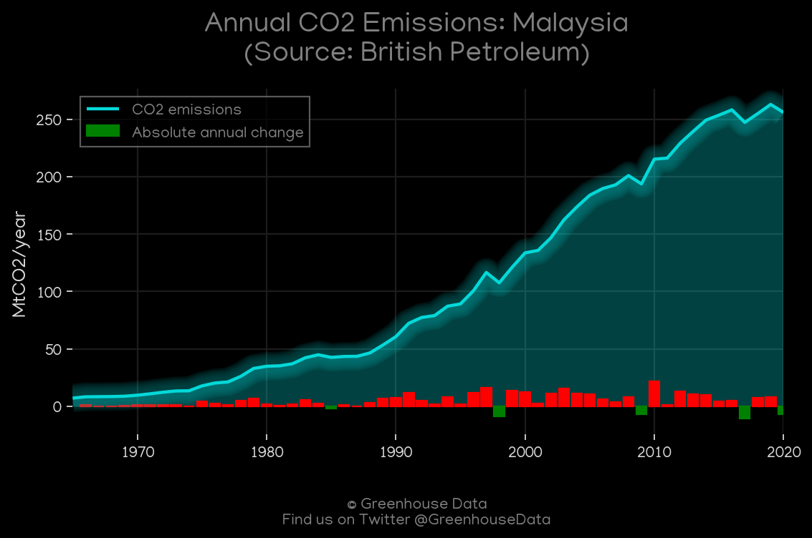
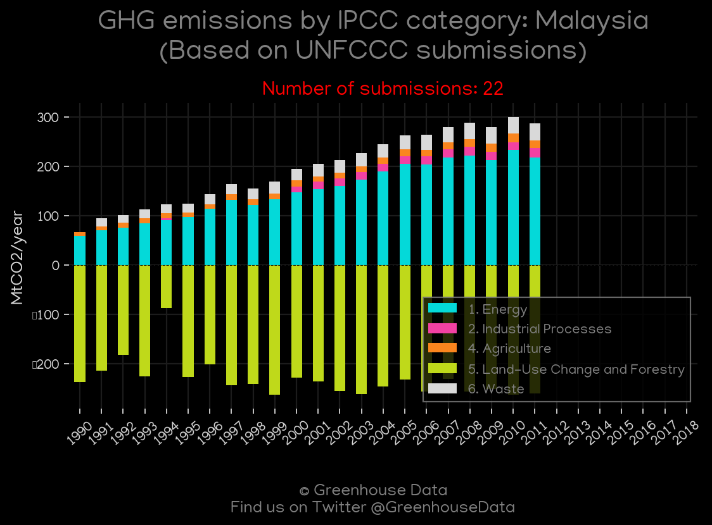
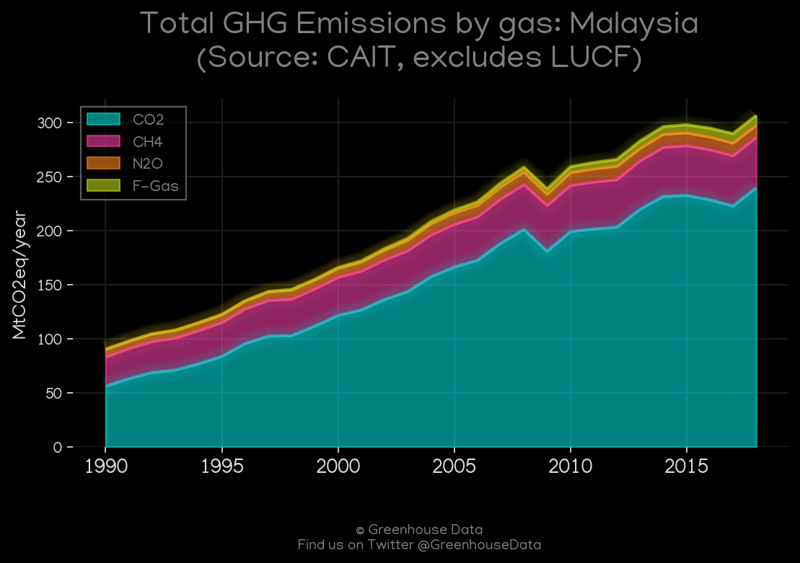
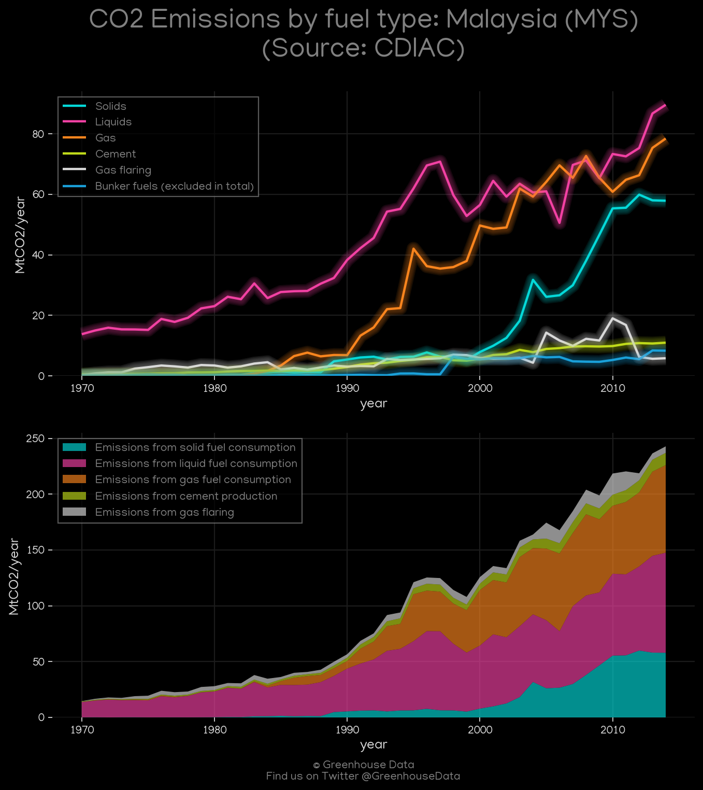
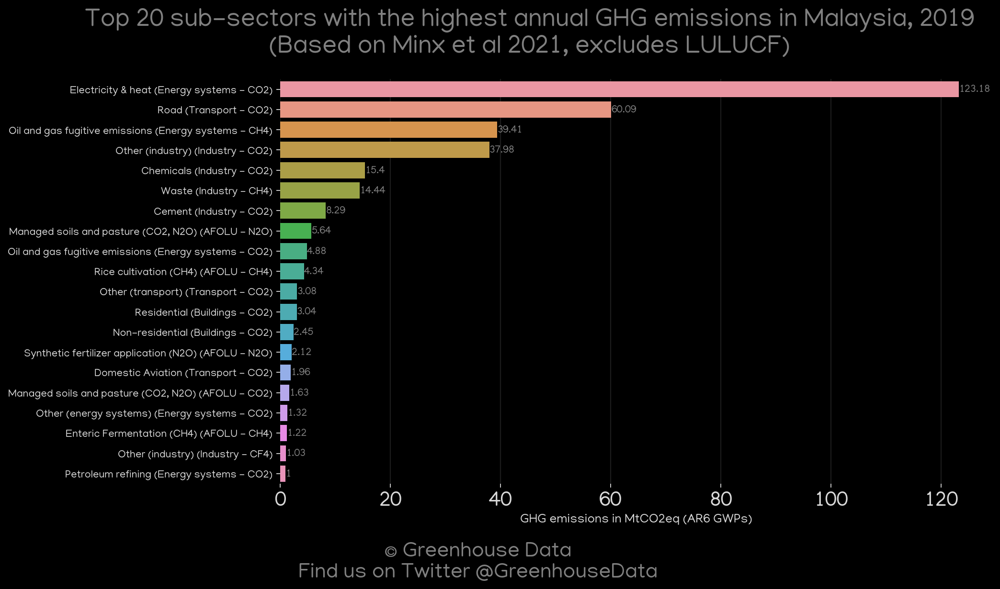
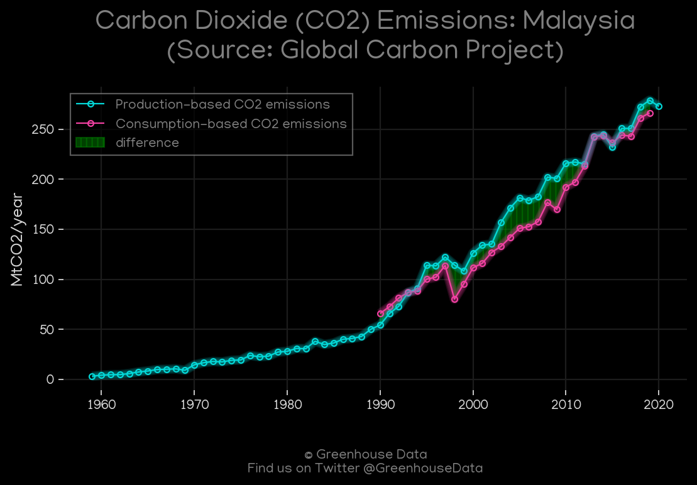
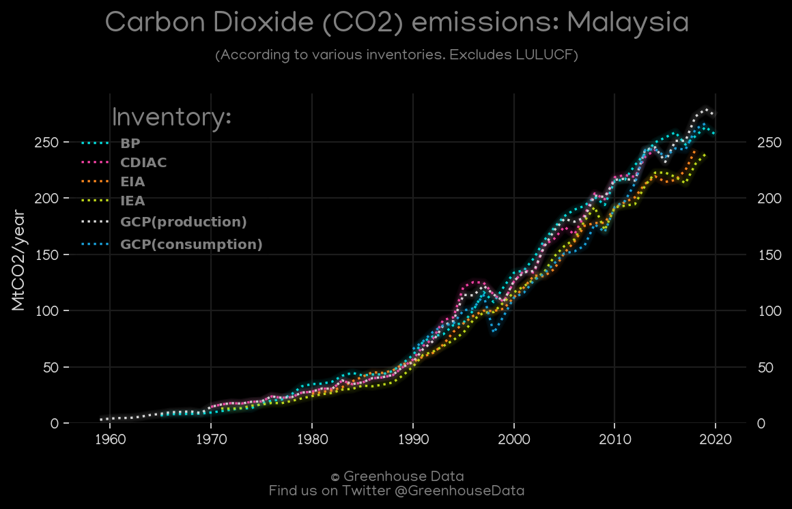
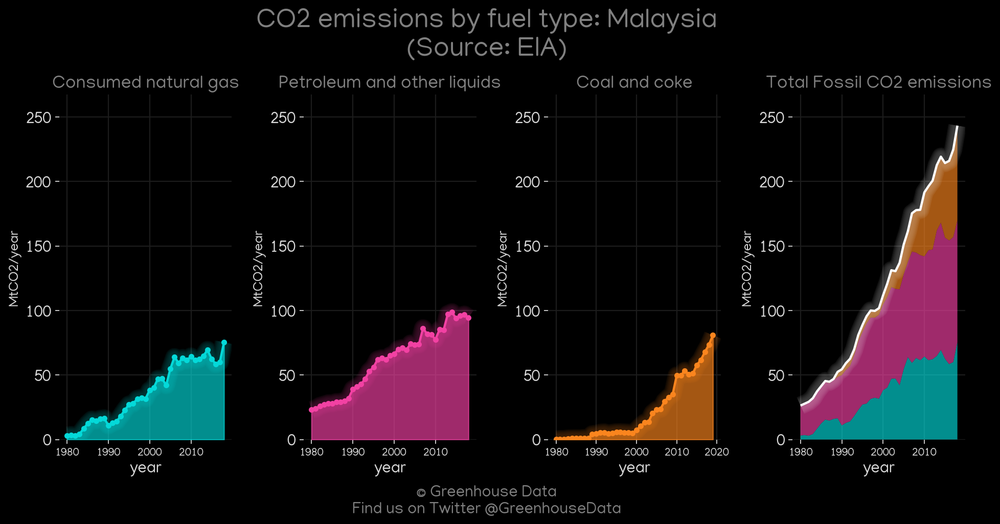

<h1 align="center">
🇲🇾🇲🇾🇲🇾🇲🇾🇲🇾
 
Malaysia
 
🇲🇾🇲🇾🇲🇾🇲🇾🇲🇾
</h1>
<h2>Datasets:</h2>

<a href="https://github.com/dquintani/Greenhouse-Data/tree/master/country_data/MYS_Malaysia/data">View on Github</a>
 

<a href="data/MYS_GCP.csv">GCP</a> || <a href="data/MYS_GCP_consupmption.csv">GCP_consupmption</a> || <a href="data/MYS_CAIT.csv">CAIT</a> || <a href="data/MYS_GCP_cons.csv">GCP_cons</a> || <a href="data/MYS_EPA.csv">EPA</a> || <a href="data/MYS_Minx_2021.csv">Minx_2021</a> || <a href="data/MYS_BP.csv">BP</a> || <a href="data/MYS_CDIAC.csv">CDIAC</a> || <a href="data/MYS_EIA.csv">EIA</a> || <a href="data/MYS_EDGAR.csv">EDGAR</a> || <a href="data/MYS_IEA.csv">IEA</a> || <a href="data/MYS_FAO.csv">FAO</a> || <a href="data/MYS_PRIMAP-hist.csv">PRIMAP-hist</a>

 

<h1>Figures:</h1><h2>#1 (MYS_IEA_1)</h2>

<h2>#2 (MYS_BP_1)</h2>

<h2>#3 (MYS_UNFCCC_NAI_1)</h2>

<h2>#4 (MYS_CAIT_gases_1)</h2>

<h2>#5 (MYS_CDIAC_1)</h2>

<h2>#6 (MYS_Minx_top20_subsectors)</h2>

<h2>#7 (MYS_GCP_1)</h2>

<h2>#8 (MYS_CO2_totals)</h2>

<h2>#9 (MYS_EIA_1)</h2>

