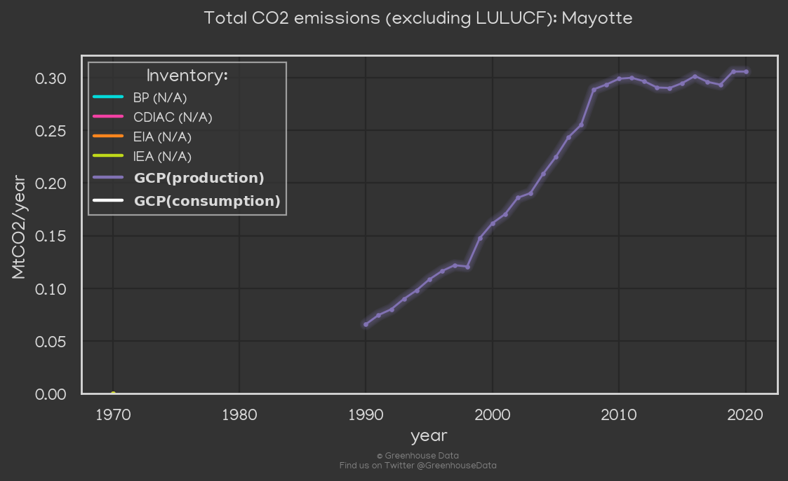
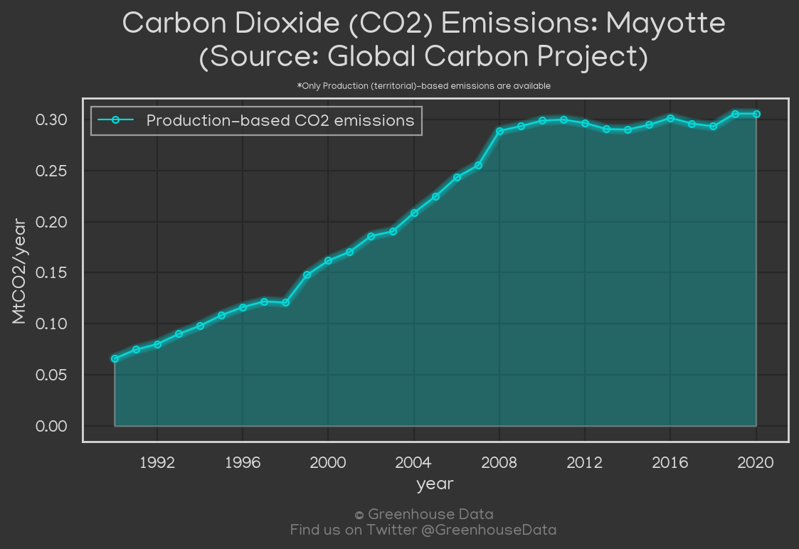
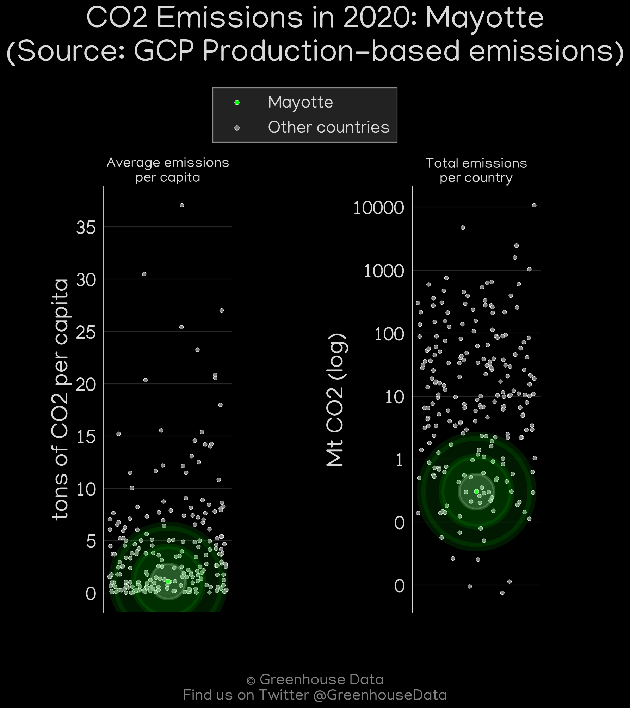
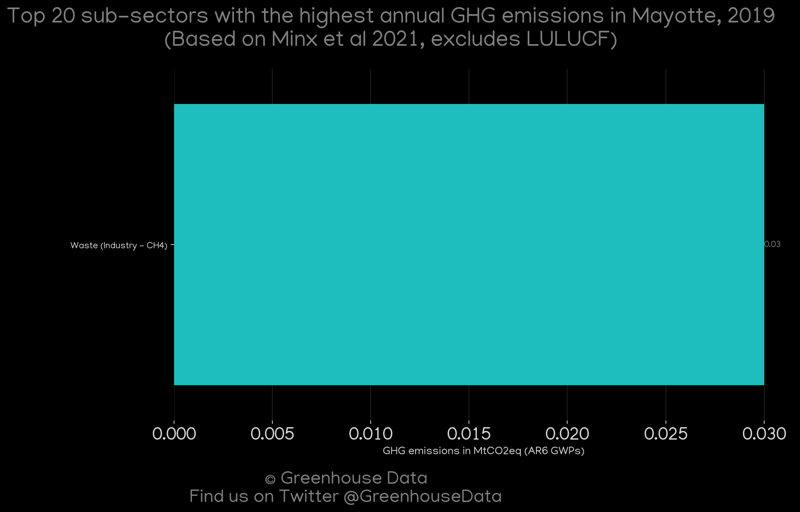
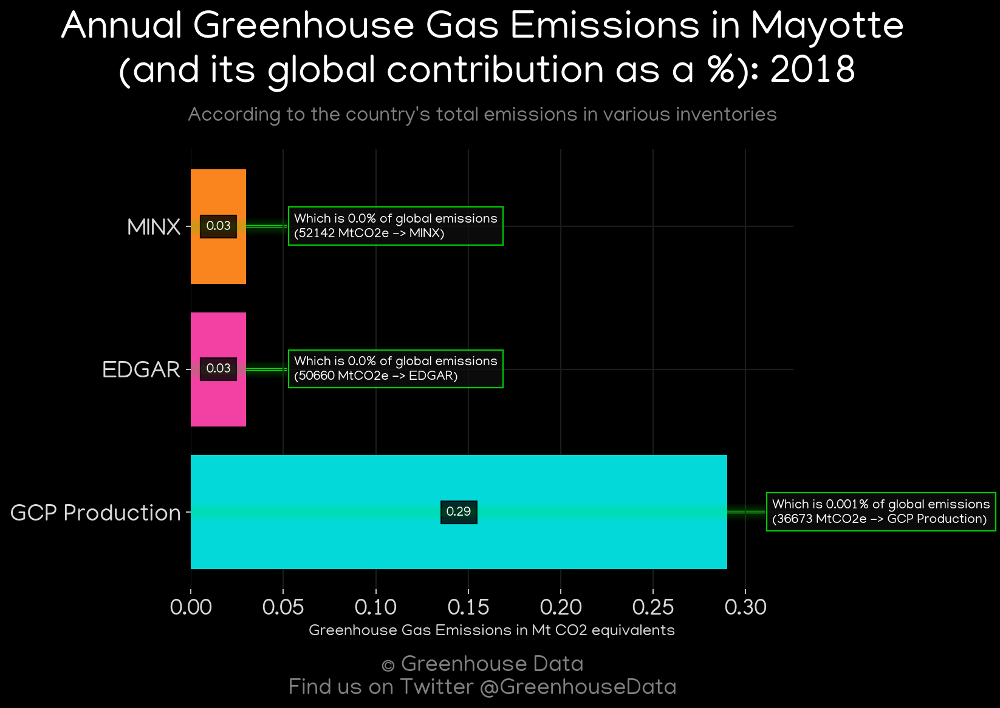

<h1 align="center">
🇾🇹🇾🇹🇾🇹🇾🇹🇾🇹
 
Mayotte
 
🇾🇹🇾🇹🇾🇹🇾🇹🇾🇹
</h1>
<h2>Datasets:</h2>

<a href="https://github.com/dquintani/GreenhouseData/tree/master/country_data/MYT_Mayotte/data">View on Github</a>
 

<a href="data/MYT_EDGAR.csv">EDGAR</a> || <a href="data/MYT_FAO.csv">FAO</a> || <a href="data/MYT_GCP.csv">GCP</a> || <a href="data/MYT_GCP_consupmption.csv">GCP_consupmption</a> || <a href="data/MYT_Minx_2021.csv">Minx_2021</a>

 

<h1>Figures:</h1><h2>#1 (MYT_CO2_totals)</h2>

<h2>#2 (MYT_GCP_1)</h2>

<h2>#3 (MYT_GCP_Country_Highlight)</h2>

<h2>#4 (MYT_Minx_top20_subsectors)</h2>

<h2>#5 (MYT_relative_totals)</h2>

