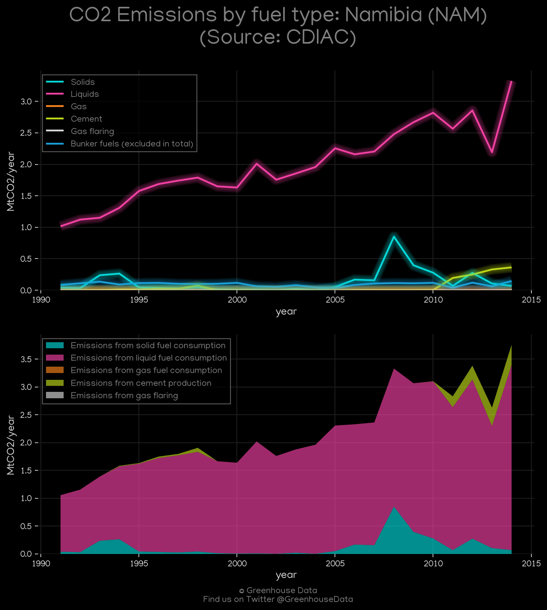
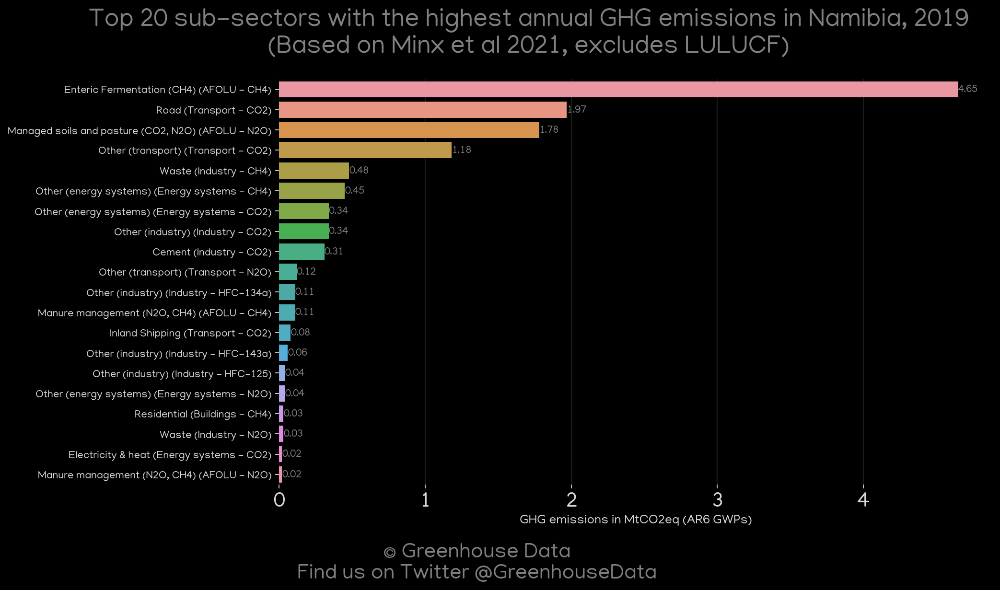
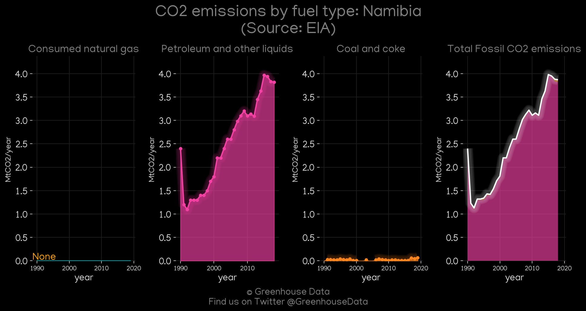
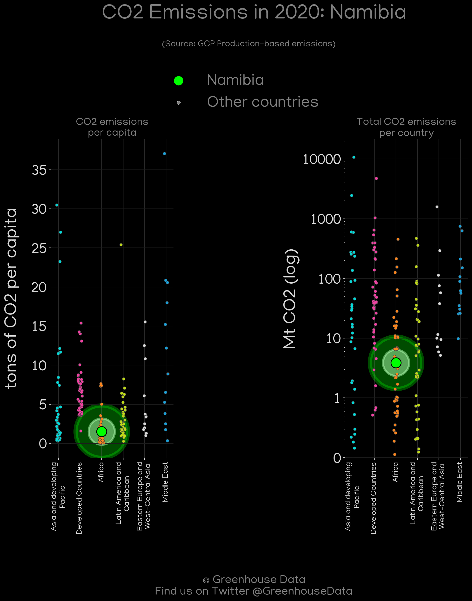
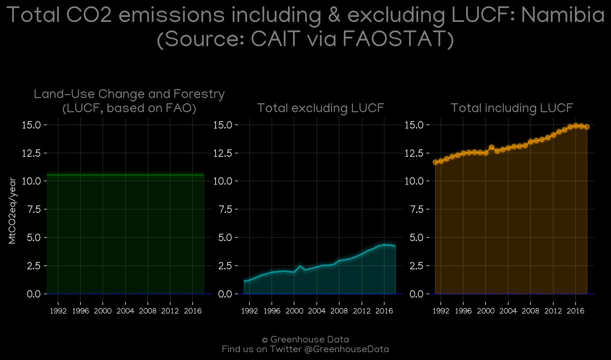
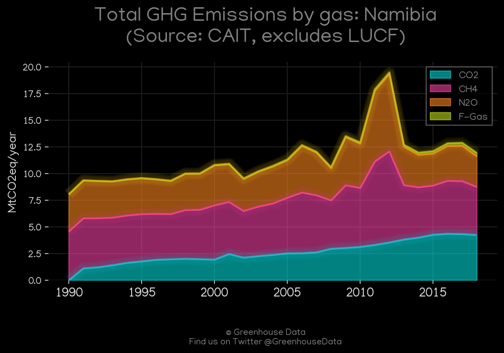
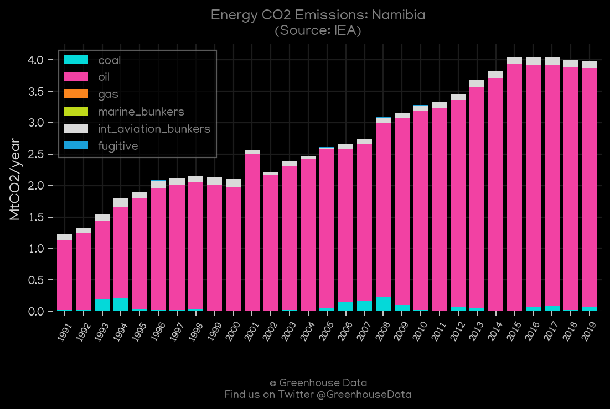
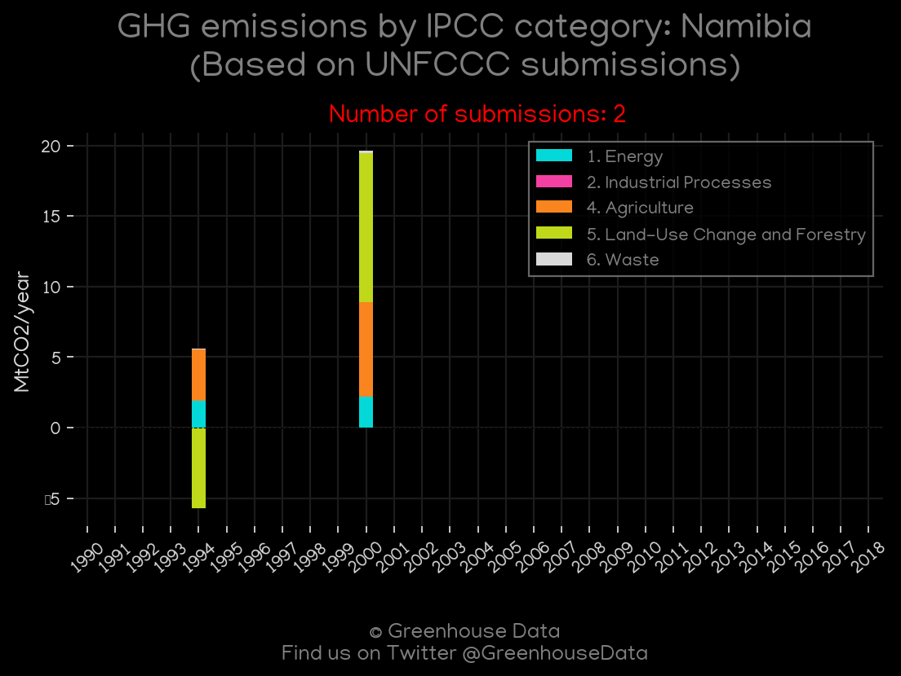
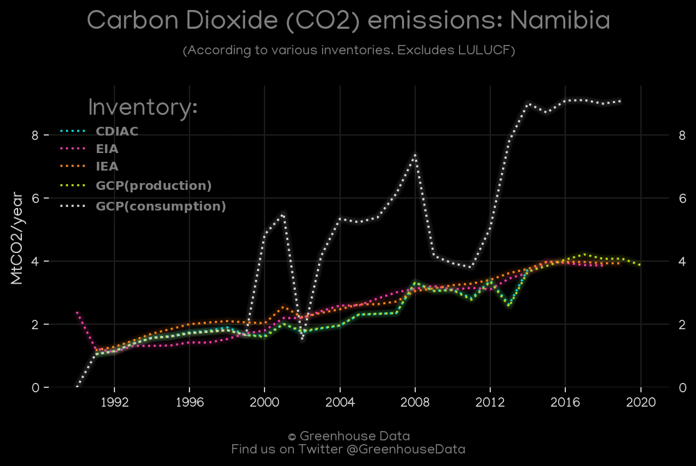
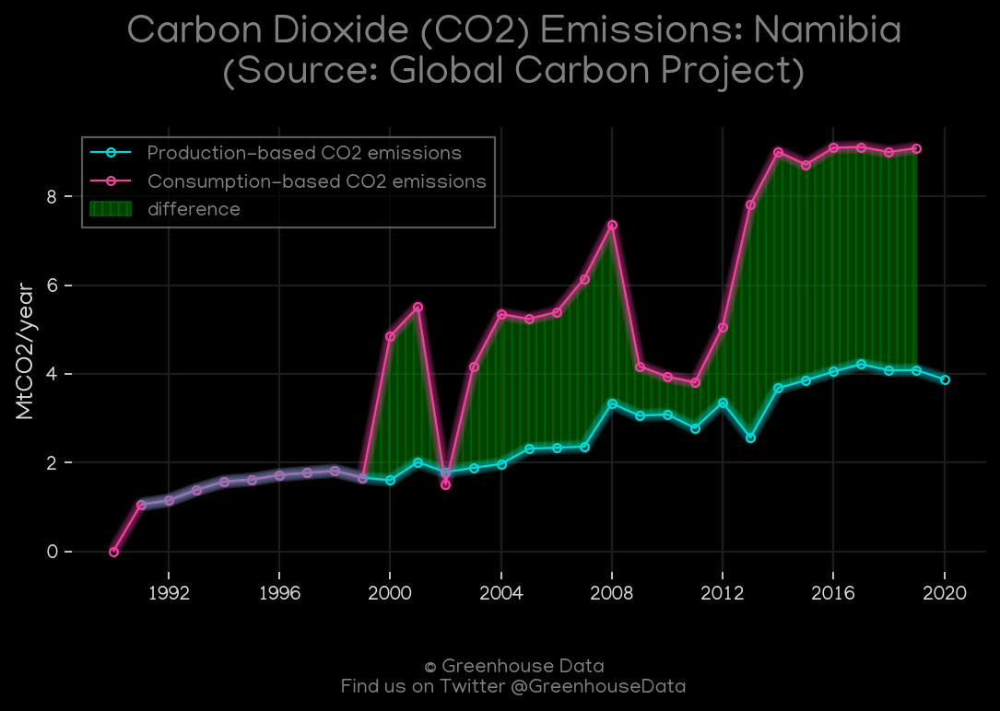

<h1 align="center">
🇳🇦🇳🇦🇳🇦🇳🇦🇳🇦
 
Namibia
 
🇳🇦🇳🇦🇳🇦🇳🇦🇳🇦
</h1>
<h2>Datasets:</h2>

<a href="https://github.com/dquintani/GreenhouseData/tree/master/country_data/NAM_Namibia/data">View on Github</a>
 

<a href="data/NAM_GCP.csv">GCP</a> || <a href="data/NAM_CDIAC.csv">CDIAC</a> || <a href="data/NAM_EIA.csv">EIA</a> || <a href="data/NAM_FAO.csv">FAO</a> || <a href="data/NAM_EDGAR.csv">EDGAR</a> || <a href="data/NAM_CAIT.csv">CAIT</a> || <a href="data/NAM_IEA.csv">IEA</a> || <a href="data/NAM_GCP_consupmption.csv">GCP_consupmption</a> || <a href="data/NAM_PRIMAP-hist.csv">PRIMAP-hist</a> || <a href="data/NAM_Minx_2021.csv">Minx_2021</a> || <a href="data/NAM_EPA.csv">EPA</a>

 

<h1>Figures:</h1><h2>#1 (NAM_CDIAC_1)</h2>

<h2>#2 (NAM_Minx_top20_subsectors)</h2>

<h2>#3 (NAM_EIA_1)</h2>

<h2>#4 (NAM_GCP_Country_Highlight)</h2>

<h2>#5 (NAM_CAIT_lucf_vs_nolucf)</h2>

<h2>#6 (NAM_CAIT_gases_1)</h2>

<h2>#7 (NAM_IEA_1)</h2>

<h2>#8 (NAM_UNFCCC_NAI_1)</h2>

<h2>#9 (NAM_CO2_totals)</h2>

<h2>#10 (NAM_GCP_1)</h2>

