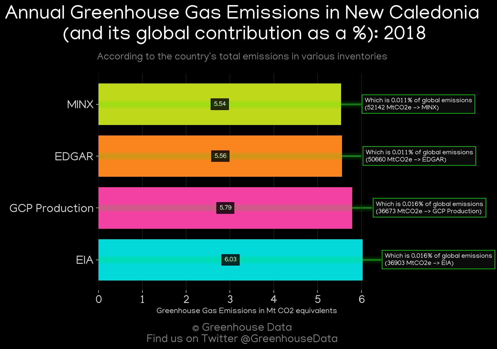
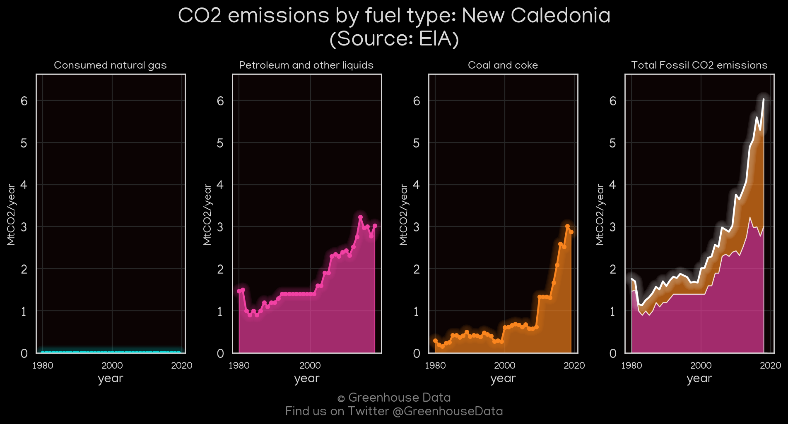
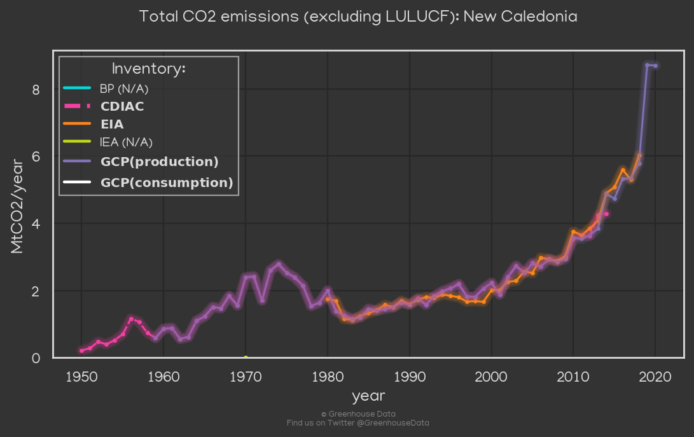
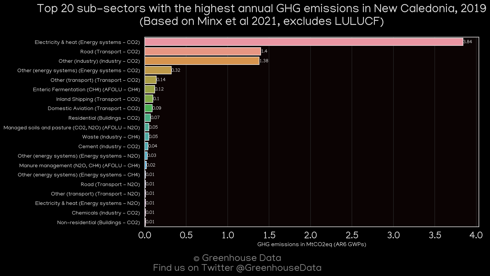
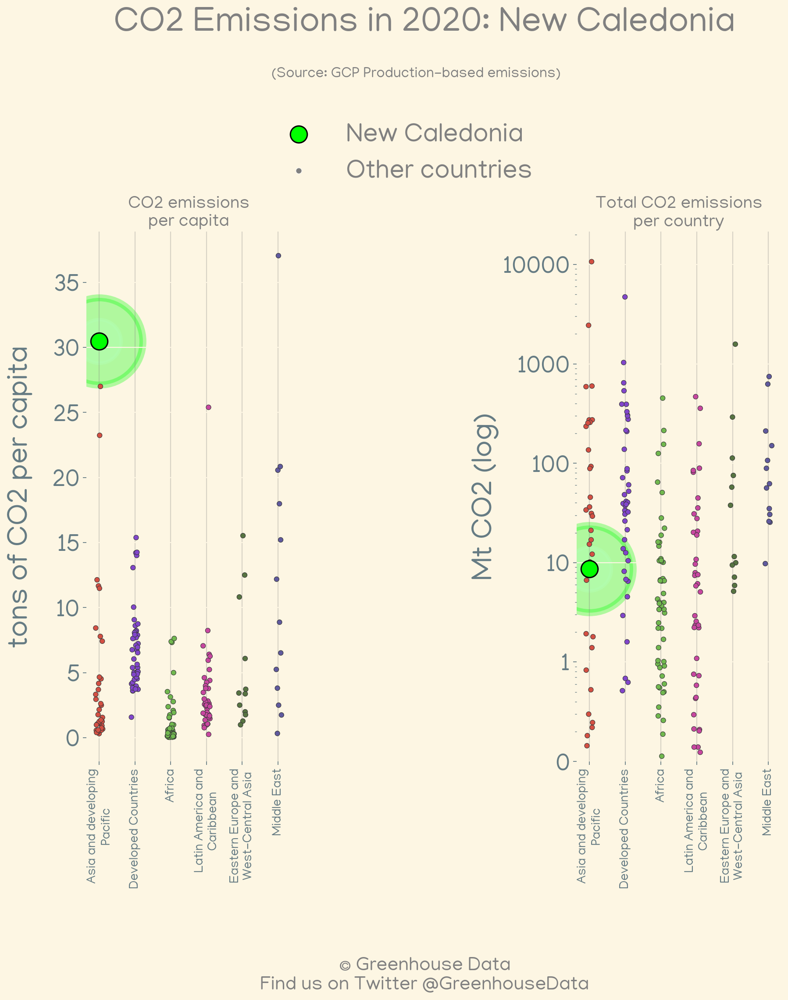
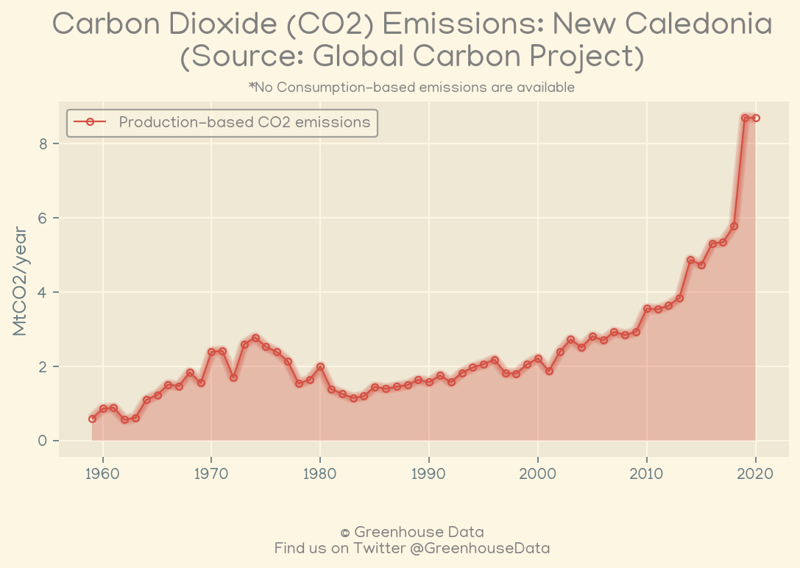
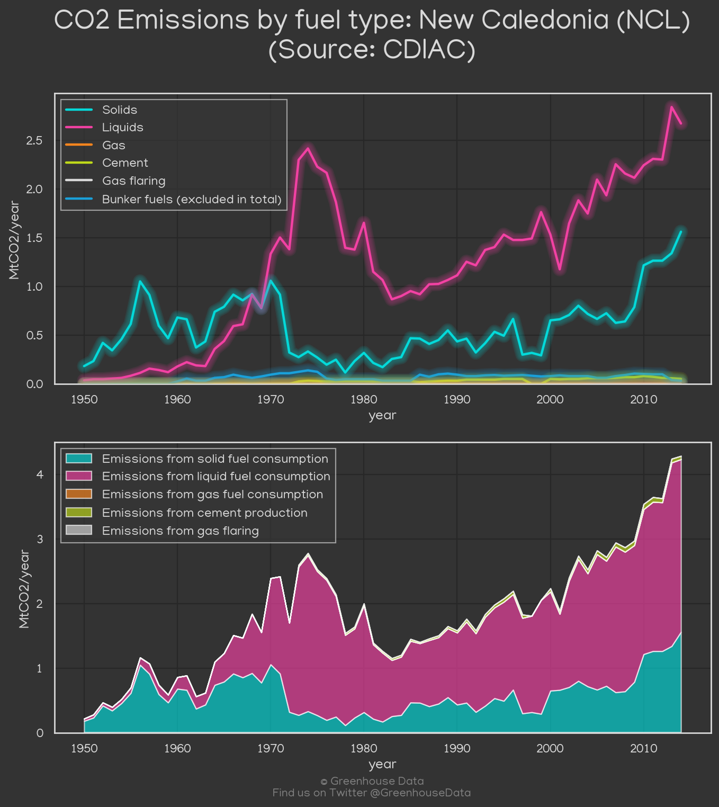

<h1 align="center">
🇳🇨🇳🇨🇳🇨🇳🇨🇳🇨
 
New Caledonia
 
🇳🇨🇳🇨🇳🇨🇳🇨🇳🇨
</h1>
<h2>Datasets:</h2>

<a href="https://github.com/dquintani/GreenhouseData/tree/master/country_data/NCL_New Caledonia/data">View on Github</a>
 

<a href="data/NCL_Minx_2021.csv">Minx_2021</a> || <a href="data/NCL_CDIAC.csv">CDIAC</a> || <a href="data/NCL_GCP_consupmption.csv">GCP_consupmption</a> || <a href="data/NCL_EIA.csv">EIA</a> || <a href="data/NCL_GCP.csv">GCP</a> || <a href="data/NCL_EDGAR.csv">EDGAR</a> || <a href="data/NCL_FAO.csv">FAO</a>

 

<h1>Figures:</h1><h2>#1 (NCL_relative_totals)</h2>

<h2>#2 (NCL_EIA_1)</h2>

<h2>#3 (NCL_CO2_totals)</h2>

<h2>#4 (NCL_Minx_top20_subsectors)</h2>

<h2>#5 (NCL_GCP_Country_Highlight)</h2>

<h2>#6 (NCL_GCP_1)</h2>

<h2>#7 (NCL_CDIAC_1)</h2>

