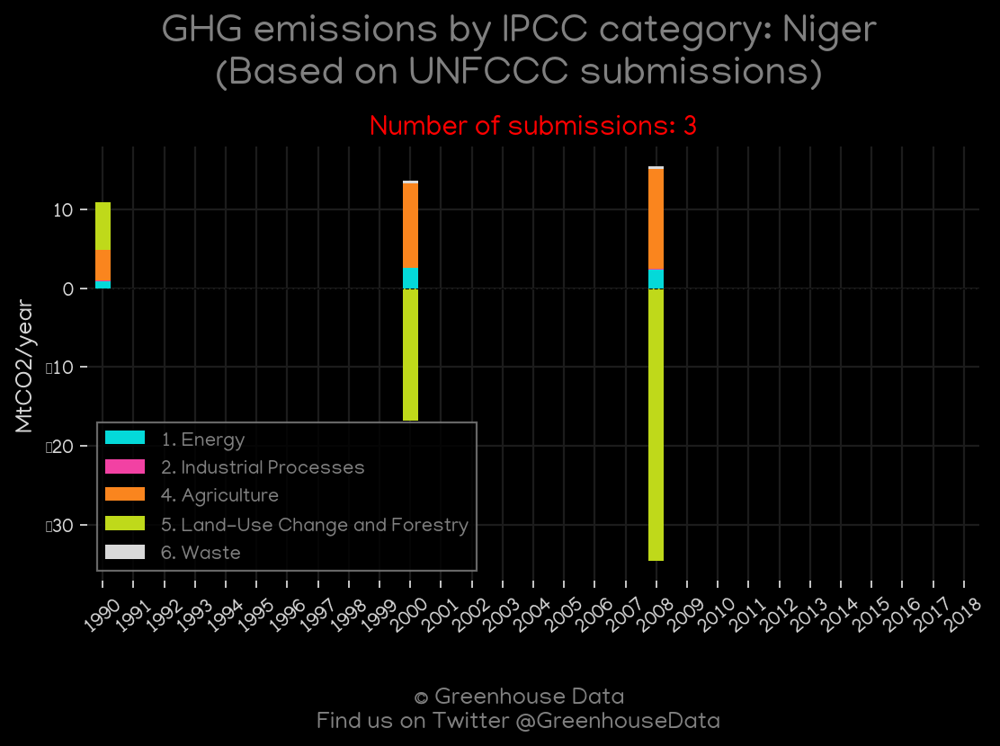
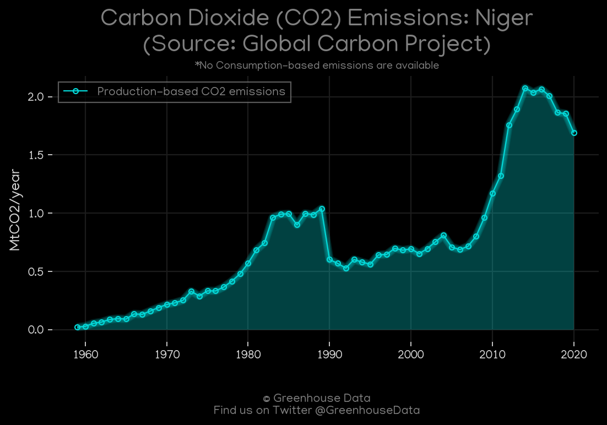
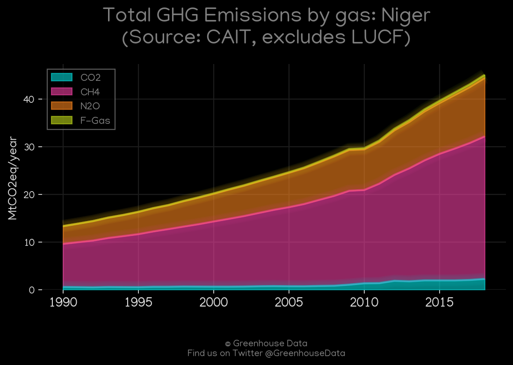
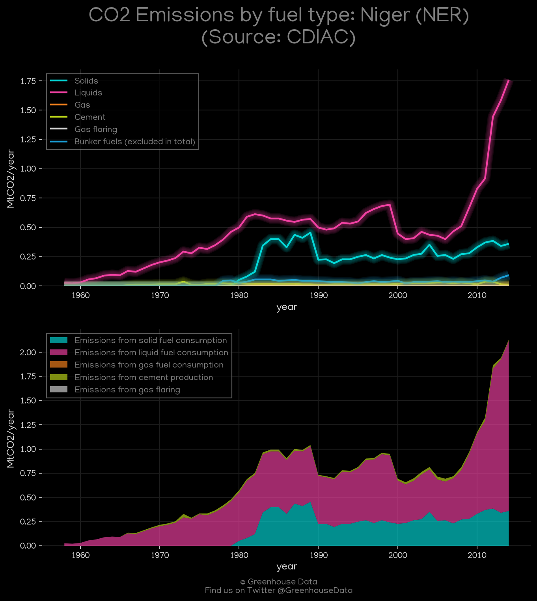
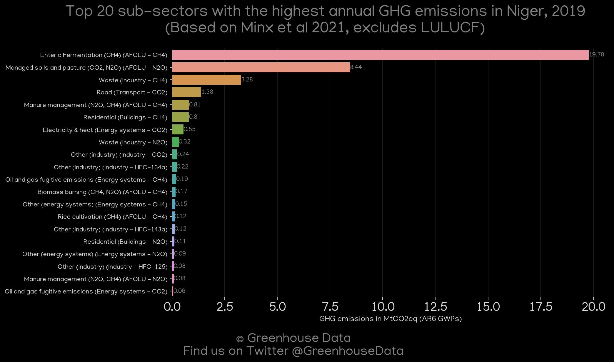
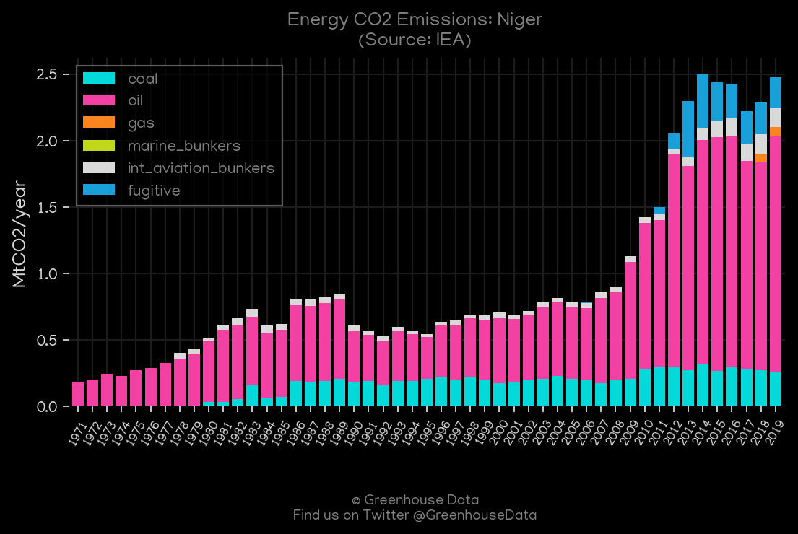
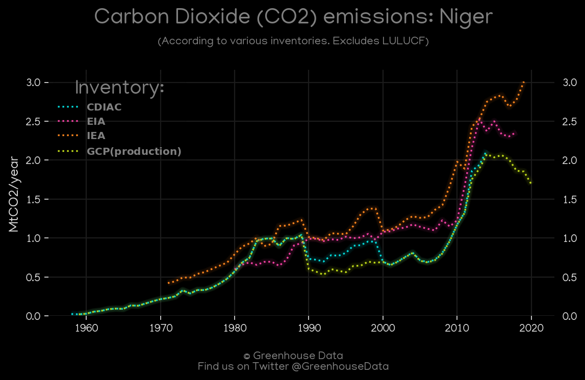
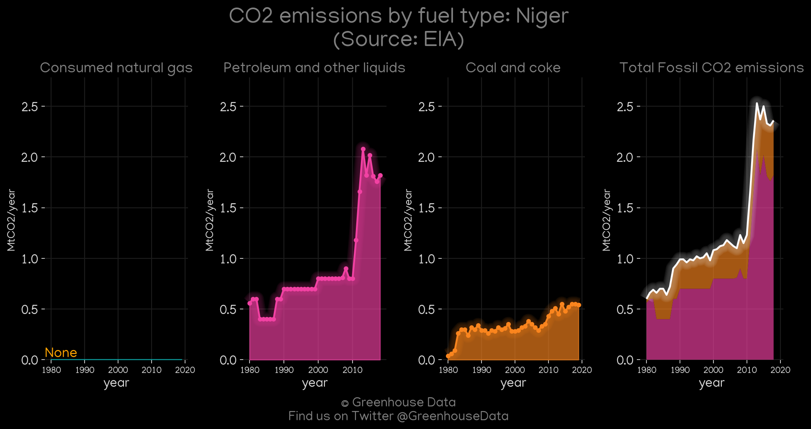

<h1 align="center">
🇳🇪🇳🇪🇳🇪🇳🇪🇳🇪
 
Niger
 
🇳🇪🇳🇪🇳🇪🇳🇪🇳🇪
</h1>
<h2>Datasets:</h2>

<a href="https://github.com/dquintani/GreenhouseData/tree/master/country_data/NER_Niger/data">View on Github</a>
 

<a href="data/NER_CAIT.csv">CAIT</a> || <a href="data/NER_CDIAC.csv">CDIAC</a> || <a href="data/NER_EDGAR.csv">EDGAR</a> || <a href="data/NER_Minx_2021.csv">Minx_2021</a> || <a href="data/NER_FAO.csv">FAO</a> || <a href="data/NER_PRIMAP-hist.csv">PRIMAP-hist</a> || <a href="data/NER_EPA.csv">EPA</a> || <a href="data/NER_EIA.csv">EIA</a> || <a href="data/NER_IEA.csv">IEA</a> || <a href="data/NER_GCP.csv">GCP</a> || <a href="data/NER_GCP_consupmption.csv">GCP_consupmption</a>

 

<h1>Figures:</h1><h2>#1 (NER_UNFCCC_NAI_1)</h2>

<h2>#2 (NER_GCP_1)</h2>

<h2>#3 (NER_CAIT_gases_1)</h2>

<h2>#4 (NER_CDIAC_1)</h2>

<h2>#5 (NER_Minx_top20_subsectors)</h2>

<h2>#6 (NER_IEA_1)</h2>

<h2>#7 (NER_CO2_totals)</h2>

<h2>#8 (NER_EIA_1)</h2>

