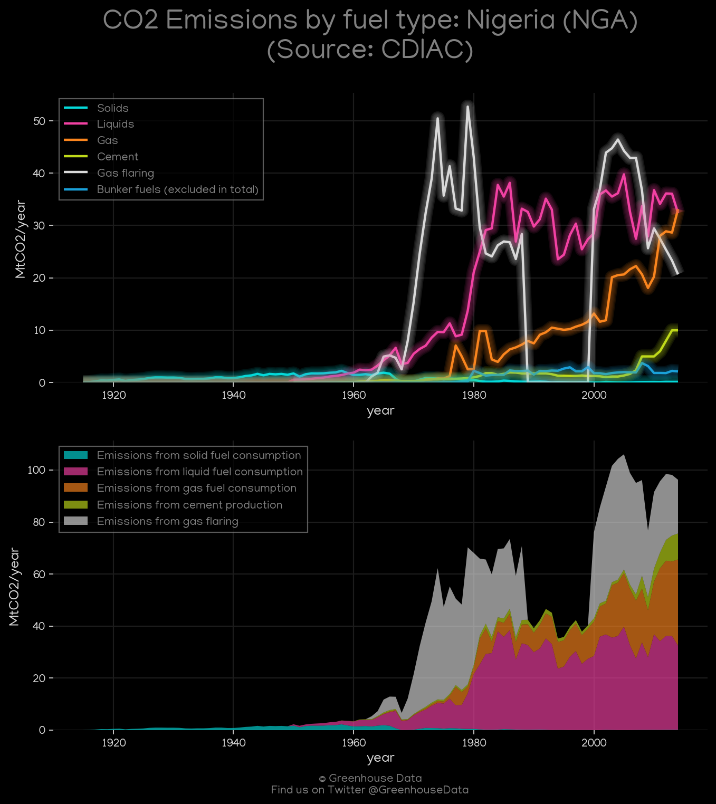
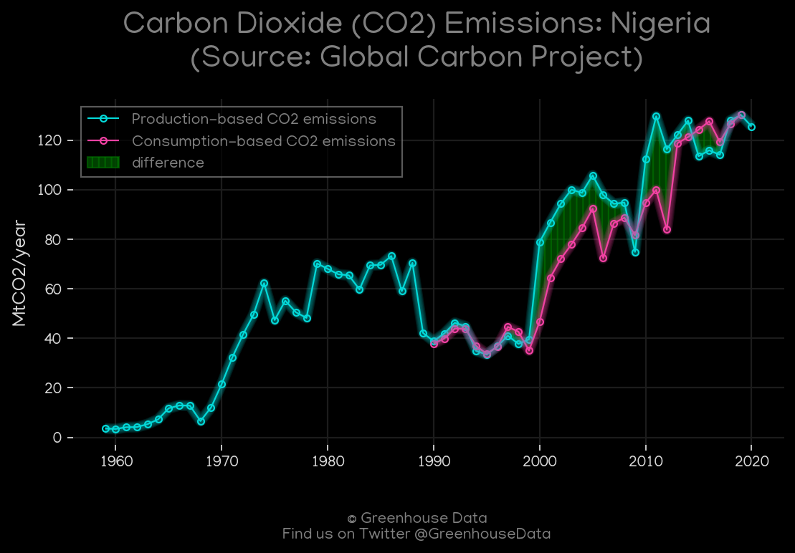
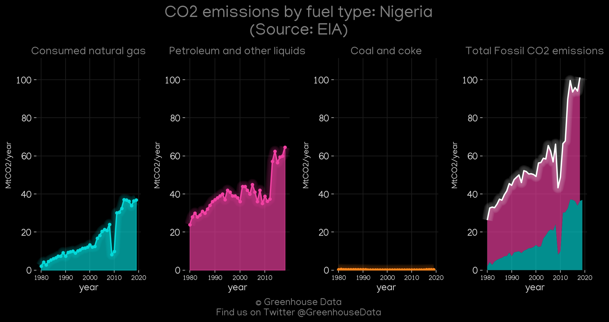
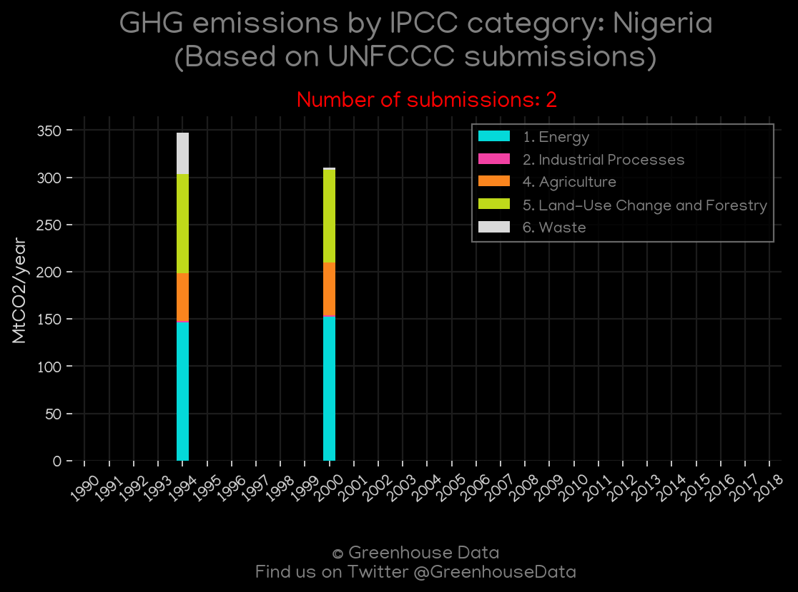
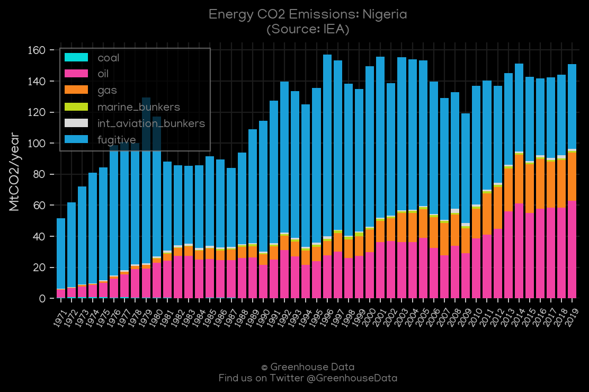
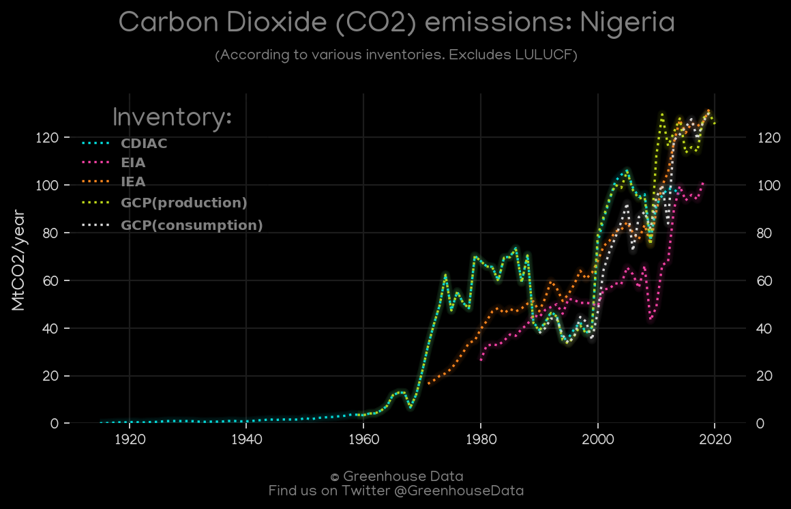
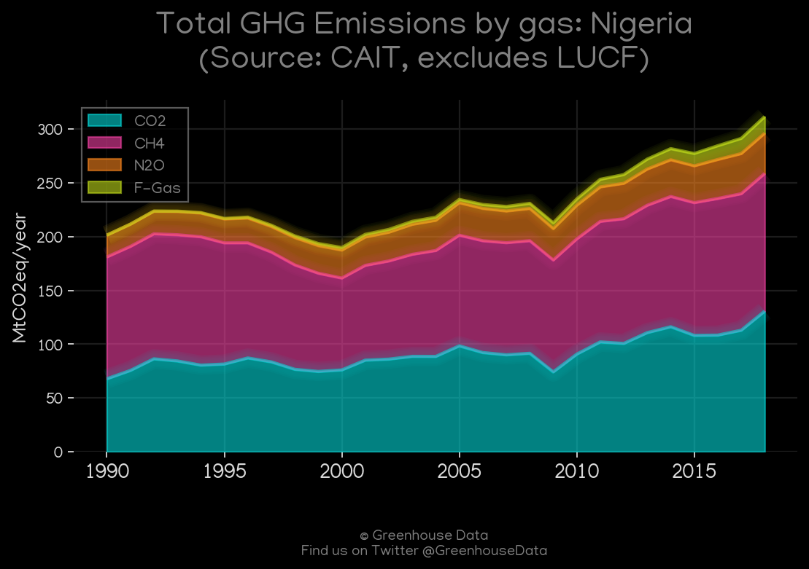
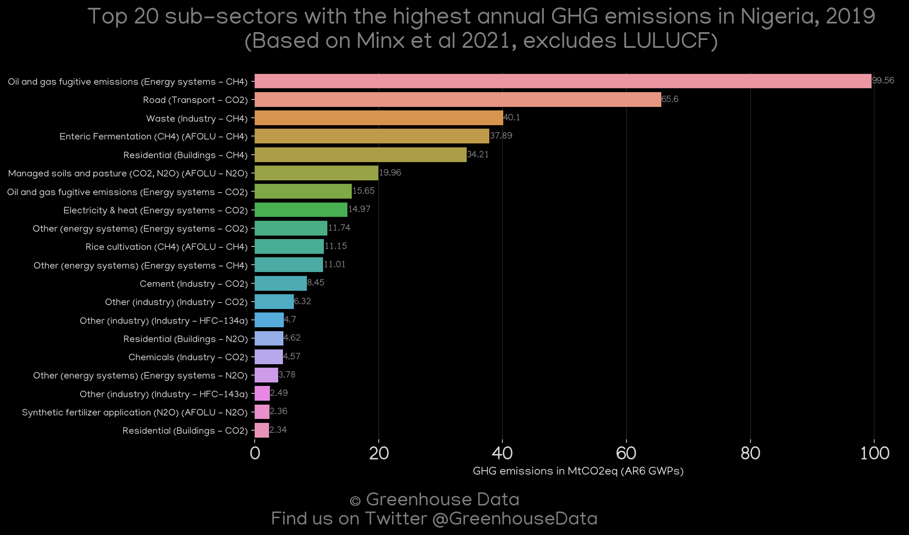

<h1 align="center">
🇳🇬🇳🇬🇳🇬🇳🇬🇳🇬
 
Nigeria
 
🇳🇬🇳🇬🇳🇬🇳🇬🇳🇬
</h1>
<h2>Datasets:</h2>

<a href="https://github.com/dquintani/GreenhouseData/tree/master/country_data/NGA_Nigeria/data">View on Github</a>
 

<a href="data/NGA_CAIT.csv">CAIT</a> || <a href="data/NGA_FAO.csv">FAO</a> || <a href="data/NGA_EDGAR.csv">EDGAR</a> || <a href="data/NGA_GCP_consupmption.csv">GCP_consupmption</a> || <a href="data/NGA_CDIAC.csv">CDIAC</a> || <a href="data/NGA_PRIMAP-hist.csv">PRIMAP-hist</a> || <a href="data/NGA_EIA.csv">EIA</a> || <a href="data/NGA_GCP.csv">GCP</a> || <a href="data/NGA_Minx_2021.csv">Minx_2021</a> || <a href="data/NGA_IEA.csv">IEA</a> || <a href="data/NGA_EPA.csv">EPA</a>

 

<h1>Figures:</h1><h2>#1 (NGA_CDIAC_1)</h2>

<h2>#2 (NGA_GCP_1)</h2>

<h2>#3 (NGA_EIA_1)</h2>

<h2>#4 (NGA_UNFCCC_NAI_1)</h2>

<h2>#5 (NGA_IEA_1)</h2>

<h2>#6 (NGA_CO2_totals)</h2>

<h2>#7 (NGA_CAIT_gases_1)</h2>

<h2>#8 (NGA_Minx_top20_subsectors)</h2>

