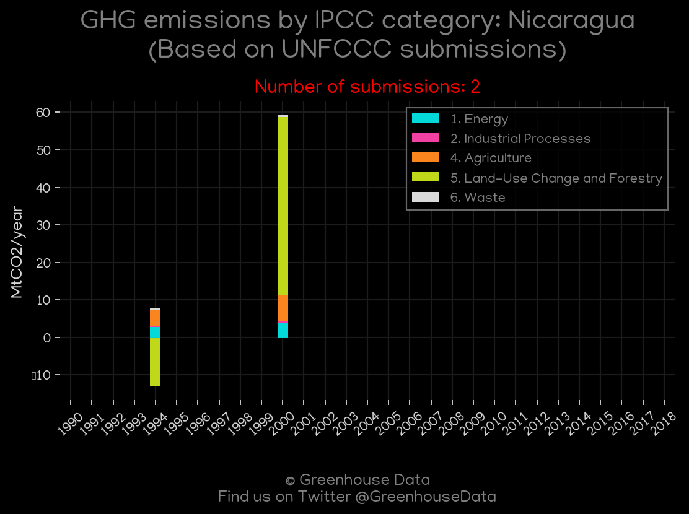
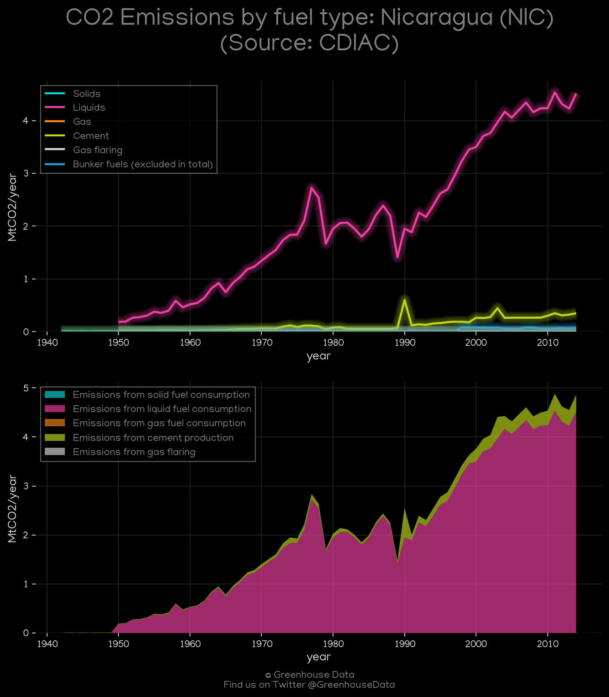
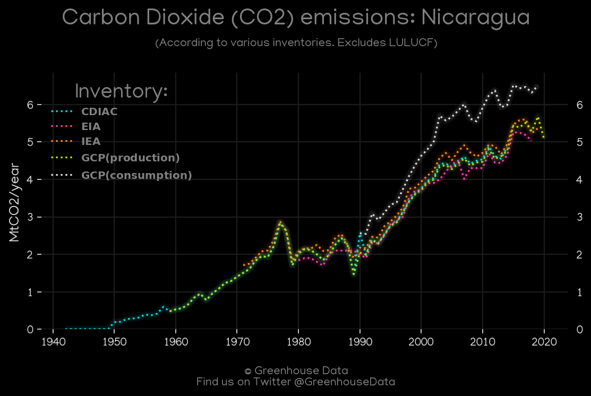
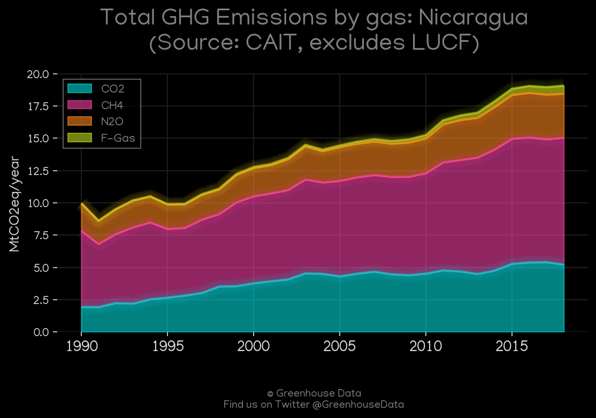
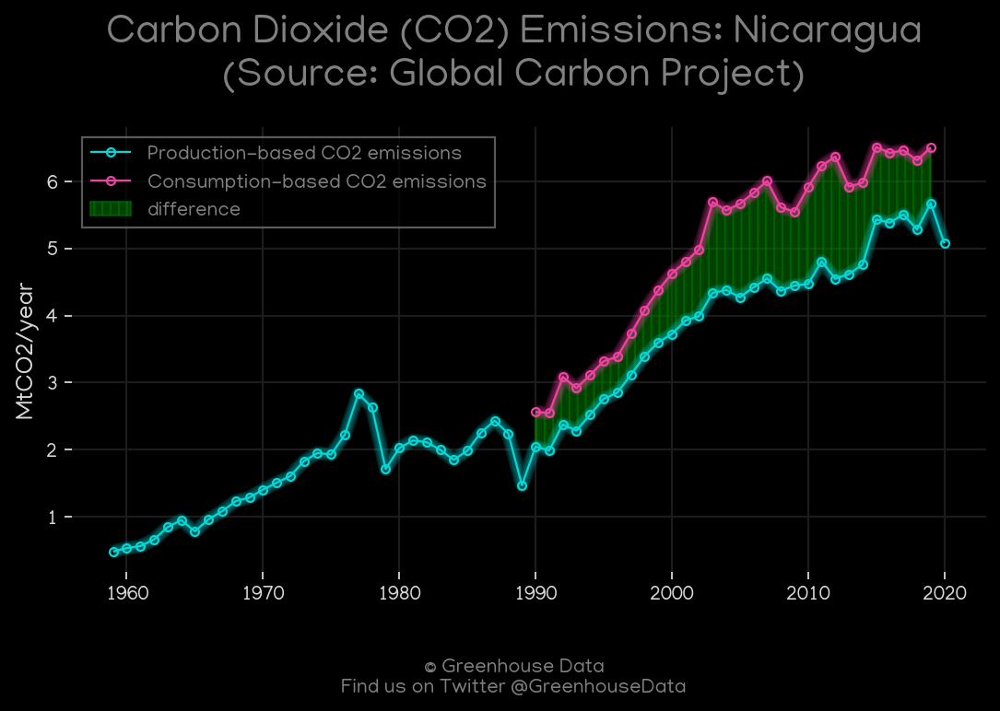
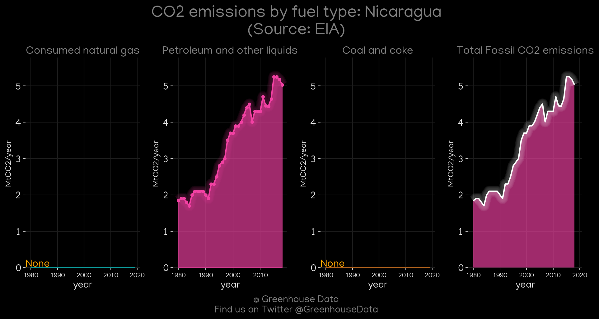
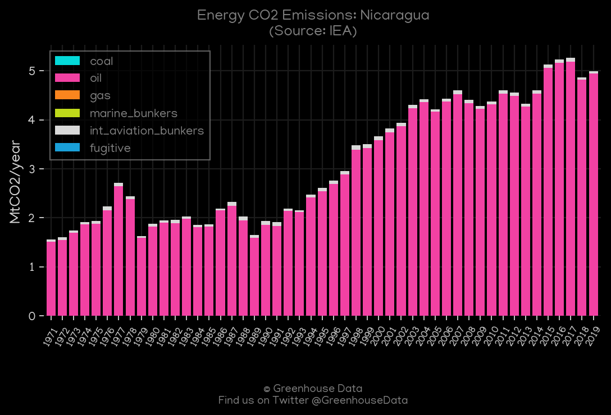
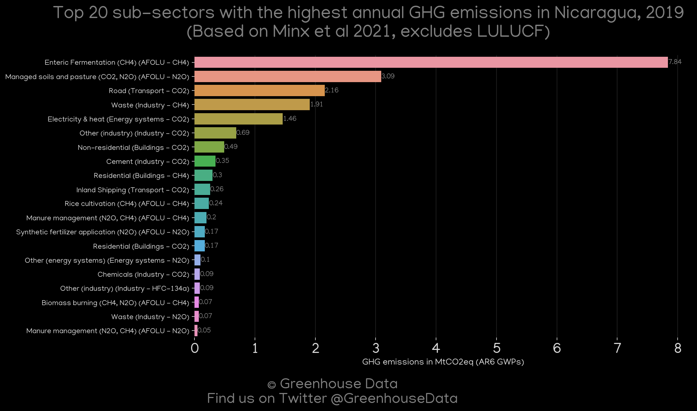
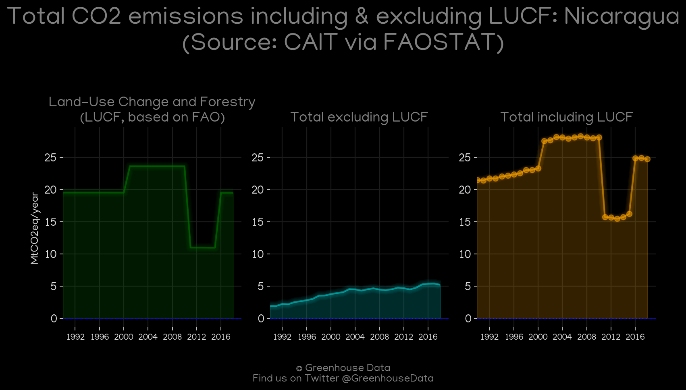

<h1 align="center">
🇳🇮🇳🇮🇳🇮🇳🇮🇳🇮
 
Nicaragua
 
🇳🇮🇳🇮🇳🇮🇳🇮🇳🇮
</h1>
<h2>Datasets:</h2>

<a href="https://github.com/dquintani/GreenhouseData/tree/master/country_data/NIC_Nicaragua/data">View on Github</a>
 

<a href="data/NIC_EIA.csv">EIA</a> || <a href="data/NIC_EDGAR.csv">EDGAR</a> || <a href="data/NIC_FAO.csv">FAO</a> || <a href="data/NIC_GCP_consupmption.csv">GCP_consupmption</a> || <a href="data/NIC_PRIMAP-hist.csv">PRIMAP-hist</a> || <a href="data/NIC_EPA.csv">EPA</a> || <a href="data/NIC_CDIAC.csv">CDIAC</a> || <a href="data/NIC_Minx_2021.csv">Minx_2021</a> || <a href="data/NIC_IEA.csv">IEA</a> || <a href="data/NIC_GCP.csv">GCP</a> || <a href="data/NIC_CAIT.csv">CAIT</a>

 

<h1>Figures:</h1><h2>#1 (NIC_UNFCCC_NAI_1)</h2>

<h2>#2 (NIC_CDIAC_1)</h2>

<h2>#3 (NIC_CO2_totals)</h2>

<h2>#4 (NIC_GCP_Country_Highlight)</h2>

<h2>#5 (NIC_CAIT_gases_1)</h2>

<h2>#6 (NIC_GCP_1)</h2>

<h2>#7 (NIC_EIA_1)</h2>

<h2>#8 (NIC_IEA_1)</h2>

<h2>#9 (NIC_Minx_top20_subsectors)</h2>

<h2>#10 (NIC_CAIT_lucf_vs_nolucf)</h2>

