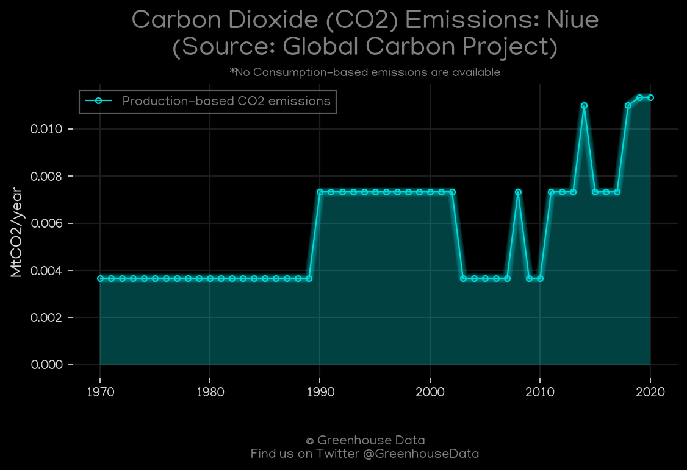
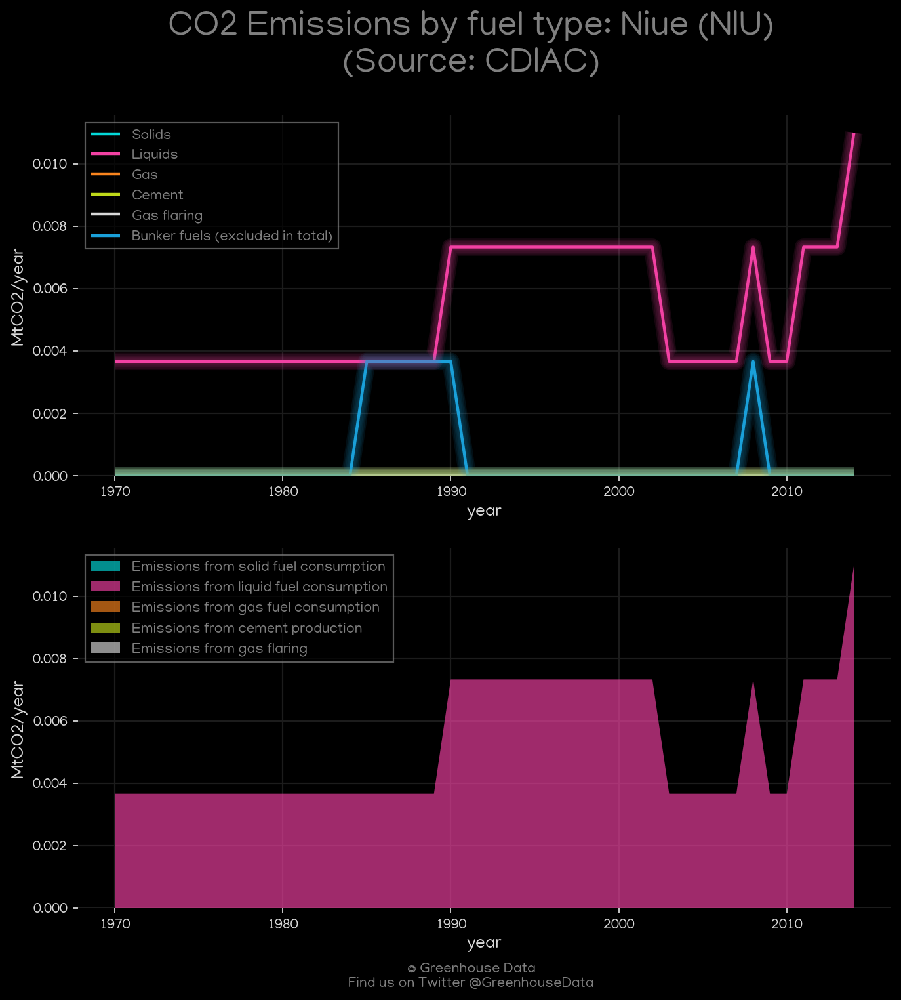
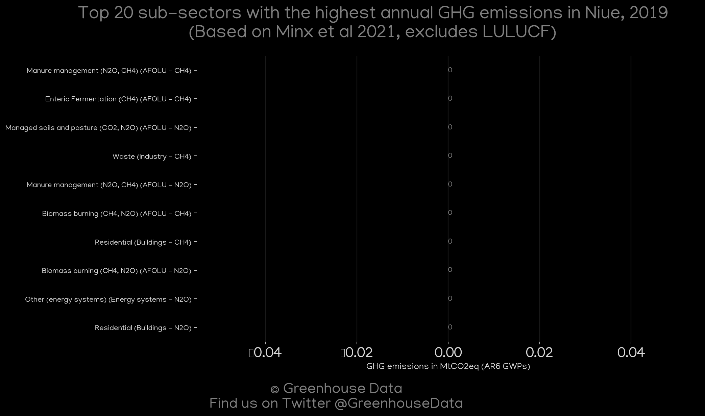
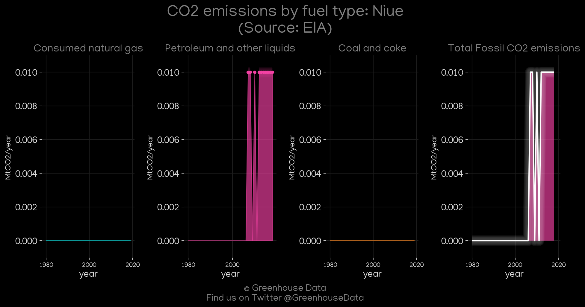
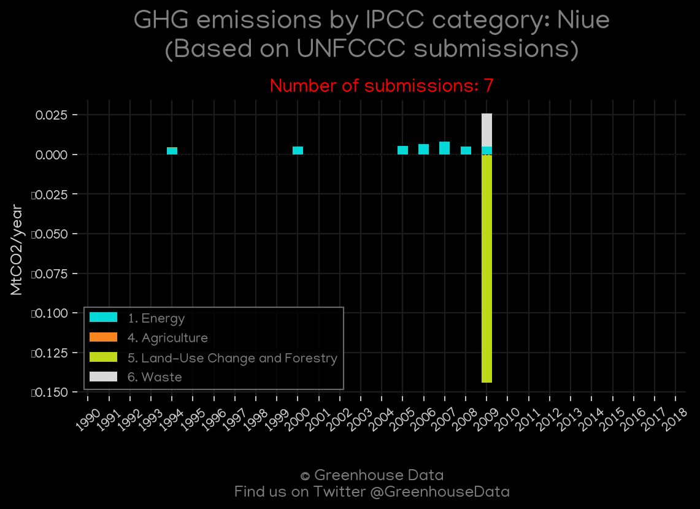
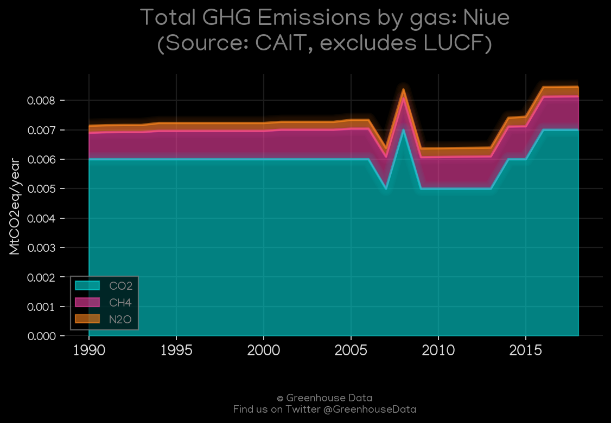
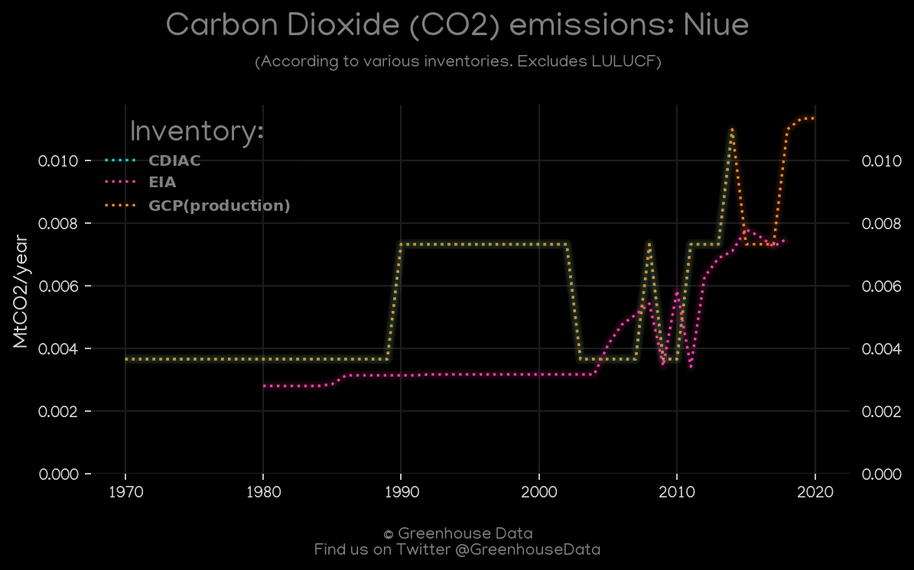

<h1 align="center">
🇳🇺🇳🇺🇳🇺🇳🇺🇳🇺
 
Niue
 
🇳🇺🇳🇺🇳🇺🇳🇺🇳🇺
</h1>
<h2>Datasets:</h2>

<a href="https://github.com/dquintani/GreenhouseData/tree/master/country_data/NIU_Niue/data">View on Github</a>
 

<a href="data/NIU_CDIAC.csv">CDIAC</a> || <a href="data/NIU_FAO.csv">FAO</a> || <a href="data/NIU_CAIT.csv">CAIT</a> || <a href="data/NIU_PRIMAP-hist.csv">PRIMAP-hist</a> || <a href="data/NIU_EDGAR.csv">EDGAR</a> || <a href="data/NIU_GCP.csv">GCP</a> || <a href="data/NIU_GCP_consupmption.csv">GCP_consupmption</a> || <a href="data/NIU_EIA.csv">EIA</a> || <a href="data/NIU_Minx_2021.csv">Minx_2021</a> || <a href="data/NIU_GCP_cons.csv">GCP_cons</a>

 

<h1>Figures:</h1><h2>#1 (NIU_GCP_1)</h2>

<h2>#2 (NIU_CDIAC_1)</h2>

<h2>#3 (NIU_Minx_top20_subsectors)</h2>

<h2>#4 (NIU_EIA_1)</h2>

<h2>#5 (NIU_UNFCCC_NAI_1)</h2>

<h2>#6 (NIU_CAIT_gases_1)</h2>

<h2>#7 (NIU_BP_1)</h2>

<h2>#8 (NIU_CO2_totals)</h2>

