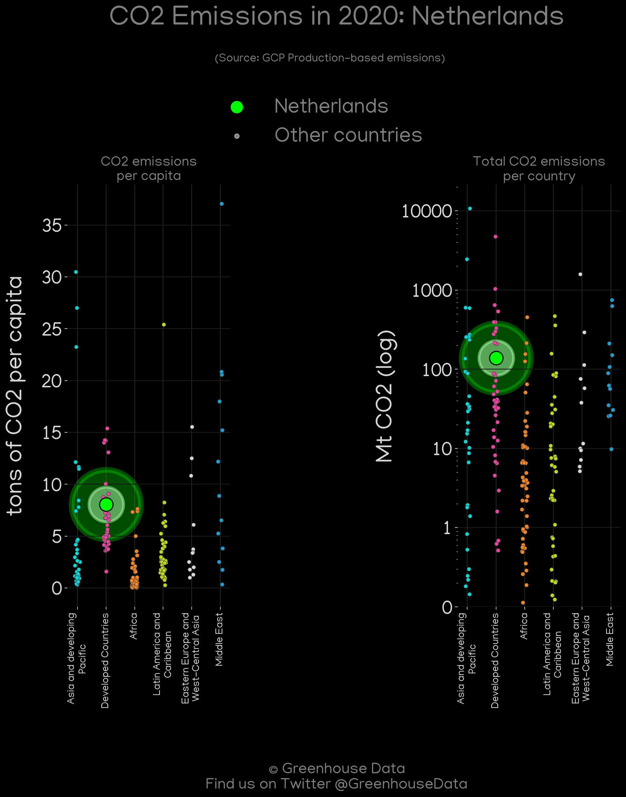
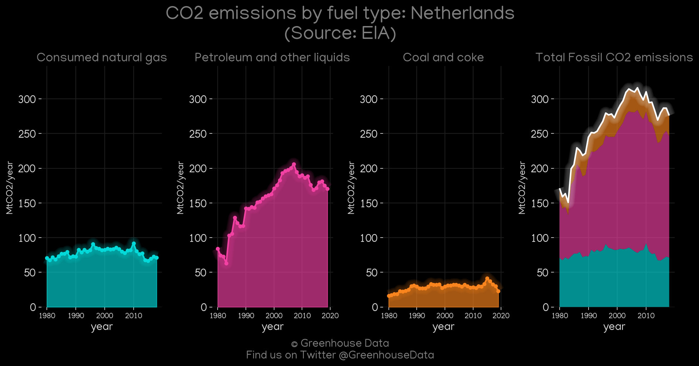
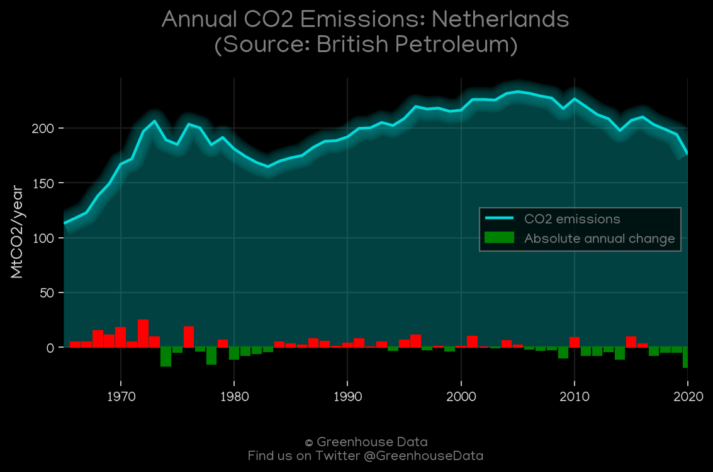
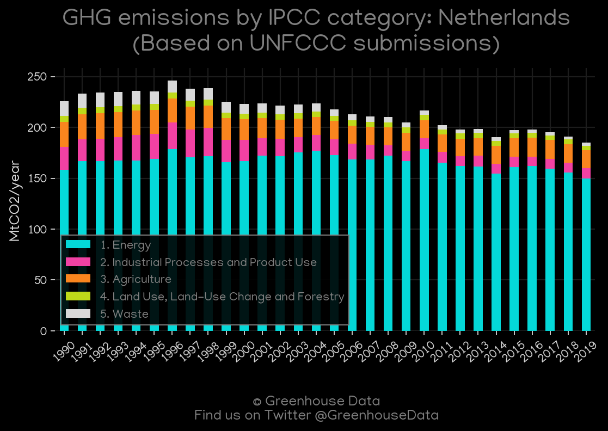
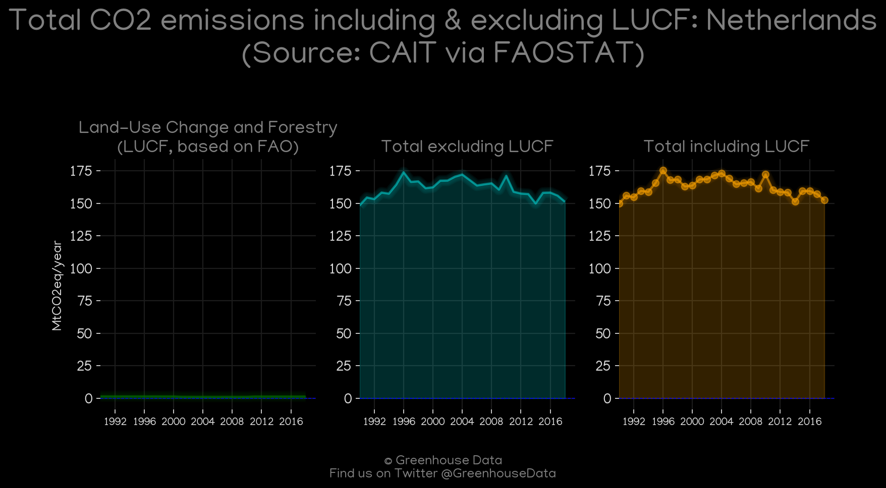
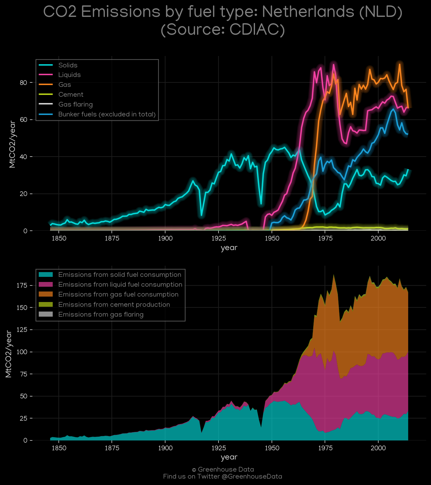
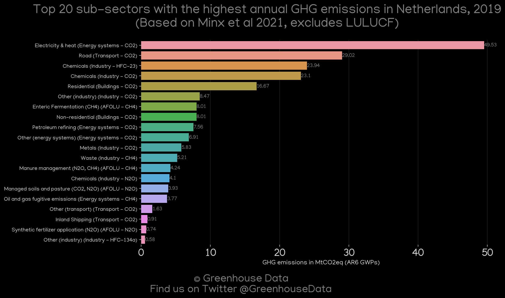
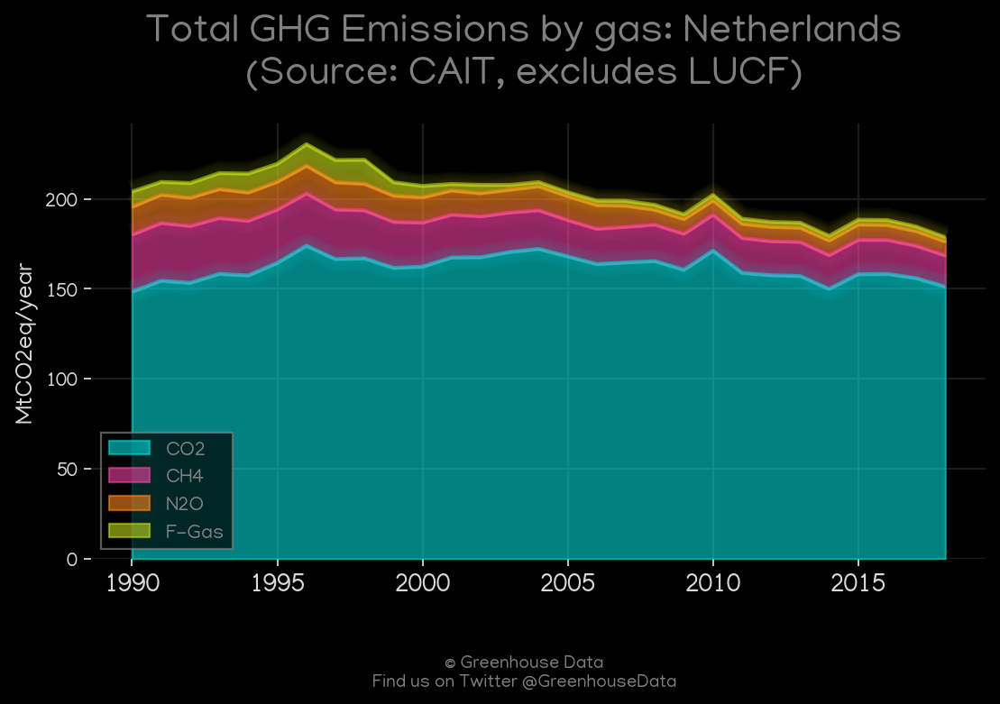
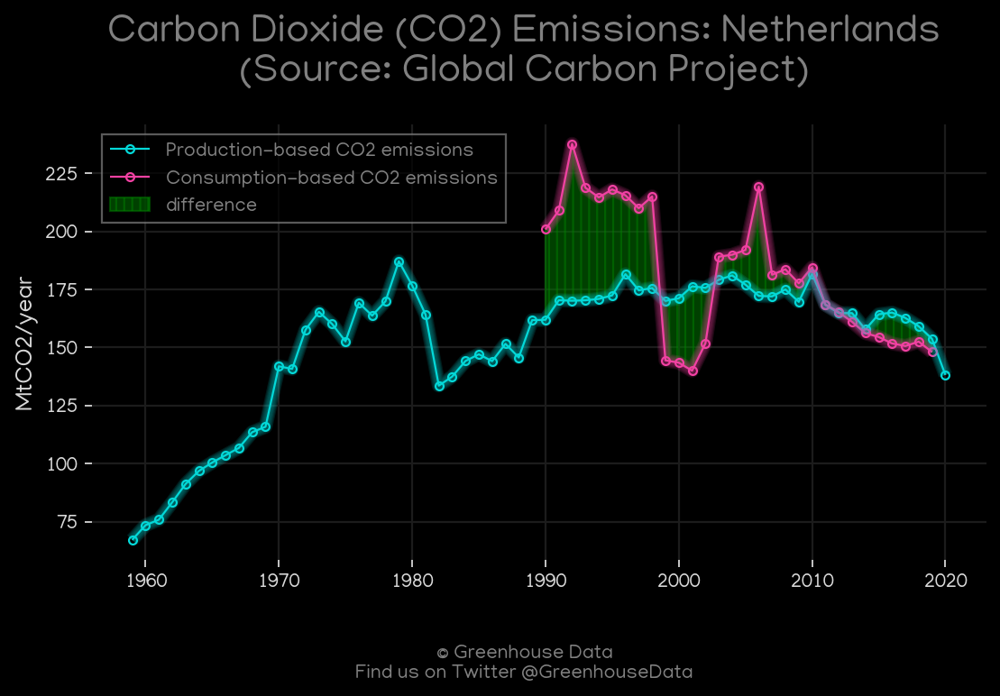
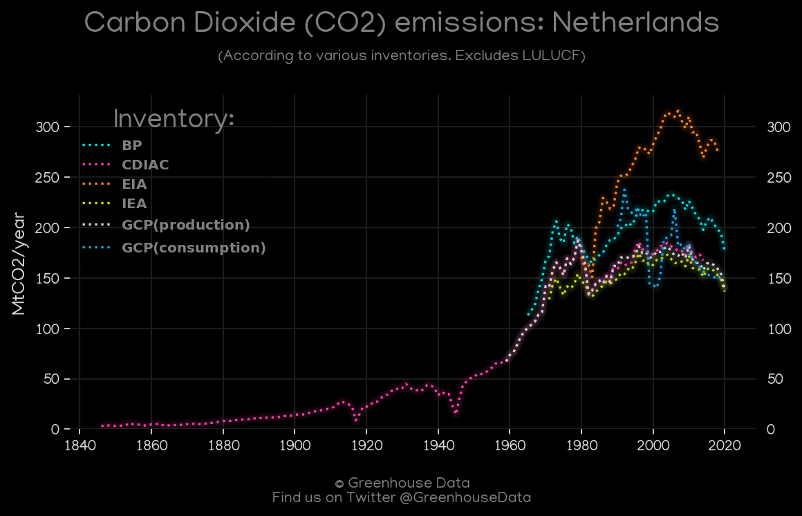

<h1 align="center">
🇳🇱🇳🇱🇳🇱🇳🇱🇳🇱
 
Netherlands
 
🇳🇱🇳🇱🇳🇱🇳🇱🇳🇱
</h1>
<h2>Datasets:</h2>

<a href="https://github.com/dquintani/GreenhouseData/tree/master/country_data/NLD_Netherlands/data">View on Github</a>
 

<a href="data/NLD_PRIMAP-hist.csv">PRIMAP-hist</a> || <a href="data/NLD_FAO.csv">FAO</a> || <a href="data/NLD_EIA.csv">EIA</a> || <a href="data/NLD_IEA.csv">IEA</a> || <a href="data/NLD_EDGAR.csv">EDGAR</a> || <a href="data/NLD_Minx_2021.csv">Minx_2021</a> || <a href="data/NLD_GCP.csv">GCP</a> || <a href="data/NLD_BP.csv">BP</a> || <a href="data/NLD_CAIT.csv">CAIT</a> || <a href="data/NLD_CDIAC.csv">CDIAC</a> || <a href="data/NLD_GCP_consupmption.csv">GCP_consupmption</a> || <a href="data/NLD_EPA.csv">EPA</a>

 

<h1>Figures:</h1><h2>#1 (NLD_GCP_Country_Highlight)</h2>

<h2>#2 (NLD_EIA_1)</h2>

<h2>#3 (NLD_BP_1)</h2>

<h2>#4 (NLD_UNFCCC_AI_1)</h2>

<h2>#5 (NLD_CAIT_lucf_vs_nolucf)</h2>

<h2>#6 (NLD_CDIAC_1)</h2>

<h2>#7 (NLD_Minx_top20_subsectors)</h2>

<h2>#8 (NLD_CAIT_gases_1)</h2>

<h2>#9 (NLD_IEA_1)</h2>

<h2>#10 (NLD_GCP_1)</h2>

<h2>#11 (NLD_relative_totals)</h2>

<h2>#12 (NLD_CO2_totals)</h2>

