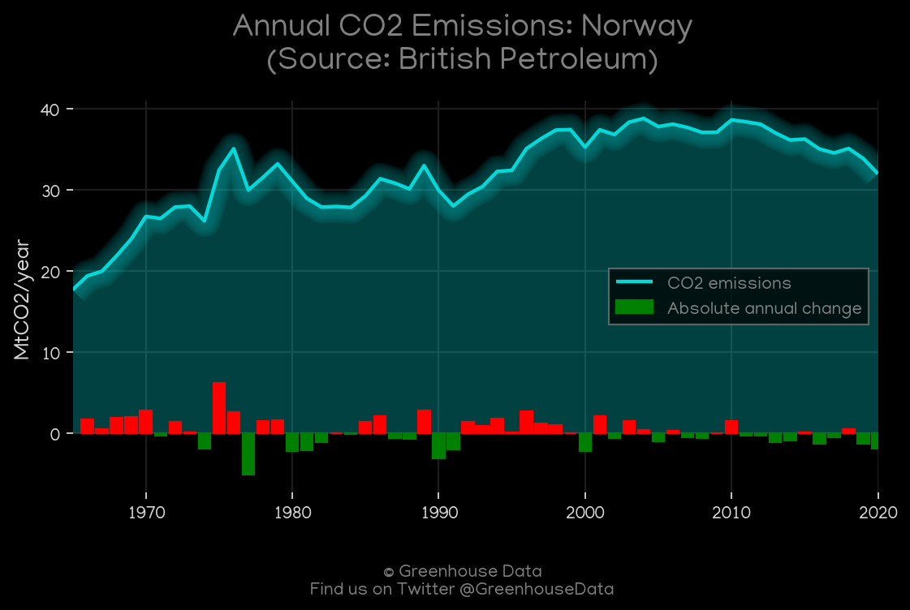
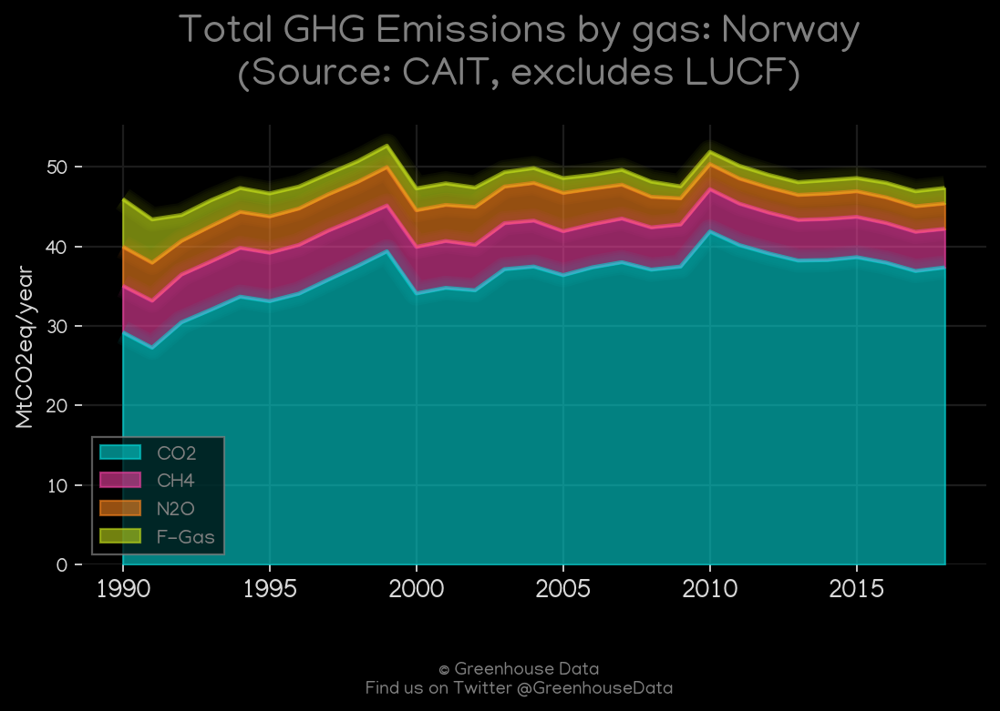
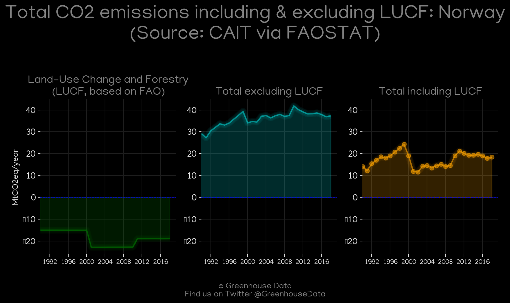
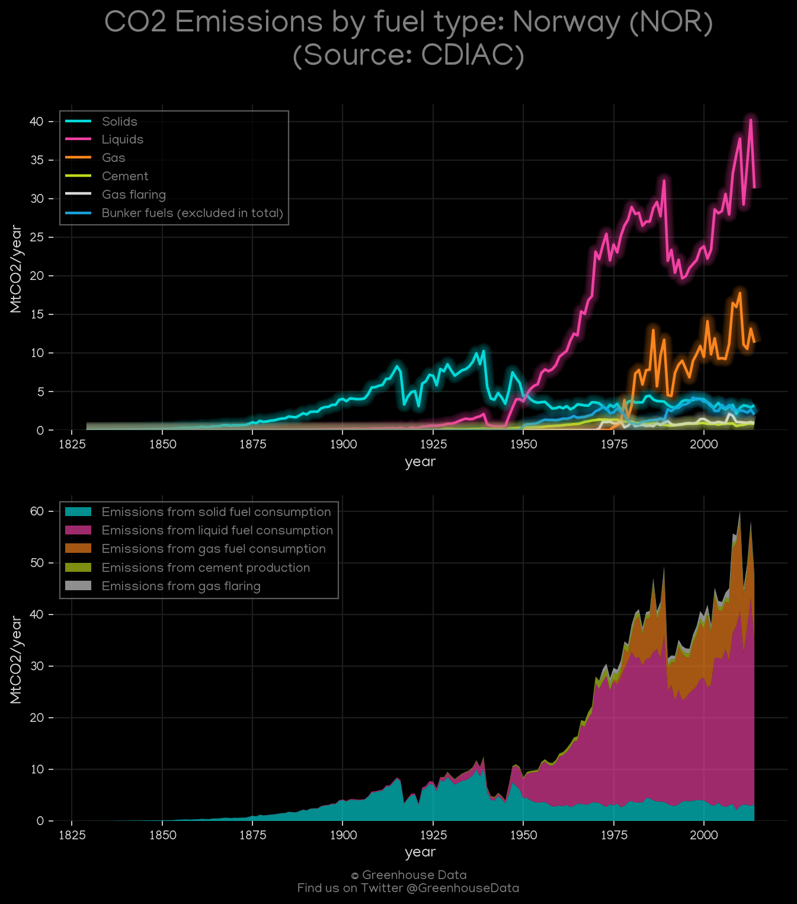
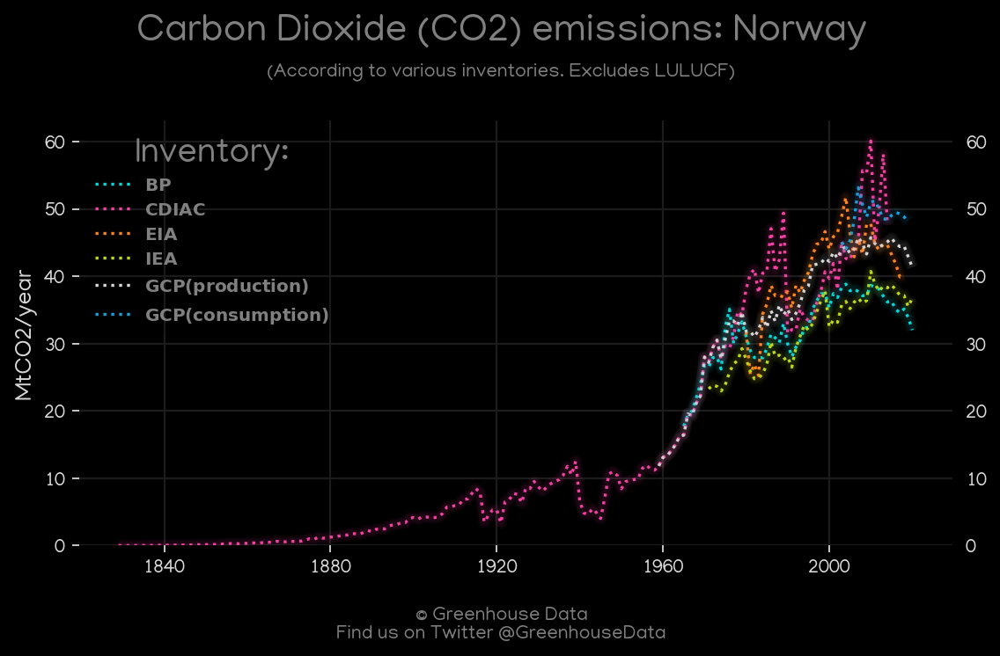
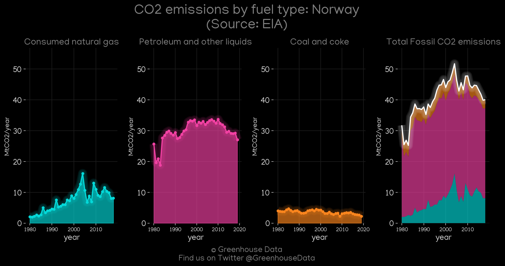
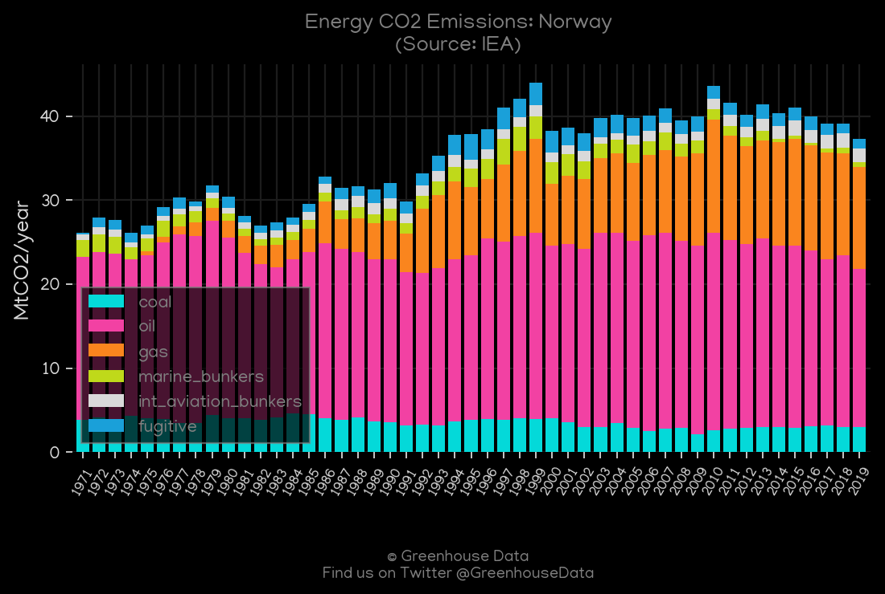
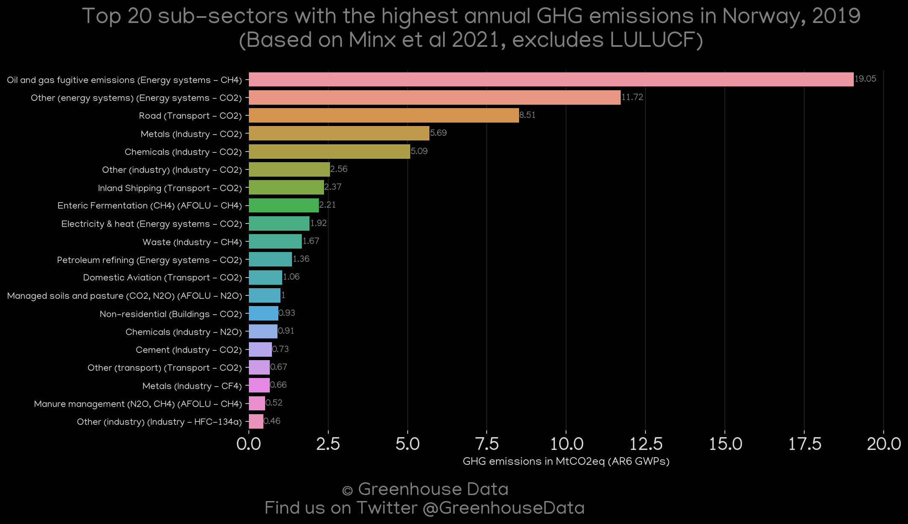
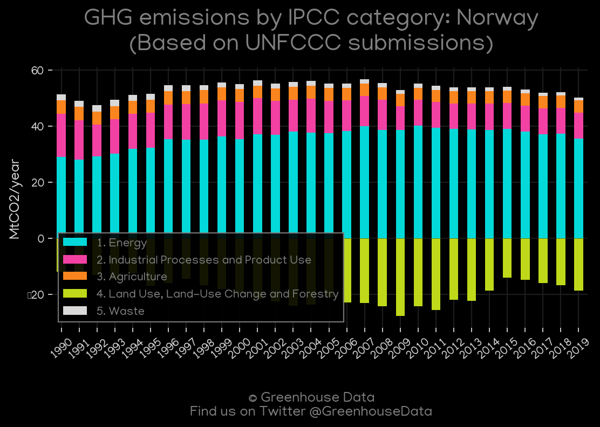

<h1 align="center">
🇳🇴🇳🇴🇳🇴🇳🇴🇳🇴
 
Norway
 
🇳🇴🇳🇴🇳🇴🇳🇴🇳🇴
</h1>
<h2>Datasets:</h2>

<a href="https://github.com/dquintani/GreenhouseData/tree/master/country_data/NOR_Norway/data">View on Github</a>
 

<a href="data/NOR_BP.csv">BP</a> || <a href="data/NOR_CAIT.csv">CAIT</a> || <a href="data/NOR_CDIAC.csv">CDIAC</a> || <a href="data/NOR_EDGAR.csv">EDGAR</a> || <a href="data/NOR_EIA.csv">EIA</a> || <a href="data/NOR_EPA.csv">EPA</a> || <a href="data/NOR_FAO.csv">FAO</a> || <a href="data/NOR_GCP.csv">GCP</a> || <a href="data/NOR_GCP_consupmption.csv">GCP_consupmption</a> || <a href="data/NOR_IEA.csv">IEA</a> || <a href="data/NOR_Minx_2021.csv">Minx_2021</a> || <a href="data/NOR_PRIMAP-hist.csv">PRIMAP-hist</a>

 

<h1>Figures:</h1><h2>#1 (NOR_BP_1)</h2>

<h2>#2 (NOR_CAIT_gases_1)</h2>

<h2>#3 (NOR_CAIT_lucf_vs_nolucf)</h2>

<h2>#4 (NOR_CDIAC_1)</h2>

<h2>#5 (NOR_CO2_totals)</h2>

<h2>#6 (NOR_EIA_1)</h2>

<h2>#7 (NOR_GCP_1)</h2>

<h2>#8 (NOR_GCP_Country_Highlight)</h2>

<h2>#9 (NOR_IEA_1)</h2>

<h2>#10 (NOR_Minx_top20_subsectors)</h2>

<h2>#11 (NOR_relative_totals)</h2>

<h2>#12 (NOR_UNFCCC_AI_1)</h2>

