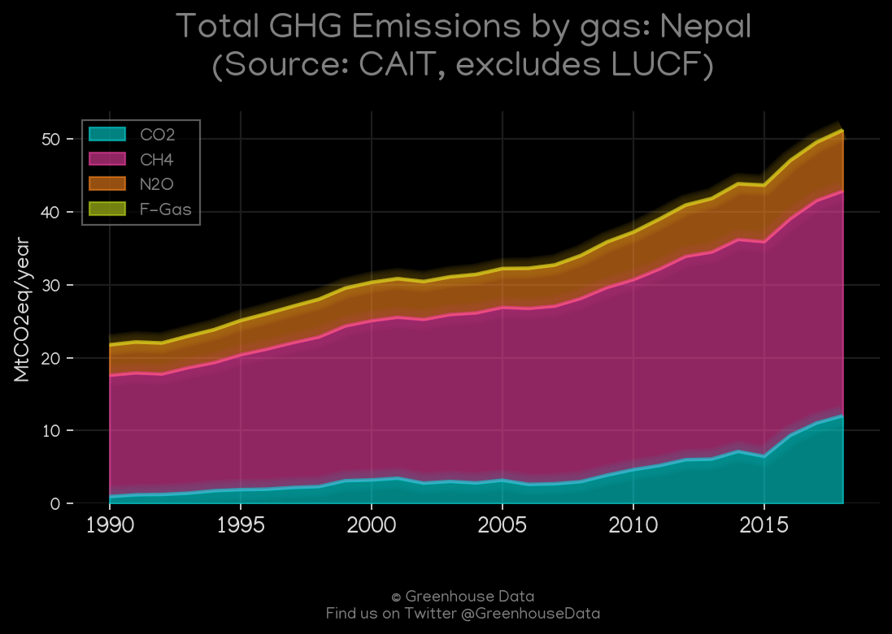
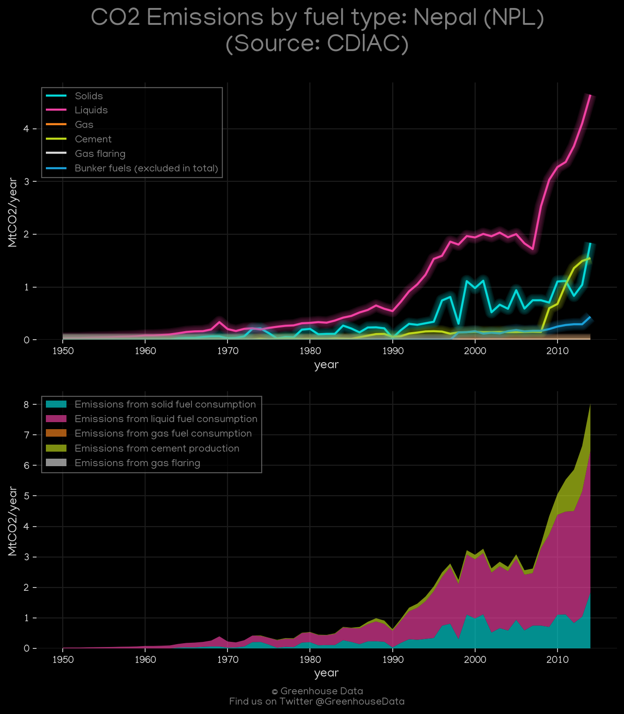
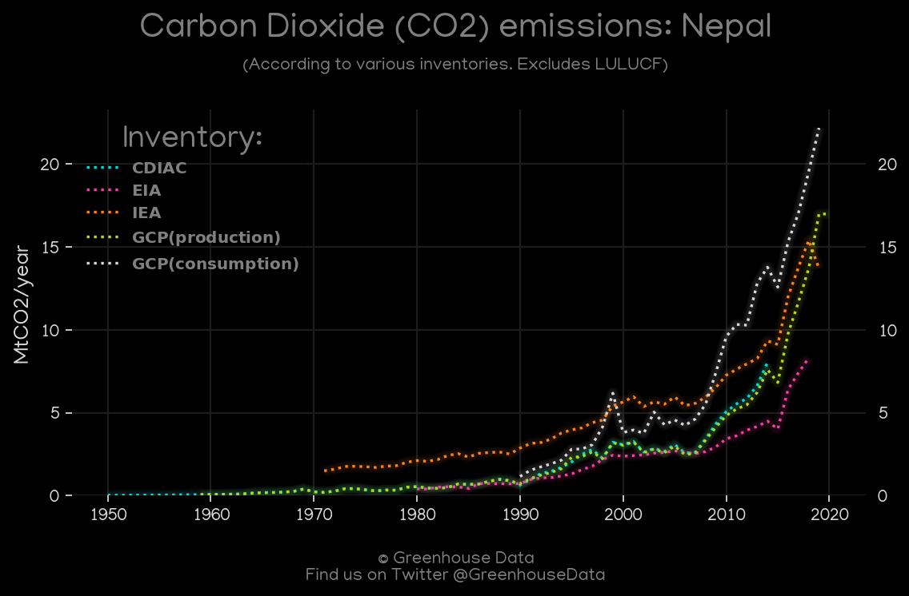
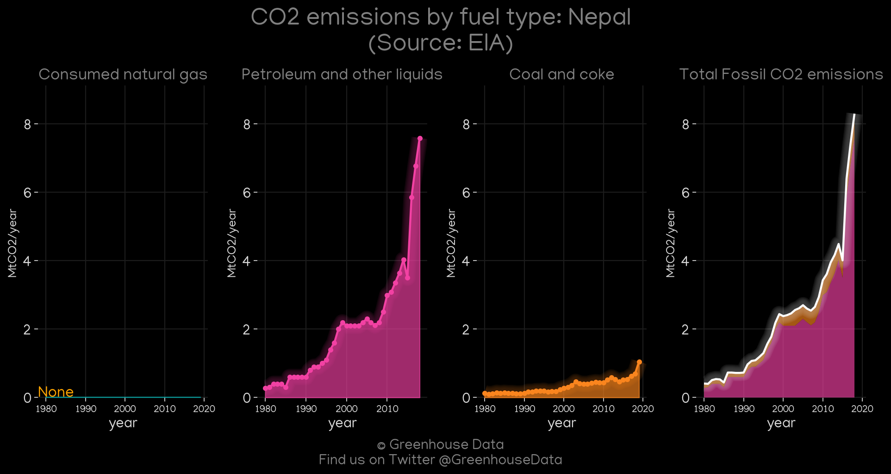
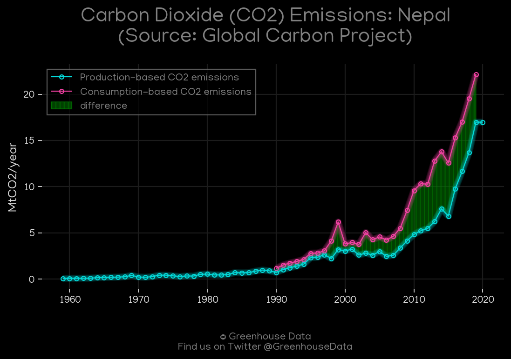
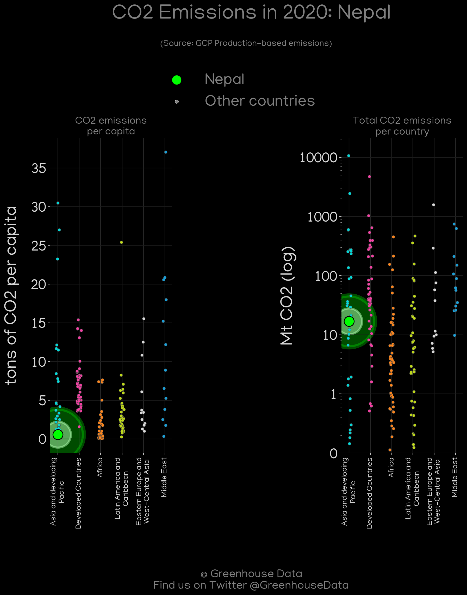
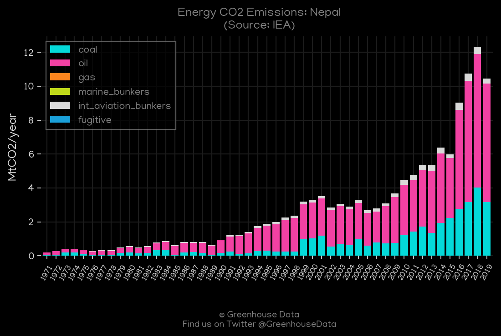
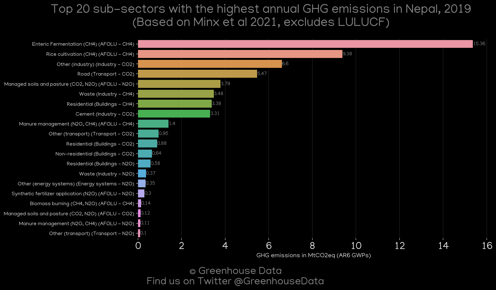
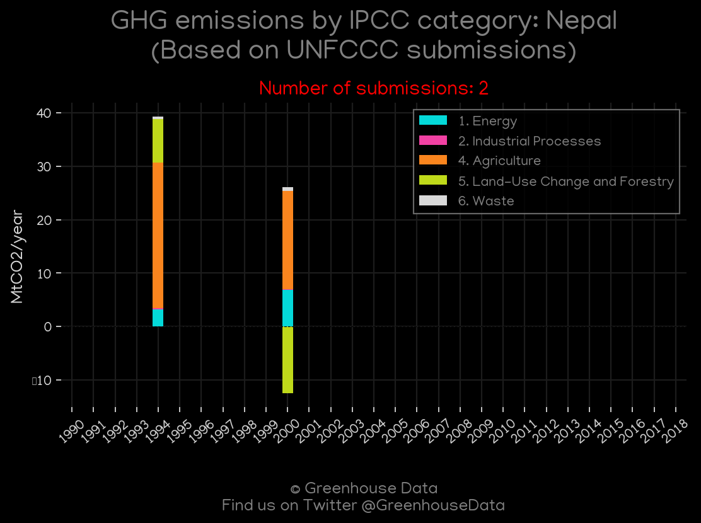

<h1 align="center">
🇳🇵🇳🇵🇳🇵🇳🇵🇳🇵
 
Nepal
 
🇳🇵🇳🇵🇳🇵🇳🇵🇳🇵
</h1>
<h2>Datasets:</h2>

<a href="https://github.com/dquintani/GreenhouseData/tree/master/country_data/NPL_Nepal/data">View on Github</a>
 

<a href="data/NPL_CAIT.csv">CAIT</a> || <a href="data/NPL_CDIAC.csv">CDIAC</a> || <a href="data/NPL_EDGAR.csv">EDGAR</a> || <a href="data/NPL_EIA.csv">EIA</a> || <a href="data/NPL_EPA.csv">EPA</a> || <a href="data/NPL_FAO.csv">FAO</a> || <a href="data/NPL_GCP.csv">GCP</a> || <a href="data/NPL_GCP_consupmption.csv">GCP_consupmption</a> || <a href="data/NPL_IEA.csv">IEA</a> || <a href="data/NPL_Minx_2021.csv">Minx_2021</a> || <a href="data/NPL_PRIMAP-hist.csv">PRIMAP-hist</a>

 

<h1>Figures:</h1><h2>#1 (NPL_CAIT_gases_1)</h2>

<h2>#2 (NPL_CAIT_lucf_vs_nolucf)</h2>

<h2>#3 (NPL_CDIAC_1)</h2>

<h2>#4 (NPL_CO2_totals)</h2>

<h2>#5 (NPL_EIA_1)</h2>

<h2>#6 (NPL_GCP_1)</h2>

<h2>#7 (NPL_GCP_Country_Highlight)</h2>

<h2>#8 (NPL_IEA_1)</h2>

<h2>#9 (NPL_Minx_top20_subsectors)</h2>

<h2>#10 (NPL_relative_totals)</h2>

<h2>#11 (NPL_UNFCCC_NAI_1)</h2>

