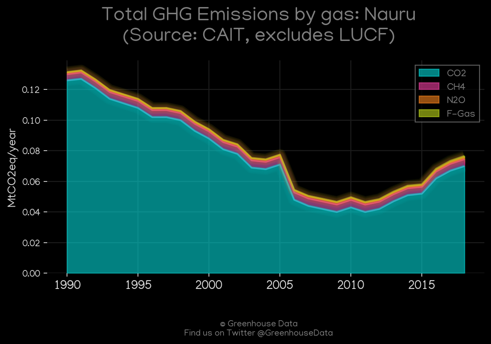
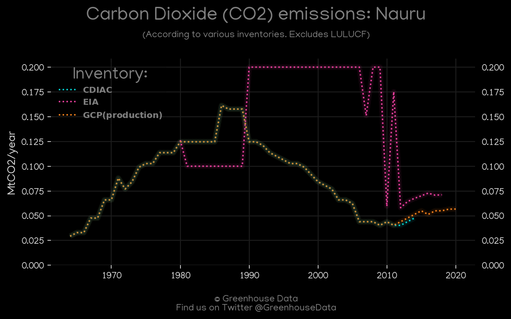
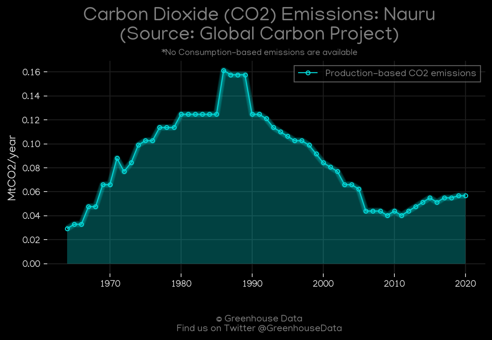
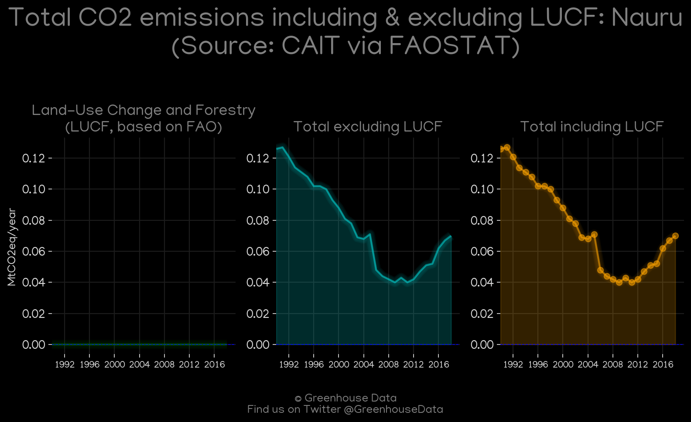
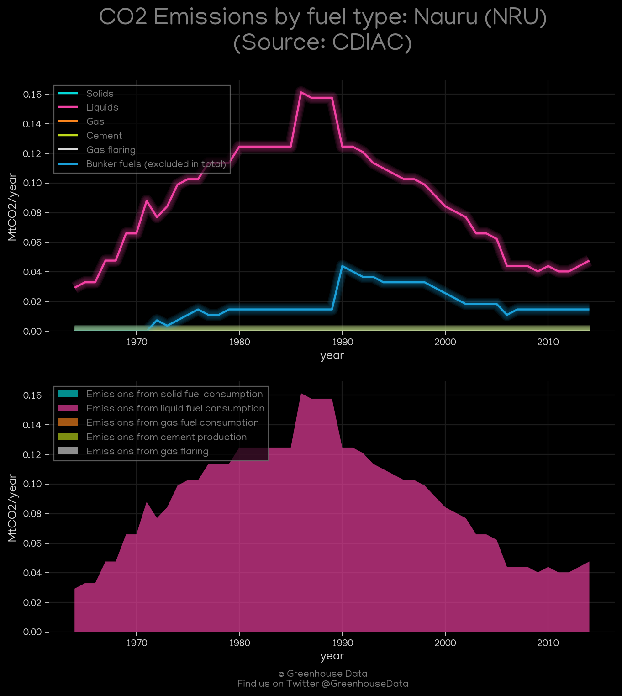
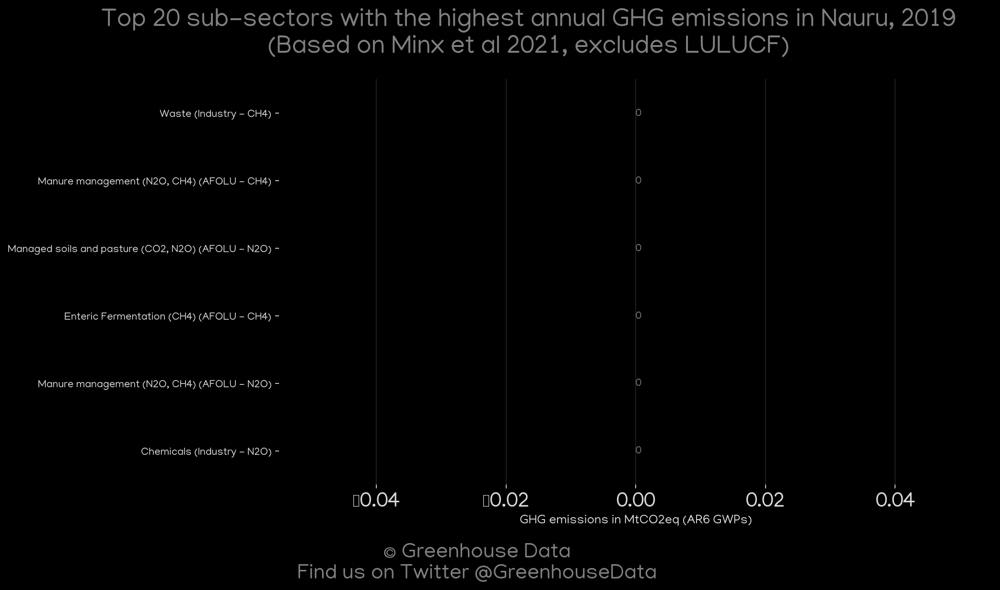

<h1 align="center">
🇳🇷🇳🇷🇳🇷🇳🇷🇳🇷
 
Nauru
 
🇳🇷🇳🇷🇳🇷🇳🇷🇳🇷
</h1>
<h2>Datasets:</h2>

<a href="https://github.com/dquintani/GreenhouseData/tree/master/country_data/NRU_Nauru/data">View on Github</a>
 

<a href="data/NRU_CDIAC.csv">CDIAC</a> || <a href="data/NRU_EPA.csv">EPA</a> || <a href="data/NRU_GCP_consupmption.csv">GCP_consupmption</a> || <a href="data/NRU_GCP.csv">GCP</a> || <a href="data/NRU_CAIT.csv">CAIT</a> || <a href="data/NRU_EDGAR.csv">EDGAR</a> || <a href="data/NRU_Minx_2021.csv">Minx_2021</a> || <a href="data/NRU_PRIMAP-hist.csv">PRIMAP-hist</a> || <a href="data/NRU_EIA.csv">EIA</a> || <a href="data/NRU_FAO.csv">FAO</a>

 

<h1>Figures:</h1><h2>#1 (NRU_CAIT_gases_1)</h2>

<h2>#2 (NRU_CO2_totals)</h2>

<h2>#3 (NRU_UNFCCC_NAI_1)</h2>

<h2>#4 (NRU_relative_totals)</h2>

<h2>#5 (NRU_GCP_Country_Highlight)</h2>

<h2>#6 (NRU_GCP_1)</h2>

<h2>#7 (NRU_CAIT_lucf_vs_nolucf)</h2>

<h2>#8 (NRU_CDIAC_1)</h2>

<h2>#9 (NRU_Minx_top20_subsectors)</h2>

<h2>#10 (NRU_EIA_1)</h2>

