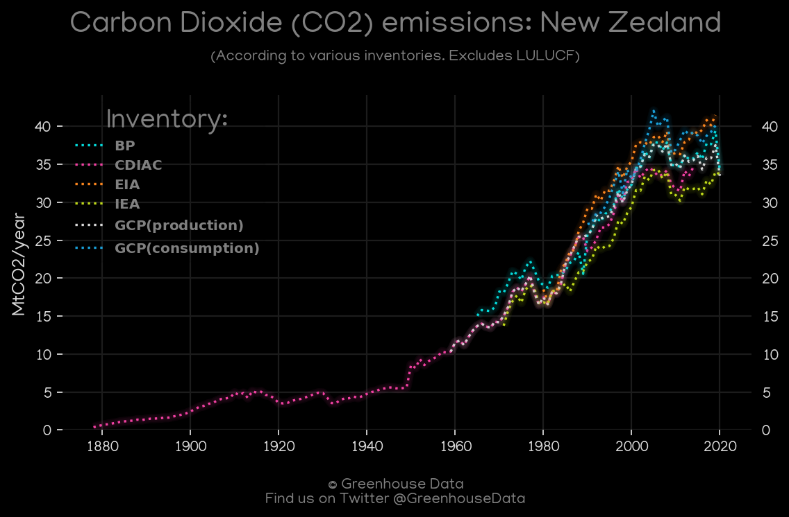
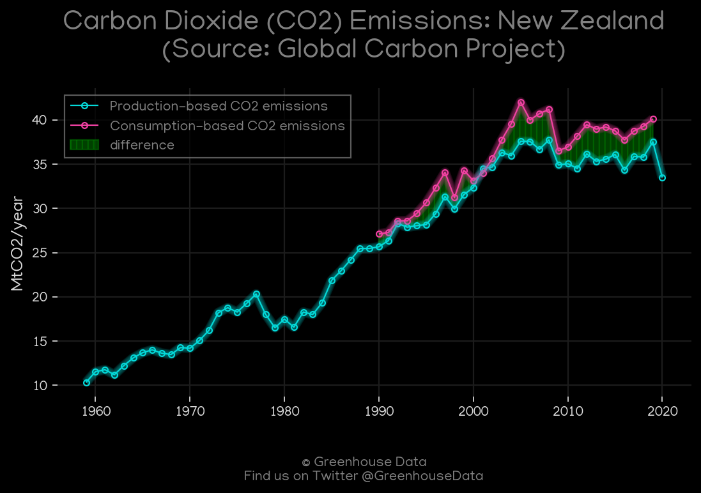
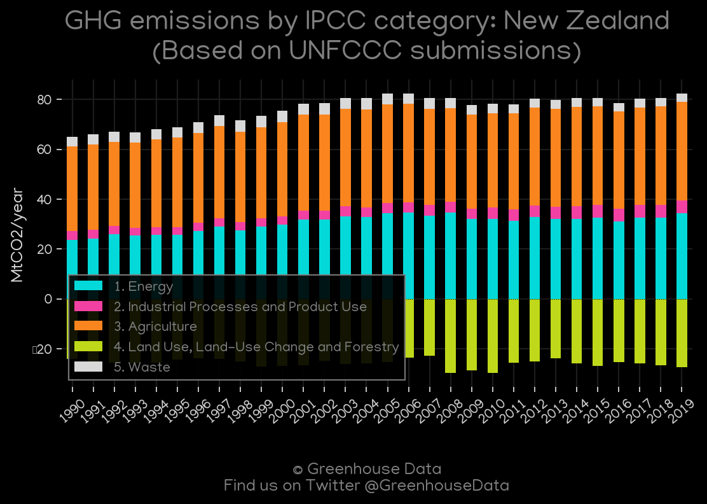
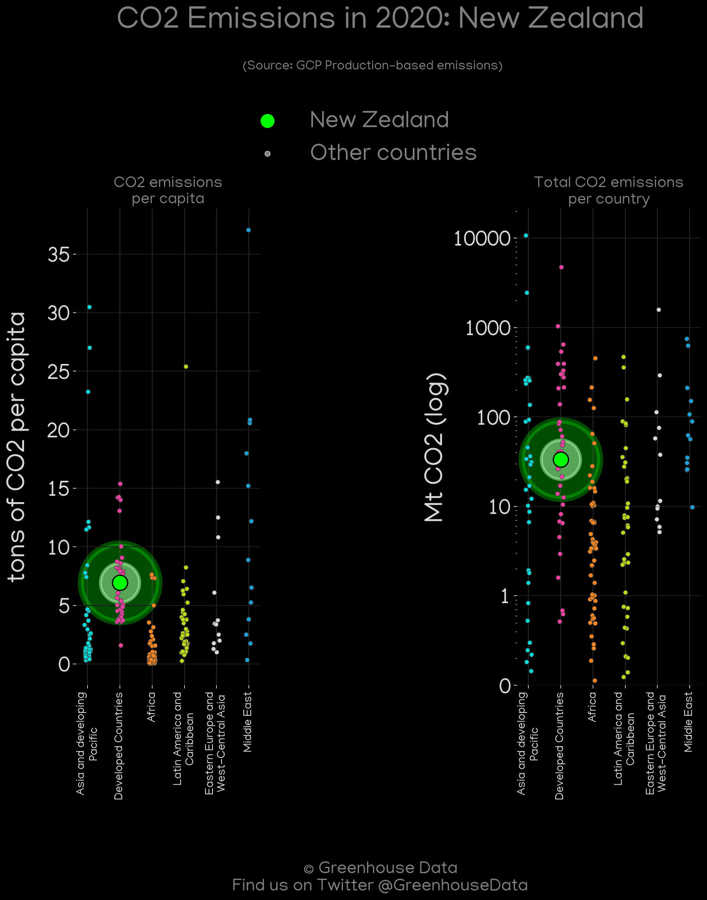
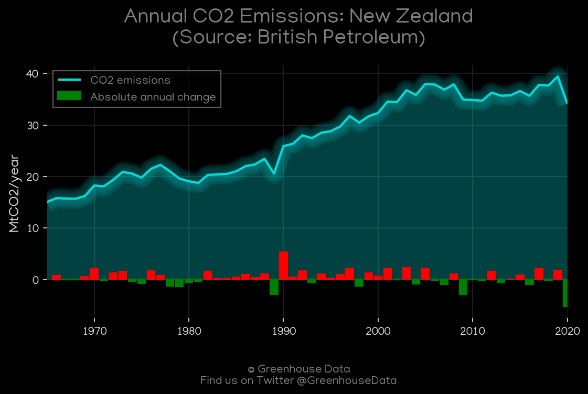
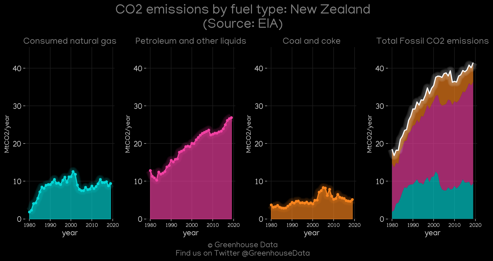
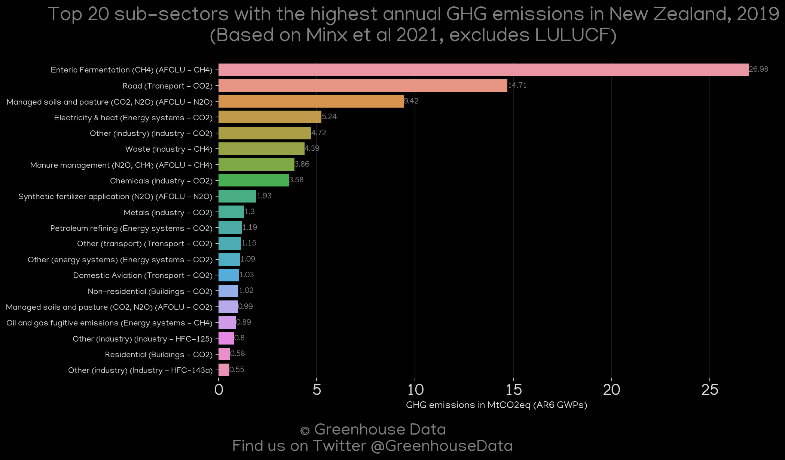
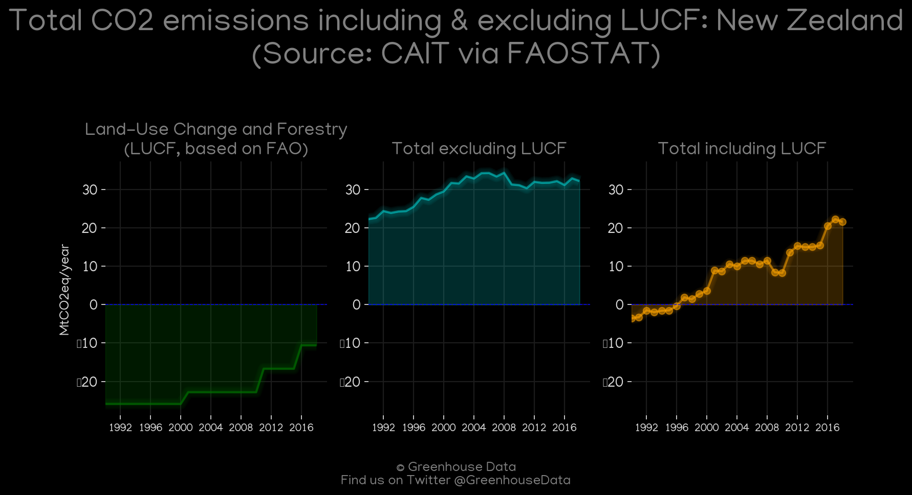
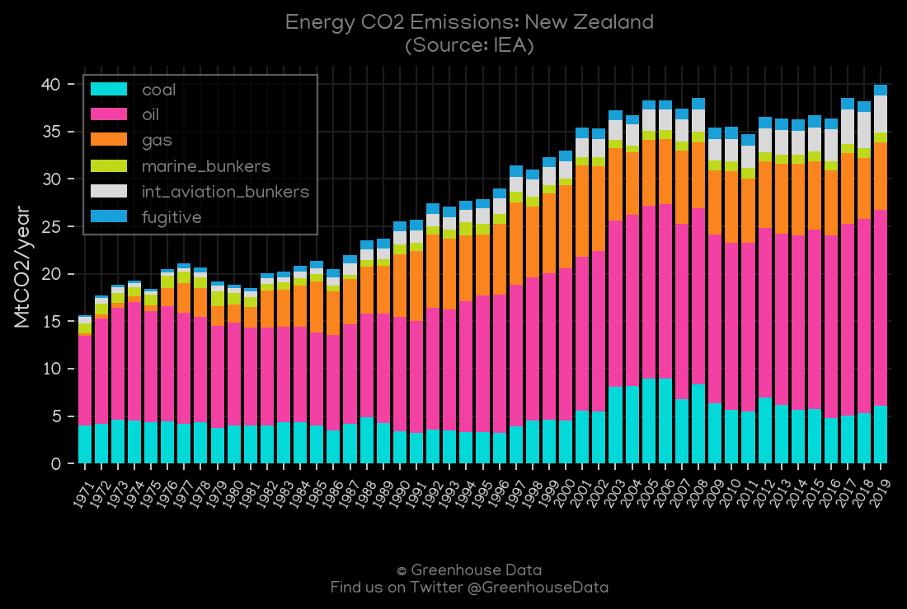
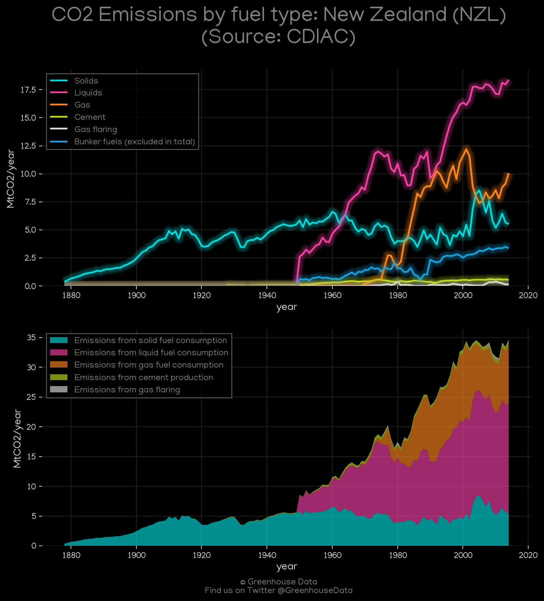

<h1 align="center">
🇳🇿🇳🇿🇳🇿🇳🇿🇳🇿
 
New Zealand
 
🇳🇿🇳🇿🇳🇿🇳🇿🇳🇿
</h1>
<h2>Datasets:</h2>

<a href="https://github.com/dquintani/GreenhouseData/tree/master/country_data/NZL_New Zealand/data">View on Github</a>
 

<a href="data/NZL_GCP_consupmption.csv">GCP_consupmption</a> || <a href="data/NZL_EPA.csv">EPA</a> || <a href="data/NZL_BP.csv">BP</a> || <a href="data/NZL_EIA.csv">EIA</a> || <a href="data/NZL_CDIAC.csv">CDIAC</a> || <a href="data/NZL_CAIT.csv">CAIT</a> || <a href="data/NZL_FAO.csv">FAO</a> || <a href="data/NZL_Minx_2021.csv">Minx_2021</a> || <a href="data/NZL_IEA.csv">IEA</a> || <a href="data/NZL_EDGAR.csv">EDGAR</a> || <a href="data/NZL_PRIMAP-hist.csv">PRIMAP-hist</a> || <a href="data/NZL_GCP.csv">GCP</a>

 

<h1>Figures:</h1><h2>#1 (NZL_CO2_totals)</h2>

<h2>#2 (NZL_GCP_1)</h2>

<h2>#3 (NZL_UNFCCC_AI_1)</h2>

<h2>#4 (NZL_relative_totals)</h2>

<h2>#5 (NZL_GCP_Country_Highlight)</h2>

<h2>#6 (NZL_CAIT_gases_1)</h2>

<h2>#7 (NZL_BP_1)</h2>

<h2>#8 (NZL_EIA_1)</h2>

<h2>#9 (NZL_Minx_top20_subsectors)</h2>

<h2>#10 (NZL_CAIT_lucf_vs_nolucf)</h2>

<h2>#11 (NZL_IEA_1)</h2>

<h2>#12 (NZL_CDIAC_1)</h2>

