

<h1 align="center">
🇴🇲🇴🇲🇴🇲🇴🇲🇴🇲
 
Oman
 
🇴🇲🇴🇲🇴🇲🇴🇲🇴🇲
</h1>
<h2>Datasets:</h2>

<a href="https://github.com/dquintani/GreenhouseData/tree/master/country_data/OMN_Oman/data">View on Github</a>
 

<a href="data/OMN_EIA.csv">EIA</a> || <a href="data/OMN_CDIAC.csv">CDIAC</a> || <a href="data/OMN_IEA.csv">IEA</a> || <a href="data/OMN_Minx_2021.csv">Minx_2021</a> || <a href="data/OMN_FAO.csv">FAO</a> || <a href="data/OMN_BP.csv">BP</a> || <a href="data/OMN_EPA.csv">EPA</a> || <a href="data/OMN_CAIT.csv">CAIT</a> || <a href="data/OMN_GCP_consupmption.csv">GCP_consupmption</a> || <a href="data/OMN_PRIMAP-hist.csv">PRIMAP-hist</a> || <a href="data/OMN_GCP.csv">GCP</a> || <a href="data/OMN_EDGAR.csv">EDGAR</a>

 

<h1>Figures:</h1><h2>#1 (OMN_GCP_Country_Highlight)</h2>

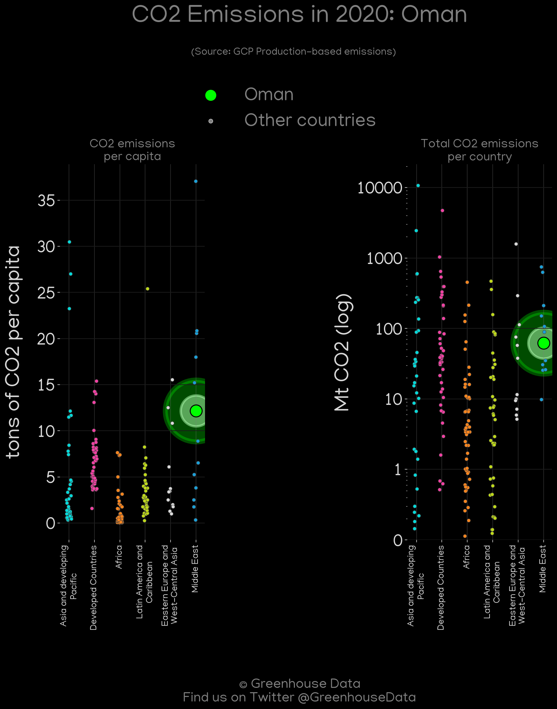
<h2>#2 (OMN_CDIAC_1)</h2>

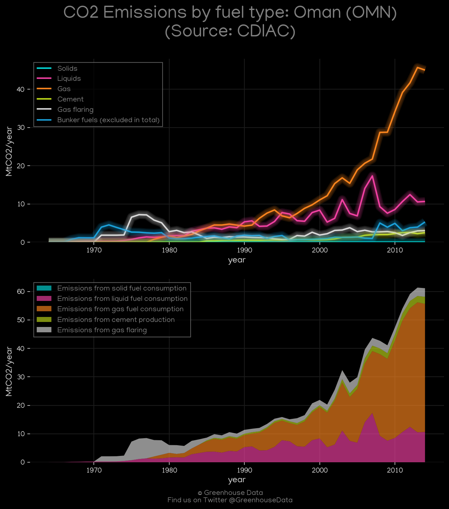
<h2>#3 (OMN_GCP_1)</h2>

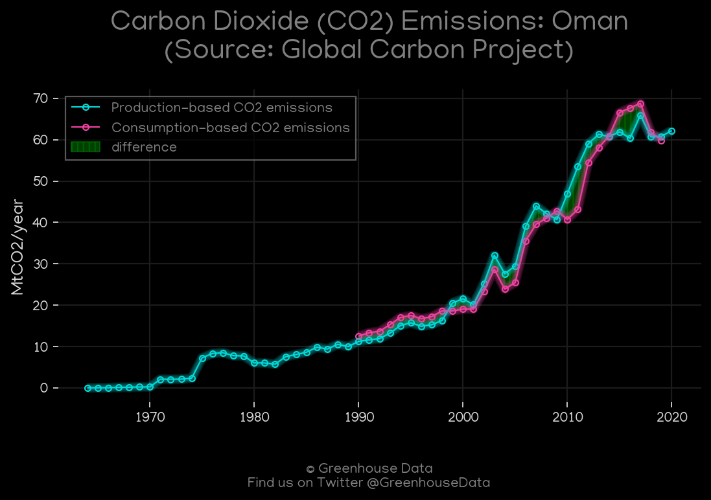
<h2>#4 (OMN_EIA_1)</h2>

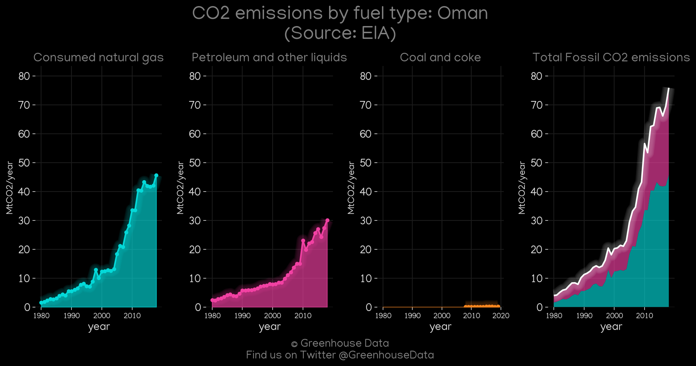
<h2>#5 (OMN_UNFCCC_NAI_1)</h2>

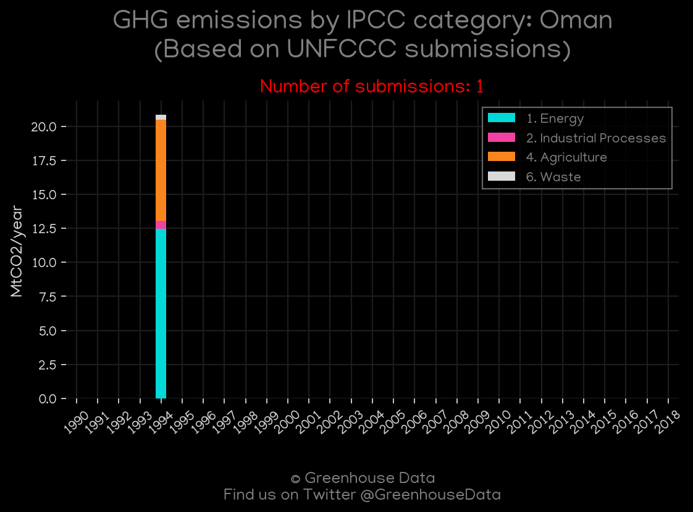
<h2>#6 (OMN_Minx_top20_subsectors)</h2>

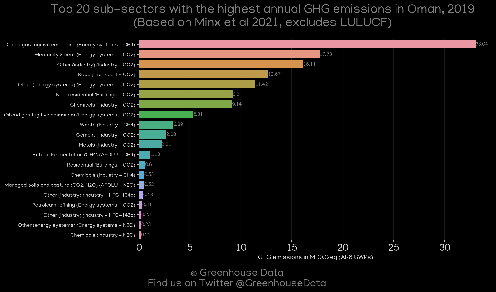
<h2>#7 (OMN_CAIT_gases_1)</h2>

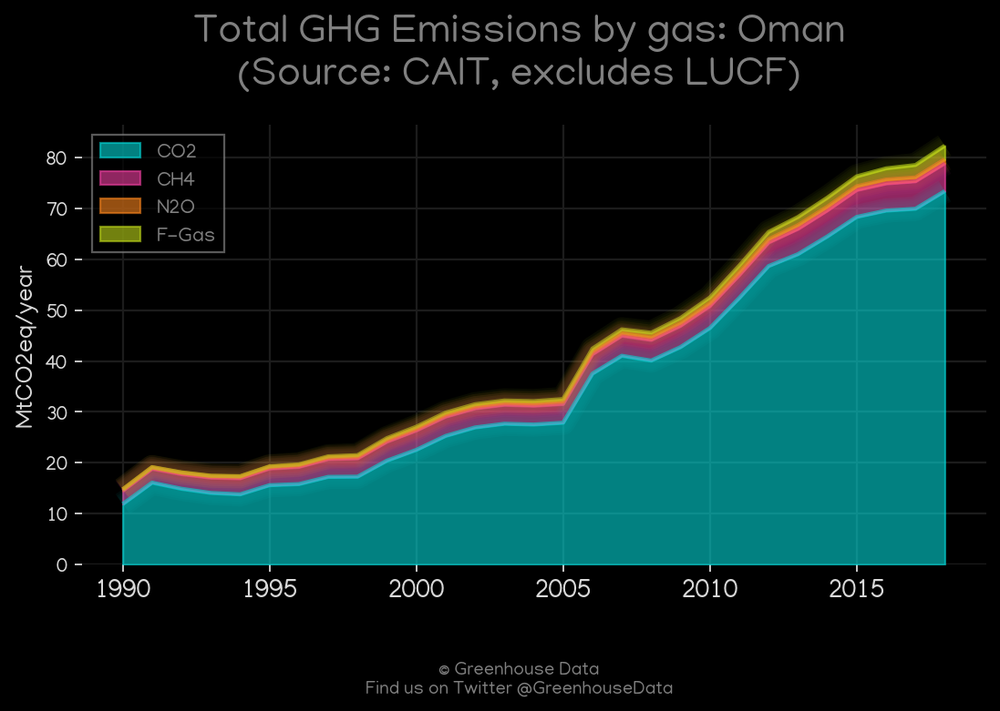
<h2>#8 (OMN_CO2_totals)</h2>

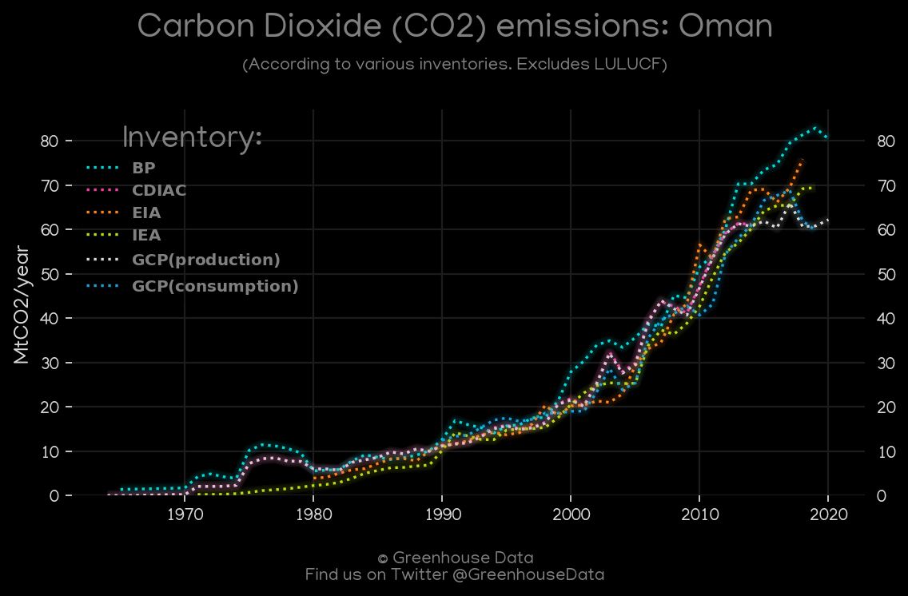
<h2>#9 (OMN_CAIT_lucf_vs_nolucf)</h2>

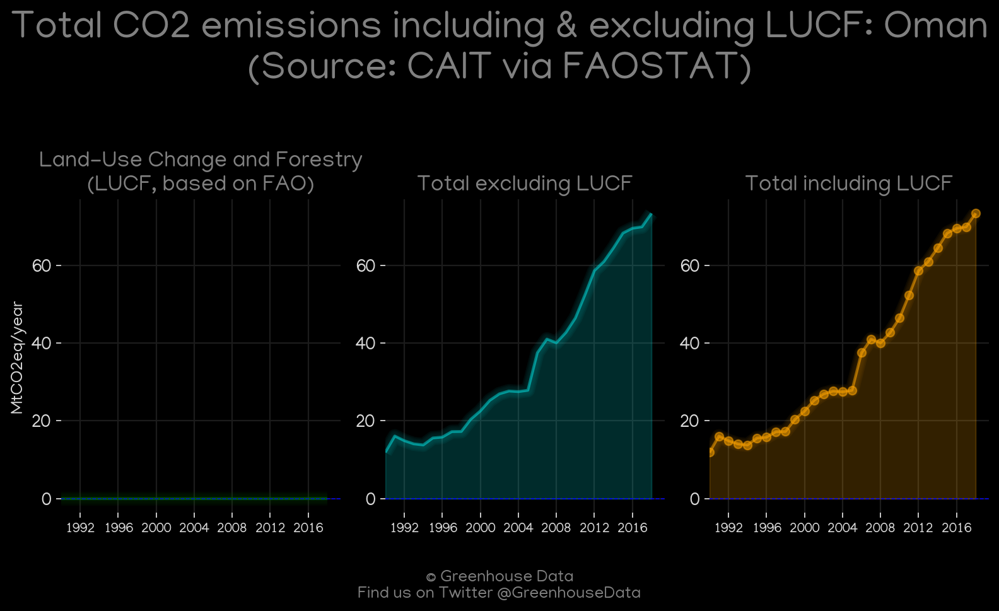
<h2>#10 (OMN_relative_totals)</h2>

<h2>#11 (OMN_IEA_1)</h2>

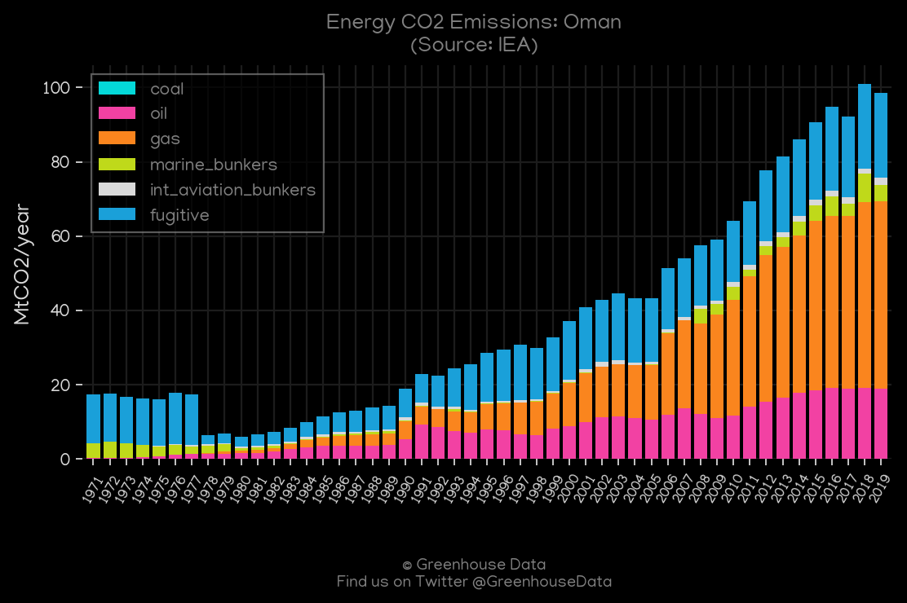
<h2>#12 (OMN_BP_1)</h2>

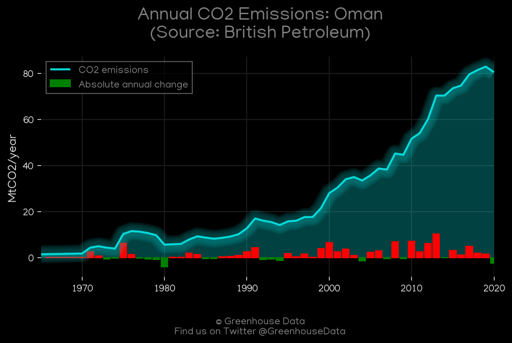
