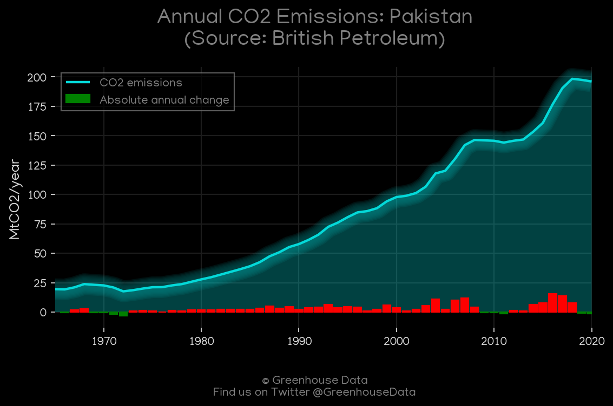
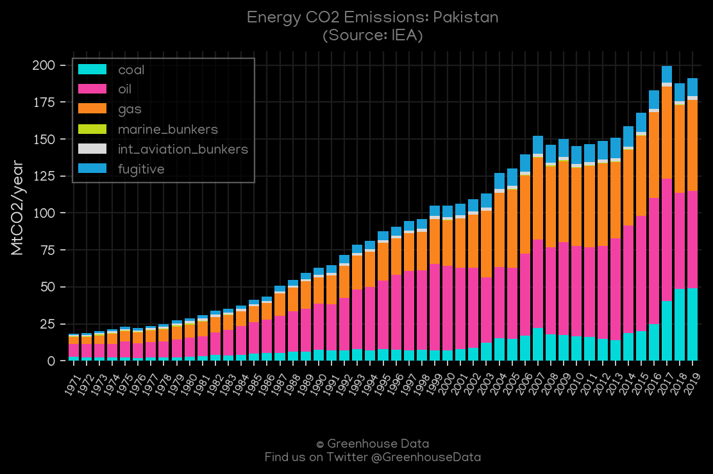
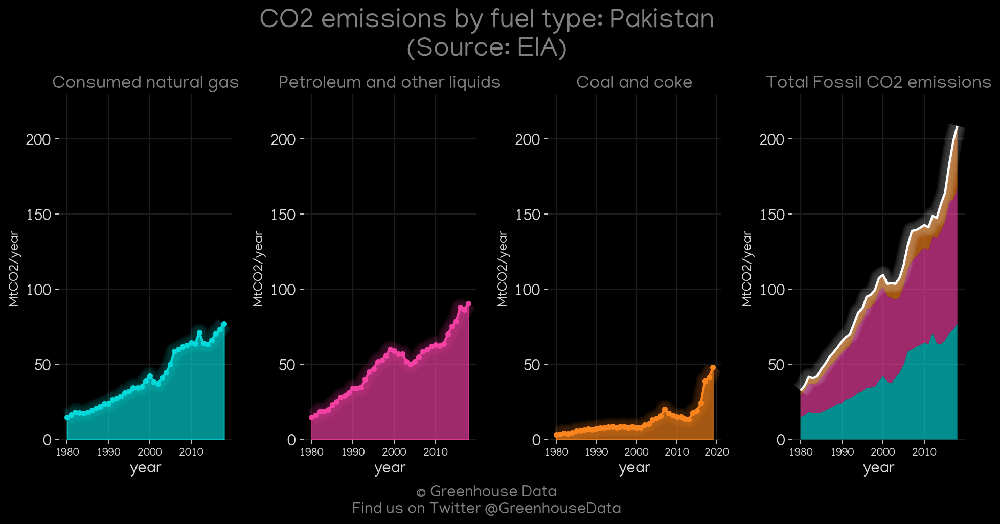
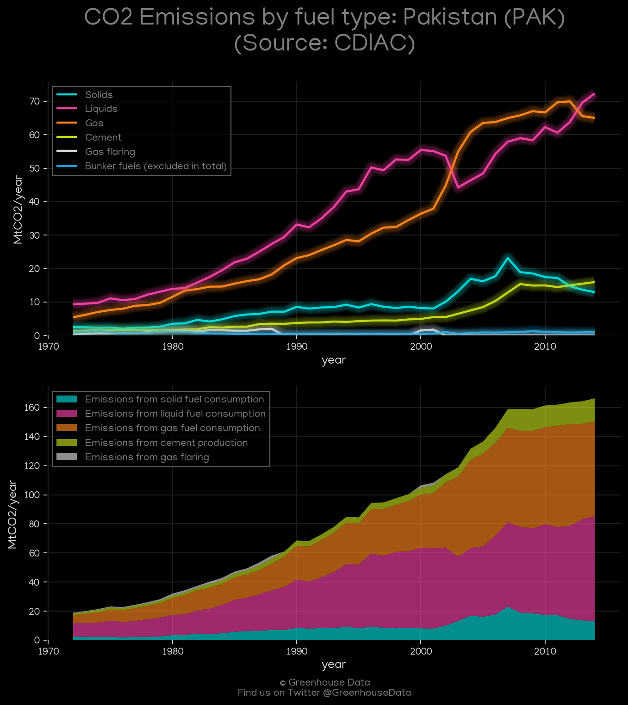
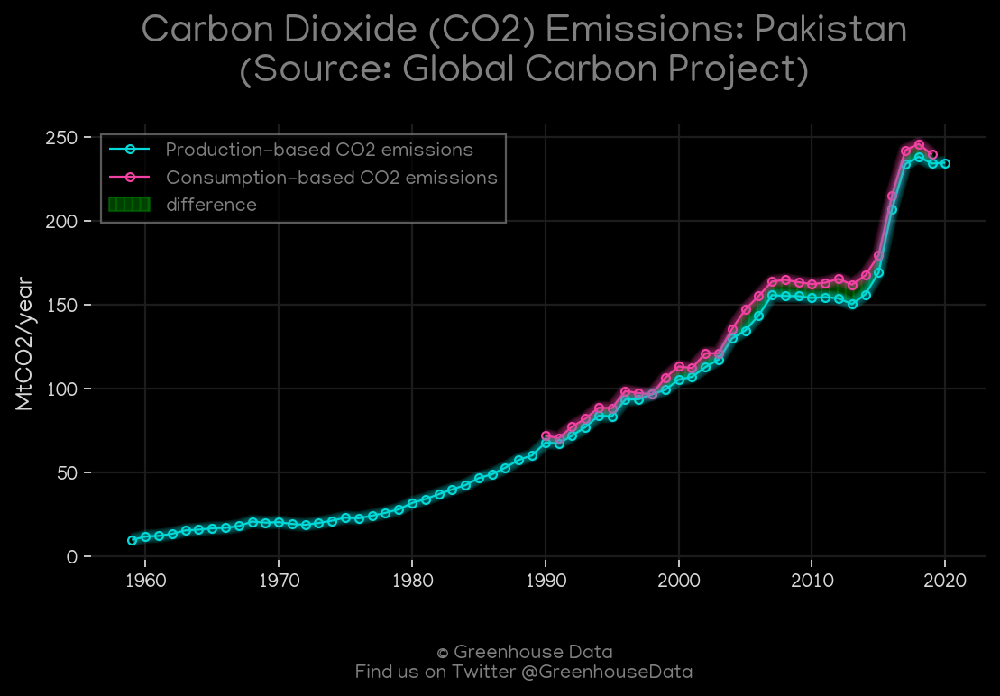
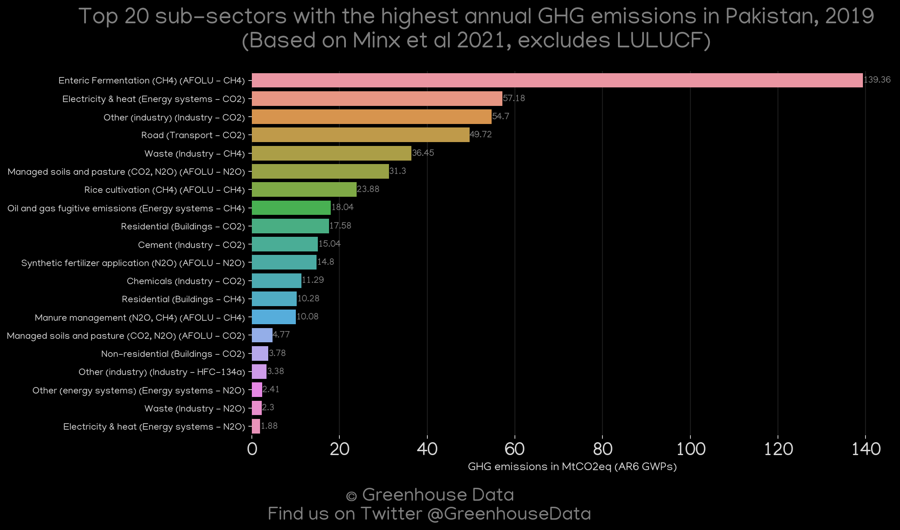
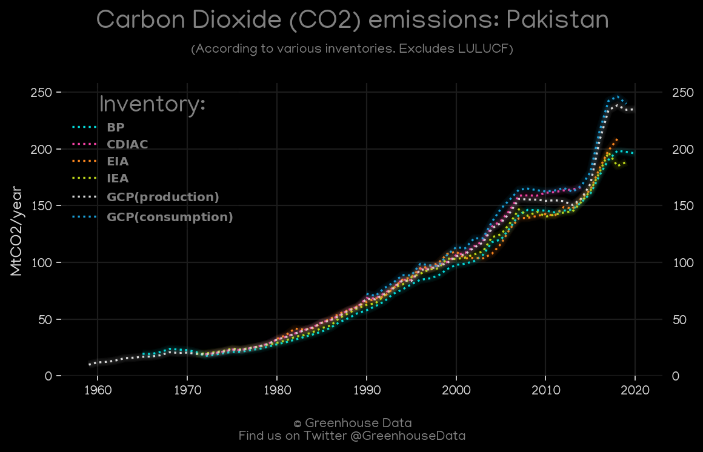
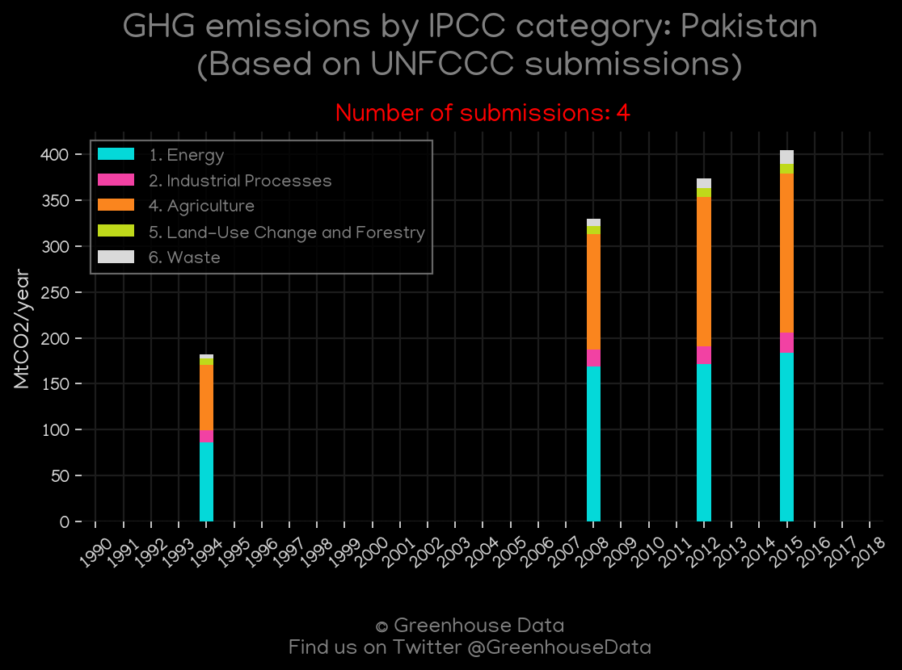
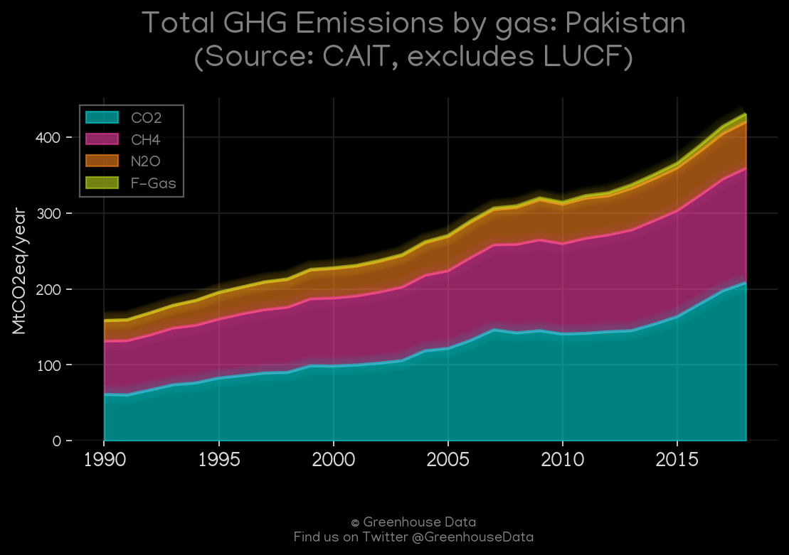

<h1 align="center">
🇵🇰🇵🇰🇵🇰🇵🇰🇵🇰
 
Pakistan
 
🇵🇰🇵🇰🇵🇰🇵🇰🇵🇰
</h1>
<h2>Datasets:</h2>

<a href="https://github.com/dquintani/Greenhouse-Data/tree/master/country_data/PAK_Pakistan/data">View on Github</a>
 

<a href="data/PAK_GCP.csv">GCP</a> || <a href="data/PAK_FAO.csv">FAO</a> || <a href="data/PAK_IEA.csv">IEA</a> || <a href="data/PAK_PRIMAP-hist.csv">PRIMAP-hist</a> || <a href="data/PAK_EIA.csv">EIA</a> || <a href="data/PAK_Minx_2021.csv">Minx_2021</a> || <a href="data/PAK_GCP_consupmption.csv">GCP_consupmption</a> || <a href="data/PAK_CDIAC.csv">CDIAC</a> || <a href="data/PAK_BP.csv">BP</a> || <a href="data/PAK_GCP_cons.csv">GCP_cons</a> || <a href="data/PAK_EPA.csv">EPA</a> || <a href="data/PAK_CAIT.csv">CAIT</a> || <a href="data/PAK_EDGAR.csv">EDGAR</a>

 

<h1>Figures:</h1><h2>#1 (PAK_BP_1)</h2>

<h2>#2 (PAK_IEA_1)</h2>

<h2>#3 (PAK_EIA_1)</h2>

<h2>#4 (PAK_CDIAC_1)</h2>

<h2>#5 (PAK_GCP_1)</h2>

<h2>#6 (PAK_Minx_top20_subsectors)</h2>

<h2>#7 (PAK_CO2_totals)</h2>

<h2>#8 (PAK_UNFCCC_NAI_1)</h2>

<h2>#9 (PAK_CAIT_gases_1)</h2>

