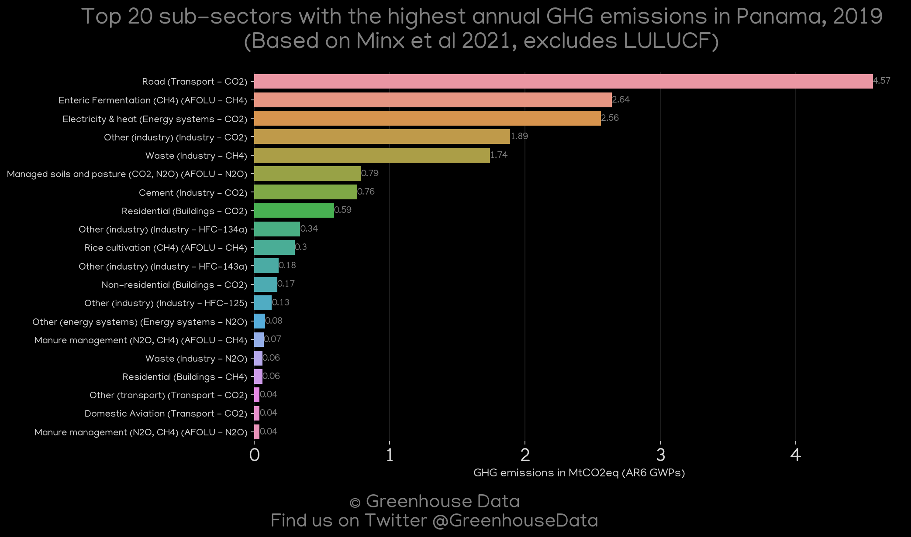
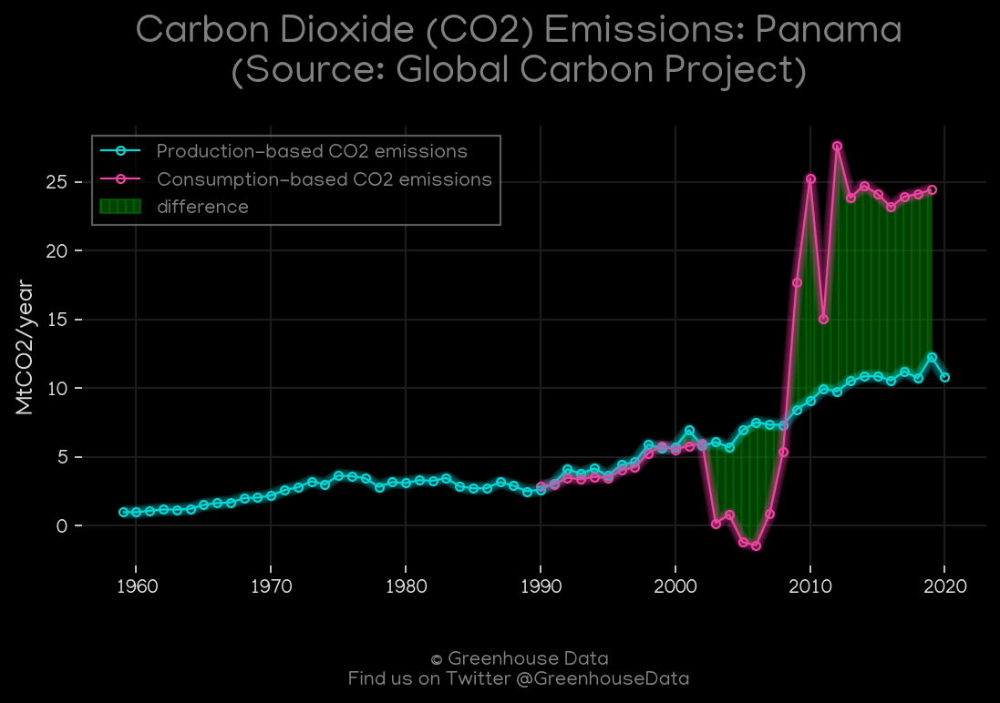
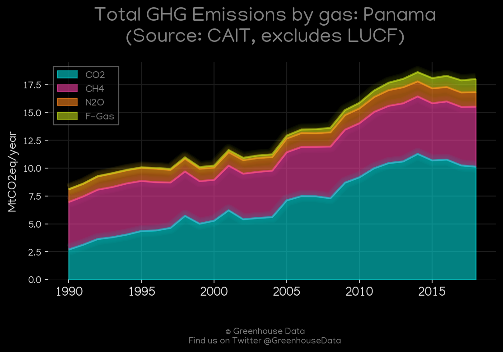
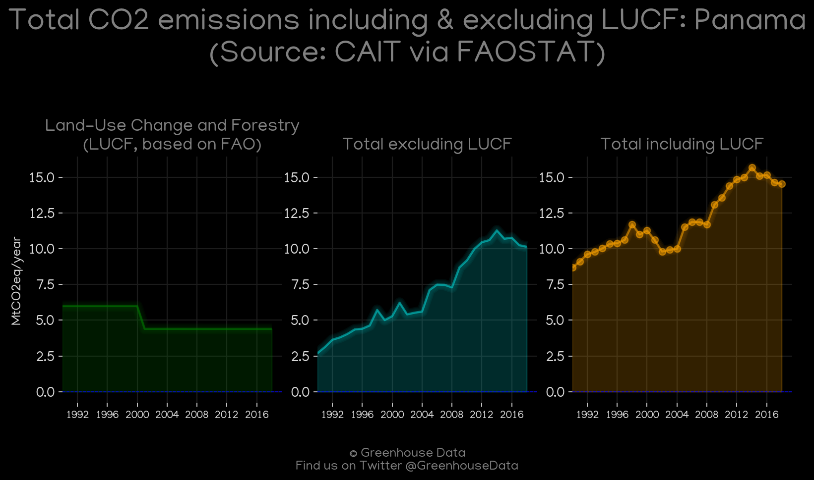
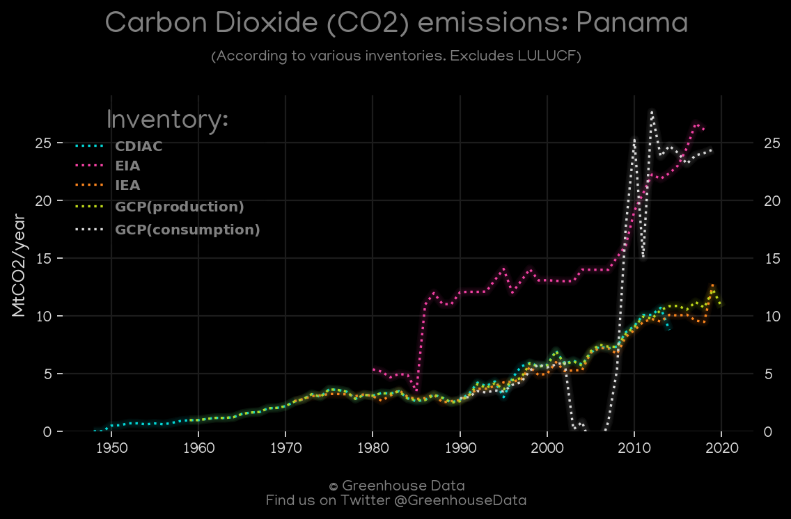
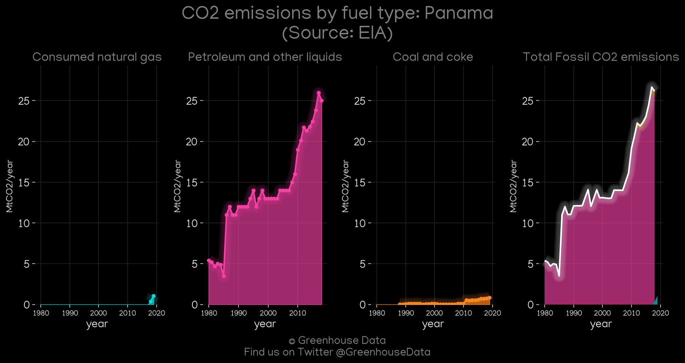
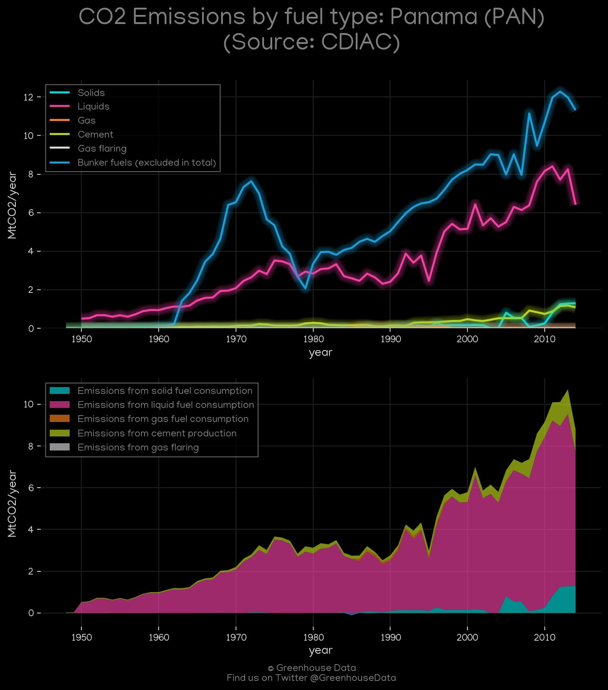
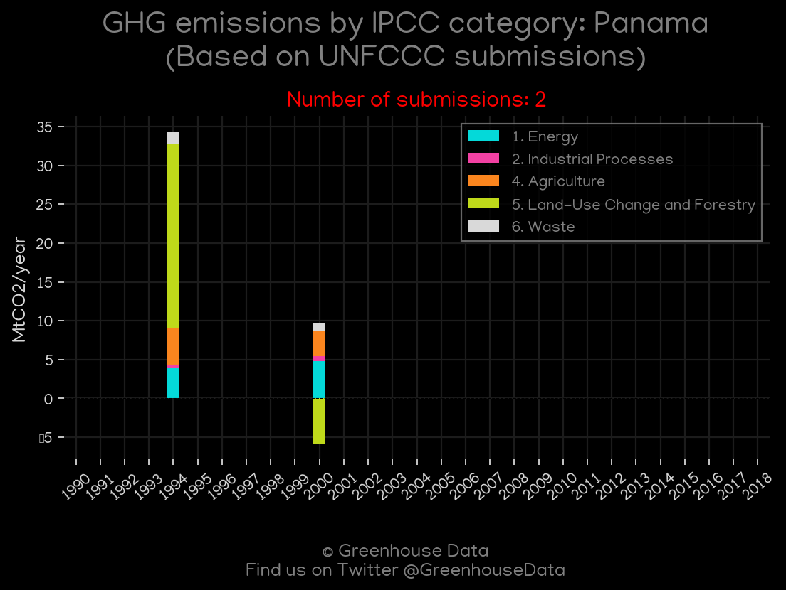

<h1 align="center">
🇵🇦🇵🇦🇵🇦🇵🇦🇵🇦
 
Panama
 
🇵🇦🇵🇦🇵🇦🇵🇦🇵🇦
</h1>
<h2>Datasets:</h2>

<a href="https://github.com/dquintani/GreenhouseData/tree/master/country_data/PAN_Panama/data">View on Github</a>
 

<a href="data/PAN_EPA.csv">EPA</a> || <a href="data/PAN_GCP.csv">GCP</a> || <a href="data/PAN_CDIAC.csv">CDIAC</a> || <a href="data/PAN_CAIT.csv">CAIT</a> || <a href="data/PAN_IEA.csv">IEA</a> || <a href="data/PAN_PRIMAP-hist.csv">PRIMAP-hist</a> || <a href="data/PAN_GCP_consupmption.csv">GCP_consupmption</a> || <a href="data/PAN_EDGAR.csv">EDGAR</a> || <a href="data/PAN_FAO.csv">FAO</a> || <a href="data/PAN_Minx_2021.csv">Minx_2021</a> || <a href="data/PAN_EIA.csv">EIA</a>

 

<h1>Figures:</h1><h2>#1 (PAN_Minx_top20_subsectors)</h2>

<h2>#2 (PAN_GCP_1)</h2>

<h2>#3 (PAN_CAIT_gases_1)</h2>

<h2>#4 (PAN_CAIT_lucf_vs_nolucf)</h2>

<h2>#5 (PAN_CO2_totals)</h2>

<h2>#6 (PAN_EIA_1)</h2>

<h2>#7 (PAN_CDIAC_1)</h2>

<h2>#8 (PAN_UNFCCC_NAI_1)</h2>

<h2>#9 (PAN_IEA_1)</h2>

