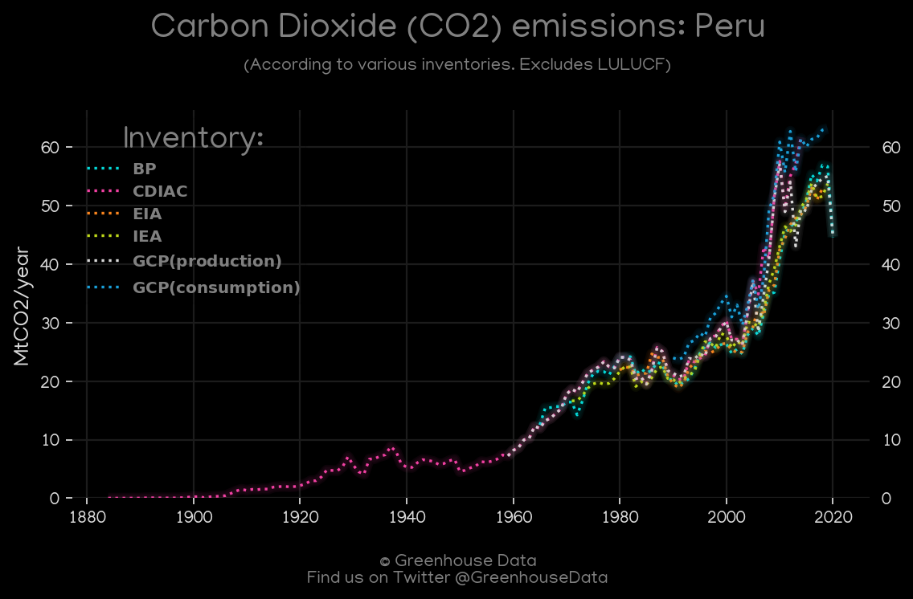
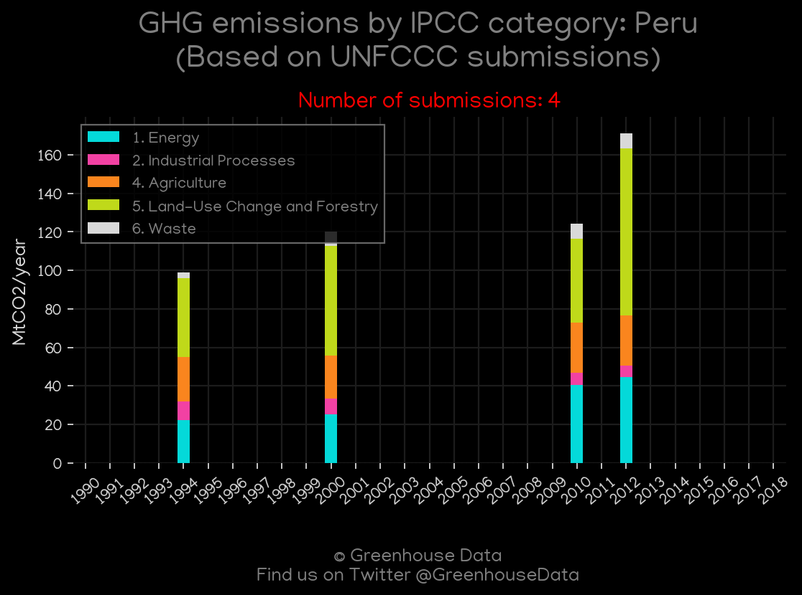
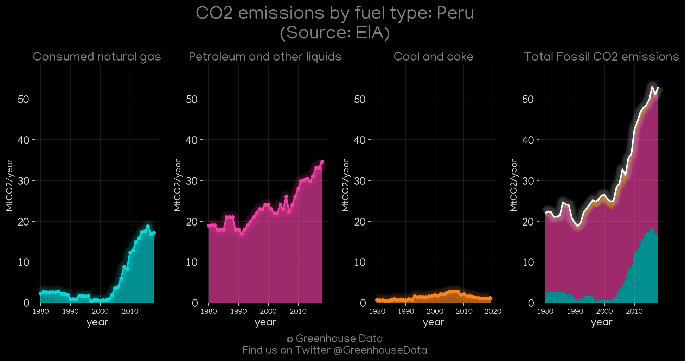
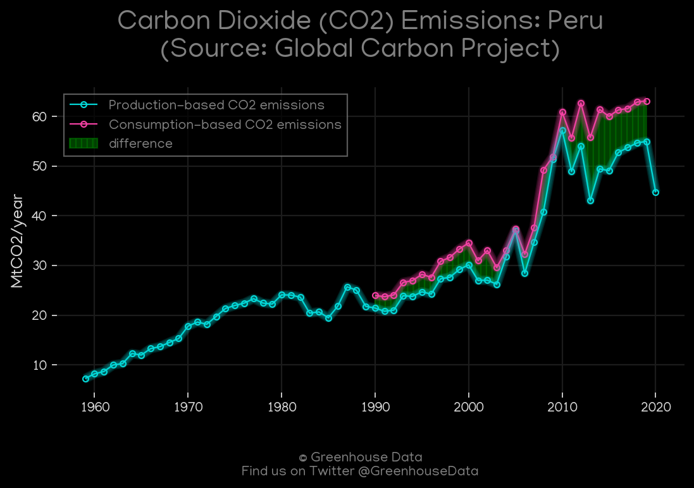
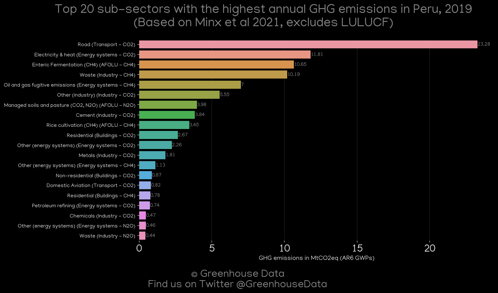
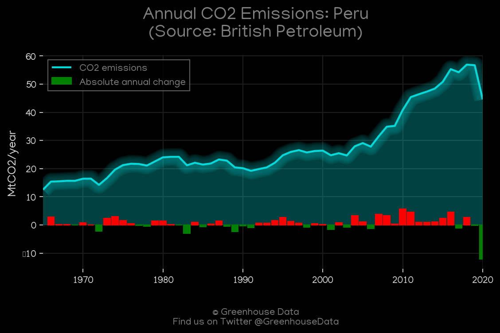
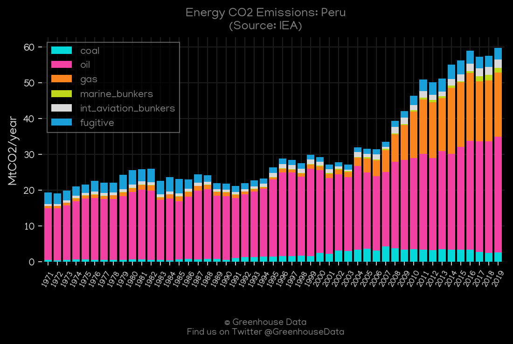

<h1 align="center">
🇵🇪🇵🇪🇵🇪🇵🇪🇵🇪
 
Peru
 
🇵🇪🇵🇪🇵🇪🇵🇪🇵🇪
</h1>
<h2>Datasets:</h2>

<a href="https://github.com/dquintani/Greenhouse-Data/tree/master/country_data/PER_Peru/data">View on Github</a>
 

<a href="data/PER_CDIAC.csv">CDIAC</a> || <a href="data/PER_IEA.csv">IEA</a> || <a href="data/PER_CAIT.csv">CAIT</a> || <a href="data/PER_EDGAR.csv">EDGAR</a> || <a href="data/PER_EPA.csv">EPA</a> || <a href="data/PER_PRIMAP-hist.csv">PRIMAP-hist</a> || <a href="data/PER_GCP_consupmption.csv">GCP_consupmption</a> || <a href="data/PER_Minx_2021.csv">Minx_2021</a> || <a href="data/PER_GCP.csv">GCP</a> || <a href="data/PER_EIA.csv">EIA</a> || <a href="data/PER_GCP_cons.csv">GCP_cons</a> || <a href="data/PER_BP.csv">BP</a> || <a href="data/PER_FAO.csv">FAO</a>

 

<h1>Figures:</h1><h2>#1 (PER_CO2_totals)</h2>

<h2>#2 (PER_CAIT_gases_1)</h2>

<h2>#3 (PER_UNFCCC_NAI_1)</h2>

<h2>#4 (PER_EIA_1)</h2>

<h2>#5 (PER_GCP_1)</h2>

<h2>#6 (PER_Minx_top20_subsectors)</h2>

<h2>#7 (PER_BP_1)</h2>

<h2>#8 (PER_CDIAC_1)</h2>

<h2>#9 (PER_IEA_1)</h2>

