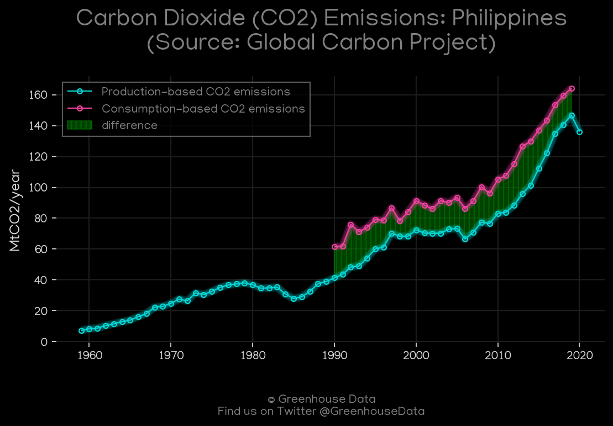
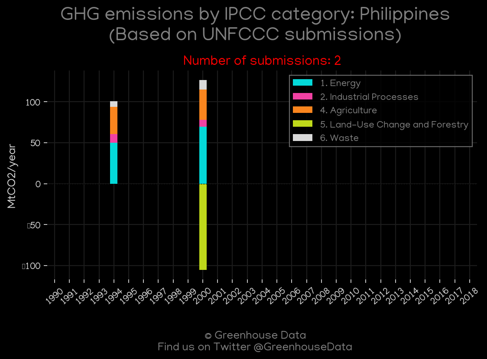
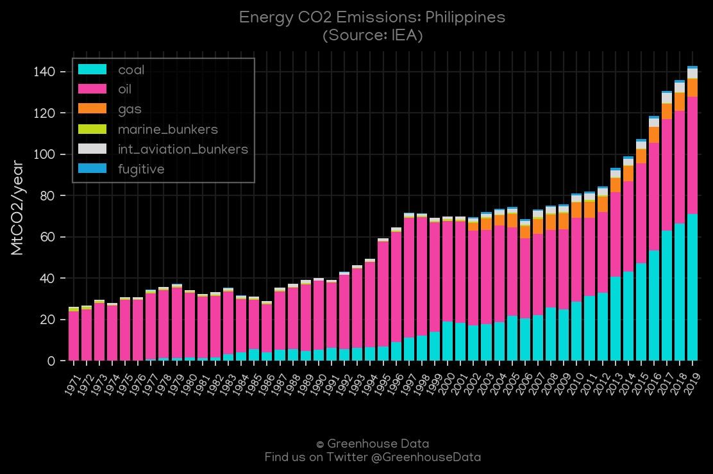
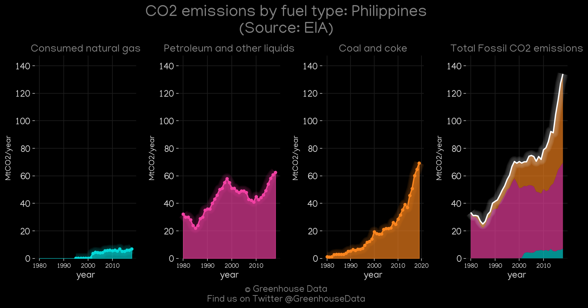
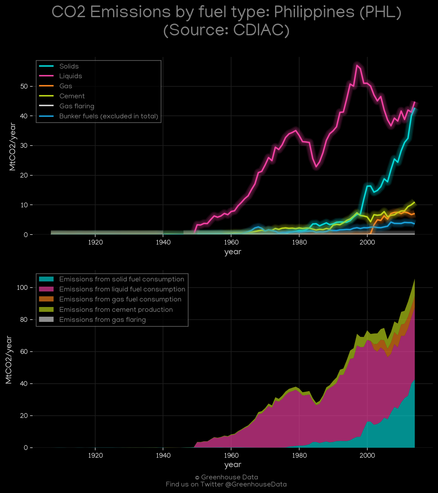
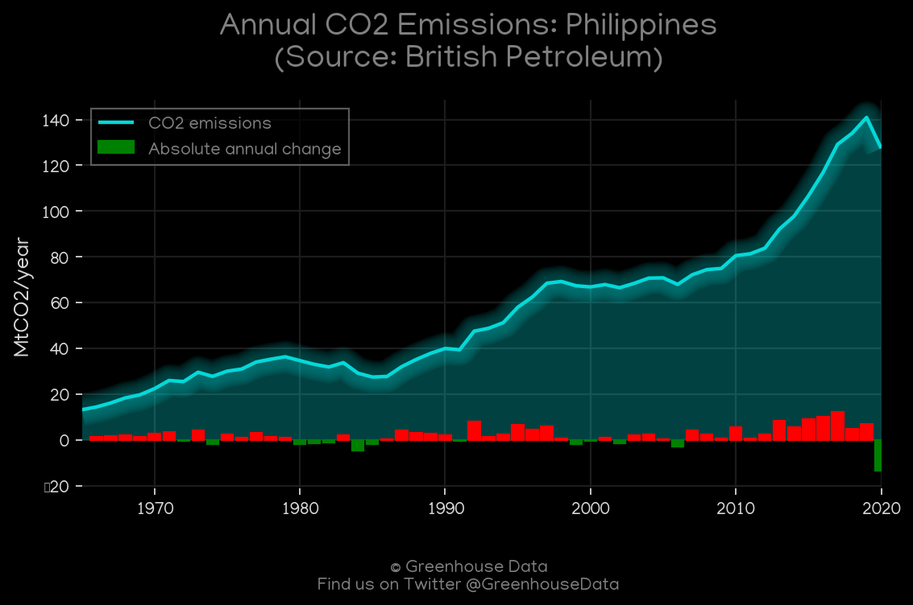

<h1 align="center">
🇵🇭🇵🇭🇵🇭🇵🇭🇵🇭
 
Philippines
 
🇵🇭🇵🇭🇵🇭🇵🇭🇵🇭
</h1>
<h2>Datasets:</h2>

<a href="https://github.com/dquintani/Greenhouse-Data/tree/master/country_data/PHL_Philippines/data">View on Github</a>
 

<a href="data/PHL_GCP_cons.csv">GCP_cons</a> || <a href="data/PHL_GCP_consupmption.csv">GCP_consupmption</a> || <a href="data/PHL_EIA.csv">EIA</a> || <a href="data/PHL_GCP.csv">GCP</a> || <a href="data/PHL_EPA.csv">EPA</a> || <a href="data/PHL_EDGAR.csv">EDGAR</a> || <a href="data/PHL_FAO.csv">FAO</a> || <a href="data/PHL_CDIAC.csv">CDIAC</a> || <a href="data/PHL_IEA.csv">IEA</a> || <a href="data/PHL_BP.csv">BP</a> || <a href="data/PHL_CAIT.csv">CAIT</a> || <a href="data/PHL_Minx_2021.csv">Minx_2021</a> || <a href="data/PHL_PRIMAP-hist.csv">PRIMAP-hist</a>

 

<h1>Figures:</h1><h2>#1 (PHL_GCP_1)</h2>

<h2>#2 (PHL_UNFCCC_NAI_1)</h2>

<h2>#3 (PHL_CAIT_gases_1)</h2>

<h2>#4 (PHL_IEA_1)</h2>

<h2>#5 (PHL_CO2_totals)</h2>

<h2>#6 (PHL_EIA_1)</h2>

<h2>#7 (PHL_CDIAC_1)</h2>

<h2>#8 (PHL_Minx_top20_subsectors)</h2>

<h2>#9 (PHL_BP_1)</h2>

