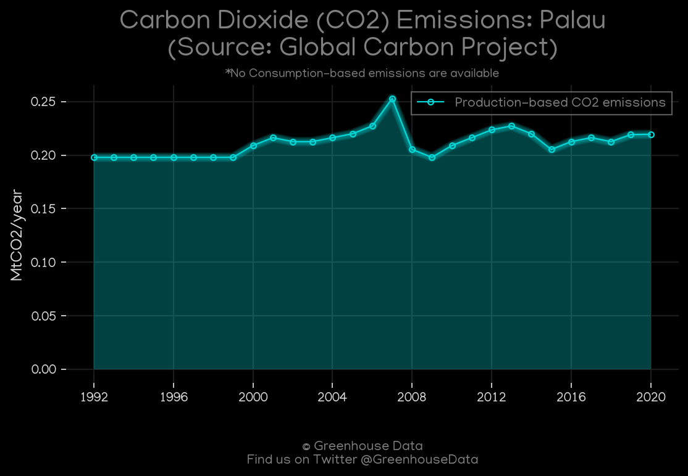
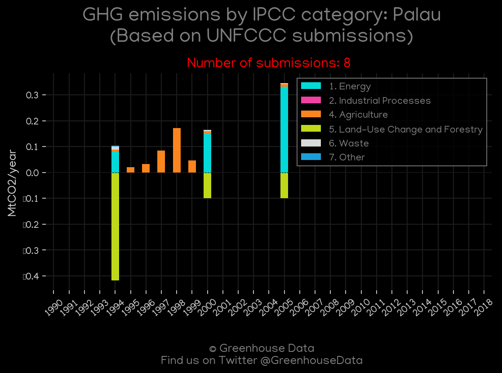
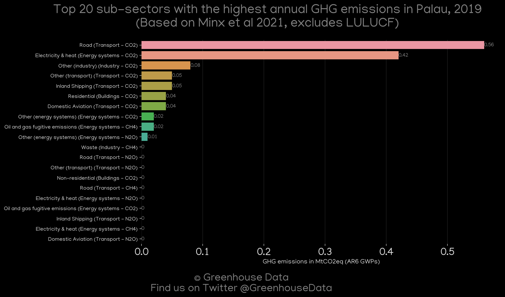
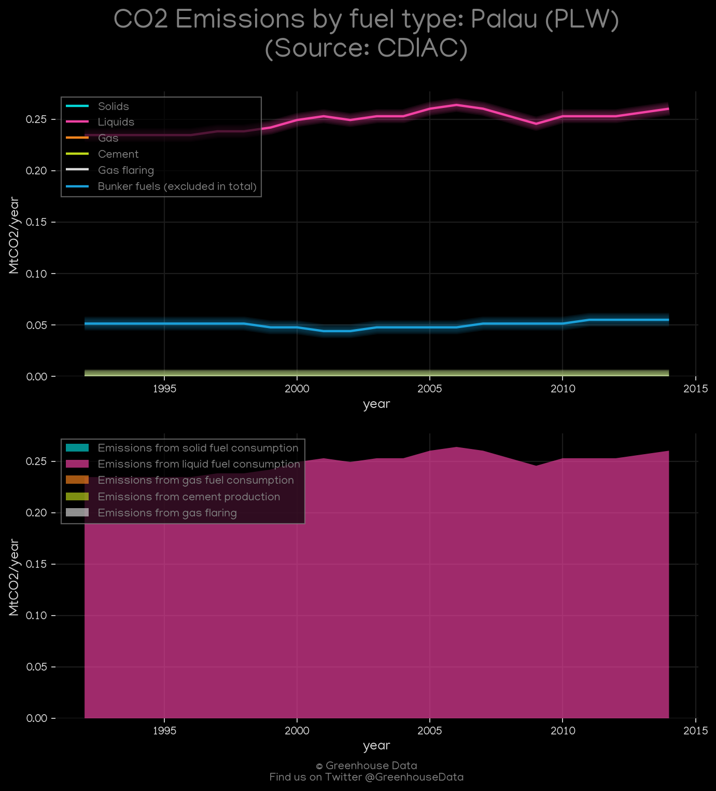
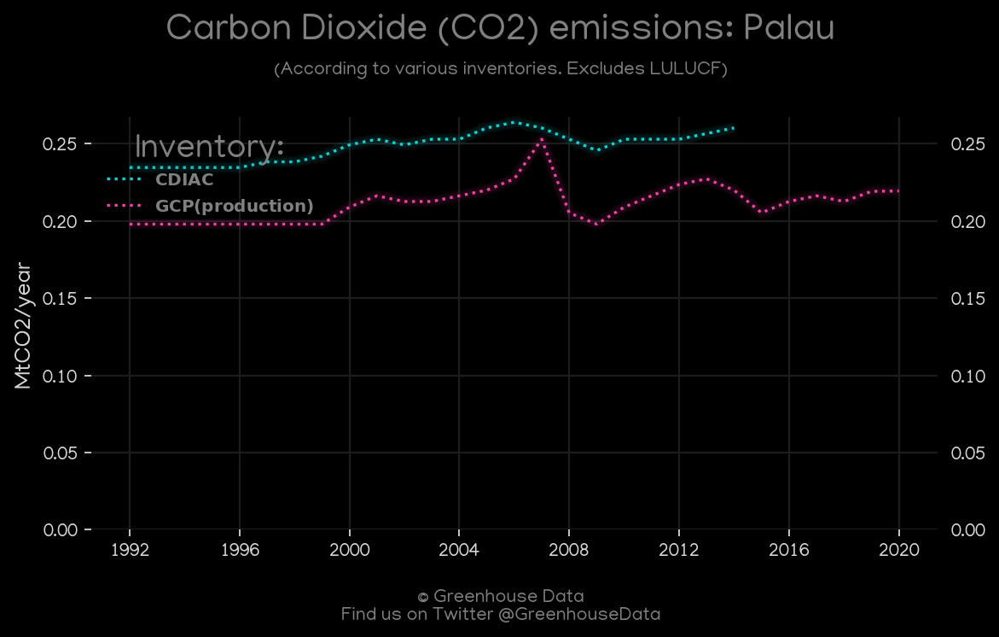
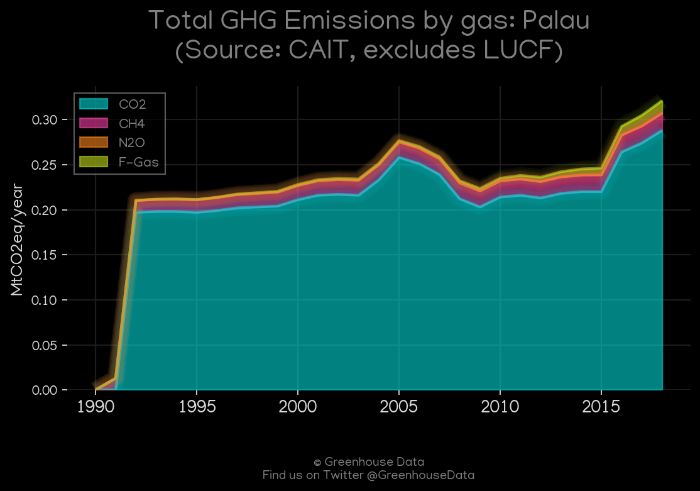

<h1 align="center">
🇵🇼🇵🇼🇵🇼🇵🇼🇵🇼
 
Palau
 
🇵🇼🇵🇼🇵🇼🇵🇼🇵🇼
</h1>
<h2>Datasets:</h2>

<a href="https://github.com/dquintani/GreenhouseData/tree/master/country_data/PLW_Palau/data">View on Github</a>
 

<a href="data/PLW_EPA.csv">EPA</a> || <a href="data/PLW_EDGAR.csv">EDGAR</a> || <a href="data/PLW_Minx_2021.csv">Minx_2021</a> || <a href="data/PLW_CDIAC.csv">CDIAC</a> || <a href="data/PLW_GCP_cons.csv">GCP_cons</a> || <a href="data/PLW_CAIT.csv">CAIT</a> || <a href="data/PLW_GCP.csv">GCP</a> || <a href="data/PLW_PRIMAP-hist.csv">PRIMAP-hist</a> || <a href="data/PLW_FAO.csv">FAO</a> || <a href="data/PLW_GCP_consupmption.csv">GCP_consupmption</a>

 

<h1>Figures:</h1><h2>#1 (PLW_GCP_1)</h2>

<h2>#2 (PLW_UNFCCC_NAI_1)</h2>

<h2>#3 (PLW_Minx_top20_subsectors)</h2>

<h2>#4 (PLW_CDIAC_1)</h2>

<h2>#5 (PLW_CO2_totals)</h2>

<h2>#6 (PLW_CAIT_gases_1)</h2>

