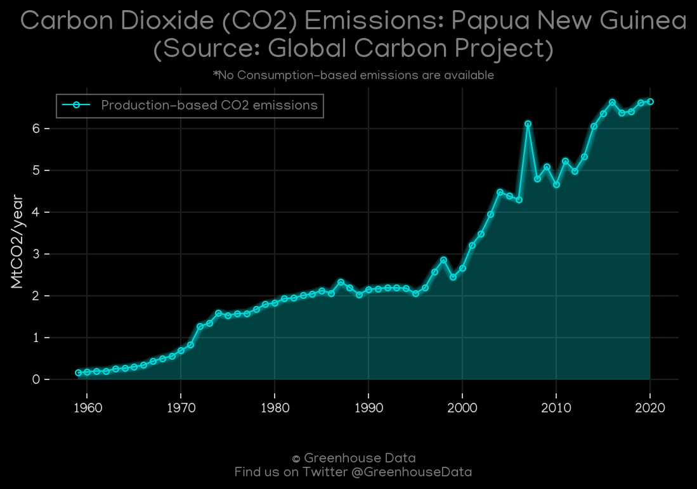
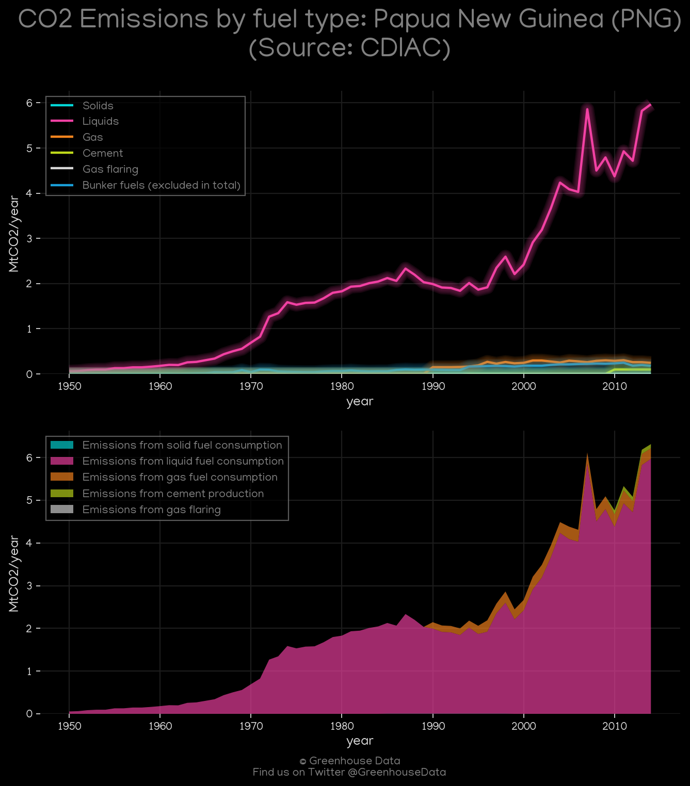
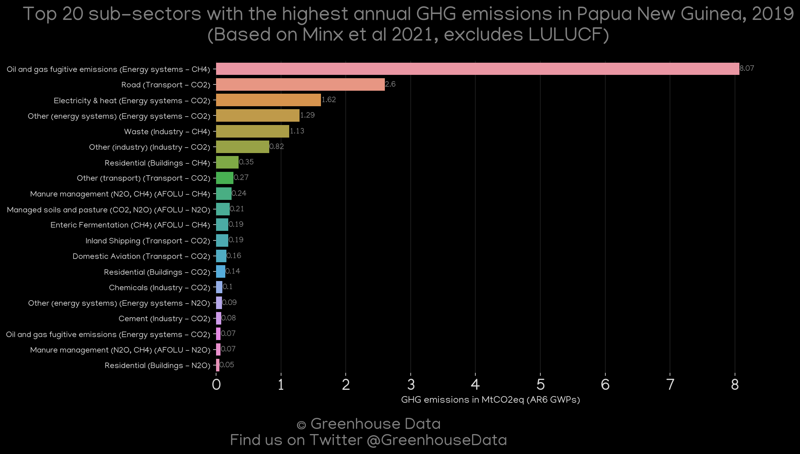
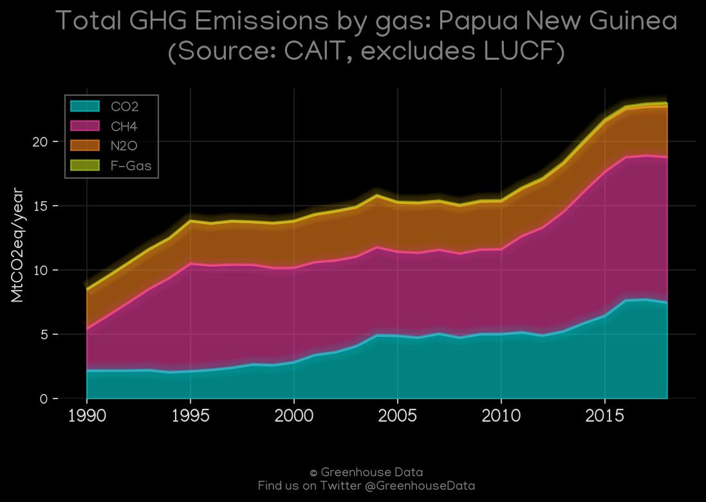
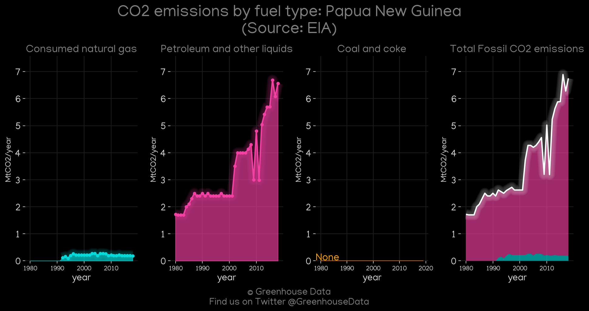
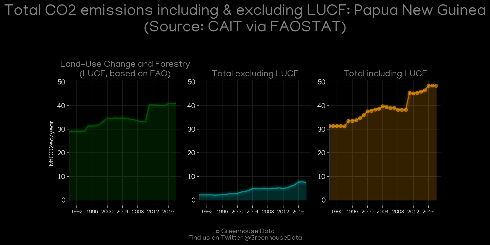
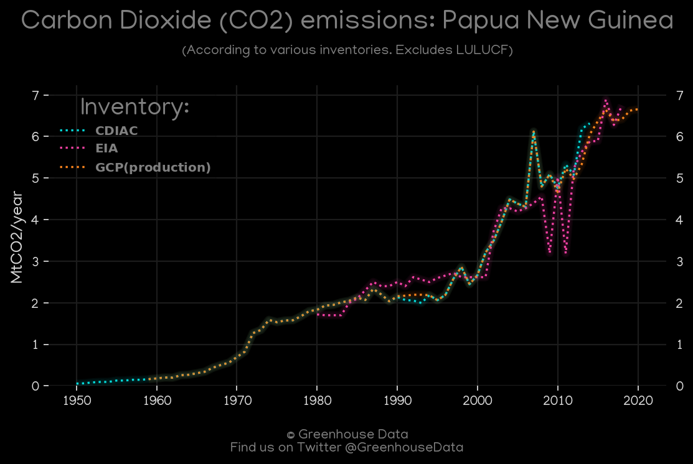

<h1 align="center">
🇵🇬🇵🇬🇵🇬🇵🇬🇵🇬
 
Papua New Guinea
 
🇵🇬🇵🇬🇵🇬🇵🇬🇵🇬
</h1>
<h2>Datasets:</h2>

<a href="https://github.com/dquintani/GreenhouseData/tree/master/country_data/PNG_Papua New Guinea/data">View on Github</a>
 

<a href="data/PNG_PRIMAP-hist.csv">PRIMAP-hist</a> || <a href="data/PNG_FAO.csv">FAO</a> || <a href="data/PNG_EPA.csv">EPA</a> || <a href="data/PNG_GCP_consupmption.csv">GCP_consupmption</a> || <a href="data/PNG_EIA.csv">EIA</a> || <a href="data/PNG_Minx_2021.csv">Minx_2021</a> || <a href="data/PNG_CAIT.csv">CAIT</a> || <a href="data/PNG_EDGAR.csv">EDGAR</a> || <a href="data/PNG_GCP.csv">GCP</a> || <a href="data/PNG_CDIAC.csv">CDIAC</a>

 

<h1>Figures:</h1><h2>#1 (PNG_GCP_1)</h2>

<h2>#2 (PNG_CDIAC_1)</h2>

<h2>#3 (PNG_Minx_top20_subsectors)</h2>

<h2>#4 (PNG_CAIT_gases_1)</h2>

<h2>#5 (PNG_EIA_1)</h2>

<h2>#6 (PNG_CAIT_lucf_vs_nolucf)</h2>

<h2>#7 (PNG_UNFCCC_NAI_1)</h2>

<h2>#8 (PNG_CO2_totals)</h2>

