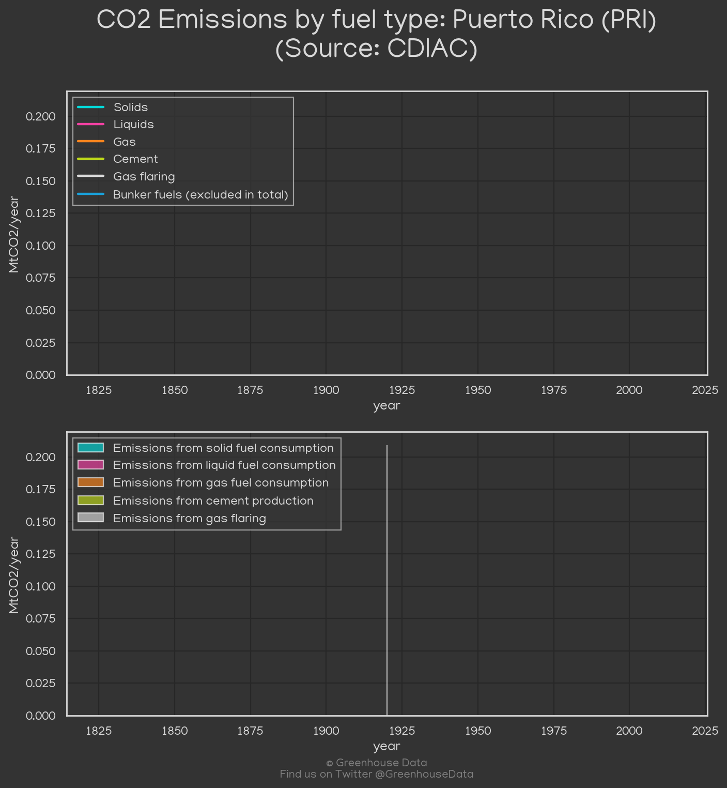
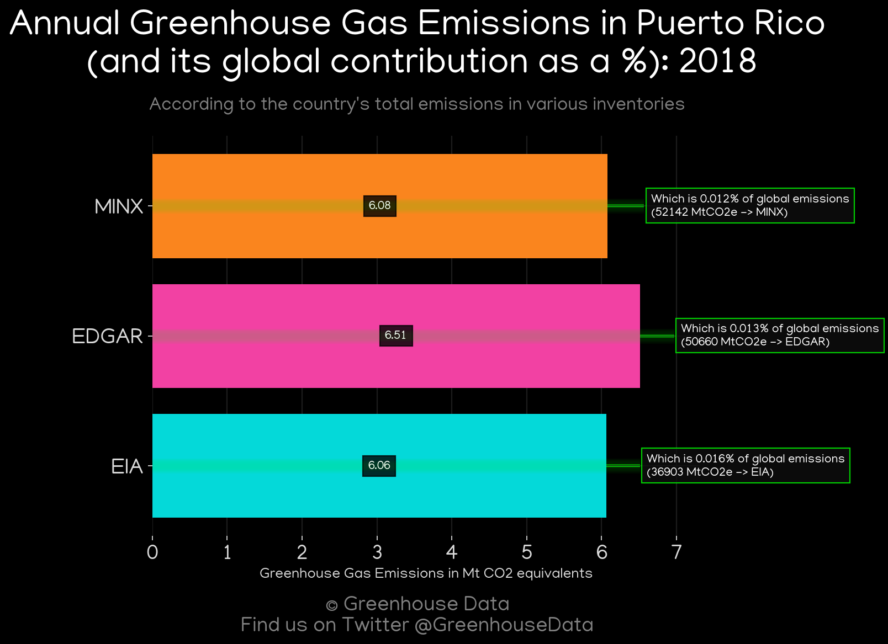
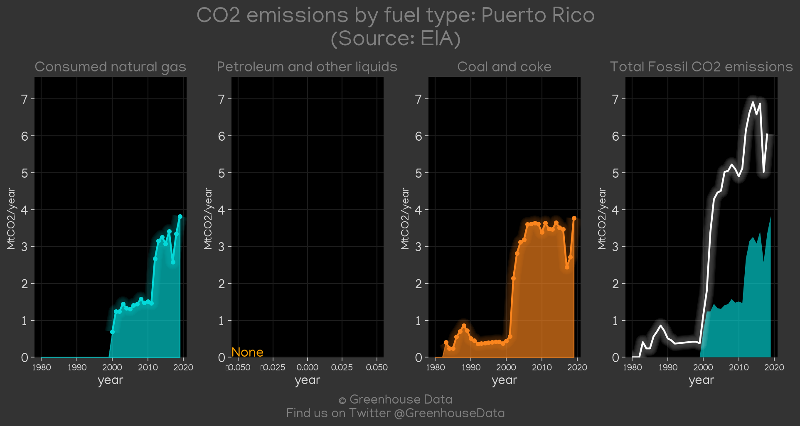
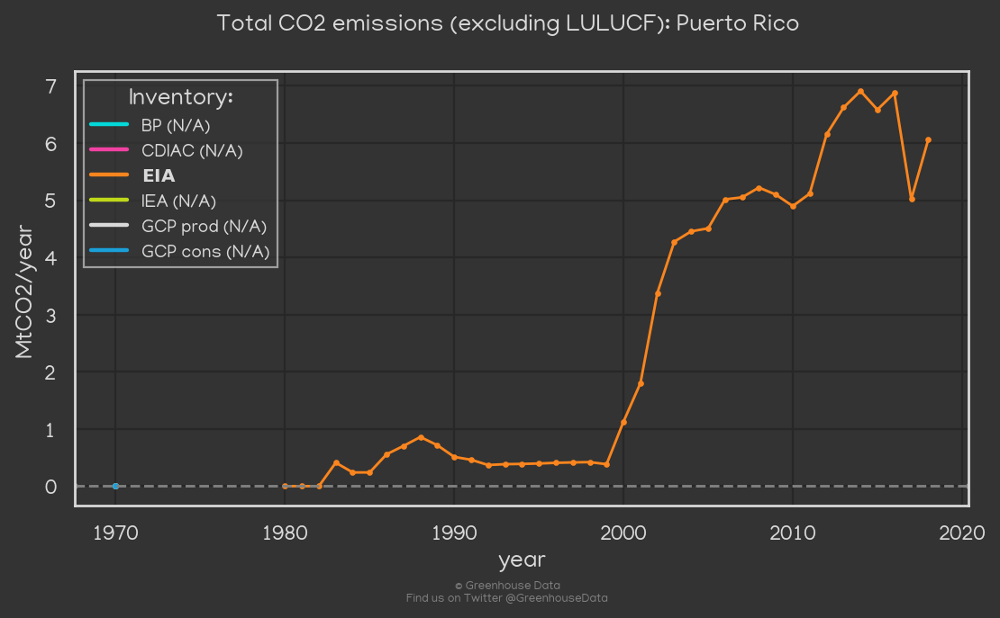
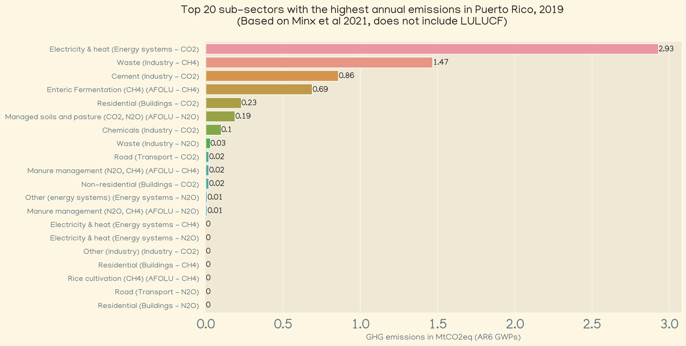

<h1 align="center">
🇵🇷🇵🇷🇵🇷🇵🇷🇵🇷
 
Puerto Rico
 
🇵🇷🇵🇷🇵🇷🇵🇷🇵🇷
</h1>
<h2>Datasets:</h2>

<a href="https://github.com/dquintani/GreenhouseData/tree/master/country_data/PRI_Puerto Rico/data">View on Github</a>
 

<a href="data/PRI_CDIAC.csv">CDIAC</a> || <a href="data/PRI_FAO.csv">FAO</a> || <a href="data/PRI_EIA.csv">EIA</a> || <a href="data/PRI_Minx_2021.csv">Minx_2021</a> || <a href="data/PRI_EDGAR.csv">EDGAR</a>

 

<h1>Figures:</h1><h2>#1 (PRI_CDIAC_1)</h2>

<h2>#2 (PRI_relative_totals)</h2>

<h2>#3 (PRI_EIA_1)</h2>

<h2>#4 (PRI_CO2_totals)</h2>

<h2>#5 (PRI_Minx_top20_subsectors)</h2>

